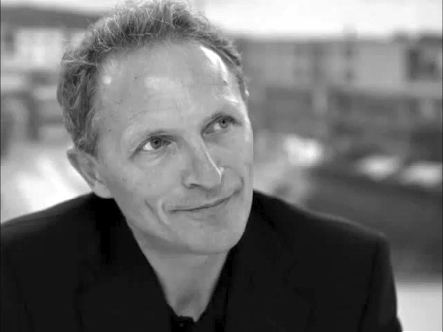
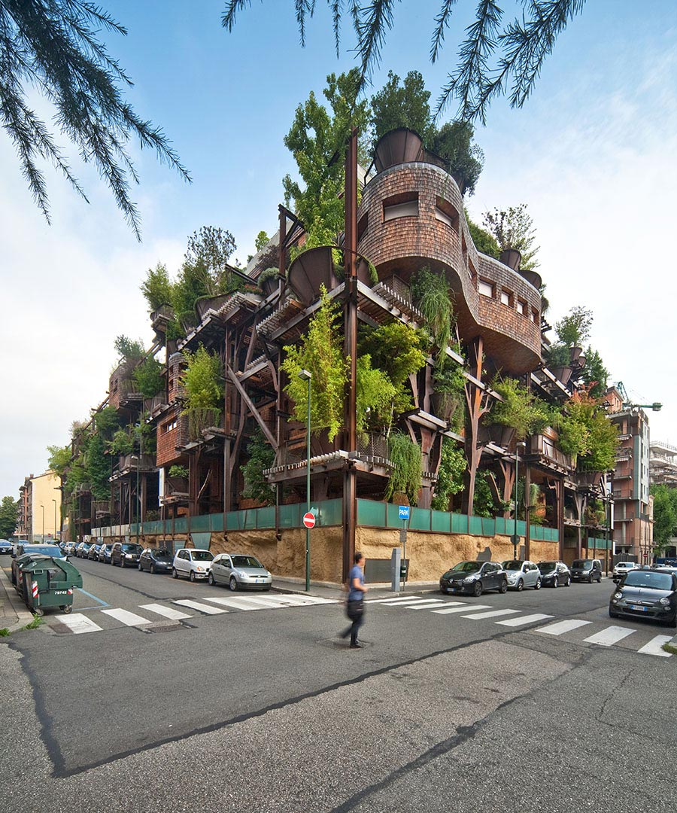
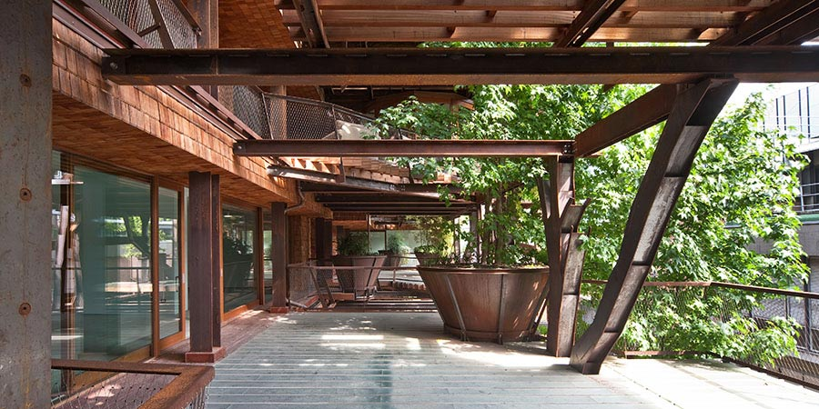
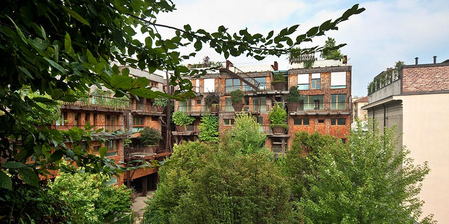
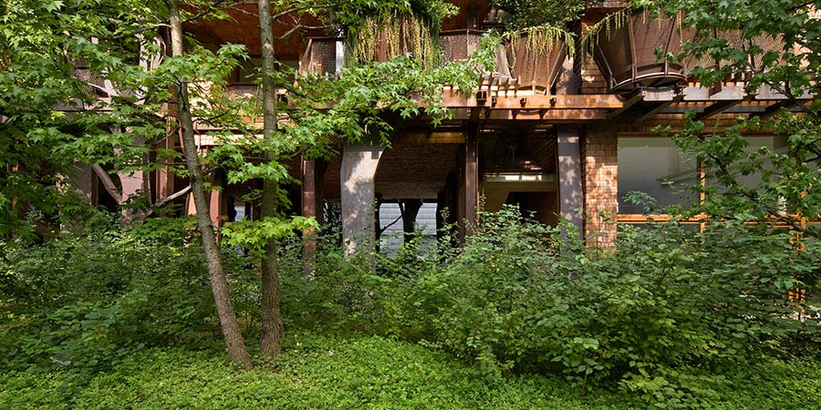

Amici lettori, eccoci di ritorno dalle vacanze! 
Prima di parlare dell'argomento di questa settimana, sento di volervi dire che mi siete mancati. Dico sul serio. 
Un'altra cosa che voglio dirvi, è la seguente: MyHumus torna alla ribalta più carico che mai, ci sono tanti nuovi volti e progetti che attendono di "salire sul palco" per presentarsi e raccontarsi. 
Siete curiosi? Non state più nella pelle, vero? Lo so. 
Inauguro questo nuovo ciclo di articoli parlandovi di architettura e, nello specifico, di un particolarissimo edificio torinese che ha attirato la mia attenzione per la sua capacità di coniugare architettura e natura insieme. 
Qualcosa di simile fu affrontato lo scorso dicembre in occasione dell'intervista all'architetto [Stefano Boeri](http://www.stefanoboeriarchitetti.net/) a proposito del suo *[Bosco Verticale](https://myhumus.com/bosco-verticale/)* a Milano, ricordate? 
Questa settimana è la volta di *[25 verde](http://www.25verde.it)*, il progetto dell'architetto [Luciano Pia](http://www.lucianopia.it).

Questo edificio a più piani, in via Chiabrera 25 a Torino, ospita 63 appartamenti, tutti diversi fra loro, e rappresenta una bella sfida di riqualificazione di un ex quartiere industriale caratterizzato da affacci eterogenei. 
Quando si vorrebbe uscire di casa e andare al lavoro in kayak anziché scendere gli scalini della metropolitana, quando si desidererebbe salire su una barchetta a remi al posto di fermare un taxi, quando si preferirebbe vedere sbuffare un piccolo e isolato geyser invece della fuoriuscita dei fumi dai tombini (*sì,* *questa fa molto "New York style"!*) e quando si snobberebbe volentieri l'ascensore in favore di una bella e salda liana, forse è giunto il momento di fare qualcosa. 
Siamo tutti d'accordo sul fatto che vivere in un contesto 100% naturale sia quanto di meglio si possa desiderare per il proprio benessere psicofisico e per quello dei nostri cari, ed io, fidatevi, sono la prima che andrebbe a vivere in una casa sull'albero o sull'isola che non c'è! 
Tuttavia, esistono circostanze e momenti della vita in cui questo, purtroppo, risulterebbe un tantino complicato...
Voi cosa scegliereste fra un edificio come questo, adorno di centinaia di piante e di piccoli arbusti, energeticamente efficiente e con un bel tetto verde su cui realizzare un orto urbano, ed il classico palazzo alto e grigio, privo di qualsiasi forma di vita?

### Salve arch. Pia, benvenuto in MyHumus. Mi dica: cosa significa essere architetto al giorno d'oggi?

> "Ciao Anna! Potrei offrire molte risposte a questa domanda, a seconda di chi si considera come architetto.
>
> Certamente, oggi, moltissimi architetti soffrono una grande crisi lavorativa e, come dice qualcuno, molti di loro fanno i professionisti per non dire che sono disoccupati. 
> 
> Dall'altra parte ci sono architetti che si sono inventati i lavori più disparati e questo è un grande pregio, forse, delle scuole di architettura, quello di creare figure adatte a tutte le stagioni, *open mind*.
>
> Ci si chiede se sia logico e giusto continuare a formare delle figure, gli architetti, per l'appunto, senza nessuna possibilità reale di praticare la professione vera. 
>
> C'è un grande dibattito all'interno delle università sul ruolo della formazione universitaria oggi. Forse è meglio non illudere i giovani, che comunque non si illudono così facilmente, su un futuro di professionalità progettuale che quasi sicuramente non avranno. 
>
> Le università stanno formando giovani architetti che sognano mondi impossibili, progetti irrealizzabili in quanto privi di ogni fondamento reale e concreto. La facilità di reperire immagini di architetture e di oggetti dell'architettura in spettacolo icona distintiva ha spianato la strada all'uniformità progettuale indifferenziata ed alla "star" architettura. 
>
> I progetti sicuramente più interessanti non sono nell'architettura *spettacolistica*, ma nelle architetture "minori" di architetti che hanno ancora un legame con il territorio e con la propria cultura. 
>
> L'architetto è sempre stato un traduttore in forme teoricamente "abitabili" del sentire comune, ha sempre interpretato, come fanno tutte le altre forme di lavoro creativo, un bisogno della società, utilizzando i mezzi che questa ha a disposizione per soddisfare i bisogni indotti da essa stessa".

## Qual è la consapevolezza di Torino nei confronti dell'ambiente, secondo Lei?

"Torino si è candidata ad essere una Smart City e sta facendo del suo meglio per diventare una città intelligente. 
Purtroppo, anche in questo caso, ciò che conta sono gli investimenti concreti che si fanno, ed è un momento di fatica. Nonostante tutto, per fortuna, Torino aveva ed ha un grande patrimonio verde, dentro e fuori dalla città, che altre realtà non possiedono, e si è dotata, negli anni, di strumenti legislativi e regolamenti edilizi che spingono nella giusta direzione di rispetto e cura dell'ambiente. 
Quello che deve ancora essere fatto, tuttavia, è un vero cambiamento di obiettivi per la salvaguardia ed il miglioramento della qualità ambientale. 
La città vede ancora l'attività edilizia e, quindi, le nuove costruzioni, come un'occasione per incamerare denari. Bisogna cambiare registro ed imparare a *guadagnare dalla sottrazione del costruito*. 
I nuovi piani di sviluppo di Torino vedono la creazione di altri densi quartieri abitati e ciò, a mio avviso, è una direzione che, ormai, si è rivelata sbagliata per una città che vuole essere Smart. 
La qualità della nostra vita dipende anche dalla qualità dell'ambiente in cui viviamo: città o territori costruiti, che il pensiero comune ritiene essere esempi di contemporaneità e di innovazione, hanno rivelato di avere una qualità della vita e del loro ambiente costruito pessime. 
Le città cresciute a dismisura sono diventate invivibili anche a causa dell'inquinamento, ed ora cercano di correre ai ripari. Torino, che ha ancora una dimensione umana in rapporto ad altre città del mondo, non deve rincorrere, a mio avviso, modelli di sviluppo che altra città hanno già abbandonato. 
Credo che i recenti interventi di creazione di edifici alti siano stati negativi, ma, soprattutto, non siano ciò che Torino deve perseguire. 
È sempre questione di obiettivi, di punti di vista e di visioni. La scelta di quale possa essere la strada giusta da percorrere è in funzione dell'obiettivo che si vuole raggiungere e, nel tempo, gli obiettivi cambiano: le strade che sembravano giuste, ora sembrano sbagliate".

## Da quali necessità nasce "25 verde" e quali obiettivi si prefigge?

"Tutti noi abbiamo sempre desiderato abitare in mezzo al verde ed in mezzo alla natura. 
Noi umani siamo parte della natura e l'ambiente costruito in cui, spesso, siamo costretti a vivere, ci sta stretto. Da sempre cerchiamo il luogo ideale in cui il connubio uomo-natura si realizzi. 
Purtroppo, però, dobbiamo fare i conti con la realtà ed il più delle volte dobbiamo abitare luoghi che sono molto lontani dalle nostre aspirazioni; le nostre città sono molto costruite e le porzioni metropolitane sorte dopo la seconda guerra sono diventate veramente invivibili. C'è la tendenza, tutta innaturale, a costruire in altezza, spinti solo da una speculazione economica anziché da un reale bisogno. 
Tutti noi vorremmo abitare in mezzo al verde, alla natura, con grandi terrazze in cui prendere il sole e poter godere dello spazio esterno. Ma non sempre questo è possibile. 
Molte volte dobbiamo costruire delle case, com'è capitato per il *25 verde*, in aree urbane già molto degradate e compromesse in cui gli affacci esterni sono deprimenti e non mettono la voglia di vivere. 
L'area in cui è stato costruito il *25 verde* è proprio una di queste zone: una zona ex industriale della città (in questi quartieri è nata la prima fabbrica [FIAT](http://www.fiat.com)) dove gli affacci guardano su edifici industriali dismessi, retri di case che hanno l'affaccio sull'altro lato, ecc. 
Questa area del *25 verde* è molto vicina al fiume, al [Parco del Valentino](http://www.comune.torino.it/verdepubblico/patrimonioverde/parchi-giardini/valentino/valentino.shtml), alla splendida collina torinese, ma in questo isolato urbano non c'è il parco, la collina, il fiume, il verde. Solo affacci su aree industriali e retri delle case. 
Allora, anzichè costruire un edificio, si è cercato di realizzare un bosco con le case tra gli alberi. Dapprima sono giunti gli alberi e poi, dove questi lasciavano lo spazio, gli spazi per abitare. 
È un progetto che vuole essere introverso, per negare il contesto che non ha nessun interesse: dove il verde è il padrone e serve come frontiera, quinta di transizione tra esterno ed interno, dove il verde è l'involucro dentro il quale ci si può sentire protetti ed immersi. 
Ecco perchè gli alberi (200, tra piccoli e grandi!). E poi il verde cresce, cambia, si evolve, segue il ritmo delle stagioni, non è mai uguale, proprio come noi che facciamo parte della natura. 
Il committente aveva questa area fabbricabile e non un'altra. Anche io, a primo acchito, ho trovato che la zona fosse un po' squallida, tuttavia ho colto la sfida, ed ora chi ci abita è contentissimo perché si sente parte di un organismo, perché è entrato in sintonia con il verde forte e massiccio di questo intervento e ne ha apprezzato il valore e le potenzialità. 
È un progetto studiato in funzione del benessere degli abitanti, in modo che siano più vicini alla natura, avvolti in essa. 
Torino, come Amburgo e Berlino, ha molti spazi verdi bellissimi e molto frequentati, ha la collina verde a ridosso della città proprio come Amburgo. 
Dal momento che non tutti possono abitare in collina, possiamo fare qualcosa per migliorare la qualità della vita in città. Questa è una possibilità".

## Potrebbe illustrare le caratteristiche tecniche di "25 verde" nel dettaglio, per favore?

"Certo! Le unità immobiliari sono concepite come delle cellule abitative a pianta libera in cui ognuno può organizzare il proprio spazio abitativo liberamente, senza vincoli di pilastri o di impianti; i terrazzi esterni sono delle propaggini dello spazio interno e rappresentano il 50% della superficie interna; i tetti sono giardini verdi con un metro di terra per poter coltivare quello che si vuole e per oter fare agricoltura urbana a km zero; le grandi vetrate a tutta parete permettono di sfruttare al massimo la luce naturale per illuminazione; i materiali utilizzati sono ferro Cor-Ten, legno e vetro, lasciati al loro stato naturale, che invecchiano insieme a noi e cambiano nel tempo (non richiedono manutenzione e, come il verde, crescono, invecchiano e lasciano i segni del tempo). 
È stata curata molto l'efficienza energetica del fabbricato così da consumare poca energia: i terrazzi ed il verde proteggono le vetrate dal sole estivo in modo che il caldo non surriscaldi gli ambienti abitati, ma rimangano freschi e temperati. 
Oltretutto, attraverso un sistema di pompe di calore che sfrutta l'energia geotermica, si producono l'acqua calda ed il riscaldamento invernale. 
Il recupero dell'acqua piovana, inoltre, serve ad innaffiare il verde del fabbricato. 
Il progetto vuole essere provocatorio, forse anche *esagerato*, per dimostrare che è possibile costruire in modi diversi da quelli in cui siamo abituati o costretti a vivere".

## Perché comprare casa in "25 verde"?

"Gli interventi di aggressione del verde sullo spazio abitato realizzati in giro per il mondo sono molti, non è sicuramente una novità. 
Penso che ogni intervento sia unico ed irripetibile, non se ne possono fare due identici. Certamente, ciò che può essere seguito sono lo spirito, le motivazioni e gli obiettivi che ci si propone di realizzare. 
Per questo credo che le architetture sempre uguali e ripetitive che molti architetti internazionali realizzano con lo stesso "marchio" nel mondo siano un non senso: credo che debba esserci il *vitruvius genius loci*. 
Noi possiamo pensare ad ambienti e a modi di abitare molto diversi da quelli che solitamente ci vengono proposti. Si possono creare modelli abitativi più umani, senza necessariamente costruire in altezza e rendere disumane le nostre città. 
Le persone che vivono in *25 verde* hanno scelto di abitarci in modo consapevole: sono molto contente di abitarci ed hanno ritrovato una dimensione umana di comunità che, normalmente, nelle città non c'è più. Non si sentono migliori, si sentono di condividere un modo di abitare e di vivere, e questo è importante: vivono una scelta consapevole. 
*25 verde* è un complesso immobiliare a destinazione residenziale che intende far vivere i cittadini il più vicino possibile con la natura, cercando di fare in modo che ognuno possa godere di uno spazio esterno, che ci sia del verde al di fuori della propria abitazione in modo che si possa creare un legame più diretto con la natura. 
Essa diviene un filtro fra noi ed i vicini".

## Il progetto ha suscitato molto interesse da parte della stampa. Quale riscontro ha ricevuto da parte della cittadinanza torinese e delle amministrazioni?

"Sì, c'é stato molto interesse da parte della stampa verso questo progetto, quasi due anni dopo che il fabbricato è stato terminato ed abitato. Forse perché il verde, crescendo, è diventato predominante sul manufatto edilizio, oppure perché prima non era ancora il momento giusto... 
Quando si osserva qualcosa, a seconda dei momenti, si notano aspetti diversi: ciò dipende dal nostro modo di porci e dai filtri che usiamo per vedere e per capire. 
I torinesi, che hanno giudizi diversi in funzione del loro modo di vedere le cose, non hanno alcun problema ad apprezzare o a rifiutare un progetto. 
Questo è accaduto fin dal principio di *25 verde*, quando è stata condotta un'importante campagna pubblicitaria per testare la risposta della città al progetto. È un intervento che divide ed Andrea Gavotto, Vice Presidente della [White Red &amp; Green Group](http://whiteredgreen.com) nonché curatore della campagna pubblicitaria iniziale, l'aveva capito benissimo. 
L'amministrazione pubblica, a volte, è distratta da problemi più contingenti e non fa attenzione a ciò che accade, specialmente per un intervento residenziale di modeste dimensioni. 
L'iter burocratico è stato lungo e complesso e la città, in questo, non ci ha particolarmente aiutati, anzi: il timore di aprire scorciatoie o altri scenari formali nel costruito contemporaneo è stato un grande freno. 
Ancora oggi non saprei definire in quale modo l'amministrazione pubblica veda questo intervento. Torino è una città molto riservata ed è assai difficile capire l'atteggiamento nei confronti delle cose che succedono in città. 
Forse è proprio questa sua riservatezza sabauda a contraddistinguerla dalle altre città".

### Quante persone hanno collaborato alla realizzazione di questo interessante progetto?

"Gli ostacoli più grandi che normalmente s'incontrano sono la mancanza di voglia d'innovazione, la mancanza di voglia di sperimentazione e di percorrere strade che non sono quelle normalmente percorse. 
Quando tutti condividono un'idea ed un percorso, si va avanti e si arriva ad un risultato. Bisogna crederci, avere la voglia e la forza di portare avanti le proprie idee. 
Quando non ci si crede, non si fa. Tutti gli altri problemi sono secondari e possono essere superati. 
A credere in *25 verde* sono stati, innanzitutto, i promotori: le sorelle Maina, Francesco Corazza, i fratelli Gallesio. Senza di loro non ci sarebbe nulla di tutto questo. 
A seguire, ci hanno creduto i proprietari delle unità abitate, perché hanno acquistato un immobile, per così dire, "a scatola chiusa", al buio, avendo fiducia in un progetto che avrebbe cominciato il cantiere dopo un anno. 
Ci hanno creduto le persone che hanno lavorato in cantiere, le varie maestranze ed i tecnici che hanno permesso la realizzazione del progetto. 
È grazie ad un ristrettissimo gruppo di persone che sono stati sviluppati i particolari e le tecnologie che hanno permesso la realizzazione del *25 verde*. Senza la collaborazione di Gianni Vercelli che, pazientemente, ha fatto "stare su" le strutture, Andrea Cagni che ha sviluppato le tecnologie energetiche per far funzionare l'organismo abitativo, senza Chiara Otella e Stefania Naretto che, con la loro giovane esperienza agronomica, si sono lanciate nella sfida del connubio natura-architettura, oggi non ci sarebbe nulla (sul sito di *25 verde* c'è una [sezione](http://www.25verde.it/chi-siamo.html) dedicata alle diverse realtà che hanno contribuito a realizzare questo progetto). 
Occorre sempre tradurre in materia le idee progettuali e, a differenza dell'artista che crea le opere personalmente, in architettura non è così, ed il risultato della costruzione è frutto della mediazione tra una idea progettuale ed il lavoro di altre persone: in questo caso, le "altre persone" sono i carpentieri, i muratori, i falegnami e gli artigiani, che conoscono il loro mestiere e che mantengono la voglia e la capacità di mettersi in gioco e di provare a fare qualcosa di diverso".

> *Foto di copertina: Beppe Giardino.*
