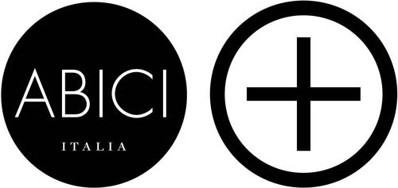
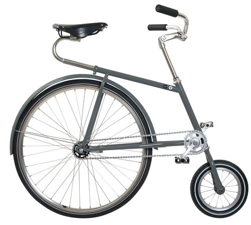
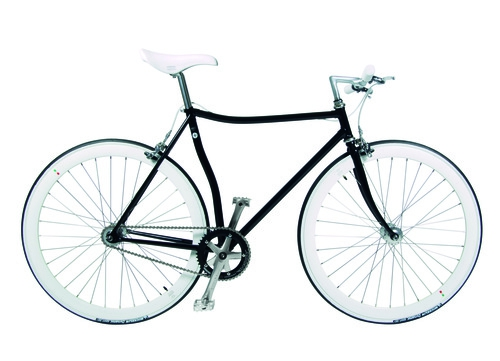
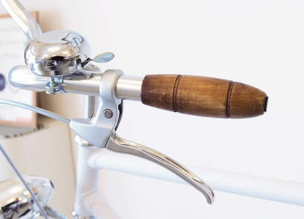
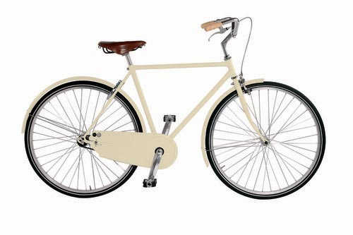

Sono fermamente convinta che mangiare sia una forma di comunicazione e che il cibo, quello buono, favorisca le facoltà intellettive.

Voglio dire, quante volte vi è capitato di avere un'illuminazione mentre eravate a tavola?

Giorgio Gaber cantava: *"Un'idea, un concetto, un'idea, finché resta un'idea è soltanto un'astrazione. Se potessi mangiare un'idea, avrei fatto la mia rivoluzione"*.

È dinnanzi a qualche piatto invitante (non cucinato da me, ovviamente! Il mio essere imbranata ai fornelli è ormai cosa nota...) che ho preso decisioni capaci di influenzare la mia vita, indirizzandola verso una direzione piuttosto che un'altra: a quale corso di laurea iscrivermi, se partire o meno per l'avventura australiana, se andare a lavorare in Spagna, se accettare un dato lavoro piuttosto di un altro.

Anche l'idea di aprire questo blog, in qualche modo, è nata in compagnia del cibo: è stato a casa di un'amica, una sera dello scorso autunno, davanti ad una tisana con biscotti. Si era in pigiama, in pieno brainstorming serale.

Una piccola ma doverosa precisazione: il protagonista della prossima intervista non è un cuoco e il suo settore occupazionale non è quello gastronomico.

Questa introduzione vuole essere solo un modo per esprimere una mia personale osservazione, e cioè che molte belle idee possono nascere mentre si è a tavola.

Ne sa qualcosa Stefano Seletti che, in occasione di una serata in trattoria, è stato uno degli ideatori del marchio Abici

Attualmente, questo marchio esporta i suoi prodotti in tutto il mondo, da San Paolo a Shanghai.

Che dire, quella sera ci hanno visto davvero giusto...

### Ciao, Stefano! Quando e come nasce Abici?

"*Ciao Anna*! L'idea di Abici, come hai appena anticipato, nasce 10 anni fa da una serata in trattoria passata tra amici davanti ad un piatto di tortelli, una bottiglia di lambrusco e consultando vecchi cataloghi artigiani degli anni '50.

Abici è, a tutti gli effetti, un'azienda di famiglia alla cui base c'è un legame forte e solido, creativo e sanguigno: oltre a me, infatti, gli altri 2 soci fondatori dell'azienda sono Dario Gozzi (cognato e amico d'infanzia) e suo fratello Cristiano".

***Qual è la vostra filosofia?***

"Se dovessi racchiudere la nostra filosofia in tre parole, sicuramente sarebbero *estetica*, *essenzialità* ed *artigianato*.

*Essenzialità* perché Abici porta le forme al massimo dell'essenziale: l'assenza di fili e di sovrastrutture esalta la sensualità delle forme e mostra la bicicletta nella sua nudità.

*Estetica* perché, in ogni modello Abici, c'è la continua ricerca della bellezza mescolando linee retrò a dettagli hi-tech, andando a creare un prodotto senza tempo.

*Artigianato* perché ogni bicicletta viene fatta a mano in Italia, compreso il telaio, e assemblata dalla stessa persona, dall'inizio alla fine, che firma un cartellino garantendo l'artigianalità del prodotto.

Questo è un metodo di produzione sicuramente inusuale, ma ci permette di aver cura del prodotto e dei suoi particolari come nessun altro".

***Per quanto ti riguarda, hai avuto trascorsi ciclistici?***

"No, non a livello agonistico, ma la passione per la bicicletta è sempre stata presente nella mia vita, fin da giovane, quando preferivo spostarmi in bicicletta piuttosto che in Vespa".

***Quali caratteristiche hanno le vostre biciclette e quali modelli proponete?***

"Una delle caratteristiche fondamentali delle nostre bici è, indubbiamente, la qualità.

Tutti i nostri modelli sono pensati e progettati per durare nel tempo: questo grazie ad una verniciatura a 3 strati, alla bulloneria inox e alla componentistica in alluminio o in acciaio inox.

Crediamo che la bicicletta sia uno di quegli oggetti che debbano tramandarsi di generazione in generazione e che, quindi, debba poter durare nel tempo, un po' come la Vespa o la Cinquecento alle quali, molte volte, ci siamo ispirati per colori e linee.

Complessivamente, proponiamo 14 modelli in versioni uomo e donna, tutti rigorosamente con telaio in acciaio a congiunzioni saldo brasate".

***Siete coinvolti esclusivamente nella produzione di biciclette o realizzate anche altro?***

"Abbiamo anche una linea di accessori per bici, tutta di nostra produzione, ed un piccola linea di abbigliamento pensato per il ciclismo.

Tra i nostri accessori degni di nota ci sono, sicuramente, le manopole in legno fatte a mano, così come le catene ricoperte in vera pelle italiana cucita a mano e con un lucchetto di tipo marino".

***In quali Paesi esportate e dove producete?***

"La produzione risiede interamente in Italia ed è tutto handmade, compreso il telaio (sembra stupido fare questa precisazione, ma ormai sono pochissimi i marchi che li realizzano nel nostro Paese). Proprio a questo proposito, penso che la figura del telaista di biciclette debba essere maggiormente valorizzata.

Nonostante il prodotto sia completamente Made in Italy, esportiamo l'85% per del nostro fatturato e abbiamo un Abici flagship store a San Paolo, in Brasile, così come a Shanghai, oltre che una rete di distributori che copre buona parte di Europa e di mondo.

Secondo me, esportiamo così tanto perché il Made in Italy e l'artigianato sono valori apprezzati maggiormente all'estero che non in Italia".

***Cosa bolle in pentola per il futuro?***

"Abbiamo molti progetti per il futuro, sia nuovi modelli che nuove collaborazioni con marchi importanti (come, del resto, abbiamo già fatto in passato per [Fendi](http://www.fendi.com/it/it), [Veuve Clicquot](http://www.veuve-clicquot.com) e [Acqua di Parma](http://www.acquadiparma.com/it/?gclid=CMKRt97As8ECFdTLtAodeF8AHw)).

Al momento, però, non posso ancora svelare nulla...ma vi invito a rimanere in contatto con noi attraverso il nostro sito e i canali social!".

