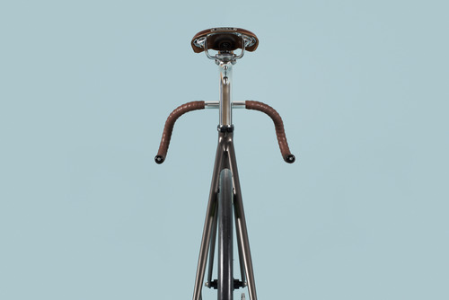
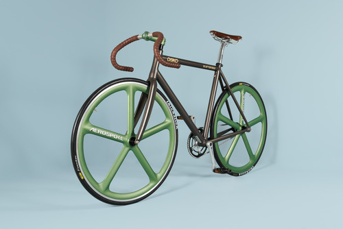
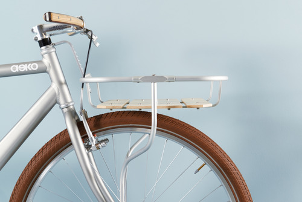
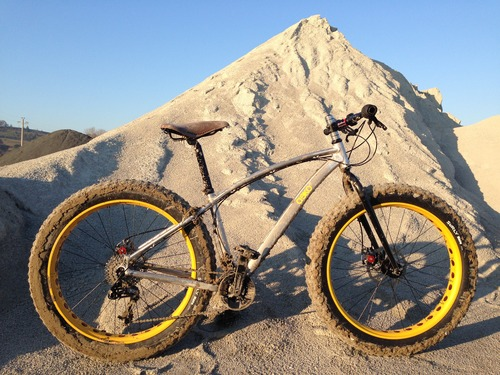
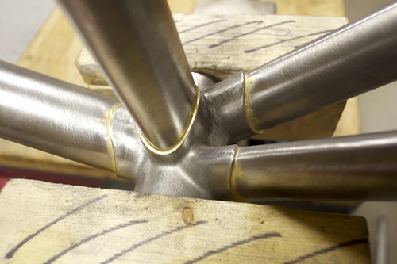
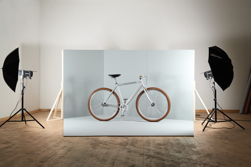

> Anna, ho conosciuto un artigiano che ti devo assolutamente presentare!

Ha esoridito così, qualche tempo fa, il mio caro amico Andrea.

L'artigiano in questione è Paolo Azzolini, classe 1959, proprietario di "Aeko" ([www.aeko.it](http://www.aeko.it/)).

Milanese di nascita, Paolo decide di dedicarsi all'attività lavorativa dopo aver completato le scuole superiori.

Dopodiché si sposa, diventa padre di due figli e, fino al 2010, porta avanti le sue attività nel campo delle attrezzature per cantieri edili. Tutt'altro mondo.

Poi la svolta e la decisione di dedicarsi alla passione per le biciclette: fonda Aeko, presso San Mauro Pascoli (Cesena), un laboratorio specializzato nella creazione e nella produzione di bici su misura, continuando quanto suo zio Giuseppe aveva fatto per una vita intera, lasciandogli in eredità tutti gli attrezzi del mestiere.

Durante le ore che trascorre dentro al suo laboratorio, Paolo produce pezzi unici, 100% Made in Italy, che realizza dalla A alla Z e che assembla personalmente in base ai gusti del cliente.

Per la lavorazione meccanica dei componenti e per la verniciatura dei pezzi, Paolo collabora con alcuni artigiani locali.

Fondamentalmente, le tipologie di bici realizzate sono quattro: la granturismo, la mountain bike, la scattofisso e la bici da turismo.

Qualche tempo fa sono andata a visitare il laboratorio di Paolo insieme al mio amico Andrea: è uno spazio molto ampio in cui sono esposti i suoi pezzi e in cui si ritrova quel bel disordine tipico degli ambienti creativi...

***Ciao Paolo! Innanzitutto grazie per aver accettato l'intervista. Prima di parlare di Aeko, facciamo un piccolo passo indietro e torniamo al principio. Chi era lo zio Giuseppe?***

"Ciao Anna! Zio Giuseppe Guglielmone era un artigiano, ciclista di Zeme, un piccolo paese della Lomellina che possiamo definire un atollo fra le risaie. La sua vita lavorativa è sempre stata dedicata alla bicicletta.

Le costruiva e le riparava con passione senza mai sottovalutare alcun aspetto costruttivo, impegnandosi principalmente nella realizzazione di biciclette da corsa e da passeggio.

Dopo la sua morte, ho ereditato l'attrezzatura per la costruzione dei telai. Attrezzi unici che si è costruito da sé. Zio Giuseppe era anche uno specialista nel riparare gli stivali dei contadini con enormi toppe...

Devo aggiungere che mio padre ha corso al [Vigorelli di Milano](http://www.milanosport.it/impianto/49/maspes-vigorelli/), tra gli anni '50 e '60, quando era ritenuto il tempio delle corse ciclistiche in pista. Ora, purtroppo, è abbandonato e in disuso da molti anni. Anche questo è parte del mio Dna ciclistico".

***Mollare la ditta di macchine escavatrici per dedicarti, anima e corpo, al mondo della bici: è un passo che denota molto coraggio. Com'è stata accolta questa decisione dalla tua famiglia?**

"Non nascondo che sia stata una scelta in qualche modo sofferta e meditata a lungo, non nego di aver avuto qualche incertezza.

Tuttavia, è noto che il mondo delle costruzioni, nel nostro Paese, soffre da anni una crisi pesante. Considerando questo contesto, la scelta è stata in qualche misura agevolata e resa meno traumatica di quanto, dall'esterno, si potrebbe immaginare.

La mia famiglia ha saputo comprendere le mie decisioni e mi è rimasta vicino, come del resto ha sempre fatto in questi anni. Anche una famiglia, nel suo piccolo, è una società, e credo che nulla possa andare a buon fine se non vi è collaborazione, accordo e complicità".

***Dove cerchi le materie prime? E quanto tempo impieghi per realizzare ed assemblare una bici?***

"Per quanto riguarda i materiali, ho preso un impegno con me stesso: utilizzare prodotti italiani, realizzati nel nostro Paese. Quando ciò non è possibile, per qualità o per disponibilità, allora cerco le migliori professionalità tra gli artigiani nel mondo, non importa da quale Paese.

È fondamentale che siano realizzazioni tecnicamente ineccepibili e, quando possibile, realizzate a mano in piccole serie.

Potrà sembrare strano ma ancora oggi, in paesi come gli Stati Uniti o il Giappone, esistono piccole realtà in grado di realizzare a mano degli ottimi prodotti. Certo, bisogna saper cercare...ma la tecnologia, in questo, aiuta parecchio!

Per quanto riguarda il tempo che impiego per realizzare una delle mie biciclette, beh, ti dirò che è una bella domanda.

Se non potrò essere breve, cercherò di essere almeno chiaro.

Tutto dipende da cosa vuole il cliente e dal fatto che scelga qualcosa che somigli o meno a realizzazioni già fatte o che desideri, invece, qualcosa di completamente nuovo.

Ho un portfolio che raccoglie alcuni esempi significativi di mie realizzazioni. Il mio sito offre una panoramica allargata: se si parte da un prodotto già realizzato, possono servire anche tre o quattro settimane per mettere in strada quanto desiderato del cliente.

Se invece devo realizzare qualcosa di completamente nuovo, allora potrebbero servire anche uno o due mesi.

Variabili che possono dilatare i tempi sono le fasi di colorazione e di decorazione: più complessa e particolare è la richiesta del cliente e maggiori sono i tempi necessari agli artigiani specializzati.

Tuttavia, alcune delle mie realizzazioni sono già disponibili: sono i modelli che presento nelle fiere e nelle esposizioni per mostrare cosa e come realizzo i miei progetti.

Non nascondo che alcuni clienti si sono innamorati subito del mio operato, chiedendomi di accontentarli subito.

Spesso penso alle mie biciclette come a piccole ed uniche opere d'arte, utili per muoversi e per soddisfare il desiderio di distinzione che è in tutti noi".

***Cosa significa, per te, il termine "Made in Italy"?***

"Realizzato in Italia. Made in Italy è, oggigiorno, un vantaggio competitivo riconosciuto e apprezzato. Occorre che l'intera filiera sia italiana, dall'idea al prodotto: il risultato è un insieme di caratteristiche distintive che sono riconosciute dagli intenditori a prima vista e che, soprattutto, sono apprezzate e cercate.

Mi avvalgo, non potendo fare tutto da solo, di realtà locali, artigiani che spesso non sono direttamente collegati al mondo della bicicletta, ma che hanno grandi capacità e che sanno interpretare al meglio ciò che desidero per i miei clienti".

***Quali progetti hai in mente per le prossime stagioni?***

"In questi ultimi mesi mi sono dedicato al settore delle *Fat Bike*, realizzando alcuni prototipi, e al momento sono pronto per produrre questo tipo di bicicletta, alquanto nuova per il nostro mercato, sia nella versione in alluminio che in acciaio inox.

Sto sviluppando alcuni componenti con caratteristiche innovative e presto sarò on line con il mio negozio virtuale per offrire al mercato non solo i miei prodotti e i miei componenti, ma anche una selezione del meglio che il mercato offre attualmente.

Sto anche pensando di realizzare alcuni modelli in piccole serie per allargare il numero dei "fortunati" che possano pedalare il sogno di una bici esclusiva, al vertice della tecnica e sintesi del meglio che è disponibile sul mercato.

Non nego, poi, il concreto interesse per i mercati esteri, quelli più attenti al prodotto esclusivo, che sanno valutare il valore del Made in Italy e di tutto ciò che è realizzato a mano".

