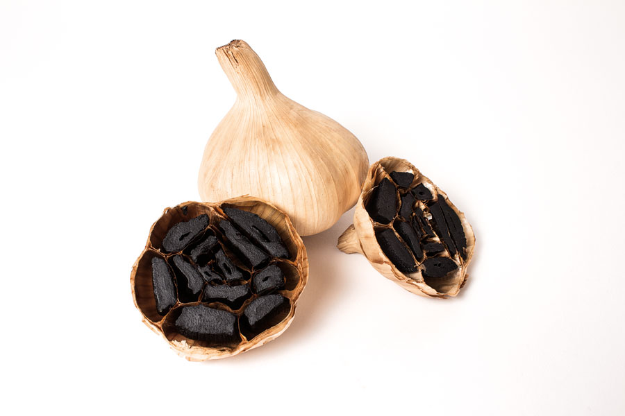
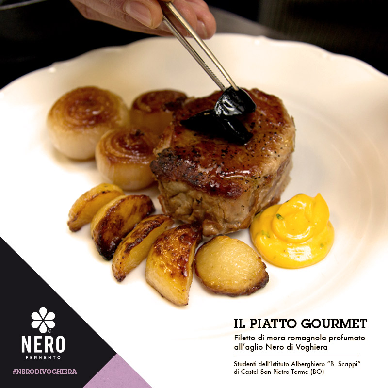
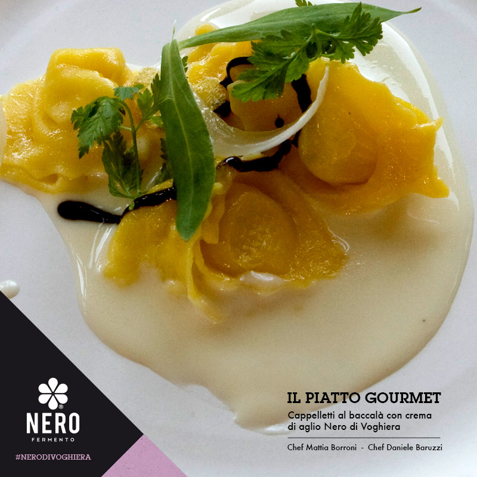

Lavorando tutti i giorni davanti al monitor di un computer, quando stacco ho davvero bisogno di usare le mani, e con *usare le mani* mi riferisco all'arte del forgiare qualcosa, del creare ex novo.
La cucina riveste sicuramente un ruolo importante, in questo senso, soprattutto durante i mesi invernali.
Musica, ingredienti disposti sul tavolo e grembiuletto: ecco ciò che mi serve per entrare in modalità *non-ci-sono-per-nessuno-ci-vediamo-domani* e per riuscire a godere dei profumi che i fornelli sono in grado di sprigionare.

In un'ottica di studio e di ricerca personale, all'incirca due settimane fa sono entrata in contatto con una nuovissima start up italiana gestita da un gruppo di giovani ingegneri impegnati nella produzione e promozione dell'aglio nero ottenuto dall'aglio di Voghiera.
Mai sentito parlare di questo prodotto? Lo avete mai assaggiato?
Se la risposta è "no", allora è il caso di conoscere [Nero Fermento](https://www.nerofermento.it) attraverso le parole di Tommaso Pavani, uno dei componenti di questo bel team romagnolo.
Cerchiamo di capire insieme a lui di cosa si tratta, come viene prodotto e qual è il suo impatto ambientale...

#### Ciao Tommaso! Quando e da chi è nato Nero Fermento?

"Ciao Anna! Nero Fermento è una start-up nata all'incirca un mese fa dopo due anni di lavoro e di ricerca insieme a due realtà: [RES](http://www.resitalia.org), che ha sviluppato le tecnologie di cui avevamo bisogno, e [A.I - Agricoltori in Erba](https://www.facebook.com/Societ%C3%A0-Agricola-AI-Agricoltori-in-erba-544511275628514/), azienda agricola in provincia di Ferrara.
Questo progetto è il frutto di una bella cena insieme agli ingegneri Stefano Silvi, Davide Bersani e Chato Della Casa, con la preziosa collaborazione di Gian Paolo e Neda Barbieri, ovvero mio zio e mia madre nonché soci di A.I - Agricoltori in Erba che, appunto, ci rifornisce di aglio bianco di Voghiera".

#### Siete i soli a produrre aglio nero in Italia?

"Diciamo che in Italia ci sono piccolissime realtà coinvolte in questo settore. Alcuni chef lo autoproducono, ma i risultati non sono sempre soddisfacenti anche a causa degli strumenti utilizzati - solitamente si tratta di un normale forno da cucina - che non consentono di gestire bene i valori di temperatura e di umidità.
Poi abbiamo alcuni piccoli produttori che non sempre scelgono una materia prima biologica certificata, come invece facciamo noi, e che, alle volte, non hanno un consorzio alle spalle.
**Noi siamo i primi in Italia a produrlo affidandoci a un aglio bianco di partenza che è certificato D.O.P**. Parliamo di una materia prima d'eccellenza.
La nostra attuale ambizione è distribuire il nostro aglio nero al maggior numero di consumatori possibile, dato anche che **questo è un mercato ancora pressoché inesistente in Italia**".

Ecco come si presenta il Nero di Voghiera.

#### Dove producete l'aglio nero di Voghiera?

"**Lo produciamo a Ravenna**, la città che ha visto nascere questo progetto".

#### Potresti darmi qualche informazione sull'aglio di Voghiera?

"L'aglio bianco di Voghiera, che rappresenta la materia prima da cui ricaviamo l'aglio nero, è il primo in Italia ad essere D.O.P.
Voghiera, questo piccolo paese in provincia di Ferrara, presenta quelle caratteristiche del terreno in grado di dare un'impronta particolare al prodotto. Mi riferisco specialmente alla composizione delle argille e della sabbia.
Dalla sinergia fra coltivatori, Università e amministrazioni pubbliche, alcuni anni fa è nato un grandissimo studio rivolto a questo particolare prodotto locale".

#### Come viene prodotto l'aglio nero?

"**Si tratta di un processo di maturazione dell'aglio bianco di Voghiera**. La sua fermentazione avviene in condizioni di umidità e di temperatura controllate, sempre al di sotto dei 100°C. Queste particolari condizioni attivano gli enzimi dell'aglio bianco che, a loro volta, producono gli zuccheri che riescono a trasformare la consistenza e il colore dell'aglio facendogli perdere fino al 60% del suo peso.
In linea di massima impieghiamo due mesi di lavoro per ultimare il prodotto. Lo lasciamo maturare all'interno del fermentatore saggiandolo solo di tanto in tanto".

####

#### Che cosa si ottiene dopo questo periodo di due mesi?

"La licina contenuta nell'aglio classico, responsabile dei problemi di digestione e dell'odore pungente di questo alimento, scompare, per cui otteniamo un prodotto molto più **digeribile** e **delicato**.
Aumentando la produzione di zuccheri, la fermentazione fa sì che il sapore diventi quasi balsamico e con alcune note di liquirizia".

#### Proviamo a chiarire un aspetto importante: qual è l'impatto ambientale relativo alla produzione dell'aglio nero? Mi riferisco agli strumenti che utilizzate e al loro dispendio energetico: che grado di impatto c'è sull'ambiente e come avete deciso di affrontare questo aspetto?

"Dal punto di vista delle emissioni e degli scarti, **l'impatto è trascurabile**. Circa gli strumenti che utilizziamo per la maturazione e per la fermentazione, in fase prototipale abbiamo utilizzato delle resistenze elettriche cercando di mitigare il consumo energetico coibentando in maniera massiccia la cella di maturazione.
La nuova cella che stiamo mettendo a punto vuole cercare di ridurre i consumi, sia per questioni ambientali che per ragioni economiche.
Partendo sempre da una coibentazione spinta per diminuire al massimo il fabbisogno di energia, sono al vaglio due ipotesi: una prevede un impianto fotovoltaico a servizio di un'eventuale generazione elettrica, l'altra prevede l'uso di un sistema idronico alimentato a biomasse di scarto.
Provenendo molti di noi dal campo delle energie rinnovabili e della sostenibilità applicata, **la riduzione dei consumi è indubbiamente in cima alla lista di cose da attuare e da approfondire**".

#### Torniamo alla questione aglio bianco e aglio nero: i due prodotti hanno usi differenti, giusto?

"Esattamente, sono due cose molto diverse. Ad esempio, sconsiglierei l'aglio nero per la preparazione dei soffritti perché si perderebbe moltissimo del suo sapore.
L'utilizzo migliore, a nostro parere, è quello crudo. Eventualmente lo si può addizionare a piccole cotture. È l'ideale per risotti, pesce, carne e abbinamenti tartufati".

#### Cosa mi dici a proposito della conservazione? L'aglio nero si conserva meglio?

"Sì, la fermentazione blocca la possibilità che possa germinare. **L'aglio nero di Voghiera si mantiene per mesi**, anche all'interno di un normalissimo contenitore di vetro".

#### A chi vendete il vostro prezioso aglio?

"Grazie alla collaborazione con [Chef to Chef](http://www.cheftochef.eu) lo vendiamo soprattutto ai ristoranti, alcuni dei quali sono addirittura stellati.
I suggerimenti di chi cucina per lavoro ci hanno aiutato a migliorare il gusto del nostro aglio nero.
Da un po' di tempo siamo stati inclusi nel catalogo dell'azienda romana [HQF](http://www.hqf.it) (High Quality Food) che rifornisce i ristoranti di prodotti d'eccellenza.
Inoltre, abbiamo cominciato a lavorare insieme a [Selecta](http://www.selectaspa.it), leader italiano nell'alta ristorazione, poi con Ferrara Frutta e [Moriconi](http://www.moriconifrutta.it) a Ravenna".

#### Programmi per il futuro?

"Nero Fermento non nasce per produrre esclusivamente aglio nero, quello vorremmo che diventasse il nostro top di gamma.
Il nostro desiderio è riuscire a sviluppare anche altri prodotti. Siamo solo all'inizio!".
