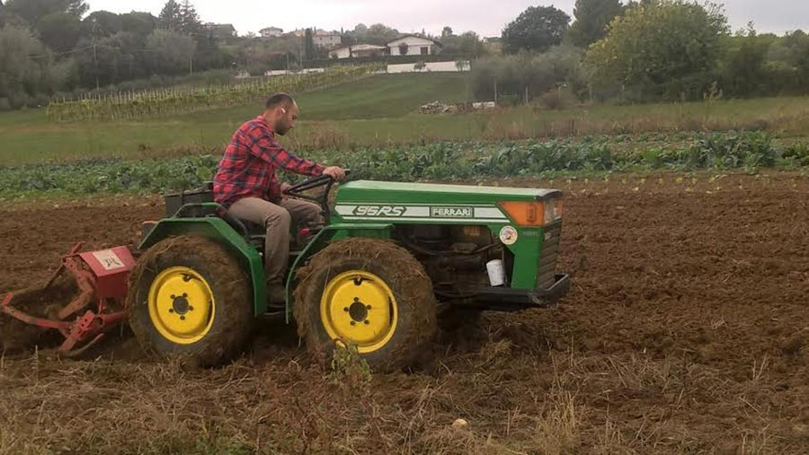

Ok, ora mollate tutto quello che state facendo: salutate chi dovete salutare, impostate lo smartphone in modalità "silenzioso", spegnete la musica (oppure accendete quella che più vi piace ascoltare durante la lettura), posticipate il caffè che avevate promesso al collega, salvate in "bozze" la mail che stavate scrivendo e preparatevi a leggere un articolo che parla di sogni e di coraggio.
Sì, lo ammetto, sono letteralmente affascinata dalla storia di Laura e Marco, due ragazzi romagnoli che hanno deciso di rivoluzionare le loro vite: dall'ufficio al campo da arare, dalle scrivania al trattore.
Mollare tutto per rincorrere la felicità, per essere padroni del proprio tempo, per dedicarsi a quell'umile lavoro che ha tanto segnato le vite dei nostri nonni.
Avere il coraggio di mollare una vita che non ti appartiene per cercare di afferrare ciò che vuoi per davvero: utopia?
Se Lucio Dalla, nella sua splendida *Anna e Marco*, cantava: "*Dov'è la strada per le stelle?*", io mi domando: dov'è la strada per la realizzazione personale? Risiede nella rassegnazione oppure in una silente rivoluzione personale?
Cari amici lettori, vi presento Laura e Marco, due giovani che hanno deciso di mettersi in gioco senza avere il timore di essere felici.

#### Ciao ragazzi! È davvero un grande piacere conoscervi. Ditemi, chi siete ora e chi eravate prima della vostra scelta di vita?

"Oggi siamo dei contadini con la grande ambizione di cambiare il mondo a partire da ciò che facciamo ogni giorno, cioè produrre buon cibo e prenderci cura della terra.
Fino a due anni fa, prima di iniziare questa avventura, avevamo alcune cose in comune con ciò che siamo adesso, così come tante differenze; la voglia di cambiare il mondo in cui viviamo è rimasta inalterata, per il resto eravamo due giovani laureati in sociologia che si barcamenavano in una grande città come Bologna tra vari lavori precari.
Nel corso degli anni, Laura ha lavorato come segretaria, barista ed educatrice, mentre Marco è stato magazziniere, operatore di call center e, nell'ultimo periodo, educatore e tutor in un ente di formazione professionale".

#### Cosa vi mancava fino a due anni fa?

"Vivevamo un profondo malessere personale legato alle condizioni lavorative e di vita.
Abbiamo affrontato ritmi abbastanza snervanti e alti livelli di stress, soprattutto nell'ultimo anno, e i soldi non bastavano mai, nonostante lavorassimo entrambi non riuscivamo a fronteggiare tutte le spese (caso emblematico che raccontiamo sempre: per andare a lavoro eravamo costretti a muoverci in auto, ma non guadagnavamo abbastanza per poterla mantenere! Un paradosso che ci ha spinti a compiere alcune riflessioni).
Abbiamo sempre sentito una forte spinta al cambiamento: siamo stati attivisti di movimenti studenteschi, ecologisti e membri di comitati cittadini, eravamo abituati a riflettere e a discutere di sostenibilità ambientale e di sfruttamento delle risorse naturali.
Ad un certo punto, però, ci siamo resi conto che il cambiamento di cui si sente la necessità non basta solo dichiararlo, occorre praticarlo mettendosi in gioco fino in fondo.
È proprio in quel periodo che abbiamo iniziato a frequentare i mercati contadini dell'[associazione Campi Aperti](http://www.campiaperti.org) (legata al circuito di [Genuino Clandestino](https://genuinoclandestino.noblogs.org)) e che siamo diventati assegnatari di un orto comunale ([Dalla Parte del Cavolo](https://dallapartedelcavolo.wordpress.com), il nostro blog, è nato proprio in quei mesi per raccontare quella piccola esperienza).
È venuto spontaneo pensare che l'agricoltura potesse essere l'anello di congiunzione tra le grandi cause e i grandi sogni - che non abbiamo mai abbandonato - e il cambiamento quotidiano.
Ci teniamo a sottolineare che la decisione di andarcene da Bologna nell'autunno del 2013, per tornare in provincia di Rimini, non è stata presa a cuor leggero: è stato un piccolo trauma per noi e per le persone che ci circondavano, abbiamo lasciato una città che amavamo e che iniziavamo a sentire come casa nostra.
In quel momento, però, ci è sembrata la cosa giusta da fare. A distanza di due anni restiamo di quell'idea".

#### Parlatemi della vostra politica agricola: quale agricoltura promuovete? C'è qualcuno a cui vi ispirate?

"La nostra è l'agricoltura contadina, quella diversificata e di piccola scala che viene portata avanti da chi pensa che la terra non sia solo un semplice fattore produttivo, ma che vada trattata con rispetto.
Rifiutiamo l'utilizzo della chimica di sintesi e pensiamo che la sostenibilità ecologica debba rappresentare il movente di ogni azione.
Una delle malattie dell'agricoltura industriale è la pretesa di controllare tutte le variabili che la natura produce e di rendere tutto prevedibile, quando qualcosa sfugge al controllo si tenta di risolvere il problema per via tecnologica o attraverso qualche prodotto chimico; gli ecosistemi, in realtà, sono molto più complessi e non completamente prevedibili.

Il nostro è un dialogo costante - a volte duro e conflittuale - insieme all'ecosistema con cui abbiamo a che fare, ma senza la pretesa della completa sottomissione delle dinamiche naturali alla nostra volontà.
Pensiamo ad un'agricoltura legata al territorio e supportata dalla comunità: significa costruire relazioni di fiducia con le persone che consumano i tuoi prodotti e che, quindi, diventano qualcosa di più di semplici clienti perché imparano a conoscere e a rispettare il tuo lavoro e a sostenere il tuo progetto.
Come detto precedentemente, un nostro punto di riferimento è la rete di *Genuino Clandestino* che promuove in molti territori l'agricoltura contadina attraverso mercati e iniziative di vario genere, poi guardiamo con interesse alcuni percorsi che prendono vita nel Sud del mondo, dove l'agricoltura contadina ha un ruolo rilevante nella produzione agroalimentare e dove ci sono esperienze e riflessioni che parlano anche alla nostra parte di mondo (un esempio su tutti: la riflessione e le pratiche sull'agroecologia sperimentate in Brasile dal movimento dei [Sem Terra](http://www.mst.org.br)).
Viviamo in un territorio che ha una tradizione contadina molto radicata, molte cose si sono un po' perse negli ultimi decenni ma, per fortuna, stiamo trovando canali e relazioni che ci permettono di riscoprire saperi e pratiche antiche ma, allo stesso tempo, attualissime.
Stiamo conoscendo agricoltori che provano a non disperdere questo patrimonio e stiamo frequentando corsi organizzati da piccole associazioni (la scorsa primavera, ad esempio, ne abbiamo frequentato uno riguardante le erbe spontanee e il loro utilizzo in cucina).
Tutte queste cose, fino ad alcuni anni fa, erano banali e scontate, ma oggi è necessario riscoprirle e diffonderle".

#### Mi piacerebbe molto conoscere la vostra giornata-tipo: a che ora suona la sveglia? E poi come si sviluppa la giornata?

"È il clima a decidere per noi. L'estate appena trascorsa, ad esempio, è stata caldissima e si poteva lavorare solo per poche ore al giorno, la mattina presto e la sera: sveglia puntata alle 04:30 e poi in campo a raccogliere, zappare, trapiantare, ecc.
Una volta sfamate le galline, quando il sole diventava troppo rovente, ci si riposava un po' oppure si facevano i lavoretti in casa, dopodiché si tornava in campo nel tardo pomeriggio.
In realtà le variabili di cui tenere conto e i lavori da fare sono tantissimi, quindi ogni giornata fa storia a sé; se sappiamo che il giorno dopo piove, dobbiamo anticipare alcuni lavori che pensavamo di fare con più calma e terminarli in fretta e furia (lavorazioni della terra, semine, raccolta, ecc.).
In autunno e in inverno i tempi sono più rilassati, le giornate sono più brevi è c'è tempo per riposarsi, per leggere e per coltivare altri interessi. Abbiamo comunque sempre da fare: la vendemmia, la raccolta delle olive, la potatura, la semina di altri ortaggi, la programmazione del lavoro per la primavera/estate successiva".

(https://myhumus.com/wp-content/uploads/2015/10/aratura-del-terreno-affittato-un-anno-fa.jpg);">

  

#### Cosa e come producete? Dove possiamo acquistare i vostri prodotti?

"La nostra attività principale è l'orto, produciamo ortaggi e un po' di frutta, abbiamo un po' di ulivi e di vigne e poi abbiamo alcune attività integrative.
Quando ci sono delle rimanenze di frutta o di ortaggi, li trasformiamo in marmellate e in conserve per evitare lo spreco.
Abbiamo alcuni animali: galline, polli, anatre e oche che ci danno uova e carne.

  

In queste settimane abbiamo affittato ulteriore terra su cui ci sono altrae vigne, alberi da frutto e ulivi, per cui estenderemo la produzione di queste cose, pensavamo di ampliare anche la produzione di legumi secchi.

I nostri prodotti possono essere acquistati direttamente in azienda oppure ad un mercato settimanale di produttori a cui partecipiamo a Cattolica".

  #### Una curiosità personale: avete ricevuto qualche contributo dall'Unione Europea?

"Questo è un tasto dolente.
Quando abbiamo iniziato questa esperienza facevamo molto affidamento su quella possibilità, poi ci siamo resi conto che era più complicato del previsto e ne siamo rimasti tagliati fuori.
Per accedere ai finanziamenti devi avere la possibilità e la capacità di impostare un progetto di medio periodo, significa avere accesso ad una certa quantità di terra per un certo periodo di tempo. Il paradosso è che meno risorse hai di partenza e meno possibilità hai di essere aiutato.
Il grande problema non sono solo i finanziamenti, ma l'accesso alla terra: se non sei già dentro al settore, è molto difficile entrarci in modo stabile.
Noi siamo partiti con poco, siamo una realtà abbastanza precaria e i termini e i tempi che determinano il nostro rapporto con la terra non sono sufficienti a costruire un progetto di medio-lungo periodo e a garantire i prerequisiti per accedere a quei finanziamenti.
Abbiamo notevoli difficoltà finanziarie e, da due anni, lavoriamo con attrezzature insufficienti e con un surplus di fatica a volte evitabile; abbiamo costruito vari attrezzi - li abbiamo soprannominati "Frankenstein" - a volte funzionanti, altre volte completamente fallimentari.
Non vuole essere una sterile lamentela, alla fine ci divertiamo e l'entusiasmo non ci manca, ma a volte è dura.
La nostra vera risorsa sono le persone che ci circondano, e che credono nel nostro progetto, che ci danno una mano acquistando i nostri prodotti o partecipando alle cene che organizziamo per autofinanziarci, oppure aiutandoci a fare alcuni lavori e a far funzionare le cose.
Inoltre, in queste settimane, proprio perché abbiamo bisogno di comprare qualche attrezzo più adeguato, abbiamo lanciato una raccolta fondi sulla piattaforma di crowdfunding [Produzionidalbasso.com](https://www.produzionidalbasso.com/project/giovani-contadini-terreni-abbandonati-e-agricoltura-sostenibile/)".

#### Dopo aver intrapreso questa decisione, in che modo è migliorata la qualità della vostra vita? E gli amici, la famiglia, ecc., che cosa vi dicono?

"Sicuramente mangiamo decisamente meglio! Abbiamo scoperto sapori e prodotti che non conoscevamo, abbiamo la sensazione di fare qualcosa di giusto e di utile - non solo per noi - e questo motiva la fatica che facciamo trasformandola in orgoglio e in soddisfazione.
Siamo padroni del nostro tempo e del nostro lavoro anche se, a volte, dobbiamo scendere a patti con le condizioni meteo e con i ritmi della natura. Capita che ci siano incomprensioni, ma è fisiologico.
Tutti ci incoraggiano a continuare; anche i più scettici, vedendo e toccando con mano ciò che facciamo, con il tempo riescono a capirne l'importanza.
Qualcuno, a volte, non capisce la nostra radicalità nel perseguire obiettivi di sostenibilità ambientale (ci sono momenti in cui, effettivamente, siamo puntigliosi e rompi balle!) ma c'è condivisione degli obiettivi e solidarietà".

#### Quali piani per il futuro?

"Vorremmo condividere la nostra piccola esperienza insieme ad altri, la terra che abbiamo a disposizione ci consente già di coinvolgere attivamente altre persone nel lavoro che facciamo; un'altra persona lavora con noi e vorremmo estendere questa opportunità.
Restiamo convinti che l'agricoltura contadina possa essere un'occasione per creare lavoro di qualità e reddito per molti, e noi vogliamo fare la nostra parte.
In questi giorni, il nostro blog [Dalla Parte del Cavolo](https://dallapartedelcavolo.wordpress.com) è divenuta un'associazione: un modo per raccogliere la piccola comunità nata intorno al nostro progetto in questi due anni e per mostrare la valenza collettiva del nostro percorso.
Vorremmo che diventasse un piccolo punto di riferimento anche per altri che, su questo territorio, stanno facendo un percorso simile al nostro, così come un modo per dar vita ad iniziative sociali e culturali che rafforzino il senso del lavoro che facciamo".

> Se il tema dell'agricoltura sostenibile ti interessa, ti consiglio di leggere anche gli articoli su [Mater Naturae](https://myhumus.com/decrescita-felice-mater-naturae/), [Civiltà Contadina](https://myhumus.com/civilta-contadina-biodiversita/) e [Veve](https://myhumus.com/veve-orto-verticale/).

