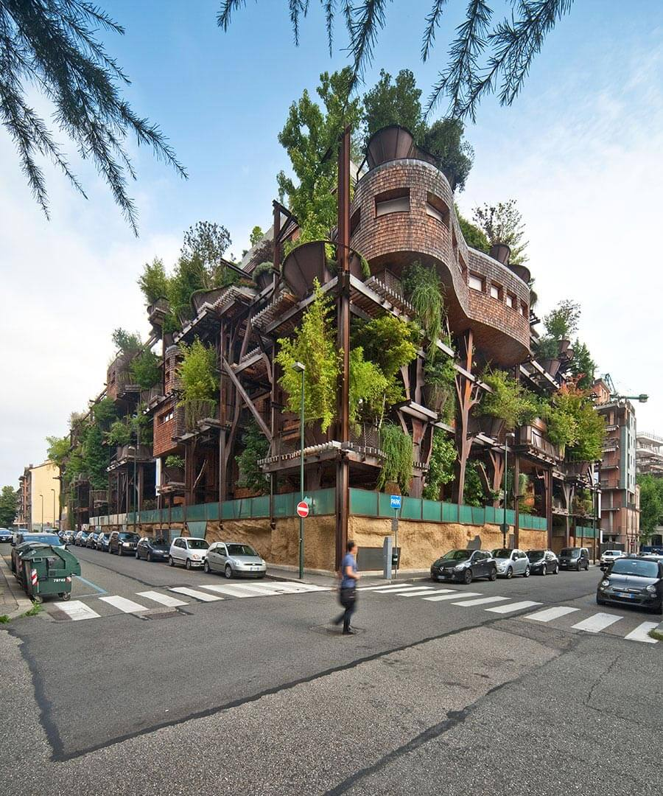
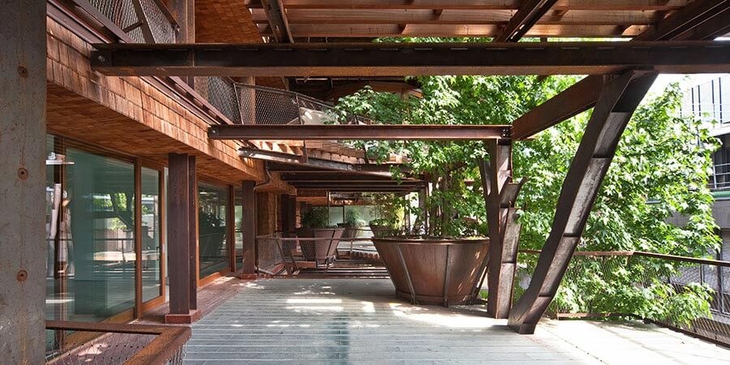
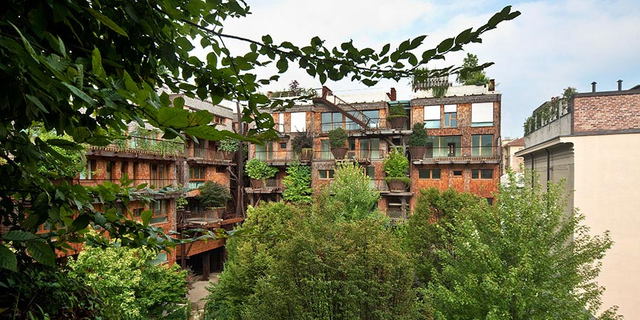
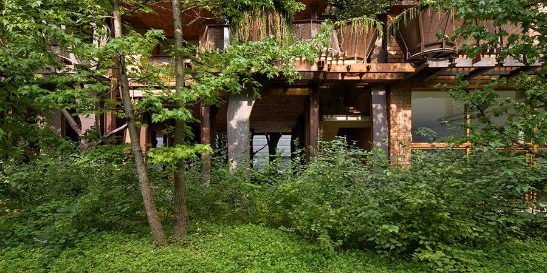

[25 verde](http://www.25verde.it) è il palazzo foresta di Torino concepito dall'architetto [Luciano Pia](http://www.lucianopia.it).

Questo edificio di 63 appartamenti, tutti diversi fra loro, è un esempio di **riqualificazione urbana di un ex quartiere industriale** con affacci eterogenei.
È un _condominio green_ ricco di piante e di piccoli arbusti, energeticamente efficiente e con un bel 'tetto verde' su cui coltivare ortaggi.

### Salve, arch. Pia. Mi dica, da quali necessità nasce il palazzo foresta di Torino?

> Spesso siamo costretti ad abitare luoghi molto distanti dalle nostre aspirazioni. Molti di noi vorrebbero abitare in mezzo al verde, nella natura, in abitazioni con grandi terrazze. Ma non sempre, questo, è possibile.
>
> Le nostre città sono molto _costruite_, e le porzioni metropolitane sorte dopo la Seconda Guerra Mondiale sono diventate invivibili. C'è la tendenza innaturale a costruire in altezza, spinti da una speculazione economica anziché da un reale bisogno.

> Molte volte è richiesto di costruire case, com'è stato per 25 Verde, in aree urbane degradate e compromesse.
>
> Quella del Condominio 25 Verde è una **zona ex industriale di Torino**. In questi quartieri è sorta la prima fabbrica FIAT. L'area è molto vicina al fiume, al Parco del Valentino e alla collina torinese. Eppure, in questo isolato urbano, non ci sono il parco, la collina, il fiume e il verde. Ci sono solo affacci su aree industriali e retri delle case.
>
> Ecco perché, anziché costruire un edificio, si è realizzato il primo palazzo foresta di Torino. **Un bosco con le case tra gli alberi**. Nei punti lasciati liberi dagli alberi, abbiamo posizionato gli spazi abitabili.

### Come si sentono gli abitanti del Condominio 25 Verde? Sono soddisfatti della loro scelta?

> Chi vive in questo palazzo foresta di Torino è contentissimo, perché si sente parte di un **organismo vivente**. È entrato **in sintonia col verde forte e massiccio**, apprezzandone il valore e tutte le potenzialità.
>
> Dal momento che non tutti possono abitare in collina, possiamo fare qualcosa per **migliorare la qualità della vita in città**. Il palazzo foresta di Torino ha questo specifico obiettivo.

## Perché comprare casa all'interno del palazzo foresta di Torino?

> Le persone che vivono in 25 Verde hanno compiuto una scelta consapevole. Hanno ritrovato una dimensione umana di comunità che, nelle città, non c'è quasi più. Non si sentono migliori, si sentono di condividere un modo di abitare e di vivere, e questo è importante. Vivere in questo palazzo foresta di Torino li fa sentire parte di qualcosa di speciale.
>
> 25 Verde è un complesso immobiliare a destinazione residenziale che intende far vivere i cittadini con la natura. Intende far sì che ognuno possa godere di uno spazio esterno.
>
> La natura diventa un filtro fra gli abitanti del condominio 25 Verde.

## Prima di salutarLa, Le domando: qual è stata la risposta da parte della cittadinanza torinese e delle amministrazioni? 25 Verde è stato accolto bene?

> È un intervento che divide. Andrea Gavotto, vice presidente di [White Red&Green Group](http://whiteredgreen.com) e curatore della campagna pubblicitaria iniziale, l'aveva intuito.
>
> L'amministrazione pubblica, distratta da problemi più contingenti, non fa attenzione a interventi residenziali di modeste dimensioni.
>
> L'iter burocratico è stato lungo e complesso e la città, in questo, non ci ha particolarmente aiutati.
>
> Ancora oggi, **non saprei definire come l'amministrazione pubblica veda questo intervento**. Torino è una città riservata e, a volte, è molto difficile comprenderla.

Foto di copertina: Beppe Giardino.
