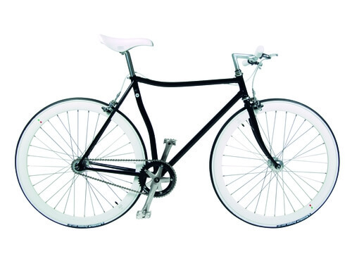

Cibo e **mobilità sostenibile**: che legame esiste fra queste parole?

Davanti a un piatto fumante ho preso molte decisioni importanti. La stessa idea di avviare questo blog è nata in compagnia del cibo. È stato a casa di un'amica, una sera dello scorso autunno, mangiando biscotti con l'uvetta.

Il protagonista della prossima intervista non è un cuoco e il suo settore occupazionale non è quello gastronomico. Eppure anche lui, un bel giorno, ha preso una decisione standosene seduto a tavola.

**Stefano Seletti**, in occasione di una serata in trattoria, insieme ad alcuni amici ha concepito il marchio Abici

Oggi esportano i loro prodotti in tutto il mondo, da San Paolo a Shanghai.

A quanto pare, quella sera ci hanno visto giusto...

### Ciao, Stefano. Mi parli di Abici, la vostra soluzione per la mobilità sostenibile?

> Ciao, Anna! Abici nasce dieci anni fa da una serata con amici di fronte a un piatto di tortelli, a una bottiglia di lambrusco e a vecchi cataloghi artigiani degli anni Cinquanta.
>
> Abici è un'azienda alla cui base c'è un legame forte e solido, creativo e sanguigno. Gli altri soci fondatori dell'azienda sono Dario Gozzi (cognato e amico d'infanzia) e suo fratello Cristiano.

### Qual è la filosofia del brand?

> Se dovessi racchiudere la nostra filosofia in tre parole, sicuramente sarebbero **estetica**, **essenzialità** e **artigianato**.
>
> _Estetica_ perché, in ogni modello Abici, c'è la continua ricerca della bellezza. Mescoliamo linee retrò a dettagli hi-tech, creando un prodotto senza tempo.
>
> _Essenzialità_ perché Abici porta le forme al massimo dell'essenziale.
> L'assenza di fili e di sovrastrutture esalta la sensualità delle forme e mostra la bicicletta nella sua nudità.
>
> _Artigianato_ perché ogni bicicletta viene fatta a mano in Italia, compreso il telaio. Viene assemblata dalla stessa persona, che firma un cartellino garantendo l'artigianalità del prodotto.
>
> Questo è un metodo di produzione sicuramente inusuale, ma ci permette di aver cura del prodotto e dei suoi particolari come nessun altro.

### Dì un po', mobilità sostenibile a parte: hai avuto trascorsi ciclistici?

> Non a livello agonistico, ma la passione per la bici è sempre stata presente nella mia vita, fin da giovane. Preferivo spostarmi così anziché in Vespa.

### Quali caratteristiche hanno le vostre biciclette? Quali modelli proponete?

> Una delle caratteristiche fondamentali dei nostri prodotti è la qualità.
>
> I nostri modelli sono pensati e progettati per una mobilità sostenibile durevole. Questo grazie a una verniciatura a tre strati, alla bulloneria inox e alla componentistica in alluminio o in acciaio inox.
>
> La bici deve tramandarsi di generazione in generazione. E deve durare nel tempo, un po' come la Vespa o la Cinquecento alle quali ci siamo spesso ispirati per colori e linee.
>
> Proponiamo quattordici modelli in versione uomo e donna, tutti rigorosamente con telaio in acciaio a congiunzioni saldo brasate.

### Al di là delle biciclette, realizzate anche altro?

> Abbiamo anche una linea di accessori per bici, tutta di nostra produzione. > E anche un piccola linea di abbigliamento pensata per il ciclismo.
>
> Tra i nostri accessori degni di nota ci sono le manopole in legno fatte a mano, ma anche le catene rivestite di vera pelle italiana cucita a mano e con un lucchetto di tipo marino.

### In quali Paesi esportate i vostri articoli per la mobilità sostenibile? E dove producete?

> Produciamo in Italia ed è tutto handmade, compreso il telaio. Sembra stupida questa precisazione, ma sono pochissimi i marchi che li realizzano qui.
> A questo proposito, credo che la figura del telaista di biciclette debba essere maggiormente valorizzata.
>
> Nonostante il prodotto sia completamente Made in Italy, esportiamo l'85% per del nostro fatturato. Abbiamo un Abici flagship store a San Paolo, così come a Shanghai, e una rete di distributori che copre buona parte dell'Europa e del mondo.
>
> Esportiamo così tanto perché il Made in Italy e l'artigianato sono valori apprezzati più all'estero che in Italia.

### Stefano, svelami un segreto: cosa riserva il futuro?

> Abbiamo molti progetti, nuovi modelli e nuove collaborazioni con marchi importanti (come, del resto, abbiamo già fatto in passato per [Fendi](http://www.fendi.com/it/it), [Veuve Clicquot](http://www.veuve-clicquot.com) e [Acqua di Parma](http://www.acquadiparma.com/it/?gclid=CMKRt97As8ECFdTLtAodeF8AHw)).
>
> Al momento non posso ancora svelare nulla, ma invito tutti a restare in contatto con noi attraverso il nostro sito e i canali social!.

