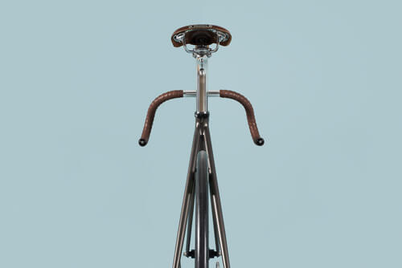
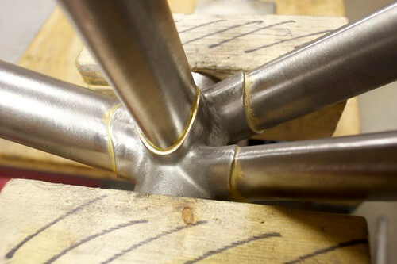

> Anna, ho conosciuto un artigiano di biciclette Made in Italy che ti devo assolutamente presentare!

Ha esoridito così, qualche tempo fa, un mio carissimo amico.

L'artigiano in questione è **Paolo Azzolini**, classe 1959, proprietario di **[Aeko](http://www.aeko.it/)**.

Milanese di nascita, Paolo decide di lavorare subito dopo aver terminato le scuole superiori.

Dopodiché si sposa, diventa padre di due figli e, fino al 2010, porta avanti le sue attività nel campo delle attrezzature per cantieri edili. Tutt'altro mondo.

Un bel giorno, la svolta: Paolo decide di dedicarsi alla passione per le biciclette ereditata dallo zio Giuseppe. Fonda Aeko a San Mauro Pascoli (Cesena) e apre un **laboratorio specializzato nella creazione e nella produzione di biciclette Made in Italy su misura**.

All'interno del suo laboratorio, Paolo produce pezzi unici, 100% Made in Italy, che realizza dalla A alla Z e che assembla personalmente in base ai gusti del cliente.

Per la lavorazione meccanica dei componenti e per la verniciatura dei pezzi, Paolo collabora con alcuni artigiani locali.

Fondamentalmente, le biciclette Made in Italy da lui realizzate sono quattro: la **granturismo**, la **mountain bike**, la **scattofisso** e la **bici da turismo**.

Qualche giorno fa ho visitato il laboratorio di Paolo insieme al mio amico Andrea. È uno spazio molto grande in cui sono esposti i suoi pezzi e in cui si ritrova quel bel disordine tipico degli ambienti creativi.

### Ciao Paolo! Come prima cosa, grazie per aver accettato l'intervista. Prima di parlare delle tue biciclette Made in Italy, facciamo un passo indietro: chi era lo zio Giuseppe?

> Ciao, Anna! Zio Giuseppe è stato un artigiano e un ciclista di Zeme, un piccolo paese della Lomellina che possiamo definire un atollo fra le risaie. > Ha dedicato la sua vita lavorativa alle biciclette.
>
> Le ha realizzate e riparate con passione, senza sottovalutare alcun aspetto costruttivo. Si è impegnandoto soprattutto nella realizzazione di biciclette da corsa e da passeggio.
>
> Dopo la sua morte, ho ereditato l'attrezzatura per la costruzione dei telai. Parliamo di attrezzi unici che si è costruito da sé. Zio Giuseppe è stato anche uno specialista nel riparare gli stivali dei contadini con enormi toppe.
>
> Devo aggiungere che mio padre ha corso al [Vigorelli di Milano](http://www.milanosport.it/impianto/49/maspes-vigorelli/) tra gli anni '50 e '60, quando era visto come il tempio delle corse ciclistiche in pista. Ora, purtroppo, è abbandonato e in disuso da molti anni. Anche questo è parte del mio DNA ciclistico.

### Mollare la ditta di macchine escavatrici per dedicarti, anima e corpo, alla realizzazione di biciclette Made in Italy: com'è stata accolta questa decisione dalla tua famiglia?

> È stata una scelta sofferta e meditata a lungo, non nego di aver avuto qualche incertezza.
>
> C'è da dire che il mondo delle costruzioni, nel nostro Paese, soffre da anni una crisi pesante. Considerando questo contesto, la scelta è stata in qualche misura agevolata e resa meno traumatica del previsto.
>
> La mia famiglia ha sempre saputo capirmi e sostenermi. Anche una famiglia, nel suo piccolo, è una società, e credo che nulla possa andare a buon fine se non c'è collaborazione, accordo e complicità.

### Dove cerchi le materie prime? E quanto tempo impieghi per realizzare e assemblare una delle tue bici?

> Per quanto riguarda i materiali, ho preso un impegno con me stesso: **utilizzare prodotti italiani**, **realizzati nel nostro Paese**. Quando ciò non è possibile, per qualità o per disponibilità, allora cerco le migliori professionalità tra gli artigiani nel mondo. Non importa da quale Paese.
>
> È fondamentale che siano realizzazioni tecnicamente ineccepibili e, quando possibile, realizzate a mano in piccole serie.
>
> Potrà sembrare strano ma ancora oggi, in nazioni come gli Stati Uniti o il Giappone, esistono piccole realtà che realizzano a mano degli ottimi prodotti. Certo, bisogna saper cercare, e in questo la tecnologia aiuta parecchio!
>
> Per quanto riguarda il tempo che impiego per realizzare una delle mie biciclette Made in Italy, beh, ti dirò che è una bella domanda.

### In che senso, Paolo? Quanto tempo ci metti a realizzarne una?

> Se non potrò essere breve, cercherò almeno di essere chiaro.
>
> 
>
> Tutto dipende da cosa voglia il cliente e dal fatto che scelga qualcosa che somigli o meno a realizzazioni già fatte. O al fatto che desideri, invece, qualcosa di completamente nuovo.
>
> Il mio portfolio raccoglie alcuni esempi significativi. Il mio sito, inoltre, offre una panoramica allargata: se si parte da un prodotto già realizzato, possono servire anche tre o quattro settimane per mettere in strada quanto desiderato del cliente.
>
> Se devo realizzare qualcosa di completamente nuovo, allora potrebbero servire anche un paio di mesi.
>
> Variabili che possono dilatare i tempi sono le fasi di colorazione e di decorazione.
>
> Tuttavia, alcune delle mie biciclette Made in Italy sono già disponibili: sono i modelli che presento alle fiere e alle esposizioni per mostrare i miei progetti.

### Fatto in Italia: che valore ha, secondo te?

> Oggi **il Made in Italy è un vantaggio competitivo, riconosciuto e apprezzato**. Occorre che l'intera filiera sia italiana, dall'idea al prodotto. Le caratteristiche distintive sono riconosciute dagli intenditori a prima vista.
>
> Non potendo fare tutto da solo, mi avvalgo di realtà locali. Si tratta di artigiani che, spesso, non hanno direttamente a che fare col mondo della bici. Eppure hanno comunque grandi capacità e sanno interpretare al meglio ciò che desidero per i miei clienti.

### Quali progetti hai in mente per il futuro?

> In questi ultimi mesi mi sono dedicato al settore delle Fat Bike, realizzando alcuni prototipi. Al momento sono pronto per produrre questo tipo di bici, sia nella versione in alluminio che in acciaio inox.
>
> Sto sviluppando alcuni **componenti con caratteristiche innovative** e presto sarò online col mio e-commerce. Voglio poter offrire anche una selezione del meglio che il mercato offre attualmente.
>
> Vorrei realizzare alcuni **modelli in piccole serie** per aumentare il numero dei "fortunati" che possano pedalare il sogno di una bici esclusiva e al vertice della tecnica.
>
> Non nego il concreto interesse verso i mercati esteri, quelli più attenti al prodotto esclusivo. Sono quelli che sanno valutare il valore delle biciclette Made in Italy e di tutto ciò che è handmade.

