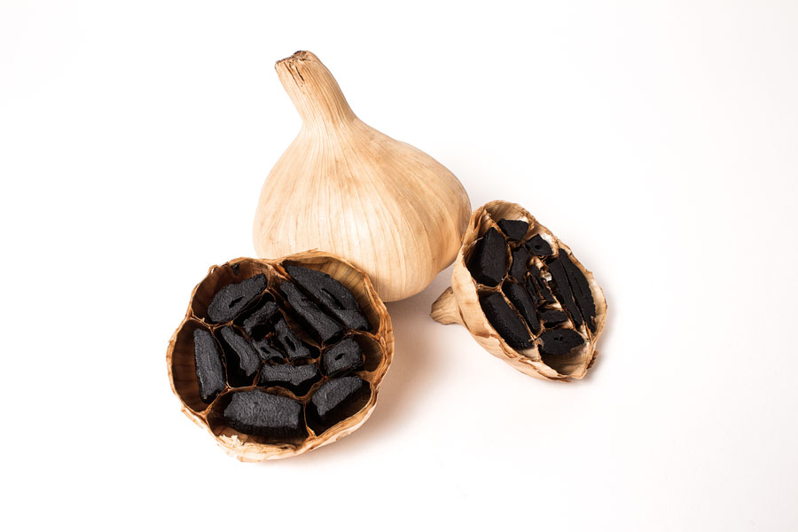
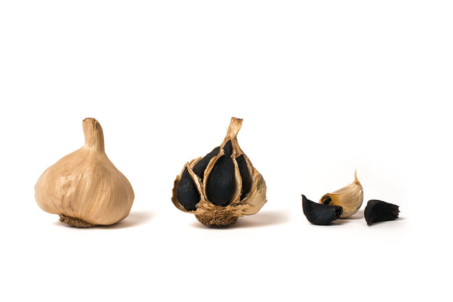

Chi ha mai sentito parlare dell'**aglio nero di Voghiera**?

Lavorando tutti i giorni davanti al monitor di un computer, quando stacco ho davvero bisogno di *usare le mani*. E quando scrivo così mi riferisco all'arte del forgiare qualcosa, del creare *ex novo*.
La cucina riveste sicuramente un ruolo importante, in questo senso, specie nei mesi invernali.

Musica, ingredienti disposti sul tavolo e grembiuletto: ecco ciò che mi serve per entrare in modalità *non-ci-sono-per-nessuno-ci-vediamo-domani* e per godere appieno dei profumi che i fornelli sanno sprigionare.

In un'ottica di studio e di ricerca personale, sono da poco entrata in contatto con una nuovissima realtà. Si tratta di una start-up italiana gestita da un gruppo di giovani ingegneri impegnati nella produzione di aglio nero ottenuto dall'aglio di Voghiera.

Mai sentito parlare di questo prodotto? Lo avete mai assaggiato?
Se la risposta è "No", allora serve conoscere **[Nero Fermento](https://www.nerofermento.it)** attraverso le parole di **Tommaso Pavani**, uno dei componenti di questo bel team romagnolo.
Di cosa si tratta? Come viene prodotto? Qual è il suo impatto ambientale?

### Ciao, Tommaso! Quando avete cominciato a produrre aglio nero di Voghiera? E qual è l'origine di Nero Fermento?

> Ciao, Anna! Nero Fermento è una start-up nata circa un mese fa dopo un paio di mesi di lavoro e di ricerca con due realtà: [RES](http://www.resitalia.org), che ha sviluppato le tecnologie necessarie, e [A.I - Agricoltori in Erba](https://www.facebook.com/Societ%C3%A0-Agricola-AI-Agricoltori-in-erba-544511275628514/), azienda agricola in provincia di Ferrara.
>
> Questo progetto è il frutto di una cena insieme agli ingegneri Stefano Silvi, Davide Bersani e Chato Della Casa. E poi c'è la preziosa collaborazione di Gian Paolo e Neda Barbieri, cioè mio zio e mia madre nonché soci di A.I - Agricoltori in Erba che, appunto, ci rifornisce di aglio bianco di Voghiera.

### Siete i soli a produrre questo prodotto in Italia?

> Diciamo che in Italia ci sono piccolissime realtà coinvolte in questo settore. Alcuni chef lo autoproducono, ma i risultati non sono sempre soddisfacenti.
>
> Abbiamo alcuni piccoli produttori che non sempre scelgono una materia prima biologica certificata come, invece, facciamo noi, e che, a volte, non hanno un consorzio alle spalle.
>
> **Siamo i primi in Italia a produrlo affidandoci a un aglio bianco di partenza che è certificato D.O.P**. Parliamo di una materia prima d'eccellenza.
>
> La nostra ambizione è distribuire il nostro aglio nero di Voghiera al maggior numero di consumatori possibile, dato anche che **questo è un mercato ancora pressoché inesistente in Italia**.

Ecco come si presenta il Nero di Voghiera.

### Dove producete l'aglio nero di Voghiera?

> **Lo produciamo a Ravenna**, la città che ha visto nascere il progetto.

### Potresti darmi qualche informazione sull'aglio di Voghiera?

> L'aglio bianco di Voghiera, ossia la materia prima da cui ricaviamo quello nero, è il primo in Italia a essere D.O.P.
>
> Voghiera è un piccolo paese in provincia di Ferrara che presenta le caratteristiche del terreno in grado di dare un'impronta particolare al prodotto. Mi riferisco specialmente alla composizione delle argille e della sabbia.
>
> Dalla sinergia fra coltivatori, università e amministrazioni pubbliche, alcuni anni fa è nato un grandissimo studio rivolto a questo speifico prodotto locale.

### Come viene prodotto l'aglio nero?

> Si tratta di un **processo di maturazione dell'aglio bianco di Voghiera**. La sua fermentazione avviene in condizioni di umidità e di temperatura controllate, sempre al di sotto dei 100°C.
>
> Queste condizioni particolari attivano gli enzimi dell'aglio bianco che, a loro volta, producono gli zuccheri che trasformano la consistenza e il colore dell'aglio facendogli perdere fino al 60% del proprio peso.
>
> In linea di massima, impieghiamo due mesi di lavoro per ultimare il prodotto. Lo lasciamo maturare all'interno del fermentatore saggiandolo solo ogni tanto.

### Cosa si ottiene dopo due mesi?

> La licina contenuta nell'aglio classico, responsabile dei problemi di digestione e dell'odore pungente di questo alimento, scompare. Otteniamo un **prodotto molto più digeribile e delicato**.
>
> Aumentando la produzione di zuccheri, la fermentazione fa sì che il sapore diventi quasi balsamico e con alcune note di liquirizia.

### Qual è l'impatto ambientale della produzione di aglio nero di Voghiera? Mi riferisco agli strumenti che utilizzate e al loro dispendio energetico: che impatto c'è sull'ambiente, e come avete scelto di affrontare questo aspetto?

> Dal punto di vista delle emissioni e degli scarti, **l'impatto è trascurabile**.
>
> Circa gli strumenti che utilizziamo per la maturazione e per la fermentazione, in fase prototipale abbiamo utilizzato delle resistenze elettriche cercando di mitigare il consumo energetico. Abbiamo coibentato in maniera massiccia la cella di maturazione.
>
> La cella che stiamo mettendo a punto vuole ridurre i consumi, sia per questioni ambientali che per ragioni economiche.
>
> Partendo sempre da una coibentazione spinta, per diminuire al massimo il fabbisogno di energia, sono al vaglio due ipotesi. Una prevede un impianto fotovoltaico al servizio di un'eventuale generazione elettrica. L'altra prevede l'uso di un sistema idronico alimentato a biomasse di scarto.
>
> Provenendo molti di noi dal campo delle energie rinnovabili e della sostenibilità applicata, **la riduzione dei consumi è in cima alla lista degli aspetti da attuare e da approfondire**.

### Torniamo alla questione aglio bianco: quale impiego trova in cucina?

> Sconsigliiamo l'aglio nero di Voghiera per la preparazione dei soffritti, perché perderebbe gran parte del sapore.
>
> **L'utilizzo migliore, a nostro parere, è quello crudo**. Eventualmente lo si può addizionare a piccole cotture. È l'ideale per risotti, pesce, carne e abbinamenti tartufati.

### Cosa mi dici a proposito della conservazione? L'aglio nero si conserva meglio?

> Sì, la fermentazione blocca la possibilità che possa germinare. **L'aglio nero di Voghiera si mantiene per mesi**, anche all'interno di un normalissimo contenitore di vetro.

### A chi vendete il vostro aglio?

> Grazie alla collaborazione con [Chef to Chef](http://www.cheftochef.eu) lo vendiamo soprattutto ai ristoranti, alcuni dei quali sono stellati. I suggerimenti di chi cucina per lavoro ci hanno aiutato a migliorare il gusto del nostro prodotto.
>
> Da un po' di tempo siamo stati inclusi nel catalogo dell'azienda romana [HQF](http://www.hqf.it) (High Quality Food), che rifornisce i ristoranti di prodotti d'eccellenza.
>
> Inoltre, abbiamo cominciato a lavorare con [Selecta](http://www.selectaspa.it), leader italiano nell'alta ristorazione, con Ferrara Frutta e [Moriconi](http://www.moriconifrutta.it) a Ravenna.

### Programmi per il futuro?

> Nero Fermento non nasce per produrre esclusivamente aglio nero, quello vorremmo che diventasse il nostro top di gamma. Vogliamo sviluppare anche altri prodotti. Siamo solo all'inizio!.
