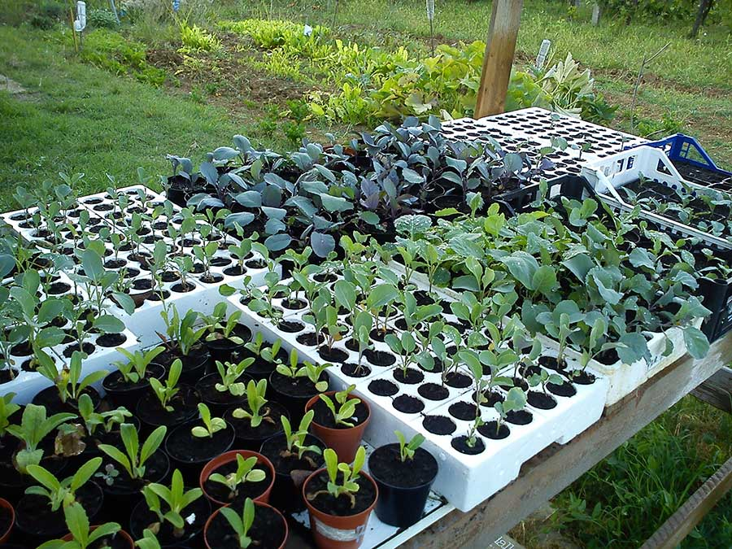

C'è qualcuno che abbia mai pensato di avviare un'azienda agricola biologica?

Prima di rispondere a questa domande, mollate quello che state facendo. Salutate chi dovete salutare, impostate lo smartphone in modalità _silenzioso_, spegnete la musica. Posticipate il caffè promesso al collega, salvate in "bozze" la mail che stavate scrivendo e preparatevi a leggere un articolo che parla di sogni e di coraggio.

Sono affascinata dalla storia di Laura e Marco, due ragazzi romagnoli che hanno deciso di rivoluzionare le loro vite: dall'ufficio al campo da arare, dal digitare su una tastiera ad avviare un'azienda agricola biologica.

Lasciare tutto per cercare la felicità, per essere padroni del proprio tempo, per dedicarsi a quell'umile lavoro che ha segnato le vite dei nostri nonni.

Mollare una vita che non ti appartiene e cercare di afferrare ciò che vuoi davvero: utopia?
Se Lucio Dalla, nella sua splendida _Anna e Marco_, cantava: "_Dov'è la strada per le stelle?_", io mi domando: dov'è la strada per la realizzazione personale? È nella rassegnazione o in una silente rivoluzione personale?

Laura e Marco hanno deciso di mettersi in gioco senza temere di essere felici.

### Ragazzi, ciao! È davvero un grande piacere conoscervi. Ditemi, chi siete ora e chi eravate prima di decidere di avviare un'azienda agricola biologica?

> Oggi siamo due contadini con l'ambizione di cambiare il mondo a partire da ciò che facciamo ogni giorno, cioè produrre buon cibo e prenderci cura della Terra.
>
> Abbiamo sempre avuto voglia di contribuire a cambiare il mondo. Prima di iniziare questa avventura, eravamo due giovani laureati in Sociologia che si barcamenavano a Bologna in lavori precari.

### Cosa vi è mancato fino a due anni fa?

> **Vivevamo un profondo malessere personale legato alle condizioni lavorative e di vita**.
>
> Abbiamo affrontato ritmi abbastanza snervanti e alti livelli di stress, soprattutto nell'ultimo anno, e i soldi non bastavano mai. Nonostante lavorassimo entrambi, non riuscivamo a fronteggiare tutte le spese. Per andare a lavoro eravamo costretti a muoverci in auto, ma non guadagnavamo abbastanza per poterla mantenere! Un paradosso che ci ha spinti a compiere alcune riflessioni.
>
> Siamo stati attivisti di movimenti studenteschi, ecologisti e membri di comitati cittadini. Siamo sempre stati abituati a riflettere e a discutere di sostenibilità ambientale.
>
> A un certo punto, ci siamo resi conto che **il cambiamento che si cerca non basta solo dichiararlo, occorre praticarlo mettendosi in gioco**.
>
> E in quel periodo abbiamo iniziato a frequentare i mercati contadini dell'[associazione Campi Aperti](http://www.campiaperti.org) (legata al circuito di [Genuino Clandestino](https://genuinoclandestino.noblogs.org)). Poi siamo diventati assegnatari di un orto comunale ([Dalla Parte del Cavolo](https://dallapartedelcavolo.wordpress.com), il nostro blog, è nato proprio allora per raccontare quella piccola esperienza).
>
> È venuto spontaneo pensare che l'agricoltura potesse essere l'anello di congiunzione tra le grandi cause, i grandi sogni - che non abbiamo mai abbandonato - e il cambiamento quotidiano.
>
> Ci teniamo a sottolineare che la decisione di andarcene da Bologna nell'autunno del 2013, per tornare a Rimini, non è stata presa a cuor leggero. È stato un piccolo trauma, per noi e per le persone che ci circondavano. Abbiamo lasciato una città che amavamo e che iniziavamo a sentire nostra.
>
> In quel momento, però, ci è sembrata la cosa migliore da fare. A distanza di due anni restiamo di quell'idea.

### Parlatemi della vostra politica agricola: quale agricoltura promuovete? C'è qualcuno a cui vi ispirate?

> Quando abbiamo deciso di avviare la nostra azienda agricola biologica abbiamo scelto l'**agricoltura contadina**. Si tratta di quella **diversificata** e **di piccola scala** che viene portata avanti da chi pensa che la terra non sia solo un semplice fattore produttivo.
>
> **Rifiutiamo l'utilizzo della chimica di sintesi** e pensiamo che la sostenibilità ecologica debba rappresentare il movente di ogni azione.
>
> Una delle malattie dell'agricoltura industriale è la pretesa di controllare tutte le variabili che la natura produce, e di rendere tutto prevedibile. Quando qualcosa sfugge al controllo, si tenta di risolvere il problema per via tecnologica o con qualche prodotto chimico.
>
> Gli ecosistemi, in realtà, sono molto più complessi, e non completamente prevedibili.

> Abbiamo un dialogo costante - a volte duro e conflittuale - con l'ecosistema con cui abbiamo a che fare, ma senza la pretesa della completa sottomissione delle dinamiche naturali alla nostra volontà.
>
> Pensiamo a **un'agricoltura legata al territorio e supportata dalla comunità**. Ciò significa costruire relazioni di fiducia con le persone che consumano i tuoi prodotti, e che diventano qualcosa di più di semplici clienti. Imparano a conoscere e a rispettare il tuo lavoro e a sostenere il tuo progetto.
>
> Un nostro riferimento è la rete di _Genuino Clandestino_, che promuove in molti territori l'agricoltura contadina attraverso mercati e iniziative di vario genere.
>
> Poi **guardiamo con interesse alcuni percorsi che prendono vita nel Sud del mondo**, dove l'agricoltura contadina ha un ruolo rilevante nella produzione agroalimentare. E dove ci sono esperienze e riflessioni che parlano anche alla nostra porzione di pianeta. Un esempio su tutti: la riflessione e le pratiche sull'agroecologia sperimentate in Brasile dal movimento dei [Sem Terra](http://www.mst.org.br).
>
> Viviamo in un territorio che ha una tradizione contadina molto radicata, molte cose si sono un po' perse negli ultimi decenni. Per fortuna, però, **stiamo trovando canali e relazioni che ci permettono di riscoprire saperi e pratiche antiche ma, allo stesso tempo, attualissime**.
>
> Stiamo conoscendo agricoltori che provano a non disperdere questo patrimonio e stiamo frequentando corsi organizzati da piccole associazioni.
>
> Tutte queste cose, fino ad alcuni anni fa, erano banali e scontate, ma oggi è necessario riscoprirle e diffonderle.

### Mi piacerebbe conoscere la vostra giornata-tipo: a che ora suona la sveglia? E come si sviluppa la giornata?

> È il clima a decidere per noi. L'estate appena trascorsa, ad esempio, è stata caldissima e si poteva lavorare solo per poche ore al giorno, la mattina presto e la sera. Una volta sfamate le galline, quando il sole diventava troppo rovente, ci si riposava un po', oppure si sbrigavano i lavoretti in casa. Dopodiché si tornava in campo nel tardo pomeriggio.
>
> In realtà le variabili di cui tenere conto, e i lavori da fare, sono tantissimi, quindi ogni giornata fa storia a sé.
>
> In autunno e in inverno i tempi sono più rilassati e le giornate più brevi, si può riposare, leggere e coltivare altri interessi.

### Cosa e come producete? Dove possiamo acquistare i vostri prodotti?

> **La nostra attività principale è l'orto**, produciamo ortaggi e un po' di frutta, abbiamo un po' di ulivi e di vigne. E poi abbiamo alcune attività integrative.
>
> Eventuali rimanenze di frutta e ortaggi le trasformiamo in marmellate e in conserve per evitare lo spreco.
>
> Abbiamo alcuni animali: galline, polli, anatre e oche che ci danno uova e carne.
> 
> 
> 
> 
> 
> 
> 
> In queste settimane abbiamo affittato ulteriore terra su cui ci sono altrae vigne, alberi da frutto e ulivi, per cui estenderemo la produzione di queste cose.
>
> **I nostri prodotti possono essere acquistati direttamente in azienda** oppure al mercato settimanale di produttori a cui partecipiamo a Cattolica.

### Una curiosità personale: avete ricevuto qualche contributo dall'Unione Europea?

> Questo è un tasto dolente. Quando abbiamo iniziato facevamo molto affidamento su quella possibilità per avviare l'azienda agricola biologica. Poi, però, ci siamo resi conto che era più complicato del previsto.
>
> Per accedere ai finanziamenti devi avere un progetto di medio periodo. Meno risorse hai di partenza e meno possibilità hai di essere aiutato.
>
> Il grande problema è l'accesso alla terra: se non sei già nel settore, è molto difficile entrarci in modo stabile.
>
> Abbiamo molte difficoltà finanziarie e, da due anni, lavoriamo nella nostra azienda agricola biologica con attrezzature insufficienti. E con un surplus di fatica a volte evitabile.
>
> **La nostra vera risorsa sono le persone che ci circondano e che credono in noi**. Acquistano i nostri prodotti e partecipano alle cene che organizziamo per autofinanziarci, oppure ci aiutano in alcuni lavori e a far funzionare le cose.

### Cosa riserva il futuro?

> Vorremmo condividere la nostra esperienza insieme ad altri, la terra che abbiamo a disposizione ci consente di coinvolgere altre persone.
>
> Restiamo convinti che l'agricoltura contadina possa essere un'occasione per dare lavoro di qualità e reddito a molti, e noi vogliamo fare la nostra parte.
>
> In questi giorni, il nostro blog [Dalla Parte del Cavolo](https://dallapartedelcavolo.wordpress.com) è divenuta un'associazione.
>
> Vorremmo che diventasse un punto di riferimento per chi sta cercando di avviare un'azienda agricola biologica facendo. E un modo per dar vita a iniziative sociali e culturali capaci di rafforzare il senso di questo lavoro.

