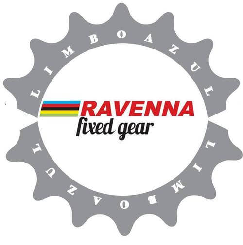

Credo che la prima lezione di spinning, su quella sorta di bici a scatto fisso statica, sia un po' un trauma per tutti: si prega il Signore di arrivare vivi a fine lezione.

Il 2007 è stato l'anno in cui ho partecipato alla prima lezione di questa disciplina indoor. Ero un'universitaria di belle speranze, divisa fra i libri e i laboratori, con un gran bisogno di scaricare la tensione.

Il mio istruttore è stato Alan Zanardi, bravissimo e biondissimo.
Originario di Ferrara, Alan nutre ancora oggi un enorme interesse verso lo sport e, in modo particolare, verso la bici a scatto fisso.

A partire dai 20 anni si è appassionato al mondo del ciclismo, per poi giungere, appunto, alla bici a scatto fisso, molto leggera e dotata di un solo rapporto.

### Ciao, Alan! Quando e in che modo è nata la tua passione per la bici?

> Ciao, Anna! Da ragazzino ho praticato un po' tutti gli sport, dal calcio al basket, fino alla pallavolo.
>
> Sono arrivato alla bici a 20 anni. Un amico mi ha convinto a comprare la prima mountain bike, che ho praticato per circa 10 anni tentando anche qualche competizione. A causa degli impegni di lavoro e di studio ho dovuto interrompere e, per qualche anno, mi sono dedicato solo al podismo.
>
> Poi, un bel giorno, mi sono detto che avrei potuto utilizzare la bici per andare al lavoro. E così, navigando online, mi sono avvicinato alla bici a scatto fisso.

### Com'è nata la tua evoluzione verso la bici a scatto fisso?

> La prima bicicletta l'ho assemblata da solo ed era molto diversa da quella di oggi. Avevo bisogno di prendere dimestichezza con questo tipo di pedalata.
>
> In 4 anni ho cambiato 5 bici, cercando di continuo nuove sensazioni e prestazioni: un telaio migliore nello scatto, ad esempio, o un manubrio più largo per un maggior controllo, e poi ruote aerodinamiche.
>
> Con la bici, a un certo punto, non volevo più solo andare al lavoro, ma fare qualche gara, le cosiddette \**alleycat* o, meglio ancora, le \**criterium*. Avevo bisogno di un mezzo performante.
>
> Ora credo di essere arrivato alla bici che fa per me anche se, in realtà, non sono mai completamente soddisfatto e cerco sempre di affinarla.

### Negli ultimi anni la bici a scatto fisso sta cominciando a fare tendenza. Parlaci un po' del gruppo Ravenna Fixed Gear. Di cosa si tratta?

> [Ravenna Fixed Gear](http://ravennafixedgear.blogspot.it) è nata vedendo ciò che c'era attorno.
>
> **Grazie alla bici a scatto fisso ho conosciuto tanti appassionati di ogni parte d'Italia**. Ho notato che si creavano gruppi di persone, o *crew*, che s'incontravano per pedalare assieme e per fare piccole gare.
>
> Ho pensato che anche a Ravenna sarebbe stato bello creare un luogo d'incontro, dapprima virtuale e poi reale. Un modo per scambiare idee o, che so, qualche pezzo di ricambio. E magari anche per organizzare qualche evento.
>
> Con i ragazzi del surfing shop "Limbo Azul" di Ravenna, Alessio e Samuele, ci siamo capiti subito. In un attimo non ero più da solo. Nella primavera del 2012 è nata la [pagina Facebook](https://www.facebook.com/ravenna.fixed.gear?ref=profile) di Ravenna Fixed Gear. Da allora è cresciuta molto e spero che continui a farlo.

### A quante competizioni in scatto fisso hai partecipato?

> In questi anni **ho partecipato a diversi eventi legati alla bici a scatto fisso**, dalle più tradizionali *alleycat*, che vogliono emulare l'ipotetica giornata di lavoro di un bike messenger, fino alle *criterium*.
>
> Per quanto riguarda le gare, ce ne sono alcune alle quali sono emotivamente legato. La prima è l'*alleycat* bolognese del 2010: mia prima volta a un evento in scatto fisso, da solo, "allo sbaraglio".
>
> E poi c'è la prima *criterium* del ciclo "Back in Black" modenese, sempre nel 2010: è in quell'occasione che ho capito come le gare di velocità possano dare una carica di adrenalina veramente notevole.

### Quali imprese eroiche ti attendono?

> In inverno si ferma un po' tutto, il clima rende difficile allenarsi con la bici a scatto fisso.
>
> Ci tengo a ricordare l'appuntamento del 26 aprile 2014, prima data del Campionato Romagnolo Criterium Scatto Fisso. L'evento sarà alle 20:30 a Fornace Zarattini, in provincia di Ravenna, in via Fratelli Lumière. È il frutto del lavoro di Ravenna Fixed Gear, di Low Romagna Fixed e di altri appassionati che hanno deciso di creare un format unico in Italia.
>
> Si tratta di 4 gare su circuiti chiusi al traffico e messi in sicurezza grazie alla presenza di ambulanza e di medico, e alla copertura assicurativa Uisp. Ravenna sarà la prima tappa di questo Campionato, quindi non mancate!
>
> Quanto a me, **mi sto avvicinando sempre di più alle *long distance**. Si sposa con la mia idea di bici come unico mezzo di trasporto.
>
> Sai, non ho più la macchina da ormai tre anni e credo che sia stata una delle scelte migliori della mia vita.

Piccolo **glossario per i non esperti di settore**:
- **alleycat**: è una corsa che simula il lavoro quotidiano del bike messenger. Prevede una partenza, un arrivo (non sempre conosciuto) e un tot checkpoints intermedi. Può essere compiuta su qualsiasi tipo di bici.
- **criterium**: è una gara ciclistica su strada in cui si ripete più volte lo stesso percorso. Può svolgersi anche in notturna.
