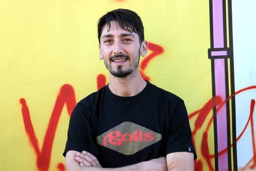
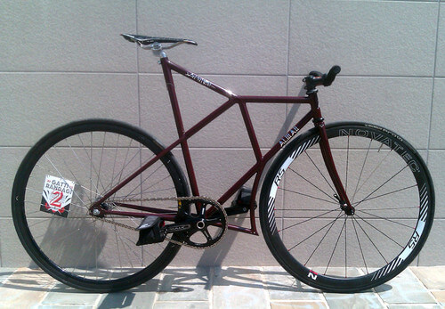
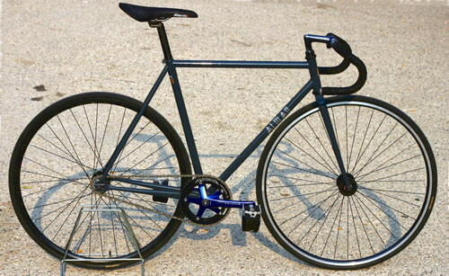
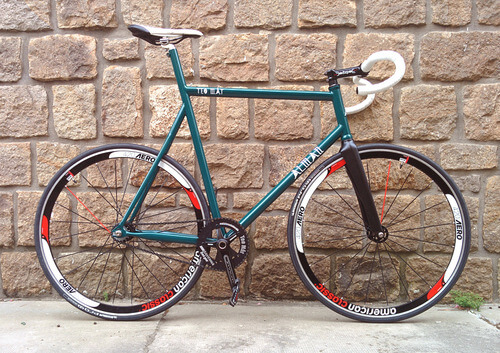
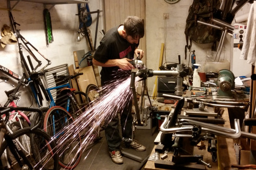

*Dimmi che garage hai e ti dirò chi sei*.

Mio padre, ad esempio, l'ha trasformato nell'officina del tuttofare. Mio fratello ne ha fatto in mini-palestra. Steve Jobs e Steve Wozniak ne fecero un laboratorio informatico. Jack O'Neill, nel 1952, lo convertì in un surf shop della Great Highway di San Francisco.

Anche il mio prossimo intervistato utilizza il garage in modo alternativo: ne ha fatto un laboratorio in cui realizzare telai artigianali.

Ladies and gentlemen, ecco a voi [Aldo Mandato](http://almancicli.com).

### Ciao, Aldo. Come nasce il tuo interesse per la mobilità alternativa? Quando sei diventato un telaista?

> Ciao, Anna! La prima bici mi è stata regalata dai miei genitori ancor prima che iniziassi a camminare. Nel corso degli anni ne ho avute diverse: da passeggio, bmx, da corsa e MTB. Da piccolo mi divertivo a smontarle e a rimontarle.
>
> Da quando mi sono trasferito a Bologna per studio, **la bici è diventata il mio principale mezzo di trasporto**. Ed è stato a Bologna che mi sono avvicinato allo scatto fisso e, più in generale, alla mobilità alternativa.
>
> È stata una **riscoperta dell'uso della bici** e del feeling che si instaura con lei.
>
> Ho iniziato assemblando una bici da corsa convertita a scatto fisso. Poi, però, ho subito desiderato un vero telaio da pista. E così, un giorno, ho deciso di realizzarne uno.
>
> Quello del **telaista** è stato un percorso da autodidatta collegato al mondo della mobilità alternativa. Ho iniziato cercando informazioni sul web e sui manuali, poi ho proseguito con prove pratiche di saldo-brasatura su pezzi di tubi e su congiunzioni. Un giorno ho cominciato a lavorare sul mio primo telaio con la minima attrezzatura necessaria.
>
> **All'inizio il mio laboratorio è stato il monolocale in cui vivevo con la mia ragazza**. Lavoravo tra il divano e la scrivania, e la casa era invasa da polvere d'acciaio.
>
> Ho continuato a realizzare telai per la mobilità alternativa grazie alla fiducia che alcuni miei amici hanno riposto in me. Il fatto che me ne abbiano commissionati alcuni mi ha permesso di fare ulteriore esperienza.

### Quali caratteristiche hanno le tue biciclette e quali modelli produci?

> I miei lavori sono artigianali e su misura. Cerco di curare i dettagli e le rifiniture, e studio soluzioni che rendano i miei telai unici attraverso particolari customizzazioni.
>
> Finora ho realizzato soprattutto telai da pista, poi un paio di MTB. Mi piacerebbe realizzare anche un telaio da corsa, da ciclocross e una cargobike.

### Dove compri i componenti che ti servono?

> Il mio lavoro al servizio della mobilità alternativa riguarda unicamente telai e forcelle.
>
> Chi mi commissiona il telaio mi dà anche i componenti da montare.
>
> I materiali che utilizzo provengono da una ditta italiana, la [Columbus](http://www.columbustubi.com/ita/1.htm). Qualche specifico componente, non presente in Italia, lo ordino direttamente all'estero.
>
> Altri componenti vengono prodotti da una ditta locale su mie specifiche richieste.

### Dove si trova il tuo laboratorio? Lavori da solo o collabori con qualcuno?

> Ora lavoro nel mio garage e non ho collaboratori, perché lo spazio non lo consente. Se le cose andranno bene, affitterò un locale più ampio e, magari, cercherò un collaboratore.
>
> Il lavoro artigianale richiede molto tempo e due mani in più farebbero comodo!.

### Nell'ambito della mobilità alternativa, ti occupi anche di riparazioni?

> Sì, riparo anche telai danneggiati. Eseguo modifiche, sostituisco componenti, aggiungo predisposizioni per portapacchi, per portaborracce e per parafanghi. Ho realizzato anche portapacchi e attacchi manubrio.

Foto di copertina: [Michael Coghlan](https://www.flickr.com/photos/mikecogh/8865883592/).
