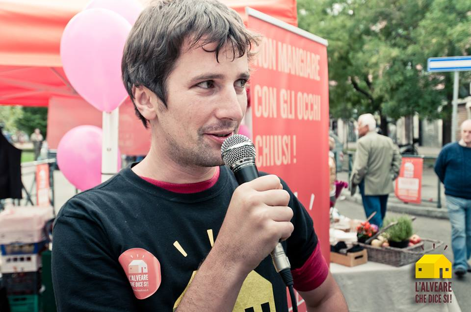
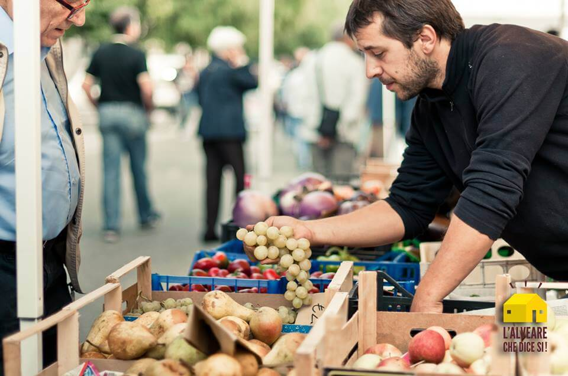
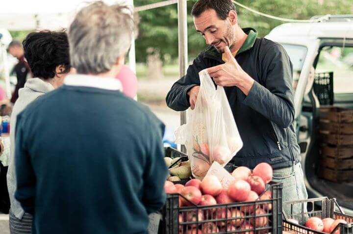
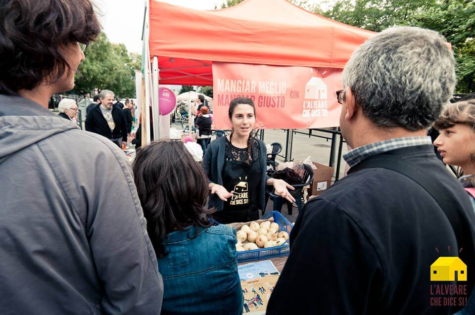

Una rete di vendita a filiera corta potrebbe distoglierci dall'acquisto di manghi a metà dicembre. O di altra frutta (o verdura) proveniente da chissà quale parte del mondo.
Potrebbe invogliarci a valorizzare i prodotti del territorio in cui viviamo, ad esempio, e a sensibilizzarci riguardo al tema dello sfruttamento del lavoro.

Come possiamo essere consumatori più responsabili? Come possiamo fare la differenza? Magari scegliendo, appunto, una rete di vendita a filiera corta?

A questo proposito, credo sia interessante conoscere l'**Alveare che dice sì!**, progetto di stampo francese che, di recente, è arrivato anche in Italia per promuovere il **Km Zero**.

Grazie a questa piattaforma, le persone entrano in **contatto diretto con gli agricoltori e gli artigiani locali**. E i produttori ricevono una remunerazione che consente loro di mantenere e di sviluppare l'attività.

**Eugenio Sapora** è colui che ha deciso di promuovere questa rete di vendita a filiera corta nel nostro Paese, importandola dalla Francia.
Che ne dite, vogliamo conoscerlo meglio insieme?

### Ciao, Eugenio. Diamo il via alla nostra chiacchierata cominciando dalle presentazioni. Chi sei e com'è iniziata la tua avventura?

> Ciao, Anna! Sono un ingegnere che ha vissuto a Parigi per una decina d'anni. È in uno degli arrondissement in cui ho abitato che ho conosciuto [La Ruche Qui Dit Oui](https://laruchequiditoui.fr/fr), un progetto a sostegno dei prodotti locali.
>
> Più acquistavo tramite questa piattaforma, più mi innamoravo della rete di vendita a filiera corta. Ed è così che ho deciso di importarlo in Italia, diventando uno startupper a tutti gli effetti.

### Immagino che l'Italia non sia uno dei Paesi più semplici, da questo punto di vista. Tu che dici?

> Già, l'Italia è ancora molto difficile, frenata da tanti ostacoli economici e culturali.

### Dove e quando è nato il progetto?

> **Il progetto è nato a Parigi nel 2011** da due giovani francesi molto in gamba. In breve tempo si è trasformato in un movimento europeo ("_The Food Assembly"_).
>
> La piattaforma ha preso piede anche in Gran Bretagna, in Germania, in Belgio e in Spagna. Solo in Francia ci sono circa 700 alveari!.

### Come funziona?

> L'Alveare che dice Sì concilia **filiera corta**, **Internet** e **sharing economy**.
>
> Proponiamo una rete di vendita a filiera corta che permetta un **contatto diretto tra produttore e consumatore**. Si basa sulla socialità e sulla conoscenza degli alimenti tipici della propria zona.
>
> Vogliamo sostenere il consumo di **prodotti locali di alta qualità**. E vogliamo farlo ricorrendo al supporto di una piattaforma online capace di ottimizzare i tempi di acquisto, di creare un impatto economico positivo sul territorio e di dar vita a una comunità affiatata.
>
> Come prima cosa, i consumatori si registrano su [www.alvearechedicesi.it](https://alvearechedicesi.it/it) per fare la spesa online. Dopodiché, acquistano i prodotti che desiderano e che sono stati messi in vendita dai produttori locali del network.
>
> Una volta a settimana si organizza la **distribuzione nell'alveare di zona**, che può essere un bar, un ristorante, un'associazione del territorio o qualsiasi altra realtà.
>
> Il ritiro della spesa è un'occasione di relazione e di contatto conviviale in cui i produttori possono farsi conoscere.

### In questa rete di vendita a filiera corta, che ruolo ha il gestore dell'alveare?

> Questa figura pianifica la consegna dei prodotti e organizza eventi, aperitivi e visite guidate nelle aziende agricole dei produttori. Diciamo che crea un vero network di relazione e di conoscenza diretta.

### Chi compra paga direttamente online, quindi prima di incontrare il produttore?

> Esatto. Il cliente paga attraverso la piattaforma, ma il denaro resta in stand-by fino al ritiro dei prodotti. È solo dopo la consegna effettiva che avviene il pagamento. Ciò tutela sia chi produce, sia chi acquista.

### Parliamo di remunerazione: quanto ricevono i produttori? E quanto, invece, va in tasca ai gestori degli alveari?

> I produttori ricevono una remunerazione pari all'83,3% del fatturato esentasse e il restante 16,7% viene utilizzato per retribuire il responsabile dell'alveare. E per far fronte alle spese per assistenza tecnica e commerciale, ovviamente.
>
> La remunerazione è in linea con i principi etici a cui ci atteniamo. È lo stesso produttore a stabilire il prezzo.

### Quanti alveari ci sono in Italia?

> Ad oggi, **Torino** e **Milano** sono le principali sedi dei primi alveari di questa rete di vendita a filiera corta. Presto potremo ufficializzare altre aperture a **Roma** e a **Napoli**.

### Cosa può fare chi intenda fondare un alveare nel proprio territorio?

> Dopo aver trovato la propria comunità di acquirenti, e 4-5 produttori locali disposti a vendere i propri prodotti, può contattarci e richiedere le informazioni necessarie a dare inizio a questa bellissima avventura sostenibile.
>
> L'alveare diventa visibile sulla piattaforma affinché tutti possano vederlo, iscriversi e ampliare la comunità.
>
> Prima di dar vita all'alveare, di solito si organizza il cosiddetto _alveritivo_, una serata conviviale in cui i produttori presentano ciò che venderanno alla comunità.

### Dimmi, che differenza c'è fra voi e i gruppi di acquisto solidale?

> Siamo un GAS 2.0: il GAS, come sappiamo, nasce da persone che decidono di acquistare insieme alcuni prodotti. Se il numero di persone aumenta in modo importante, tutto diventa difficile da gestire. Nel nostro caso, invece, più siamo e meglio è!
>
> La gestione viene condotta dalla piattaforma e **ognuno è libero di comprare i prodotti che desidera** **per conto proprio**, senza accordarsi con gli altri.
>
> È un e-commerce diretto in cui il produttore vende direttamente al venditore finale.

### Come posso essere certa che un prodotto sia veramente bio? Chi verifica?

> Siamo noi a verificare la qualità del prodotto e le certificazioni. Sul sito, inoltre, chi compra trova la scheda informativa sui produttori che riporta numero di telefono e indirizzo dell'azienda agricola.

**Trasparenza** è la parola chiave di questa speciale rete di vendita a filiera corta.

### Avete ricevuto qualche fondo per lo sviluppo del progetto?

> Questo è un tasto dolente! Purtroppo i fondi sono pochissimi. Io, per il momento, non percepisco stipendio. Con ciò che guadagno pago i miei collaboratori e realizzo materiale pubblicitario.
