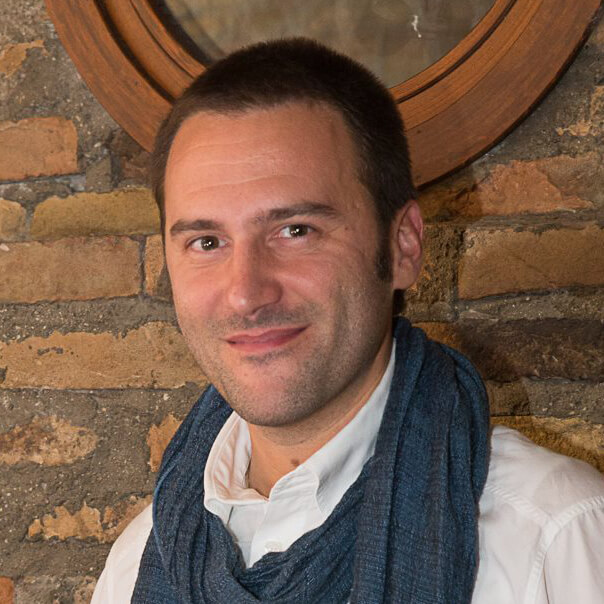
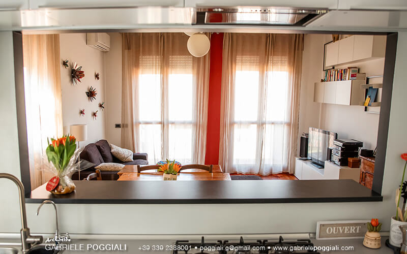
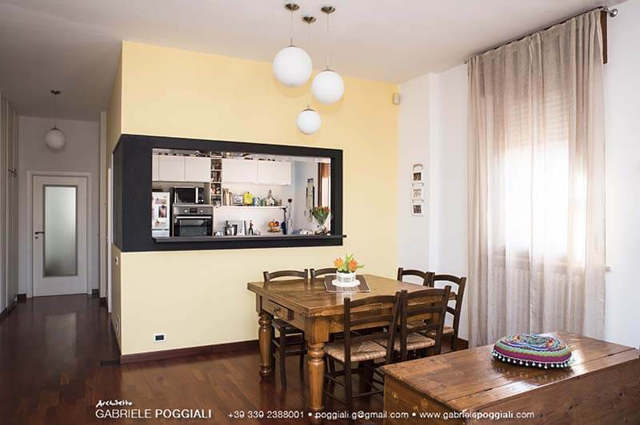

---
title: "L'architettura olistica di Gabriele Poggiali"
date: '2016-04-15T15:59:48+00:00'
description: "Gabriele Poggiali, l'architetto ravennate appassionato di Feng Shui, di arti marziali e di architettura olistica."
featuredImage: ./alvin-engler.jpg
category:
    - Ecoprogetti
tags:
    - Architettura olistica
    - Feng shui

---Non è trascorso molto tempo dal giorno in cui ho parlato di architettura olistica insieme a Giorgia, una delle mie migliori amiche.

È tramite lei che ho conosciuto [Gabriele Poggiali](http://www.gabrielepoggiali.com), architetto libero professionista appassionato di Feng Shui, di arti marziali e di tutto ciò che riguarda il benessere interiore.
Un paio di domeniche fa, a Cesena, ho partecipato a una sua conferenza sull'**equilibrio casa-persona**. Gabriele è una persona molto gentile, e quando è stato il momento di rispondere ad alcune mie domande, non si è tirato indietro.

### Ciao, Gabriele! Prima di parlare di architettura olistica, dimmi: da dove proviene la tua passione per il Feng Shui?

> Ciao, Anna. Questa mia passione nasce dalle arti marziali. La prima volta che ho sentito parlare di Feng Shui ero in palestra, avevo 16 anni e stavo praticando kung fu.

### Cos'è esattamente il Feng Shui? Cosa indaga?

> [Feng Shui](http://www.gabrielepoggiali.com/fengshui/) significa _Vento Acqua_. Nasce dallo studio di questi elementi sul territorio e del microclima creato dal loro equilibrio.
>
> Nel tempo è passato dalla macro alla micro scala, quindi dal territorio alla singola stanza, implementando ed espandendo gli studi, le analisi e gli approcci. Questo per conoscere sempre meglio l'ambiente che ci circonda.
>
> Nelle arti marziali cinesi si fa spesso riferimento ai cinque elementi (Wu Xing) o agli otto trigrammi (Ba Gua o Pa Kua) alla base di molte tecniche di Feng Shui. Mentre nelle arti marziali si ricorre ai movimenti per applicare quei concetti sul corpo, attraverso il Feng Shui si applicano all'ambiente.

### Di cosa ti occupi nella vita?

> **Mi occupo di architettura, di arti marziali e di ricerca del benessere** in senso generale.
>
> Ho iniziato dal corpo, per primo il mio attraverso il [Taiji](http://www.gabrielepoggiali.com/taiji/), un antico stile di arti marziali cinesi che è nato come forma di difesa e che, oggi, è una raffinata forma di esercizio per la salute e il benessere. Poi ho scelto l'insegnamento.
>
> Sono molto interessato all'alimentazione, alla medicina cinese e a tutto ciò che apporti benessere alla persona e all'ambiente.

### Cosa si intende con architettura olistica?

> L'architettura olistica mira al **benessere all'interno delle abitazioni**.
>
> L'architettura può essere studiata in modo puramente ingegneristico, pilastri, strutture, fondazioni. Oppure a in modo psicologico, in termini di interazione fra gli spazi e di modo di vivere gli ambienti.
>
> A questo proposito, posso considerare l'effetto psicofisico dei colori focalizzando la mia attenzione sulle risposte emotive, piuttosto che su quelle meramente fisiche.
>
> All'interno dello stesso ambiente posso effettuare analisi geobiologiche e studi col Ba Gua e con i cinque elementi.

### Che cosa manca nelle case delle persone, secondo te?

> Nelle case, quando le si vive bene, secondo me non manca niente. Al contrario, quando una persona si sente a disagio nella propria abitazione, o non si sente bene al momento di uscirne, significa che con essa non ha instaurato un buon rapporto. Questo è un aspetto studiato dall'architettura olistica.
>
> Generalmente vengo contattato proprio per **ristabilire un equilibrio casa-persona** e per capire come intervenire.

### Come sai che in una casa manca il giusto equilibrio?

> Mi baso su ciò di cui ha bisogno la persona che mi contatta.

### In che modo applichi i principi del Feng Shui?

> Facendo riferimento alla domanda del cliente. **Studio l'abitazione utilizzando le tecniche che mi sono state insegnate e che ho elaborato nel tempo**.
>
> Inizio esaminando la pianta, i suoi orientamenti, i colori degli ambienti, la forma della casa, l'uso delle stanze, chi vi abita e perché, in quali orari vive la propria abitazione, ecc.
>
> Unendo questi e altri elementi, cerco di armonizzare l'abitazione per dare la risposta migliore alla domanda iniziale. È anche di questo che l'architettura olistica si occupa.

### C'è qualche consiglio che vorresti dare ai lettori di MyHumus?

> Certamente! Se sentite che in una posizione siete a disagio, oppure che in una stanza non vi trovate bene, ascoltatevi. Seguire e acuire la propria sensibilità personale è un ottimo modo per cominciare ad applicare il Feng Shui.

Foto di copertina: [Alvin Engler](https://unsplash.com/englr) via [Unsplash](https://unsplash.com/search?utf8=%E2%9C%93&keyword=home&button=).
