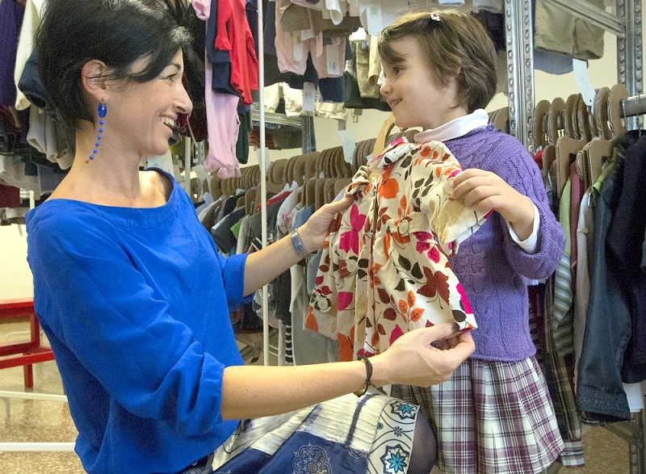
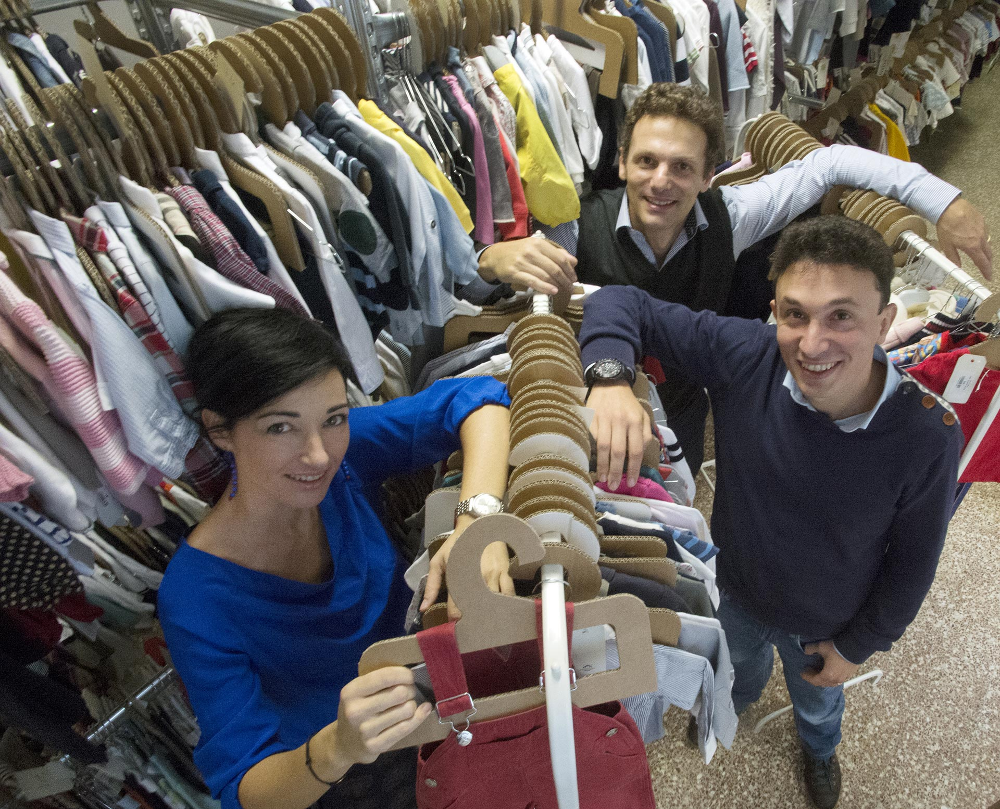

La vendita di abbigliamento usato online è un'attività sempre più in voga, in Italia e all'estero.

Stop all'acquisto di capi sempre nuovi! Basta sprechi! Impariamo a dare valore a ciò che possediamo!
E impariamo a riflettere su un aspetto: ciò che si sceglie di scartare potrebbe piacere, o tornare utile, a qualcun altro.

Perché non diventare consumatori più responsabili partendo, ad esempio, dall'abbigliamento?

**Eleonora Dellera** questo ragionamento lo ha fatto. E lo ha fatto insieme al marito, col quale ha dato vita ad [Armadio Verde](http://www.armadioverde.it), un progetto che promuove il cosiddetto _swapping_.

Questo primo marketplace italiano punta allo scambio e alla vendita di abbigliamento usato online uomo, donna e bambino. Oggi, però, è soprattutto alle madri che si rivolge, focalizzandosi sull'abbigliamento dei più piccoli.

Dopo la fondazione è stato capitalizzato da [iStarter](http://www.istarter.it) ed è stato pubblicato su [Fotolibro ANSA 2014](http://www.ansa.it/sito/notizie/speciali/2014/12/10/photoansa-2014-la-carica-delle-startup_8d43e4f8-7478-4496-8541-6a1432723327.html) alla sezione "Start-up di successo".

Conosciamolo più nel dettaglio...

### Ciao, Eleonora! Sono molto curiosa di sapere com'è nata l'idea di fondare Armadio Verde. Mi racconti?

> Certo, Anna. Armadio Verde nasce come luogo di scambio e di vendita di abbigliamento per bambini.
>
> Io e mio marito David, co-fondatore di questo progetto, vedevamo quanti regali e vestiti acquistati si accumulavano ogni mese.
>
> Da qui l'idea di capire come ovviare a questo spreco restituendo un valore agli acquisti fatti. La vendita di abbigliamento usato online come metodo per andare incontro alle mamme di tutta Italia, in altre parole.
>
> Facendo alcune ricerche abbiamo conosciuto piccole realtà di swapping fra le mamme del nostro quartiere. Poi abbiamo notato che, nelle nazioni anglosassoni, c'erano realtà molto organizzate.
>
> 
>
> Da qui l'idea di creare un business capace di andare incontro a un'esigenza forte tra le mamme. Con Armadio Verde risparmi fino all'85%, non sprechi e vesti bene i tuoi bambini con vestiti selezionati e di qualità.

### Al momento siete una start-up?

> Sì, siamo una start-up innovativa. Questo riconoscimento è giunto proprio all'inizio di quest'anno quando siamo stati capitalizzati da un acceleratore d'impresa che, quest'anno, ci farà crescere in Italia.
>
> Guardiamo all'estero già a partire dal 2016.

### Quali sono le attuali esigenze dei genitori?

> Il _risparmio_. E poi il _non spreco_, perché scambiando i vestiti restituisci un valore agli acquisti fatti. C'è bisogno di _vestire bene i figli_ senza spendere troppo e con capi di qualità. Infine, c'è bisogno di sfruttare al meglio l'_online_. Con Armadio Verde, le mamme scambiano da casa 24 ore su 24.
>
> Consegnamo in tutta Italia in pochissimi giorni.

### Come funziona la vostra vendita di abbigliamento online per bambini?

> [Iscrivendosi al sito](http://www.armadioverde.it/iscriviti/) e richiedendo una busta al profilo online, è possibile spedirci gratuitamente i vestiti che il bambino non usa più.
>
> Una volta ricevuti, ne analizziamo la qualità e accreditiamo un punteggio in stelline col quale si possono scegliere altri vestiti dal nostro store online. Per il nostro servizio si paga 5€ per ogni vestito acquistato, indipendentemente dalla marca, dalla taglia o dalla categoria.

### Chi verifica la qualità dei capi?

> Abbiamo un team che seleziona i capi garantendo sempre la massima qualità, sono severissimi.

### E dimmi, Eleonora: cosa bisogna fare per iscriversi?

> Accedendo al nostro sito si compila la [scheda](http://www.armadioverde.it/iscriviti/) con i propri dati. Dopo aver ricevuto l'e-mail di conferma, e le proprie credenziali (email e password), si effettua il login e si inizia a scambiare.

### Quindi la merce è consultabile e reperibile solo online, giusto? Oppure è possibile recarsi presso qualche punto vendita?

> Ora non abbiamo punti vendita, siamo solo online. Ogni giorno riceviamo centinaia di nuovi vestiti e la nostra [collezione](http://www.armadioverde.it/collezione/) è sempre consultabile sul nostro sito.

### Supponiamo che io mi penta dell'acquisto. Posso restituire l'articolo?

> Certo, ti ridiamo le stelline e il credito in euro per poter acquistare altri vestiti.
>
> I capi che ci mandi, che non non superano il controllo di qualità, vengono restituiti insieme alla prima spedizione di vestiti scelti dal nostro store online.
