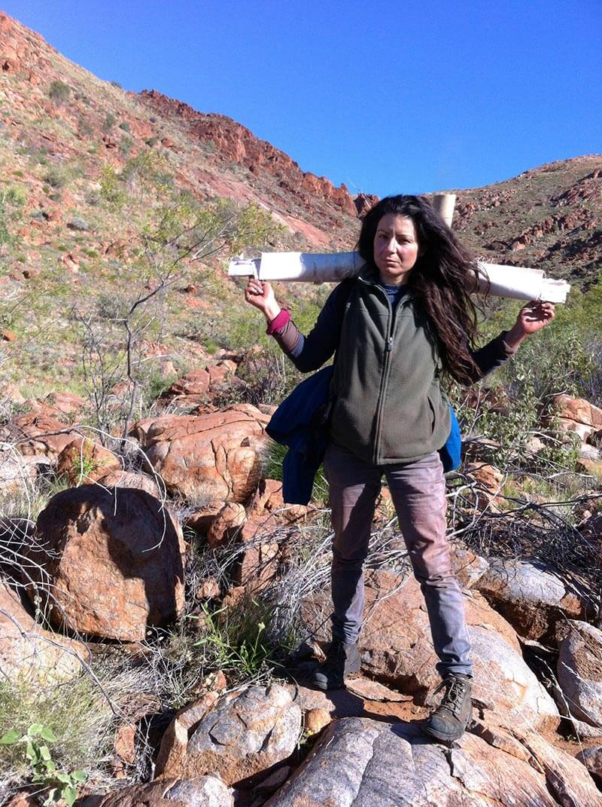

Questa volta si parla di **Uomo e paesaggio**, si parla d'arte, di tutela del territorio e di archiviazione del paesaggio.

Quest'ultimo concetto potrebbe apparire emblematico. Cosa significa _archiviare_, contestualmente all'ambiente?

C'è chi è andato dall'altra parte del globo, si è avventurato in mezzo alla natura ed è riuscito ad archiviare il paesaggio, tutelando intere porzioni di territorio minacciate. E studiando, appunto, la relazione fra Uomo e paesaggio.

Attraverso questa nuova intervista, vi presento [Giorgia Severi](http://www.giorgiaseveri.com).

Nata nel 1984 a Ravenna, Giorgia ha iniziato la propria formazione iscrivendosi all'Istituto d'Arte per il Mosaico. Successivamente, all'[Accademia di Belle Arti](http://www.accademiabellearti.ra.it) ravennate.

Il connubio arte e tutela della natura è una costante nei lavori di Giorgia.

A questo proposito, _Country_ è un ambizioso progetto artistico dedicato al rapporto Uomo-Terra, realizzato insieme a 48 artisti aborigeni provenienti da diverse zone australiane.
Attraverso il suo lavoro, Giorgia ha esplorato il rapporto Uomo e paesaggio sotto diversi punti di vista. Ha raccontato storie di persone e di luoghi lontani, creando un ponte culturale fra due continenti.

Vale davvero la pena conoscerla.

### Ciao, Giorgia! Qual è l'obiettivo del tuo lavoro e cosa rappresenti attraverso le tue opere?

> Ciao, Anna. La mia ricerca si focalizza sul paesaggio che cambia sempre più velocemente.
>
> Le opere sono **archiviazioni di porzioni di territorio che stanno scomparendo**. Sono frammenti di un ambiente che raccontano un passato geologico, oppure impatti ambientali violenti dovuti all'azione antropica.

### Con _"Country"_ sei riuscita a creare un ponte fra Europa e Australia, coinvolgendo moltissimi artisti. Perché proprio quel Paese? Quali elementi del paesaggio hai scelto e perché?

> Ho dato il via al progetto Australia e a [Country](http://www.giorgiaseveri.com/works/land-project.html) perché mi incuriosiva il rapporto Uomo e paesaggio. Mi riferisco al rapporto antropico _positivo_ nel paesaggio.
>
> La profonda e dettagliata conoscenza del territorio ha generato una cultura molto sofisticata che non è separabile dal paesaggio a più livelli.
>
> **"Un uomo senza cultura è un uomo morto che non serve a nulla"**, mi ha detto una volta Ian Crombie, rappresentante per il territorio Yankunyitjatjara. Credo che questo debba farci riflettere molto.
>
> I temi sono stati decisi insieme a colleghi e ad artisti che partecipavano al progetto, per una collaborazione aperta e alla pari. Il filo conduttore è stata la **relazione intima fra Uomo e paesaggio**, che genera ricchezza culturale, esplorata da diversi punti di vista.
>
> Insieme al [Kayili Art Centre](http://kayili.com.au) abbiamo affrontato il tema della donna e del simbolo universale che la rappresenta. Lo abbiamo fatto grazie all'installazione di culle sospese fluttuanti realizzate dalle due diverse culture.
>
> Le artiste aborigene hanno lavorato alla forma del colomoon, io a quella della culla in vimini.
>
> 
>
> A ciò si sono aggiunte 57 calcografie di piante arse che rappresentano il territorio antropico del deserto del Gipson Ngaanyatjarra. In quella zona, come in altre d'Australia, vengono ancora praticati gli incendi controllati per la rigenerazione del suolo. Quello è un paesaggio raro che va scomparendo, per questo ho voluto immortalarlo.

https://myhumus.com/wp-content/uploads/2017/02/tjampi15.jpg
https://myhumus.com/wp-content/uploads/2017/02/tjampi2.jpg

### Uomo e paesaggio: quanto ti piace coinvolgere lo spettatore?

> Siccome credo che l'arte debba rivolgersi a tutti per poter "seminare" e cambiare le cose, **amo molto coinvolgere lo spettatore**.
>
> La performance _Operazione Campo Base_ del progetto _Restoring the World_ ne è un esempio. Ho voluto che i partecipanti assumessero la consapevolezza dell'azione che stavano facendo e vivessero l'arte, sia come mezzo di comunicazione che come strumento di cambiamento interiore e sociale.

### Parliamo del progetto artistico del ghiacciaio Presena. Hai attuato una vera e propria fusione con l'habitat: potresti parlarmi di questo tuo lavoro? In cosa consiste la cosiddetta "archiviazione del paesaggio" che hai compiuto? Possiamo definirlo un imprinting?

> L'archiviazione del paesaggio proviene dalla formazione in restauro del mosaico antico che mi ha forgiata. Con un'attenzione particolare alla cura e alla conservazione di quei frammenti di paesaggio antropico che andavano deteriorandosi.
>
> Applico questi principi al paesaggio naturale geologico in erosione, ai ghiacciai in discioglimento, alle zone urbane in espansione che si sostituiscono alle foreste. E anche a pratiche antropiche legate all'ambiente che stanno andando in disuso, e che precludono una profonda e dettagliata conoscenza del territorio.
>
> Il progetto _Ghiacciaio Presena_ è dedicato a uno dei ghiacciai italiani che si sta sciogliendo ad altissima velocità, con un ritiro di quasi un metro all'anno.
>
> I calchi e le calcografie eseguite sulle pareti della montagna che, una volta, ospitava un'enorme distesa di ghiaccio, così come alcuni massi delle sassaie, sono stati oggetto delle mie opere per **parlare di ciò che sta accadendo**.

### Quali calchi hai eseguito, esattamente?

> Ho preso il calco di massi erratici, un tempo strascinati dal giaccio. E poi la calcografia di pareti in cui la lingua del ghiacciaio ha inscritto la roccia, scolpendola con la propria pressione e disegnando linee che ne descrivono il ritiro nel tempo.
>
> Credo che questa **storia scritta nella roccia** debba essere portata all'attenzione di tutti noi che, ora, viviamo nel cosiddetto _Antropocene"_.

### Vorrei che mi spiegassi meglio il concetto: che cosa si archivia di un paesaggio?

> **L'archiviazione di un paesaggio non si rivolge solo all'ambiente**. Si rivolge a tutti quei paesaggi culturali che esprimono le pratiche antropiche capaci di legare Uomo a paesaggio in sé.
>
> **È ciò che sta scomparendo**. L'erosione non è solo terrestre, su montagne e campi agricoli. È anche intellettuale a causa di una sorta di disconnessione dalla cultura.

### Quando pensiamo alla relazione Uomo e paesaggio, possiamo ancora agire positivamente?

> Certamente. La nostra azione può e deve essere positiva. Qui non si accusa esclusivamente l'antropia negativa, ma si cerca di utilizzare l'arte come mezzo di comunicazione capace di aprire nuove porte.
>
> Una prova di ciò risiede nel _Progetto Presena_: l'azione artistica performativa ha vissuto, fisicamente e direttamente, la montagna alla quale il progetto stesso si stava rivolgendo. Tutto questo con grande sforzo nel tempo.
>
> L'azione antropica ha agito e toccato quel luogo sia concettualmente sia con mano. Questo mi ha permesso di prendere consapevolezza di un luogo in cui, oltre al disgelo del ghiacciaio, i nostri avi hanno combattuto il conflitto del '15-'18.

### È stata un'esperienza emozionante?

[

> Sì, molto. Sul ghiacciaio c'è la controversa corsa ai ripari. La lingua bianca è ricoperta di telone geotessile per rallentare il discioglimento del ghiaccio. Questo è stato un altro fattore antropico al quale ho dovuto prestare molta attenzione.
>
> Qui è nata l'opera _Albedo_, un'installazione di 5 metri di materiale geotessile che evoca il ghiacciaio imitandone la forma. In questo caso, però, il materiale dell'Uomo ha funzione di tutela.

### Dove sarai nei prossimi mesi?

> Per ora è in corso la mostra _Back to the Land_ alla [Galleria Studio La Città](http://www.studiolacitta.it) di Verona fino al 23 febbraio, curata da Andrea Lerda di [Platform Green](http://www.platformgreen.org). Poi ci sarà qualche sorpresa in arrivo.

Foto di copertina: [Joshua Hibbert](https://unsplash.com/@joshnh) via [Unsplash](https://unsplash.com).
