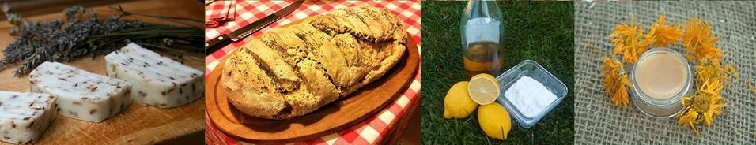

**Autoproduzione**: che bella parola. Eppure, non è qualcosa di immediato.

Ci sono volte in cui pigrizia e/o abitudine prendono il sopravvento. Acquistare un prodotto è indubbiamente più pratico e veloce rispetto all'autoprodurlo da zero.

Spesso non è neanche una questione di tempo, quanto più una mancanza di voglia unita al timore di fallire nell'impresa e di buttare tutto nell'immondizia.

Per tutti coloro che sono in cerca di speranza in questo senso, ecco una notizia rassicurante: **autoprodurre diventa un'impresa possibile** grazie alle dritte di **Lucia Cuffaro**.

Come dire, la luce alla fine del tunnel!

Lucia ha un'energia contagiosa. All'interno di [www.autoproduciamo.it](http://www.autoproduciamo.it), e nell'ambito di alcuni programmi televisivi, offre dritte inerenti l'**autoproduzione in cucina**, i **cosmetici fai da te**, i **saponi** e i **detersivi naturali**, l'**orto in appartamento**, le **compostiere fai da te**, gli **antiparassitari naturali** e molto altro.

Che ne dite? Vogliamo conoscerla meglio?

### Cara Lucia, che piacere conoscerti! Raccontami: come nasce il tuo interesse verso l'autoproduzione?

> Ciao, Anna! Il mio attuale lavoro sull'autoproduzione è frutto di tutto l'attivismo che ho condotto in passato.
>
> Diversi anni fa ho preso parte al [Movimento per la Decrescita Felice](http://decrescitafelice.it) in qualità di socia. Poi, mentre lavoravo in RAI e, nello specifico, in Report, ho partecipato a tutti i corsi organizzati dall'[Università del Saper Fare](http://decrescitafelice.it/unisf/) di Roma.
>
> Cercavo una strada che mi consentisse di esprimere tutta la mia vena creativa e il mio bisogno di etica. Così ho deciso di licenziarmi da RAI per scrivere un nuovo capitolo della mia vita.
>
> È stata la volta di [La Città dell'Utopia](http://www.cittadellutopia.it/CITTA_DELLUTOPIA/HOME.html), all'interno della quale sono stata assunta per coordinarne l'attività.
>
> Dopodiché sono diventata presidente del Circolo di Roma per la Decrescita Felice. È a quel punto che ho deciso di condurre una rubrica all'interno di [Uno Mattina In Famiglia](https://www.raiplay.it/programmi/unomattinainfamiglia), ispirata al progetto dell'Università del Saper Fare del Movimento per la Decrescita Felice.
>
> 
>
> Negli ultimi anni sono diventata vice presidente nazionale del Movimento per la Decrescita Felice. Fino a gennaio 2016, mi sono occupata di tematiche tecniche sui rifiuti all'interno della Camera dei Deputati.
>
> Ora lavoro come libera professionista, ho due contratti televisivi (uno con RAI e l'altro con TV2000), mi dedico ad alcuni corsi e seminari, sono un'attivista impegnata nelle tematiche connesse ai rifiuti e in attività di socializzazione.
>
> Amo alla follia la mia casa editrice, il [Gruppo Editoriale Macro](http://www.gruppomacro.com), con cui lavoro a nuovi progetti sull'ecologia. Gentilezza e professionalità sono le loro caratteristiche.

### Qual è il tuo impegno quotidiano?

> Punto a **semplificare l'autoproduzione**. Autoprodurre è un'impresa possibile.

### Parliamo un secondo dei tuoi prodotti. Prendiamo come esempio le tue creme: sono destinate a tutti i tipi di pelle?

> Sì, perché gli ingredienti che utilizzo sono estremamente semplici. L'autoproduzione deve poter fare sempre rima con *semplicità*, affinché possa essere praticata da tutti.
>
> Prima di pubblicare le mie ricette, le testo per un certo periodo di tempo sulla mia pelle e su quella di amici. >
>
> Di solito non uso profumi, perché privilegio l'odore della cute. Amo i prodotti semplici e neutri. Ci sono casi, tuttavia, in cui propongo delle varianti contenenti oli essenziali.
>
> Propongo dosaggi molto piccoli, perché non uso conservanti, e consiglio sempre l'uso di barattoli di vetro. Non amo gli emozionanti né tantomeno gli emulsionanti artificiali.
>
> I miei procedimenti di autoproduzione sono molto semplici.

### Quali e quanti ingredienti utilizzi?

> Gli ingredienti che uso sono al massimo trenta. Attraverso le loro combinazioni autoproduco detersivi, prodotti per la salute, articoli per la cosmesi e per l'igiene personale. Considera che ogni singolo prodotto contiene al massimo tre o quattro ingredienti.
>
> **Non servono tanti elementi primari per l'autoproduzione di ciò che ci serve!**
>
> Fra quelli che uso per realizzare centinaia di prodotti ci sono l'aceto di vino bianco e quello di mele. Poi il bicarbonato, l'acido citrico, la soda da bucato, il percarbonato di sodio, il sapone di Marsiglia, il sapone d'Aleppo. E ancora: l'olio essenziale tea tree oil, quello essenziale alla lavanda e alla menta, il burro di karité, l'amido di mais, l'aloe vera. E poi l'olio di neem, l'argilla, l'olio di mandorla, la cera d'api, la farina integrale, la pasta madre, l'olio di oliva, il sale integrale. Infine, lo zucchero di canna naturale, il miele, il caffè esausto, gli scarti degli agrumi, il Kefir e il rosmarino.
>
> Questi ingredienti sono tutti economici, facilmente reperibili nei negozi, in erboristeria, negli alimentari.
>
> Dal momento che non amo lo spreco, propongo sempre **ricette con ingredienti riutilizzabili** per più prodotti. Promuovo anche la **facile reperibilità**: quando possibile, consiglio sempre **materie prime prodotte in Italia** in maniera semplice.
>
> Purtroppo ci sono casi in cui non è possibile ricorrere al Km Zero. Penso, ad esempio, all'olio di cocco, al burro di karité e all'olio di neem.

### Una mia curiosità personale: quali sono i prodotti più difficili da autoprodurre?

> Indubbiamente le creme solari. Sono davvero molto complesse da realizzare.

#### Ciò che fai è davvero molto divertente e creativo. Brava! Prima di salutarci, dimmi: cosa pensi di te?

> Mi ritengo una persona molto fortunata, perché ho la possibilità di vivere facendo ciò che mi appassiona!

Foto di copertina: [Dominik Martin](https://unsplash.com/@dominikmartin) via [Unsplash](https://unsplash.com).
