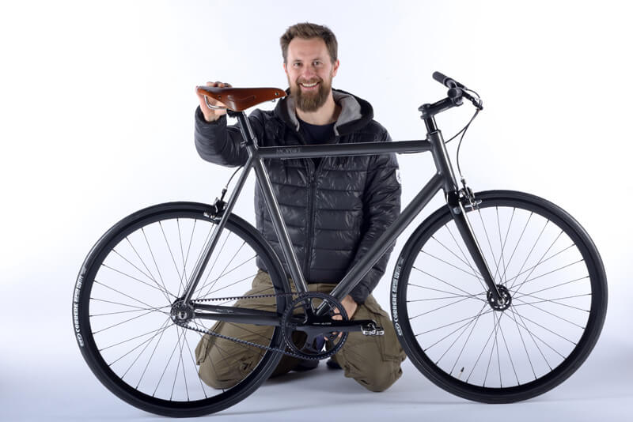
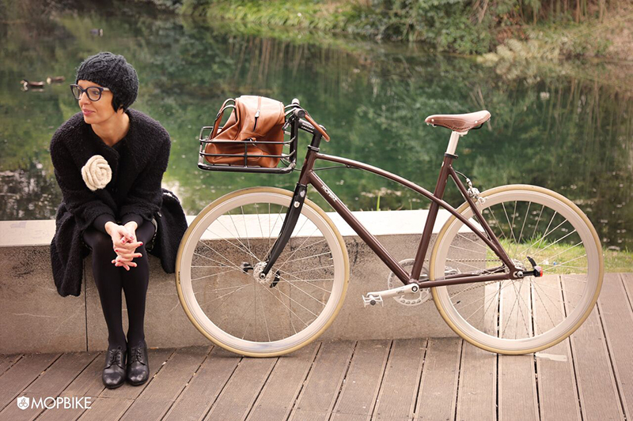
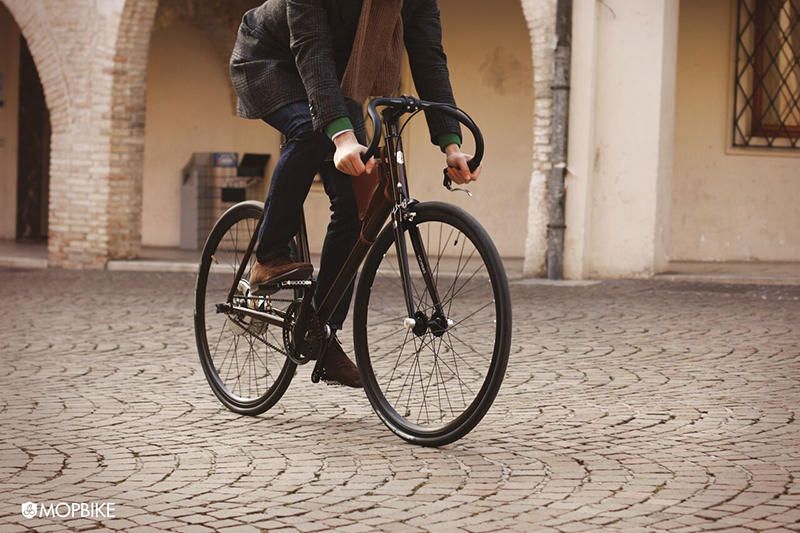
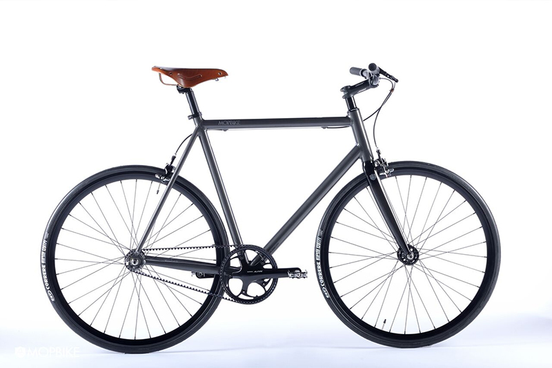

MyHumus torna a occuparsi di sostenibilità ambientale, e lo fa parlando di una delle più belle invenzioni di questo mondo: la bicicletta.
Nello specifico, questa volta vi parlo di **bici artigianali italiane**. E lo faccio presentandovi un nuovissimo brand: [Mopbike](http://www.mopbike.com).

Nato nel 2014, questo brand di Pordenone riassume due concetti principali: **passione** e **artigianato 2.0**.
I prodotti Mopbike ricalcano le esigenze di ciascun cliente e sono studiati su misura per la massima resa e il massimo soddisfacimento personale. Dimmi che bici hai e ti dirò chi sei, tanto per capirci.

Le **tubazioni Dedacciai in lega leggera di alluminio** di alta gamma sono il frutto di un'ultra decennale evoluzione nella definizione dei diametri.
Le tubazioni delle bici artigianali italiane Mopbike derivano dall'**integrazione fra la tecnologia di trafilatura a spessori differenziati e la progettazione agli elementi finiti (FEM)**. Questo permette di ottenere strutture molto più leggere con spessori diversi tra le sezioni più sollecitate e quelle che lo sono meno.

Alcuni componenti portanti del telaio sono realizzati attraverso la **tecnologia additiva della stampa 3D**. A questo proposito, Mopbike ha deciso di impiegare l'**additive manufacturing** per migliorare le prestazioni e ottenere la massima flessibilità.

Tutto inizia da un disegno CAD 3D di proprietà Mopbike che, successivamente, viene inviato alla stampante. Dopodiché c'è un laser che fissa la polvere metallica di alluminio realizzando il componente. È la stessa tecnologia usata in campo aerospaziale.
Il telaio di queste bici artigianali italiane viene successivamente saldato e verniciato rigorosamente a mano. Come? Attraverso cinque strati di vernice a liquido senza alcun processo industriale.

**Massimo Ottavio Pavan** è uno dei soci fondatori di Mopbike. Parli con lui e capisci subito quanto ami il suo lavoro.

### Ciao, Massimo! Cominciamo dalle origini del tuo brand?

> Ciao, Anna. Certamente! Alla base di questo progetto ci sono la passione per il mondo della bici e la **sensibilità verso l'ambiente**.
>
> La bici è un mezzo meravigliosamente logico: si parla di risparmio economico, di sostenibilità ambientale e di benessere per la salute. Impossibile non innamorarsene. Mopbike marchia il telaio con la scritta _Ecologic_ ed è un brand italiano che nasce da noi per voi.

### Da quante persone è composto il team? E quando avete dato vita a questo progetto?

> Siamo io, Francesca e il mio migliore amico, Elvis, a supporto.
>
> Mopbike nasce come società nel 2014 a Pordenone. Abbiamo debuttato nel settembre 2015 a [Cosmobike](http://www.cosmobikeshow.com) e adesso, a distanza di un anno, vogliamo far conoscere le nostre bici artigianali italiane.
>
> Il nostro marchio punta alla qualità ancora prima che all'estetica. Punta alla **scelta tecnologica**, al **montaggio di valore** e all'**abbassamento del livello di manutenzione**. Le nostre bici sono realizzate per durare nel tempo.

### Quali passaggi portano alla nascita delle vostre bici artigianali italiane?

> Siamo noi a realizzare le bici che vendiamo, sia quelle muscolari che quelle elettriche (queste ultime hanno l'innovativo sistema _Zehus_ che ricarica pedalando!). **Ogni nostra bicicletta è un pezzo unico**.
>
> Come prima cosa, desideriamo conoscere il cliente e ascoltare le sue esigenze. Vogliamo innanzitutto capire quale tipologia di bici sia meglio per lui e quale utilizzo debba farne.
>
> Poi **chiediamo le misure antropometriche** e iniziamo il progetto di creazione vera e propria della bici.

### Quanto tempo bisogna attendere per avere la propria Mopbike?

> Indicativamente, due mesi.

### Il vostro è un prodotto Made in Italy, quindi?

> Sì, abbiamo intrapreso un **percorso di certificazione attraverso il progetto Made in Italy di Amazon**. Dopo diversi mesi, siamo entrati nella piattaforma online garantendo il reale Made in Italy.
>
> La nostra non è solo una lavorazione finale, sosteniamo e optiamo per il Made in Italy dall'inizio alla fine della nostra produzione. Per la realizzazione delle selle artigianali, ad esempio, scegliamo le pelli selezionate di Arzignano, in provincia di Vicenza.
>
> Laddove non possiamo ricorrere al prodotto italiano, ci rivolgiamo all'alta gamma giapponese.

### Quali sono i punti forti di Mopbike?

> La **personalizzazione**, l'**unicità del mezzo** e la **qualità che dura nel tempo**.
>
> I copertoni antiforatura ad alte prestazioni e la cinghia in carbonio, anziché una normale catena, sono solo alcune delle soluzioni che offriamo per garantire la qualità delle nostre bici artigianali italiane.

### Avete più clienti in Italia o all'estero?

> Decisamente più all'estero. Vendiamo soprattutto in Svizzera, in Gran Bretagna, in Olanda e in Germania. Oggi, tuttavia, inizia a muoversi qualcosa anche in Italia.

### I vostri prodotti hanno una garanzia?

> Sì, hanno una **garanzia di due anni**. Ogni bici è dotata di un codice univoco e di un certificato di proprietà.

### Quali sono le richieste più frequenti dei vostri clienti?

> In primis viene richiesta la qualità. Chi ci contatta ha le idee molto chiare sul nostro progetto. Sono in tanti a fidarsi di noi dopo aver consultato il nostro sito.
>
> Se è vero che sono le aziende a fare le persone, fortunatamente noi riusciamo a trasmettere chi siamo.

### Obiettivi attuali e futuri?

> Il nostro attuale obiettivo è la promozione del brand Mopbike, questo è sicuramente uno degli aspetti fondamentali. Il prodotto è maturo e stiamo lanciando due nuovi modelli. In futuro ci piacerebbe approdare al mercato giapponese.
