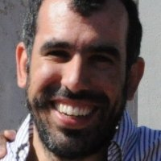
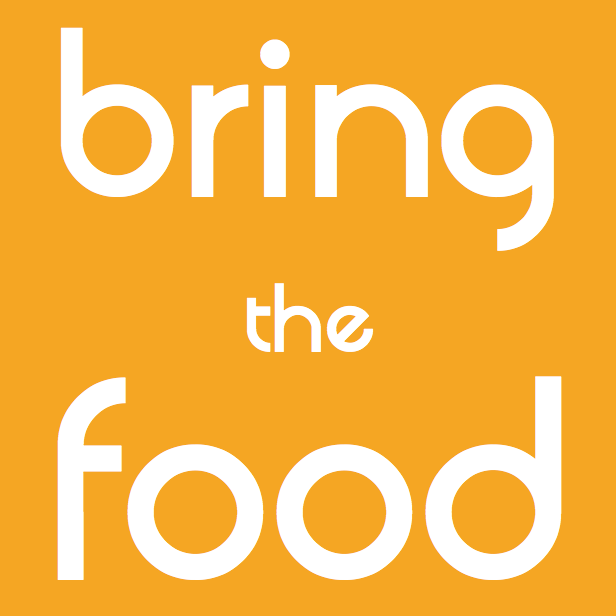

Ci sono diverse cose che non tollero: l'arroganza, la prevaricazione, l'erudizione selettiva, i sensazionalismi. E lo spreco, di tempo e di cibo. Combattere lo spreco alimentare dovrebbe essere una priorità di tutti.

Odio quando qualcosa di recuperabile finisce nella spazzatura. È per questo motivo che, quando faccio la spesa, cerco di farla in modo intelligente, calcolando le quantità per non sciupare nulla.

Sì, l'argomento di questa settimana è la **lotta allo spreco di cibo**.

Durante un incontro organizzato a [Progetto Manifattura](http://www.progettomanifattura.it) ho conosciuto **Pietro Benedetto Molini**, sviluppatore software coinvolto nel progetto di recupero alimentare [BringTheFood](http://www.bringfood.org/public/landing?locale=it).
È stata l'occasione ideale per parlare insieme a lui di questo tema e, ovviamente, degli obiettivi del suo progetto.

### Ciao, Pietro! Raccontami, da quali bisogni e mancanze nasce BringTheFood?

> Ciao, Anna! BringTheFood è un progetto dell'unità ICT4G della [Fondazione Bruno Kessler](http://www.fbk.eu). Nasce come soluzione a un problema affrontato durante l'edizione trentina della Hackathon "Random Hacks Of Kindness" nel 2011.
>
> Il problema riguardava lo spreco di cibo che avveniva ogni giorno nelle mense di un campus universitario americano. Serviva combattere lo spreco alimentare. La nostra soluzione è stata il prototipo di un'App per segnalare le eccedenze a chiunque fosse interessato a recuperare cibo nella stessa zona.
>
> Abbiamo così iniziato lo sviluppo dell'applicazione fino a presentarla alla conferenza ICTD2012 ad Atlanta, GA. In quell'occasione BringTheFood ha iniziato ad apparire sui giornali locali e nazionali.
>
> Poi abbiamo avviato una collaborazione con il [Banco Alimentare del Trentino Alto Adige](http://www.bancoalimentare.it/it/trentino) che, negli anni, si è consolidata e allargata alla [Fondazione Banco Alimentare](http://www.bancoalimentare.it), con sede a Milano.
>
> Oggi collaboriamo anche con le [ACLI di Padova](http://www.aclipadova.it/index/index/id/1) per la redistribuzione di cibo all'interno del progetto [ReteSolida](http://www.aclipadova.it/index/index/id/66/fh/5/rete_solida.html).

### Com'è strutturato il progetto? Voglio dire, come funziona questa nuova opportunità per combattere lo spreco alimentare?

> BringTheFood è un'App web gratuita, raggiungibile all'indirizzo [bringfood.org](http://www.bringfood.org), che vuole combattere lo spreco alimentare. Per farlo, facilita la donazione di cibo mettendo in contatto diretto il donatore e il ricevente.
>
> A chi si iscrive per donare cibo, BringTheFood offre la possibilità di pubblicare una donazione in meno di un minuto e di controllarne lo stato fino alla data di scadenza.
>
> A chi si iscrive per trovare donazioni, invece, l'App mostra la lista delle donazioni presenti nella zona del ricevente. Se interessato, l'utente prenota una donazione, o una sua parte, e si mette d'accordo con il donatore per il ritiro.
>
> Chi si registra per scambiare cibo, trova entrambe le funzionalità descritte sopra. L'utente può sia donare che ricevere, sempre in forma completamente gratuita.

### Quali realtà possono offrire cibo e quali, invece, possono prenotarlo e riceverlo?

> Per donare cibo ci rivolgiamo soprattutto a ristoranti, mense e piccoli supermercati. Un modo nuovo per combattere lo spreco alimentare diminuendo i costi di smaltimento.
>
> Quanto a chi riceve le donazioni, ci rivolgiamo a strutture caritative come associazioni di volontariato, mense per i poveri e centri di aiuto.
>
> Vogliamo supportare e facilitare la creazione di reti locali di donazioni. Queste potrebbero usare BringTheFood come strumento per semplificare il processo e tenere traccia delle donazione fatte o ricevute.

<iframe allowfullscreen="allowfullscreen" frameborder="0" height="281" src="https://player.vimeo.com/video/98641741" width="500"></iframe>

### Ci sono controlli sulla qualità del cibo che viene donato?

> Il donatore deve dichiarare che il cibo non sia scaduto e, nel caso di alimenti cotti, che la data di preparazione sia la stessa del giorno della donazione.
>
> Grazie alla Legge 155/2003, deleghiamo alle due parti, specie al ricevente, la responsabilità sul controllo della qualità. A chi recupera il cibo consigliamo sempre di verificare che abbia i requisiti giusti.

### Quanto cibo viene donato nell'arco di un anno?

> Nel 2014, grazie alla collaborazione con ReteSolida, BringTheFood è stato lo strumento per la gestione del recupero di più di 100 tonnellate di prodotti ortofrutticoli. In questi primi mesi del 2015 sono state recuperate altre 150 tonnellate. Un bel passo in avanto nel combattere lo spreco alimentare.

### Con quali realtà collaborate? Operate su un territorio specifico o su tutta Italia?

> BringTheFood non è legato a un territorio specifico. Gli iscritti all'App sono persone e realtà da tutta Italia che usano BringTheFood per fare e trovare donazioni sul loro territorio.
>
> Ora abbiamo circa 600 iscritti in tutta Italia. E più di 12.000 persone che hanno ricevuto cibo grazie agli enti caritativi registrati su BringTheFood.
>
> Collaboriamo in maniera più stretta con la Fondazione Banco Alimentare, di cui seguiamo le linee guida per le donazioni. E anche con le ACLI di Padova per il progetto ReteSolida.
>
> In diverse realtà locali gestite dal Banco Alimentare, BringTheFood consente ai volontari di recuperare quelle donazioni occasionali che, altrimenti, andrebbero sprecate.
>
> All'interno del progetto ReteSolida, i volontari usano la nostra App per segnalare agli enti caritativi iscritti alla piattaforma la disponibilità di grandi donazioni di prodotti ortofrutticoli.

### Pietro, svelami qualche anticipazione: cosa bolle in pentola per questo 2015?

> Portiamo avanti la collaborazione con Progetto ReteSolida, valutando anche con loro la possibilità di replicare il modello in altre città.
>
> Siamo in contatto con altre realtà caritative in Italia per occuparci delle reti di recupero territoriali. Stiamo anche lavorando con la Fondazione Banco Alimentare per supportare altri meccanismi di recupero.

Foto di copertina: [thebittenword.com](http://www.flickr.com/photos/22198928@N00/2622852938) via [Photopin](http://photopin.com).
