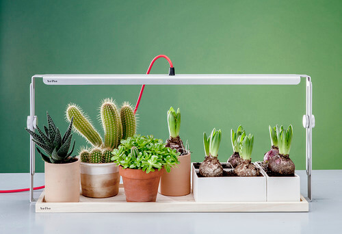
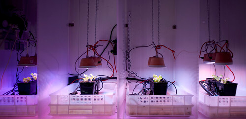

Coltivare in casa è qualcosa che, in questi anni, ha stuzzicato parecchio la mia curiosità. Vuoi per un crescente interesse personale verso il tema dell'autoproduzione, vuoi per una continua sperimentazione di nuove attività.
Mi piacerebbe farlo, prima o poi. Mi basterebbe giusto capire meglio in che modo.
Come posso coltivare in casa in modo semplice, senza fare di questa esperienza una Caporetto?

.

La risposta al quesito mi è arrivata da **Sara Pellegrini**, architetto e graphic designer di Bologna. Insieme a tre amici ha dato il via ad una start-up meravigliosa: [Bulbo](http://www.bulbolight.com/it/).

Curiosi di saperne di più? E allora non aspettiamo nemmeno un minuto, scopriamo insieme di cosa si tratta. E quale sarà, molto probabilmente, uno dei miei prossimi acquisti!

### Ciao, Sara! Sono proprio felice di presentare Bulbo su MyHumus. Dimmi, come hai conosciuto i tuoi _partner in crime_?

> Ciao, Anna! Siamo quattro bolognesi che si conoscono da una vita. Abbiamo frequentato le stesse scuole, gli stessi bar e le stesse palestre.

### Trovo che Bulbo sia un progetto davvero molto interessante, ne approfitto per farvi i complimenti. Una curiosità: a chi è venuta l'idea di progettare un dispositivo che consentisse di coltivare in casa?

> Nel 2011 Lorenzo ha iniziato a studiare l'interazione tra luce e piante, stimolato dai temi di EXPO 2015 di cui si era appena iniziato a parlare.
>
> Per la tesi di laurea, ha sviluppato un primo prototipo di lampada per coltivare in casa. Il tutto supportato dagli agronomi dell'Università di Bologna.
>
> I risultati delle sperimentazioni scientifiche su piante di lattuga e basilico hanno dimostrato esiti decisamente positivi. Grazie allo spettro luminoso riprodotto, i loro parametri di salute e di crescita sono rimasti inalterati. Addirittura, sono risultati essere migliori.
>
> È nata allora l'idea di indagare possibili sbocchi commerciali. Grazie a questa intuizione, nel 2012, Lorenzo ha vinto [Spinner](http://www.spinner.it/index.php). Un concorso, questo, che finanzia giovani imprenditori nello sviluppo della ricerca e nell'innovazione tecnologica. Insieme a noi tre, Lorenzo ha fondato Bulbo.
>
> In aprile 2013, al Salone del Mobile di Milano, abbiamo presentato i primi prototipi e ad ottobre dello stesso anno eravamo già sul mercato".

### Qual è la mission di Bulbo?

> Vogliamo coltivare la relazione tra la popolazione urbana e la natura. Vogliamo aumentare la consapevolezza delle persone rispetto all'agricoltura grazie a un'esperienza coinvolgente.
>
> Immaginiamo soluzioni intelligenti e creative per coltivare in casa, a tutte le latitudini e ogni giorno dell'anno.
>
> Uniamo design ed esperienza manifatturiera italiana, tecnologia LED avanzata e anni di ricerca scientifica condotta in laboratori universitari. Tutto insieme per ottenere un risultato unico e all'avanguardia.

### Quali sono le caratteristiche delle vostre lampade LED per coltivare in casa?

> Bulbo concentra l'energia solare in una lampada e la porta in casa per coltivare piccoli orti domestici.
>
> La luce emessa dalle nostre lampade è colorata, perché è un mix di frequenze luminose selezionate blu e rosse. Questo spettro luminoso è quello che le piante "leggono" e assorbono per attivare la fotosintesi e crescere.
>
> Tre anni di sperimentazione scientifica con l'Università di Bologna hanno permesso di sviluppare una luce sicura, che non danneggia le piante. È una luce che le fa crescere in modo naturale. Le piante crescono sane e presentano alti contenuti di clorofilla, acqua, antiossidanti, polifenoli, olii essenziali e bassi contenuti di nitrati.
>
> 
>
> Grazie al LED, che è una luce fredda e colorata, possiamo seguire l'intera crescita delle piante, dal seme al frutto.
>
> Le lampade Bulbo sono strumenti professionali e semplicissimi da usare. Fanno sì che la tecnologia usata nelle serre sia alla portata di tutti. Per usare una Bulbo e coltivare in casa non c'è niente da sapere, serve solo accendere la luce.

### Quali sono i vostri rivenditori? È possibile acquistare anche online?

> Vendiamo tantissimo online, sul nostro sito ([www.bulbolight.com/shop](http://www.bulbolight.com/shop)) e su molti eCommerce europei. In poco più di 13 mesi siamo riusciti a vendere più di 600 lampade, un grande risultato per un'azienda piccola come la nostra! Il Paese in cui vendiamo di più è la Germania, dove le persone hanno già l'abitudine di coltivare in casa. Grazie alle fiere di quest'anno a Milano, Londra e Parigi, abbiamo raggiunto molti rivenditori nel mondo del design. Ora stiamo lavorando per attraversare l'oceano e affrontare il mercato americano e canadese, dove c'è molta richiesta.

### Quanto interesse avete riscontrato, finora, nei confronti della vostra start-up?

> Moltissimo, da parte di tutti, italiani e stranieri. Ogni volta che presentiamo il progetto, le persone si lasciano scappare un sorriso quando capiscono che la luce porta vita. E che può permettere di coltivare in casa.
>
> 
>
> E questo capita ovunque, in Italia e all'estero. Gli anziani sono i più scettici, perché ancorati a una coltivazione tradizionale. I bambini, al contrario, se ne innamorano all'istante. Tanti genitori comprano le lampade per i propri figli.

### Visitando il vostro sito, ho letto a proposito di un'App e di un'iniziativa di crowdfunding. Di cosa si tratta, esattamente?

> Stiamo lavorando a un upgrade smart e social delle nostre lampade: #smartbulbo.
>
> Vogliamo che Bulbo diventi intelligente, che interagisca con le persone. Vogliamo che la coltivazione diventi ancora più semplice e la lampada più autonoma. Questo per dare a tutti la possibilità di prendersi cura delle piante in maniera divertente e consapevole.
>
> Il nostro prossimo obiettivo è progettare un'App che metta in comunicazione persone e piante attraverso un dispositivo elettronico adatto a qualsiasi lampada Bulbo.
>
> Grazie all'App sarà possibile regolare la luce a seconda della pianta, avere un manuale di coltivazione sempre aggiornato, fare della propria avventura green un'esperienza da condividere con tutti.
>
> Abbiamo lanciato **#smartbulbo** su una nuova piattaforma crowdfunding aperta da [TIM #WCAP](http://www.wcap.tim.it), dove idee, progetti e imprese possono ricevere finanziamenti dalla community.
>
> Le campagne di raccolta fondi sono un ottimo sistema per avviare processi di coinvolgimento e di scambio attorno a nuovi progetti. Il nostro obiettivo è di raccogliere 20.000€ in 3 mesi. I sostenitori riceveranno in anteprima i prototipi del nuovo dispositivo elettronico. E saranno i primi a poter testare l'App in primavera 2015 per aiutarci a migliorarla prima di andare sul mercato.
>
> 

### Programmi per il futuro?

> La grande sfida del 2015 sarà quella di migliorare l'usabilità dei prodotti. Questo per permettere a un pubblico sempre più vasto di coltivare in casa con le nostre lampade. Stiamo lavorando alle certificazioni necessarie per vendere negli USA e in Giappone, cosa che richiederà un discreto sforzo. Per farlo, cerchiamo investitori e partner industriali pronti a cogliere insieme a noi la sfida dell'home gardening.

Che altro dire? Trovo che il progetto di Sara, Zeno, Lorenzo e Tommaso sia semplicemente fantastico. Mi auguro davvero che la loro idea possa avere sempre più successo.
Forza, ragazzi, avanti tutta!

`youtube: SbvGdyadmKQ`

`youtube: 0_bbMzVp3z4`
