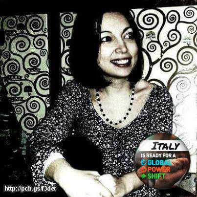

Il mondo in cui viviamo sta cambiando molto rapidamente e si avverte sempre più l'urgenza di un movimento italiano per il clima.

Non ci sono più le stagioni di una volta, non ci sono più i ghiacciai di una volta, non c'è più il sole di una volta. Non ci sono più le precipitazioni di una volta, né tantomeno la disponibilità idrica e l'agricoltura di una volta.
Tutto ciò si ripercuote sul nostro stato di salute, perché è dall'ecosistema in cui viviamo che dipende la qualità della nostra vita: malato l'ambiente, malati noi.

**Il cambiamento climatico rappresenta una delle maggiori sfide dei prossimi anni** e la nostra generazione è forse l'ultima a poter far qualcosa.

A questo proposito, dal 30 novembre all'11 dicembre 2015, Parigi ospiterà la XXI Conferenza delle Parti ([COP21](http://www.cop21.gouv.fr/en)) della Convenzione quadro delle Nazioni Unite sui Cambiamenti Climatici (UNFCCC).

Se si parla tanto di COP21, un motivo c'è: nelle due settimane di negoziato, migliaia di delegati e di ricercatori si daranno appuntamento alla Ville Lumière per trovare un accordo internazionale e vincolante sul clima. Un accordo capace di limitare il riscaldamento globale al di sotto dei 2°C.

Ogni Paese è stato invitato a proporre **soluzioni per la riduzione del consumo di combustibili fossili**. Ma anche per il **contenimento delle emissioni di gas serra** e per il conseguente global warming.
Quali accordi verranno raggiunti?

`youtube: 0n6hleA7M6o`

Fra i presenti alla conferenza ci sarà anche un movimento italiano per i clima: [Italian Climate Network](http://www.italiaclima.org).
Qualche giorno fa ho intervistato **Veronica Caciagli**, esperta di politiche riguardanti i cambiamenti climatici e l'energia nonché co-founder e presidente dell'associazione.

### Gentile Dott.ssa Caciagli, innanzitutto grazie della Sua preziosa disponibilità. Diamo inizio a questa intervista cercando di conoscere meglio Italian Climate Network: quando nè nato questo movimento italiano per il clima, e perché?

> Ciao, Anna. Questa associazione è nata nel 2011 per costruire un ponte fra scienza del clima e pubblico.
>
> Il gruppo dei fondatori, costituito da me, da alcuni climatologi e da altri professionisti del clima, pensava che ci fosse un buco nell'informazione inerente i cambiamenti climatici. Specie in termini di quantità e di approfondimento delle informazioni.
>
> In Italia, oltretutto, mancava un'informazione sui negoziati climatici.
>
> Italian Climate Network è partner di [350.org](http://350.org), il movimento mondiale per il clima, con cui organizziamo giornate di mobilitazione.
>
> Le successive attività si sono sviluppate e arricchite anche grazie all'aggiunta dei volontari. Oggi abbiamo un team di 30 persone, oltre agli associati.

### Come viene percepito l'argomento clima, in Italia? Pensa che la sensibilità a tal proposito sia in aumento?

> Sì, grazie al nostro movimento italiano per il clima stiamo notando un aumento d'interesse. Ma non è ancora sufficiente.
>
> **Le persone faticano a collegare le cause e le conseguenze dei cambiamenti climatici**. Non dovrebbe essere difficile, visto che in Italia stiamo assistendo a un aumento consistente dei fenomeni atmosferici estremi.
>
> Ancora fatichiamo a far comprendere la connessione tra tutti i punti. **I fenomeni atmosferici estremi sono una conseguenza dei cambiamenti climatici**. Essi si collegano all'aumento di gas serra in atmosfera, provocato dalla produzione di energia da fonte fossile e dal disboscamento.
>
> Le nuove generazioni sono più sensibili, attente e interessate al clima, in parte grazie alle scuole e ad alcuni insegnanti pionieri dell'educazione ambientale. Anche il web contribuisce in questo senso.
>
> Buona parte del nostro team è composto da giovani di età inferiore ai 26 anni che si relazionano anche con ragazzi di altre parti del mondo.

### Quali sono le attività che vi coinvolgono di più?

> Ora **ci stiamo preparando alla COP21 di Parigi**. Nel corso delle due settimane, la nostra delegazione porterà alla conferenza circa 20 persone. Condurremo un'attività intensiva di comunicazione, con un reporting giornaliero e diverse dirette in live streaming. Anche in questo caso, una parte consistente del gruppo sarà composta da ragazzi under 26.
>
> Da poco tempo abbiamo una nuova sezione a cui teniamo molto, [Donne, Diritti e Clima](http://www.italiaclima.org/attivita/donne-diritti-e-clima/), che riguarda le questioni di genere femminile. **In Italia si parla poco dei cambiamenti climatici e delle questioni di genere rispetto ai cambiamenti del clima**.
>
> Le donne dei paesi in via di sviluppo sono le figure più vulnerabili ai cambiamenti climatici, quelle che hanno meno possibilità di adattamento e di difesa. Non si può pensare di applicare efficaci politiche di adattamento senza considerare la condizione femminile. In molte società, oltretutto, sono le donne a occuparsi maggiormente della gestione della casa e delle risorse, così come dell'educazione dei figli e dell'educazione ambientale.
>
> Insieme ad altre associazioni stiamo per lanciare [Divestment](http://350.org/category/topic/divestment/). È una campagna nata da 350.org che si è diffusa in tantissimi paesi del mondo grazie alle associazioni locali. Si chiede a fondi, enti e istituzioni di togliere i finanziamenti destinati alle fonti fossili. Negli USA, e in diverse altre nazioni, questa campagna ha avuto un buon riscontro.
>
> Facciamo anche parte della Coalizione per il Clima. Il 29 novembre, organizzeremo una manifestazione nazionale che si terrà a Roma per la vigilia della Conferenza di Parigi.

### Ora parliamo della COP21. Nel dicembre 2015 ci si prepara a raggiungere una serie di decisioni, in primis un accordo da applicare a tutti i paesi. Bene, la mia domanda è: a che punto siamo?

> Gli impegni della maggioranza degli Stati del mondo sono stati presentati e alla UNFCCC, l'organismo delle Nazioni Unite che si occupa dei cambiamenti climatici.
>
> Ora è in corso la valutazione del loro effetto aggregato. Intanto, la maggioranza dei paesi del mondo ha presentato i propri impegni e questo è un grande passo in avanti. Per conoscere il risultato atteso, però, dovremo aspettare.

### Lei crede che la COP21 sia un'opportunità reale per l'adozione di un modello di sviluppo sostenibile?

> Sarà un momento fondamentale, una condizione necessaria ma non sufficiente: **non è il singolo evento che cambia le sorti del nostro pianeta**. Gli Stati stanno presentando degli impegni che, successivamente, saranno trasferiti a un trattato che ci auguriamo essere vincolante.
>
> Le questione sono: saranno sufficienti? E soprattutto: saranno perseguiti? Queste sono le vere sfide. E sono sfide di medio e lungo termine che richiederanno un forte impegno da parte della società civile.
>
> **Oggi abbiamo due visioni del mondo contrapposte**: quella che prevede il mantenimento dello _status quo_ con le fonte fossili di energia e quella che prevede una transizione veloce verso una produzione di energia da fonte rinnovabile.
>
> Ci sono aziende energetiche che cercano nuovi combustibili fossili, nuove riserve di petrolio e di carbone. Sono investimenti di denaro che non porteranno ad avere un reddito collegato. Credo sia folle.

### Ciò che verrà deciso sarà sufficiente a combattere una crescita delle temperature medie globali, secondo Lei?

> Credo che a Parigi si potrà giungere a un accordo capace di mitigare l'aumento delle emissioni climalteranti. Credo anche che non sarà sufficiente a evitare il rischio di aumenti delle temperature non accettabili.
>
> Una volta conclusasi la COP21, non bisognerà far trascorrere troppo tempo per mettere in pratica i nuovi passi da seguire. E occorrerà un maggiore sforzo da parte della società civile.
>
> Incrociamo le dita e rimbocchiamoci le maniche tutti quanti.

Foto di copertina: [Joshua Earle](http://www.joshuaearlephotography.com/?utm_source=Unsplash&utm_medium=website&utm_campaign=unsplash#home) via [Unsplash](https://unsplash.com).
