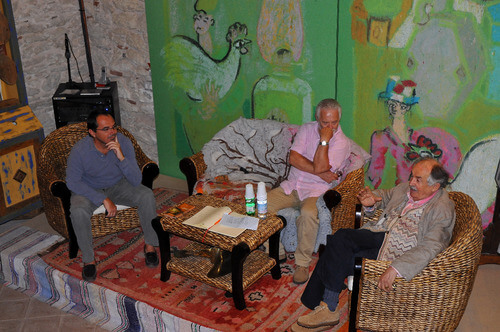

> Buttate pure via. Ogni opera in versi o in prosa. Nessuno è mai riuscito a dire cos'è, nella sua essenza, una rosa.

Scriveva così, il poeta Giorgio Caproni.

C'è chi, in una rosa, vede una semplice pianta ornamentale e chi, al contrario, vede una raffinata amante da proteggere. Come il maestro giardiniere Carlo Pagani, esperto in vivaismo ornamentale e in architettura del paesaggio.

La passione di Carlo per i giardini è nata all'età di 6 anni, osservando la madre, appassionata di piante, lavorare in giardino.
È lei ad avergli affidato un piccolo appezzamento di terra in cui seminare liberamente e dare libero sfogo alla fantasia.
Carlo l'ha emulata, realizzando in poco tempo un orto incredibile che non aveva nulla da invidiare a quello dei genitori.

Trascorsi alcuni anni, Carlo ha deciso di iscriversi alla scuola agraria, sempre guidato da una passione sfrenata per le piante.
Terminati gli studi, ha lavorato tre anni come dipendente in un'azienda. È divenuto prima apprendista giardiniere e poi capo ufficio tecnico della progettazione di giardini.

Nel 1969, la svolta: la decisione di mettersi in proprio per fondare [Flora 2000](http://flora2000.it) e dedicarsi al vivaismo ornamentale. Un vivaismo di qualità.

Si tratta di un garden shop con idee e soluzioni per l'esterno e per la casa. Al suo interno ospita un vivaio con collezioni botaniche di rose antiche, inglesi e francesi, peonie, clematidi, lillà, ortensie, erbacee perenni, graminacee e frutti dimenticati.
Nel concept store si tengono attività didattiche, prima fra tutte l'alta scuola di giardinaggio, e viene anche offerto un servizio di consulenza fitosanitaria.

Ma torniamo a Carlo. Nella sua vita ha intrapreso esperienze lavorative di altissimo livello che lo hanno portato a viaggiare in Italia e all'estero, specie in Africa. Lì ha avuto la possibilità di realizzare giardini per sultani, re e diversi presidenti della repubblica.

Nel 2000 l'azienda è passata in mano ai figli e Carlo ha deciso di dedicarsi all'attività divulgativa. Articoli su riviste, libri, programmi televisivi, rubriche.

E poi c'è stata la grande amicizia con Tonino Guerra. Dopo l'incontro col poeta, Carlo ha radicalmente cambiato il suo modo di fare vivaismo ornamentale.
Era il momento di realizzare spazi in cui fosse la natura stessa ad essere un giardino, recintata e corretta nei suoi pochi difetti.

Il mio incontro con Carlo Pagani è avvenuto poco tempo fa a Flora 2000, ed è stato veramente molto piacevole. Carlo Pagani è una persona gioiosa, piena di vita, e i suoi occhi emanano un entusiasmo contagioso.

Merito di sua moglie, dice, che lo ha sempre sostenuto dandogli la possibilità di realizzare i suoi sogni in totale libertà.
Quando si dice _vero amore_.

Carlo mi ha raccontato un sacco di aneddoti, come ad esempio quello riguardante Giuseppe Verdi.
Forse non tutti sanno che non è stato solo un grandissimo compositore, ma anche un fervente agricoltore deciso a investire molti dei suoi beni in terra agricola. Amante anche del vivaismo ornamentale e del giardinaggio, in ogni luogo in cui ha suonato ha fatto scorta di piante. Le ha scelte personalmente.

E poi gli incontri con Fellini, Antonioni, la Loren e il pittore Antonio Saliola.

Carlo e le sue incredibili collezioni di rose antiche.

Carlo e il suo giardino segreto. Il maestro giardiniere, infatti, possiede una fetta di paradiso terrestre.
Si tratta di 5 ettari di bosco, acquistati nel 1906 dal nonno e ceduti, 30 anni dopo, a un naturalista schivo e riservato che aveva deciso di viverci in totale solitudine.
In questi anni, Carlo è riuscito a riappropriarsi di questo incanto. Un luogo che lo aveva visto giocare da bambino e che aveva offerto riparo a molte persone durante la Grande Guerra.

Alla morte del naturalista schivo, Carlo ha messo mano al giardino, portando alla luce tanti piccoli "tesori": monetine, forcali, badili, vanghe che il precedente proprietario aveva seppellito nel terreno, convinto che il ferro al loro interno sarebbe tornato utile alle piante.

Sulla strada di ritorno verso casa, mi è tornata in mente una citazione di Yann Martel:

> La natura può allestire spettacoli straordinari. Il palcoscenico è immenso, le luci strabilianti, le comparse infinite. E il budget per gli effetti speciali, illimitato.

Carlo Pagani e i suoi giardini: quando creatività umana e natura formano un connubio perfetto.

