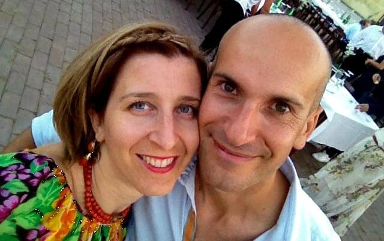

_Presa di coscienza_.

Osservo gli infissi di casa mia, tutt'altro che casa passiva. Chissà quanti spifferi ci sono.
Guardo i miei doppi vetri, e mi domando: isoleranno abbastanza?
E i termosifoni? Ne vogliamo parlare? Vogliamo affrontare anche questo discorso?
Per non parlare dell'acqua potabile dello sciacquone in bagno.
C'è poco da fare: casa mia non è abbastanza passiva. Urge un cambiamento!

_Improvvisamente, l'illuminazione divina_.

Non amo molto andare a caccia di regali natalizi, ma per le amiche del cuore sono disposta a fare un'eccezione.
Durante le ultime feste di Natale ho accompagnato Giorgia in uno dei suoi giretti. Chiacchierando, mi ha raccontato di una sua amica e della sua scelta di vivere in una casa passiva.

Subito le ho chiesto l'indirizzo e-mail di questa sua amica, Anna Baruffaldi, e di suo marito Alberto Berardi. Sono loro i due intervistati di questa settimana.

Anna e Alberto sono entusiasti della loro casa passiva: 380 mq di prestazioni tecniche super performanti.
Quella che segue è la chiacchierata che ho avuto con Anna un po' di tempo fa.

### Ciao, Anna. Abitate in campagna?

> Ciao! Abitiamo a San Mauro Pascoli, tra Rimini e Cesena, il paese natale di Giovanni Pascoli. La nostra proprietà è nella primissima campagna, non troppo distante del centro abitato.

### Quali sono le caratteristiche della vostra casa passiva?

> Si tratta di un'abitazione ecofriendly con [certificazione _Passivhaus_](http://www.zephir.ph). È costruita in **latero-cemento** con **materiali altamente isolanti** e il più possibile **riciclabili**.

### A chi vi siete affidati per rendere la vostra casa a impatto zero?

> Già da diverso tempo sapevamo che all'estero, solo in qualche caso nel nord Italia, si stavano costruendo case con un **bassissimo fabbisogno energetico** e con **alte qualità di vita**.
>
> Quando nel 2006 abbiamo deciso di costruire la nostra nuova casa, abbiamo iniziato a interessarcene. Insieme al fratello di mio marito, che è architetto, abbiamo percorso molte volte l'autostrada del Brennero per raccogliere informazioni. Ma anche per vedere e trattare l'acquisto di una casa prefabbricata.
>
> La nostra ricerca ci ha fatto conoscere i **certificatori italiani delle case passive**. Abbiamo richiesto loro una consulenza specifica per trasformare le nostre idee in realtà. E c'è stata tutta la soddisfazione di farlo insieme a imprese locali, seguendo direttamente la costruzione e i dettagli.
>
> Abbiamo dato il via a questa avventura della casa passiva sotto lo stretto controllo e la supervisione dei certificatori. Sono stati sempre pronti a controllare l'esecuzione e a offrirci soluzioni tecniche per eliminare i ponti termici e tutti i problemi che si presentavano.

### Quale percentuale di risparmio annuale state riscontrando?

> Non sono in grado di dirti quanto risparmiamo rispetto a prima perché la nostra casa passiva è nuova.
>
> Sappiamo per certo che, rispetto a un'abitazione "normale" di simili dimensioni, spendiamo pochissimo. Inoltre, abbiamo un **maggior comfort interno** a cui, ora come ora, faremmo molta fatica a rinunciare.

### Consigli da dare a chi fosse interessato a migliorare le prestazioni tecniche della propria abitazione?

> Per noi è importante la **qualità della vita**. Vivere in una casa dotata di un buon comfort, a impatto energetico limitato, dovrebbe essere possibile per chiunque.
>
> Ciò è ottenibile riqualificando energeticamente i fabbricati esistenti o costruendo in maniera più accurata i nuovi fabbricati. Oggi esistono tante soluzioni a prezzi più vantaggiosi.
>
> Le competenze tecniche sono più alte ed è molto più semplice migliorare le prestazioni energetiche delle case.

Se volete contattare Anna e Alberto per ricevere tutte le specifiche tecniche riguardanti la loro abitazione green, ecco il sito di riferimento: [casa passiva alberto berardi - costruzione di casa passiva](https://casapassiva.wordpress.com).
