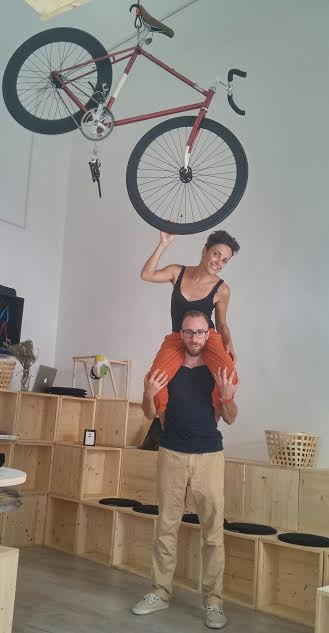
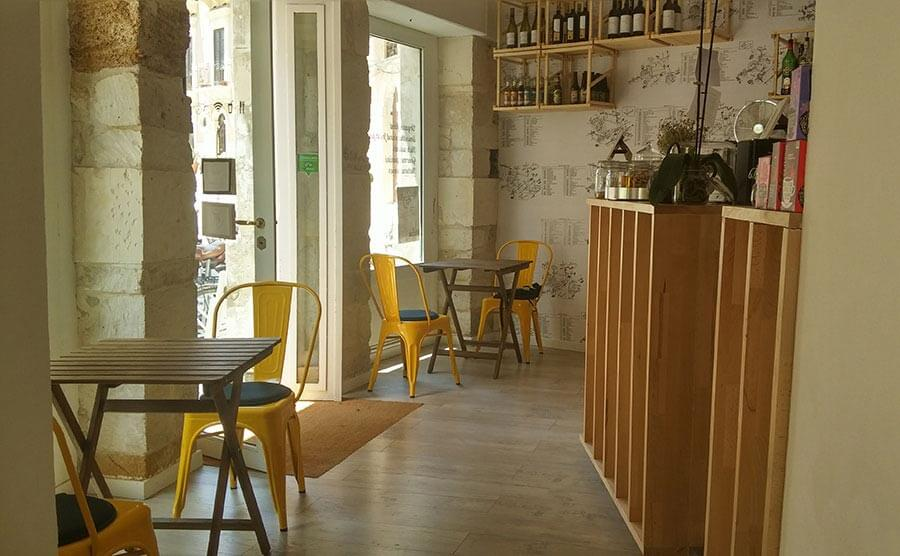
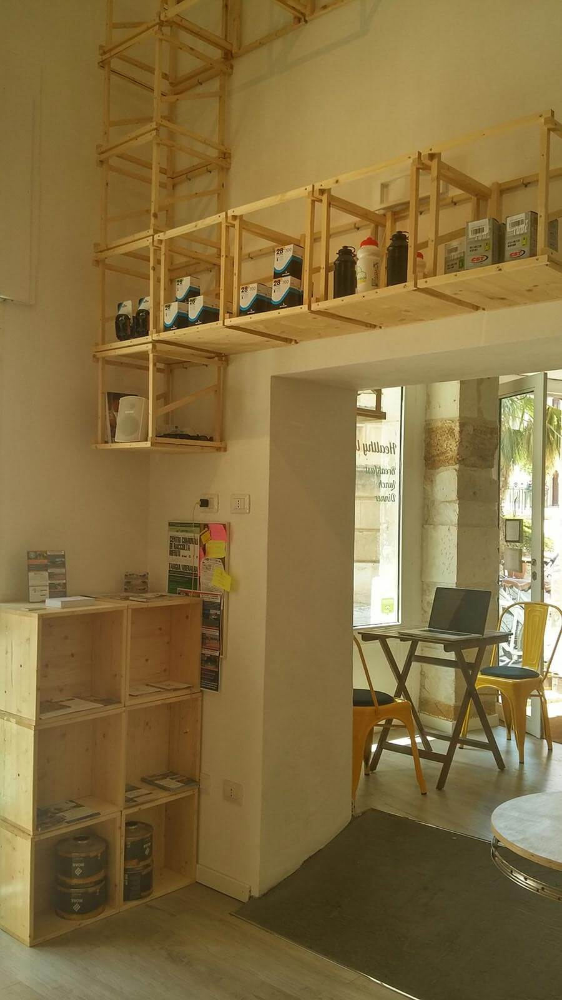
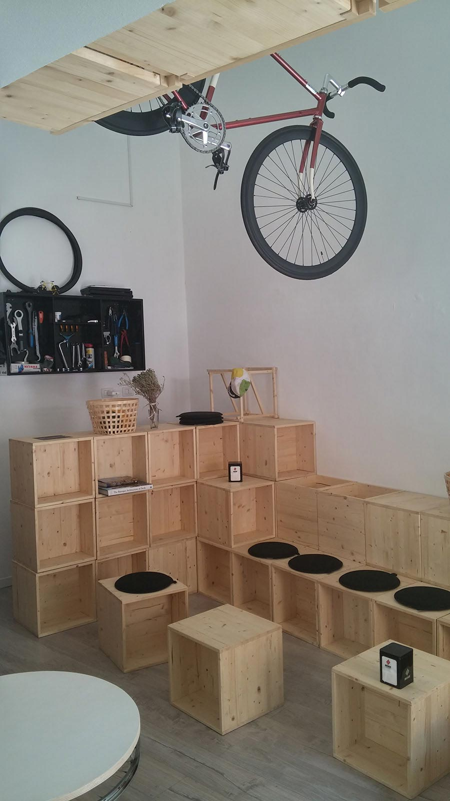
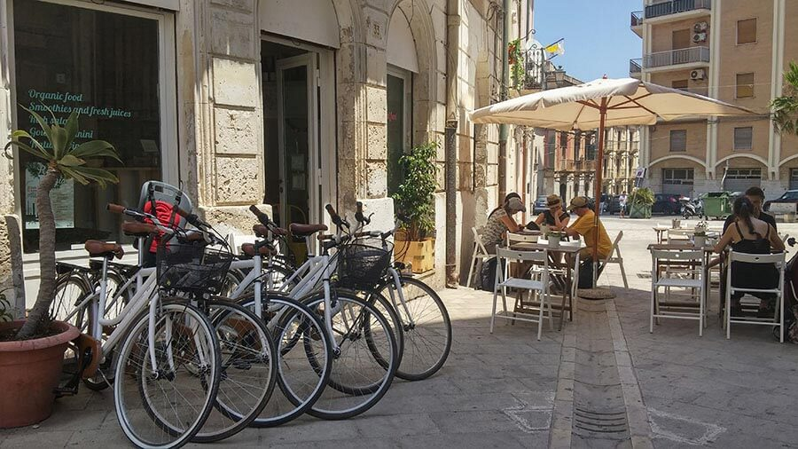
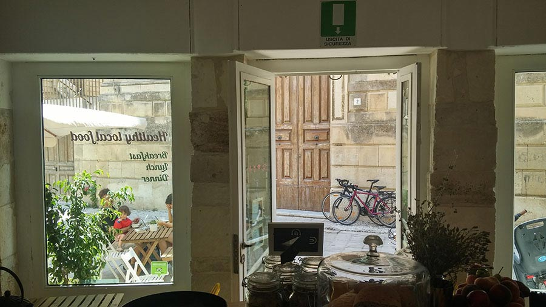

Non aver mai visitato il Sud Italia credo sia una mancanza gravissima, e darsi al cicloturismo in Sicilia potrebbe essere un ottimo modo per conoscere a fondo questa terra incredibile.

Alcuni anni fa ho perlustrato da cima a fondo la porzione sud-orientale, visitando Pozzallo, Ispica, Marzamemi, Noto, Modica, Vendicari, Caltagirone e Siracusa. È stato subito amore. Ma un amore di quelli potenti.
I panorami siciliani levano il fiato. I profumi, i colori incredibili, i centri storici delle cittadine e dei piccoli paesi conservano il sapore e l'aspetto di un'altra epoca.

Altri aspetti da non sottovalutare: arancini da urlo, granite pazzesche, pasticcerie con dolci da lacrima.

Della Sicilia colpisce anche l'ospitalità delle persone. Una sera sono stata a cena in un ristorante di Marzamemi. Dopo aver ordinato alla carta, il cameriere mi ha portato un polpo gigante che non avevo richiesto.

"_Cameriere, credo ci sia un errore, io non l'ho ordinato_", gli ho detto. E lui, sorridente: "_Lo so, è offerto dalla casa!_". Hai capito, la Sicilia?

Ma torniamo a noi e all'argomento di questa settimana.
Amanti della bici di tutta Italia, cercate un itinerario per le vostre prossime vacanze?
Semmai il vostro viaggio dovesse condurvi in Sicilia, spingetevi fino a Siracusa e portate i miei saluti a **Chiara Pota**, milanese, e ad **Alfonso Peralta**, siracusano.

Sono due ragazzi che, spinti entrambi dall'amore per la bici, hanno deciso di aprire un bike café nel centro storico di questa bellissima città per incentivare il cicloturismo in Sicilia.
L'hub si chiama [Movimento Centrale](http://www.movimentocentrale.net).

### Ciao, ragazzi! Ditemi un po': quando nasce Movimento Centrale e il vostro interesse per il cicloturismo in Sicilia?

> Ciao, Anna! Abbiamo inaugurato Movimento Centrale lo scorso aprile, qui a Siracusa. Avevamo bisogno di cambiare lavoro, stile di vita e luoghi. Desideravamo un po' di tempo libero e perseguire i nostri interessi.
>
> L'intenzione iniziale era di trasferirci a Siracusa, città natale di Alfonso, per aprire un piccolo B&B orientato al cicloturismo in Sicilia, una sorta di ostello.
>
> Dopo aver fatto un po' di conti, abbiamo progettato l'apertura di questo café. Abbiamo instaurato partnership relative ai servizi che noi non offriamo, quali, ad esempio, l'alloggio, l'affitto di grandi quantità di bici, l'organizzazione di tour e l'accompagnamento.
>
> Dall'idea iniziale alla realizzazione vera e propria dell'hub è trascorso un anno, siamo stati abbastanza veloci.

### Tu, Chiara, di cosa ti occupavi prima di intraprendere questa avventura? E Alfonso?

> Io lavoravo in uno studio legale internazionale nell'ambito della comunicazione e del marketing. Alfonso lavorava per [L'Espresso](http://espresso.repubblica.it) come web trafficker.
>

### Cos'è Movimento Centrale? Quali servizi offre?

> Movimento Centrale è una **caffetteria-tavola fredda con ciclofficina annessa**. Ciò che facciamo, fondamentalmente, è **promuovere la bici e il cicloturismo in Sicilia**.
>
> La nostra ristorazione è coerente coi principi del progetto. Sono **cibi a km zero**, biologici e sempre freschi. Vogliamo **promuovere le colture tipiche locali** e privilegiare tanto le piccole realtà a conduzione familiare quanto le tipicità del territorio.
>
> Abbiamo deciso di mettere a disposizione di tutti, gratuitamente, l'officina. Chiunque abbia bisogno di una riparazione può servirsene. Abbiamo pezzi di ricambio per il primissimo soccorso e piccoli accessori per personalizzare la propria bici.
>
> In questi giorni stiamo mettendo a punto una mappa della Sicilia sud-orientale che mostrerà alcuni percorsi ciclabili, tutti mappati con QR Code e scaricabili in formato GPX (GPS Exchange Format) così da poter essere visualizzati sul navigatore. Vogliamo che il cicloturismo in Sicilia sia facilitato e consentito a tutti.
>
> Offriamo il 10% di sconto a tutti coloro che arrivano alla caffetteria in sella alla bici. Noleggiamo biciclette e organizziamo tour cicloturistici mettendo a punto percorsi _ad hoc_.
>
> Movimento Centrale è un progetto che sta prendendo vita un po' alla volta. Desideriamo avvicinare coloro che hanno deciso di visitare la Sicilia cercando un **contatto diretto con le persone**.

### Avete ricevuto finanziamenti o altri aiuti di tipo economico?

> Abbiamo ricevuto un finanziamento a tasso agevolato da [Banca Etica](http://www.bancaetica.it) e dal [Fondo Sociale Europeo](http://ec.europa.eu/esf/home.jsp?langId=it).

### Al di là del cibo che proponete, in che modo il vostro bike cafè può dirsi sostenibile?

> I nostri arredi sono interamente in legno e sono il frutto di una sana autocostruzione. I tavolini sono stati ottenuti dal riciclo di vecchi cerchioni di biciclette. Per l'illuminazione abbiamo scelto i LED, ma per il riscaldamento non abbiamo ancora deciso come comportarci. Valuteremo diverse soluzioni.

### Organizzate anche incontri culturali?

> Vogliamo organizzare **mostre**, **incontri culturali** con cicloturisti e viaggiatori.
>
> Poco tempo fa abbiamo intervistato un ragazzo brasiliano che sta attraversando le coste di tutto il mondo. Lo fa per contribuire a sensibilizzare le persone sul tema dei rifiuti negli oceani. Lo abbiamo invitato a raccontare la sua esperienza.
>
> Da ottobre vogliamo stringere rapporti più stretti con il cicloturismo in Sicilia, invitando persone e realizzando incontri.
>
> Lo spazio riservato alla ciclofficina è stato studiato per organizzare presentazioni, installazioni e mostre. Le sedute sono costituite da cubi modulari che consentono di creare ambienti diversi sulla base delle esigenze.

### Come siete stati accolti da Siracusa?

> Le persone ci stanno ancora conoscendo. L'approccio è complessivamente positivo, c'è molta curiosità. Vogliamo agganciarci al cicloturismo su mountain bike per esplorare il territorio.

