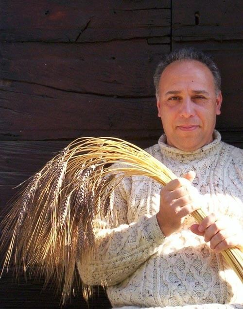
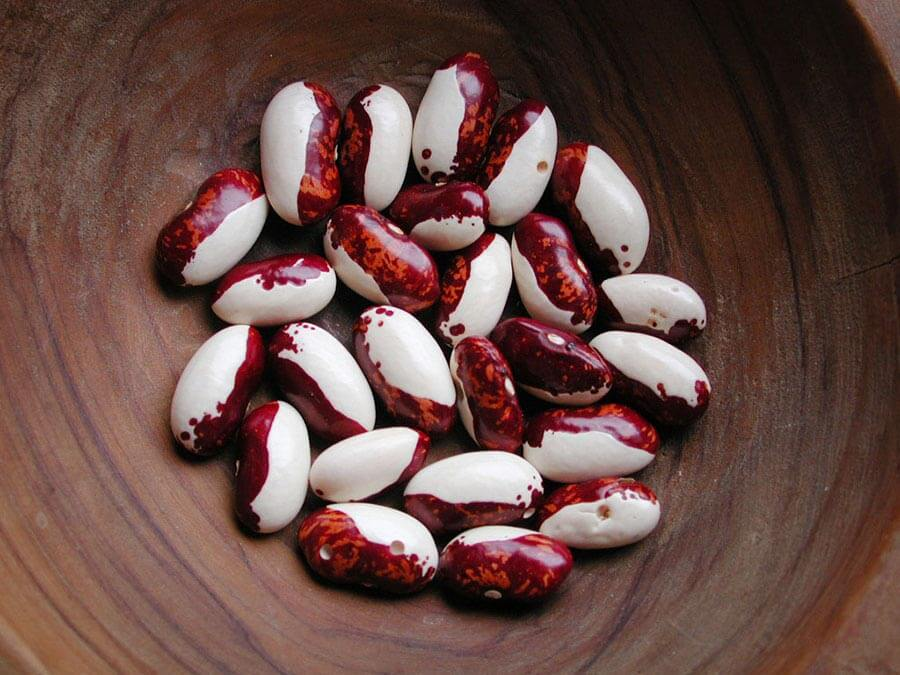

L'infanzia contadina di mia madre è qualcosa che mi ha sempre affascinato moltissimo.

Dopo aver ascoltato i suoi racconti, si ha come la sensazione che siano trascorsi secoli e secoli di storia... e invece si parla di una cinquantina di anni fa (che, voglio dire, non è preistoria...).

Era l'epoca in cui la parola "spreco" faticava a comparire sul dizionario italiano, in cui i saponi si producevano in casa e in cui il periodo della vendemmia rappresentava una vera e propria festa di paese.

I bambini non vivevano rinchiusi fra le mura domestiche, bensì all'aperto. La sera, d'estate, ci si riuniva nei cortili delle case per raccontare storie e vicende legate al presente o al passato; d'inverno, invece, si godeva insieme del tepore del camino.

E non crediate che due innamorati, così, di punto in bianco, potessero uscire insieme: molto spesso erano costretti ad incontrarsi sotto il vigile sguardo di qualche parente, magari una mamma o una nonna (per la serie: "*L'intimità di coppia è importante*").

In tutti i casi, è ascoltando le parole di mia madre che rivivo quel periodo con un po' di nostalgia.

Quando ripenso alla sua semplice ma allegra infanzia, mi torna sempre alla mente *Amarcord* di Fellini, pellicola che amo a dismisura ed in cui la Gradisca, Titta, la signora Miranda, Aurelio, Teo detto "Il pataca" (ovvero lo zio di Titta), la Volpina e Aldina sono solo alcuni dei personaggi del film che sembrano ricalcare alla perfezione il mondo contadino in cui mia madre è cresciuta.

Ma lasciamo da parte il cinema ed i racconti di un'epoca che fu per parlare dell'argomento di questa settimana e, nello specifico, di un'associazione che difende la biodiversità del mondo contadino di una volta: [Civiltà Contadina](http://www.civiltacontadina.it).

Civiltà Contadina è un'associazione Onlus nata nel 1996 da Rosa Maria Bertino, Achille Mingozzi e Gino Girolomoni, promotori dell'agricoltura biologica e impegnati in diversi progetti finalizzati alla salvaguardia delle campagne italiane.

Con l'entrata di Alberto Olivucci, l'intervistato di questa settimana, arriva il coordinamento dei primi *seed savers* italiani.

Nel 2002, Olivucci diventa Presidente dell'associazione e, nel 2009, nascono i primi gruppi locali costituiti da soci operanti nelle diverse attività.

Leggiamo cosa ci racconta di interessante Alberto Olivucci...

### Salve, Dott. Olivucci. Quando è nata la tutela verso questo tipo di biodiversità?

> "Nei primi anni '70, soprattutto negli Usa e in Australia, nacquero i primi movimenti che intendevano contrastare le leggi di limitazione della biodiversità commercializzata dei semi.
>
> Il movimento [Seed Savers Exchange](http://www.seedsavers.org) fu pionieristico e voleva conservare le varietà agricole importate dall'Europa dai coloni.
> 
> All'epoca, tanto negli Usa quanto in Europa, i registri delle sementi ammesse alla vendita crearono i presupposti per la scomparsa di centinaia di varietà dal mercato.
> 
> Coloro che si accorsero di questo fenomeno cercarono di evitare la scomparsa delle vecchie varietà "rastrellandole" dal mercato o facendo riferimento a chi ne era ancora in possesso".

### Quando nasce in Italia?

> "I primi appelli, in Italia, iniziarono nel 1999, ed il primo coordinamento di Seed Savers italiani risale al 2000.
> 
> Il nostro Paese vanta un tessuto composto di agricoltori, di anziani e di amanti delle tradizioni che, alle volte inconsapevolmente, conserva la biodiversità italiana collegata alla cultura del territorio in cui si vive.
>
> Un esempio può essere rappresentato da un particolare ortaggio che è strettamente connesso alla ricetta tipica di una regione.
> 
> L'Italia ha storia e tradizioni molto antiche e ben radicate ed è un Paese in cui la cultura contadina è ancora molto forte: perdere alcune varietà di ortaggi e di frutta significherebbe perdere la nostra identità culturale alimentare".

### Mi spieghi meglio: qual è il vostro obiettivo? Che cosa cerca di ottenere la vostra associazione?

> "Impedire la totale scomparsa della biodiversità coltivata appartenente al passato che, di fatto, appartiene anche al futuro. Noi cerchiamo di conservare la maggior varietà di piante da frutto, di ortaggi e anche di razze animali.
> 
> Grazie alle antiche varietà si produce bene, in maggior quantità e senza usare erbicidi o concimi chimici".

### Siete gli unici in Italia a difendere la biodiversità contadina?

> "No, non siamo gli unici, oltre a noi ci sono tanti piccoli gruppi molto attivi e localmente ben strutturati che hanno interesse su varietà locali. Per citarne alcuni: l'[Adipa](http://www.adipa.it) di Lucca, il [Consorzio della Quarantina](http://www.quarantina.it) di Genova, la [Banca dei Semi salentina](https://www.facebook.com/pages/Banca-dei-semi-salentina/622066717854910) ed i coltivatori custodi toscani, organizzati e sostenuti dalla [Regione Toscana](http://www.regione.toscana.it)".

### Quali minacce arrivano dalla civiltà industriale?

> "La chimica legata all'agricoltura rappresenta la maggior minaccia".

### Cosa conservate, nello specifico?

> "Ci occupiamo principalmente di ortaggi e di cereali, ma anche di antiche razze autoctone animali. Diversi gruppi di agricoltori, inoltre, si stanno impegnando nella conservazione e nella rivalutazione delle antiche razze di animali contadini. L'Italia è la sola in Europa a vantare ben 20 razze autoctone bovine!".

### Una curiosità: dove reperite i semi e i frutti antichi?

> "Dipende, le fonti sono innumerevoli: i nostri semi e frutti provengono da ricerche sul territorio, da privati, da scambi organizzati (sia da noi che da altri) e anche da fonti commerciali.
In Italia sopravvivono ancora piccole realtà che riescono a mantenere in vita alcune varietà altrimenti introvabili".

### Come conservate i vostri piccoli tesori genetici?

> "Ci sono diversi modi. La cosa migliore è raccoglierli, pulirli bene, conoscere i trucchi per evitare l'insorgere di parassiti e conservarli al fresco in sistemi refrigerati (come il comune frigo o il freezer) per riuscire a conservarli a medio-lungo termine o a lungo termine, aspetto che varia sulla base del tipo di seme (il seme di pomodoro, ad esempio, riesce a conservarsi vitale per quasi 10 anni, mentre quello di fagiolo sopravvive per 6-7 anni).
>
> Noi ci serviamo di sistemi pratici, economici e funzionali".

### All'interno di "Civiltà Contadina" siete tutti volontari?

> "Sì, siamo complessivamente 500 soci (di cui un 10% è costantemente attivo) e tutti volontari.
> 
> Non abbiamo mai ricevuto finanziamenti statali, tuttavia, in compenso, abbiamo acquisito lo status di associazione di volontariato Onlus: ciò significa che chiunque può donarci il proprio 5%".

### Collaborate con qualche Università?

> "Ogni tanto interagiamo con ricercatori universitari che si rivolgono a noi per cercare ciò che nelle banche genetiche non riescono a trovare".

### Organizzate anche eventi che consentano di conoscere le vostre attività?

> "Sì, in primavera abbiamo tenuto otto incontri regionali per lo scambio delle sementi, e poi abbiamo organizzato qualche festa della biodiversità. Partecipiamo anche ad eventi organizzati da altri gruppi.
> 
> Organizziamo corsi per far rivivere le abilità manuali della civiltà contadina, insegniamo a creare orti conservativi che preservino la biodiversità dei semi antichi e offriamo la possibilità di visitare le aziende dei soci più attivi".

### Che cosa avete in mente per i prossimi mesi?

> "Tutto dipenderà dalle forze che avremo a disposizione. Vorremmo organizzarci meglio nei gruppi locali.
> 
> Abbiamo acquistato una mini-trebbia che ci aiuti a gestire la nostra collezione di cereali, così come la macchina selezionatrice di semi (per via della quantità di semi che abbiamo).
> 
> Inoltre, stiamo cercando di attivare una campagna della frutta antica, "Adotta un frutto", che consenta di piantare alberi da frutta storici su suoli pubblici. Ma è ancora un *work in progress*".
