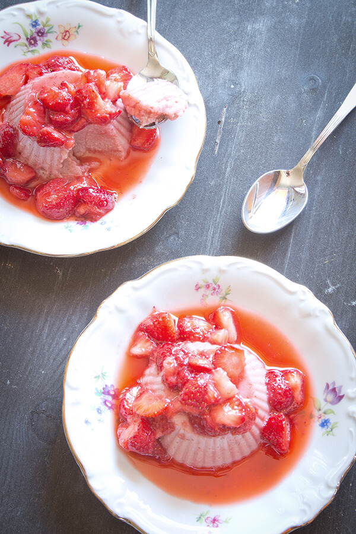

Qualche tempo fa, al telefono con l'esperto di cucina vegetale [Manuel Marcuccio](http://www.unocookbook.com), parlavo del più e del meno: dove andare in vacanza, che caldo abominevole, le cose in programma per il mese successivo.
Che caldo atroce, quello di agosto. Impossibile non ripensare a _Do the Right Thing_ di Spike Lee. La scena dei bambini che giocano con l'idrante e della donna che immerge il viso nel lavandino pieno d'acqua.
Agosto e il suo caldo disumano.

E insomma, dicevo che parlavo con Manuel e ascoltavo i suoi programmi per l'autunno: una vacanza in Canada, alcuni lavori da finire e la collaborazione a un libro di ricette di prossima pubblicazione. Il libro di una ragazza dolcissima, appassionata di cucina vegetale.

Carla Leni è l'autrice del blog [La Cucina della Capra](https://lacucinadellacapra.wordpress.com). Insieme a [EIFIS Editore](http://www.eifis.it/e-store/public/) sta per pubblicare il suo primo libro di ricette.

### Ciao Carla, benvenuta a bordo di MyHumus! Cominciamo dall'inizio: perché hai scelto di promuovere una cucina vegetale?

> Ciao, Anna! Innanzitutto grazie per questa intervista, mi fa molto piacere avere un posticino all'interno del tuo progetto.
>
> La mia avventura nella cucina vegetale è iniziata poco prima che smettessi di mangiare derivati animali. Il merito è del mio primo gatto, Camillo, sempre a caccia di topi e lucertole. Abitare con lui mi ha aperto gli occhi sul fatto che fino ad allora, come la maggior parte delle persone, avevo ignorato i diritti e i bisogni degli animali.
>
> Durante una vacanza in Germania ho avuto una brutta esperienza culinaria, così **sono prima diventata vegetariana**. Con il tempo, documentandomi e studiando, ho compreso che anche dietro l'utilizzo dei derivati animali c'era moltissima sofferenza. **Pian piano ho deciso di essere vegana** e di non utilizzarli più.

### Quale educazione alimentare hai ricevuto dalla tua famiglia?

> La mia è una famiglia romagnola: lasagne, ragù e grigliate non sono mai mancate. Altro che cucina vegetale!
>
> A casa si mangiava seguendo la tradizione locale, cosa che io non disdegnavo affatto. Il prosciutto non era nemmeno considerato carne.
>
> Sono stata io la prima ad allontanarsi da questo modello. E devo dire che sono fortunata perché i miei genitori e mia sorella rispettano molto questa mia scelta. Fanno di tutto per mettermi a mio agio quando siamo assieme.

### Quando e perché è nato La Cucina della Capra? E cosa c'entrano le capre?

> Il mio blog è nato nel 2011, mentre stavo diventando vegana. È stato un incentivo per sperimentare cose nuove e mi ha permesso di conoscere tante persone da cui ho imparato moltissimo. Ero alle prime armi, avevo ancora tanto da apprendere.
>
> Il personaggio della capra è nato per sfatare la leggenda che la cucina vegan consenta di mangiare solo erba. Come le capre, appunto.
>
> Ho giocato sul fatto che anche le capre hanno tantissima scelta, utilizzando l'ironia. Una forma comunicativa molto efficace.

### Cosa promuove La Cucina della Capra? A chi si rivolge?

> Credo che l'unico modo davvero efficace per cambiare qualcosa sia **partire da sé stessi, dalla propria esperienza**.
>
> Condividere il mio percorso attraverso i miei racconti e le mie ricette è stato d'ispirazione e d'aiuto per alcuni. Esattamente come io sono stata ispirata da chi ha compiuto questa scelta prima di me.
>
> I miei lettori sono in parte vegan, ma molti altri stanno pensando di diventarlo o sono semplicemente curiosi di saperne di più sulla cucina vegetale.
>
> Voglio dimostrare che avere uno stile di vita più etico non è impossibile, e che non è affatto triste! Si tratta solo di apportare piccoli cambiamenti e di cambiare ottica.

### Le tue ricette sono una rivisitazione della tradizione culinaria italiana?

> La tradizione italiana è di per sé ricchissima di piatti della cucina vegetale, e ciò è una grandissima risorsa.
>
> Le ricette che prevedono ingredienti di origine animale, a volte, sono facilmente adattabili attraverso semplici sostituzioni.
>
> Mi piace molto preparare questi **piatti ricchi di storia**, ma adoro anche testare **ingredienti nuovi**. Mi piace inventare piatti di cucina vegetale originali, oppure spaziare verso cucine di altre nazioni.

### Cosa ti attende nei prossimi mesi? Di cosa parlerà il tuo libro?

> Nell'ultimo anno ho avuto la fortuna di collaborare con [EIFIS Editore](http://www.eifis.it/e-store/public/) e con [Manuel](http://www.unocookbook.com). Grazie a loro, sotto l'albero di Natale troverete il mio libro!
>
> All'interno ci saranno 100 ricette di cucina vegetale che spazieranno dalle colazioni alle bevande, dalle salse alle classiche portate.
>
> Ho voluto creare ricette molto semplici da realizzare e con ingredienti facilmente reperibili.
>
> **Non bisogna essere chef o avere tantissimo tempo a disposizione per cucinare in modo sano ed etico**. Cereali e legumi fanno parte della storia del nostro Paese, possiamo trovarli in qualsiasi supermercato. Non servono molti altri ingredienti per creare piatti saporiti di cucina vegetale!
>
> Spero che le mie ricette possano offrire qualche idea a chi già cucina così. Ma anche, e soprattutto, a coloro che si avvicinano per la prima volta a questo stile di vita.

