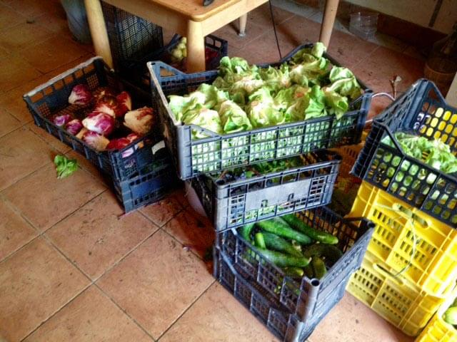
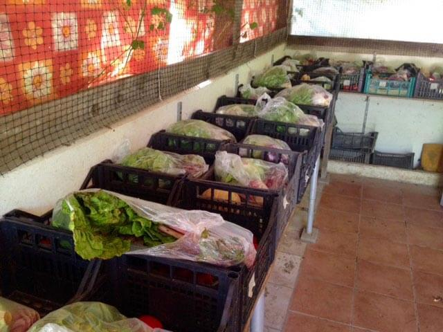
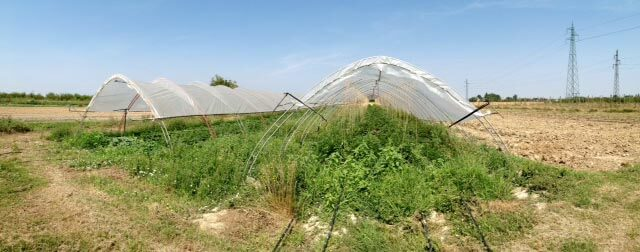
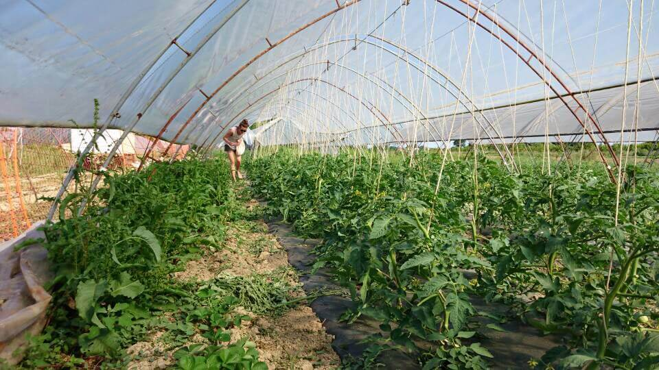
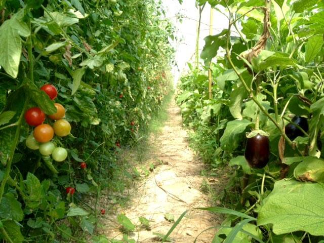
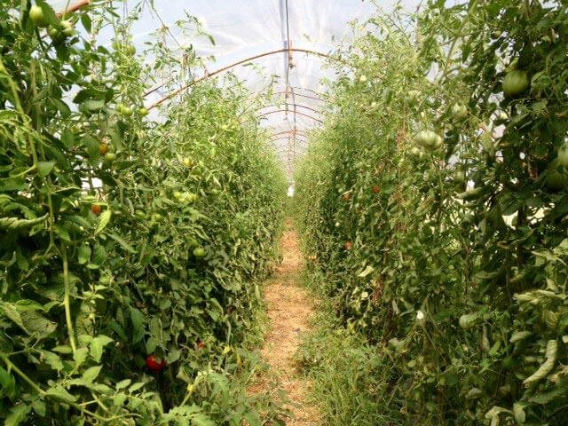
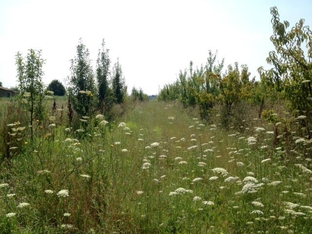
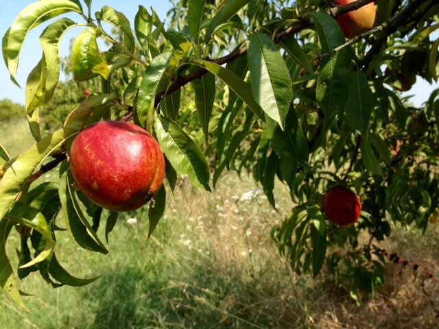
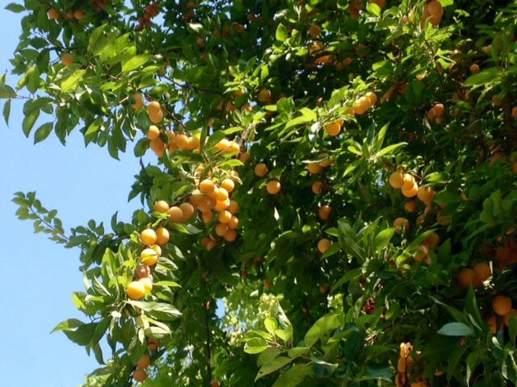

C'è una realtà che coltiva e vende verdure biologiche a Ravenna, e che s'ispira ai principi di decrescita felice.
Ma facciamo un piccolo passo indietro e chiariamo due cose su questo tipo di decrescita.

Kenneth Boulding affermava: "_Chi crede che una crescita esponenziale possa continuare all'infinito in un mondo finito è un folle, oppure un economista_". Cosa ne pensate?

Crescita economica e benessere delle persone non vanno necessariamente di pari passo?
Un aumento del PIL corrisponde spesso una diminuzione della qualità di vita?

Se avete risposto "Sì" a entrambe le domande, allora siete in sintonia con un movimento nato in Italia diversi anni fa, il [Movimento per la Decrescita Felice](http://decrescitafelice.it) (MDF).
Il fondatore è Maurizio Pallante, esperto di politica energetica e di tecnologie ambientali, impegnato nello studio delle relazioni fra ecologia, tecnologia ed economia.

Questo tipo di decrescita non è da intendersi quale una cieca rinuncia a qualsiasi cosa.
È un rifiuto di tutto ciò che può essere considerato superfluo, privilegiando il soddisfacimento dei bisogni veri ed effettivi per evitare gli sprechi.
Il movimento incoraggia l'autoproduzione quando questa implichi un miglioramento della qualità di vita. Ma anche una diminuzione dei livelli di inquinamento, del consumo di risorse, della quantità di rifiuti prodotti e dei relativi costi.

La decrescita felice è il credo di Christian Grassi.
[Mater Naturae](https://www.facebook.com/mater.naturae?fref=ts), l'azienda certificata [ICEA](http://www.icea.info/it/) che gestisce insieme ad Antonella Orselli, è in via Fiume Montone Abbandonato 481 a Borgo Montone, poco distante da Ravenna.
Ogni settimana consegna frutta e verdure biologiche a Ravenna a più di 200 famiglie.
Il lavoro di Christian e di Antonella non promuove solo l'agricoltura biologica e le colture locali. Sostiene anche i rapporti diretti con le persone attraverso la consegna o il ritiro in azienda dei prodotti.
Mater Naturae vende ai mercati contadini locali e collabora coi GAS (Gruppi di Acquisto Solidale).

### Ciao, Christian! Da quanto sei agricoltore?

> Ciao, Anna. Sono un **contadino dal 2008**. Prima sono stato un tecnico, un controllore delle produzioni biologiche e uno sperimentatore occupandomi sempre e solo di agricoltura biologica e di agroecologia.

### Quella di produrre frutta e verdure biologiche a Ravenna è stata una tua idea?

> Ho scelto di occuparmi di agricoltura biologica in terza media, quando ho deciso a quale istituto superiore iscrivermi.

### Cosa ami del tuo lavoro?

> Ogni giorno è diverso. La capacità di risolvere un problema, o di affrontare un imprevisto legato ai fenomeni naturali, è sempre messa alla prova.

### Perché farsi promotore dell'agricoltura biologica?

> Credo che il biologico possa **produrre cibo senza rapinare il pianeta**, **senza danneggiare il prossimo**, me stesso e la mia famiglia.
>
> Credo anche che il biologico si sposi bene coi principi delle teorie economiche di decrescita felice. Teorie alle quali, quotidianamente, cerco di ispirare il mio modo di vivere.

### Che cosa coltivate e quali servizi offri?

> Coltiviamo fino a **60 diverse specie di ortaggi e di frutta** che vendiamo prevalentemente con il metodo della consegna a domicilio. In parte vendiamo anche tramite mercatini e forniture a negozi e ristoranti.

### Quali strategie hai deciso di adottare per proteggere le tue colture?

> Un'agricoltura biologica più restrittiva rispetto a quanto previsto dal regolamento CE che disciplina l'agricoltura biologica stessa.

### Hai in serbo qualcosa di interessante per i prossimi mesi?

> Sì. Diciamo che, ora come ora, vogliamo mettere a punto un nuovissimo sistema di controllo delle infestanti, delle malattie delle piante e di concimazione. È un sistema che si basa sull'impiego di pecore e di galline al pascolo. Mi sa che ne vedremo delle belle!

