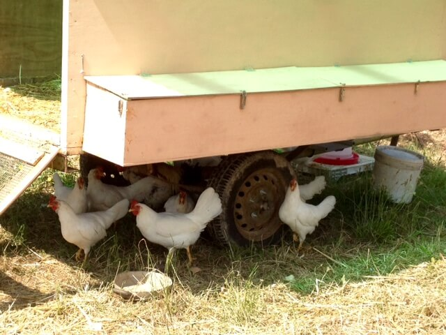

Kenneth Boulding affermava: "*Chi crede che una crescita esponenziale possa continuare all'infinito in un mondo finito è un folle, oppure un economista*". Voi cosa ne pensate?

Se ritenete che la crescita economica ed il benessere delle persone non vadano necessariamente di pari passo, e che ad un incremento del PIL (Prodotto Interno Lordo) corrisponda, sempre più spesso, una diminuzione della qualità di vita, allora siete in perfetta sintonia con un movimento nato in Italia diversi anni fa, il [Movimento per la Decrescita Felice](http://decrescitafelice.it) (MDF), il cui fondatore è il saggista Maurizio Pallante, esperto di politica energetica e di tecnologie ambientali e impegnato nello studio delle relazioni esistenti fra ecologia, tecnologia ed economia.
La decrescita a cui si riferisce il movimento non è da intendersi come una continua e cieca rinuncia a qualsiasi cosa, ma come un rifiuto di tutto ciò che può essere considerato superfluo, privilegiando il soddisfacimento dei bisogni veri ed effettivi per evitare gli sprechi.
Il movimento incoraggia l'autoproduzione quando questa implica un miglioramento della qualità di vita ed una diminuzione dei livelli di inquinamento, del consumo di risorse, della quantità di rifiuti prodotti e dei relativi costi.

Scrive Pallante sul [sito](http://decrescitafelice.it/la-decrescita-felice/): "*La decrescita è elogio dell'ozio, della lentezza e della durata; rispetto del passato; consapevolezza che non c'è progresso senza conservazione; indifferenza alle mode e all'effimero; attingere al sapere della tradizione; non identificare il nuovo col meglio, il vecchio col sorpassato, il progresso con una sequenza di cesure, la conservazione con la chiusura mentale; non chiamare consumatori gli acquirenti, perché lo scopo dell'acquistare non è il consumo ma l'uso; distinguere la qualità dalla quantità; desiderare la gioia e non il divertimento; valorizzare la dimensione spirituale e affettiva; collaborare invece di competere; sostituire il fare finalizzato a fare sempre di più con un fare bene finalizzato alla contemplazione. La decrescita è la possibilità di realizzare un nuovo Rinascimento che liberi le persone dal ruolo di strumenti della crescita economica e ri-collochi l'economia nel suo ruolo di gestione della casa comune a tutte le specie viventi in modo che tutti i suoi inquilini possano viverci al meglio*".
Un discorso su cui riflettere, non credete anche voi?

I principi alla base della decrescita felice rappresentano il credo di Christian Grassi, l'intervistato di questa settimana.
*[Mater Naturae](https://www.facebook.com/mater.naturae?fref=ts)*, l'azienda certificata [ICEA](http://www.icea.info/it/) che gestisce insieme ad Antonella Orselli, si trova in via Fiume Montone Abbandonato 481 a Borgo Montone, poco distante da Ravenna, e consegna settimanalmente frutta e verdura a più di 200 famiglie ravennati.
Il lavoro di Christian e di Antonella non promuove solo l'agricoltura biologica e le colture locali, ma anche i rapporti diretti con le persone attraverso la consegna (a casa o sul luogo di lavoro) oppure il ritiro in azienda dei prodotti, vendendo ai mercati contadini locali e collaborando con i GAS (Gruppi di Acquisto Solidale).

***Ciao Christian! Da quanto tempo sei agricoltore?***

"Sono un contadino dal 2008. Precedentemente sono stato un tecnico, un controllore delle produzioni biologiche ed uno sperimentatore occupandomi sempre e solo di agricoltura biologica e di agroecologia".

***La tua è stata una scelta?***

"Scelsi di occuparmi di agricoltura biologica in terza media, quando si trattò di decidere quale istituto superiore frequentare".

***Cosa ami del tuo lavoro?***

"Ogni giorno è diverso e la capacità di risolvere qualche problema o di affrontare un imprevisto legato ai fenomeni naturali è sempre messa alla prova".

***Perché farsi promotore dell'agricoltura biologica?***

"Credo che il biologico sia un metodo in grado di produrre cibo senza rapinare il pianeta, senza danneggiare il prossimo, me stesso e la mia famiglia. Se lavorassi nella chimica sarei il il primo a respirare porcherie.
Credo che il biologico si sposi bene con i principi delle teorie economiche di decrescita felice alle quali, quotidianamente, cerco di ispirare il mio modo di vivere".

***Che cosa coltivi e quali servizi offri?***

"Coltiviamo fino a 60 diverse specie di ortaggi e di frutta che vendiamo prevalentemente con il metodo della consegna a domicilio e, in parte, tramite mercatini e forniture a negozi e ristoranti".

***Quali strategie hai deciso di adottare per proteggere le tue colture?***

"Un'agricoltura biologica più restrittiva rispetto a quanto previsto dal regolamento CE che disciplina l'agricoltura biologica stessa".

***Hai in serbo qualcosa di interessante per i prossimi mesi?***

"Stiamo cercando di mettere a punto un sistema di controllo delle infestanti, delle malattie delle piante e di concimazione basato sull'impiego di pecore e di galline al pascolo".

> *Se l'articolo ti è piaciuto, leggi anche [Civiltà Contadina](https://myhumus.com/civilta-contadina-biodiversita/), [Adotta una mucca](https://myhumus.com/turismo-adotta-una-mucca/) e [Ravegan](https://myhumus.com/ravegan-vegan/)!*

