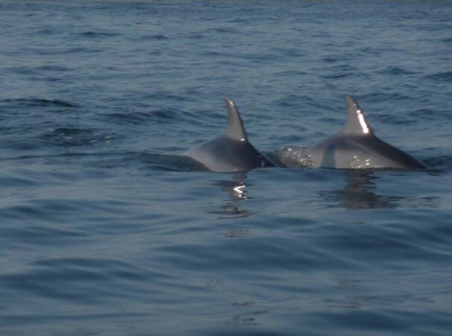
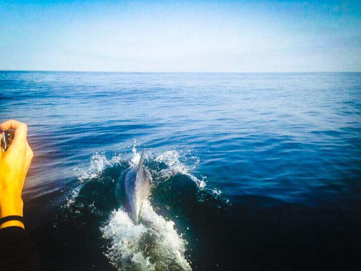

Parlare di tutela dei delfini dell'Alto Adriatico mi riempie il cuore!
Davvero, l'argomento di questa settimana è ad alto tasso glicemico. Sì perché il delfino, in sé, non è solo un mammifero. È l'emblema della dolcezza infinita.

Anche in Adriatico ci sono i delfini, tant'è che in questi anni ho sperato più volte di avvistarne qualcuno.
Fortuna che, a individuarli e a tutelarli, ci sono Rebecca Andreini, Nicola Aurier, Michela Spreafico e Carlo Pezzi. Sono loro i membri del team di [Delfini Bizantini](https://www.facebook.com/pages/Delfini-Bizantini/1427017697619968?fref=ts), una recentissima associazione nata per la tutela dei delfini dell'Alto Adriatico.
Qualche giorno fa ho avuto il piacere di incontrare Rebecca e di conoscere più nel dettaglio questo progetto.

### Ciao, Rebecca! Cosa ti ha spinta ad avvicinarti al mondo naturale?

> Ciao, Anna! Sono nata con una particolare sensibilità ed empatia nei confronti del mondo animale. Da bambina molto timida e introversa, mi sono sempre sentita più mio agio con gli animali che con le persone.
>
> Con il tempo, gli animali sono diventati anche una via per aprirmi e comunicare con la gente. Molto presto ho scoperto che l'amore per loro è un fortissimo mezzo di unione.
>
> Ognuno di noi ama profondamente il proprio cane o il proprio gatto. In questo senso, l'animale diventa anche un tramite per conoscersi, per scoprirsi e per apprezzarsi. Questo indipendentemente dalle distanze mentali tra noi esseri umani.

### Come hai conosciuto gli altri componenti del team?

> _Delfini Bizantini_ è rappresentata da 4 ricercatori, di cui 2 biologi e 2 veterinari.La solida amicizia che mi lega a Carlo e a Michela si è costituita nel tempo grazie alla _forma mentis_ e all'interesse scientifico che ci accomunano.
>
> Tutti abbiamo fatto della nostra passione un duro percorso di studi che si è tramutato in una professione. La capacità di comprendere realmente le rispettive difficoltà, e di condividere i successi, è divenuto un collante sempre più efficace.
>
> Nicola ed io ci siamo conosciuti durante il suo tirocinio formativo in Francia. Nicola stava svolgendo un'interessante ricerca sulla bioacustica dei delfini. È un biologo molto appassionato e competente, motivo per cui ho subito pensato di coinvolgerlo in questo progetto.

### Quando è nato questo progetto di tutela dei delfini?

> Questo **progetto di monitoraggio e di tutela dei delfini dell'Alto Adriatico** è nato grazie al percorso formativo di ciascuno di noi.
>
> Alla base di Delfini Bizantini c'è un duro lavoro di formazione, studio e ricerca. L'idea nasce dall'**assenza di dati significativi** sulla popolazione di delfini dell'Alto Adriatico che insiste in questo tratto di mare. Una condizione, questa, che ci ha stimolati a colmare questa lacuna.
>
> Il progetto è attivo da maggio nella sua fase di ricerca sul campo. Seguiranno tante iniziative aperte al pubblico e consultabili sulla nostra [pagina Fb](https://www.facebook.com/pages/Delfini-Bizantini/1427017697619968?fref=ts).

### Perché la tutela dei delfini dell'Alto Adriatico? Su quali specie vi state concentrando?

> I delfini suscitano una forte empatia, l'attenzione su di essi è sempre maggiore sia da parte del privato cittadino che degli enti pubblici e privati che operano nel settore marittimo.
> L'ottenimento di dati certi sulla presenza frequente di questi animali, in particolare della specie _tursiope_, è un punto di forza per la nostra area costiera. Essa ha ricadute positive sia dal punto di vista economico che sociale, ma anche in termini d'immagine e di educazione e rispetto ambientale.
>
> **I delfini sono a forte rischio di estinzione**. Per fortuna vengono sempre più tutelati dalle normative nazionali, europee e mondiali. Si pensi, ad esempio, alla Convenzione di Washington e ad [ACCOBAMS](http://www.accobams.org), che riunisce i paesi del Mediterraneo pertutelare i cetacei delle nostre acque.
>
> Nonostante questo, gli sforzi e le attività di ricerca nell'Adriatico sono sempre state penalizzate e messe poco in evidenza.
>
> La carenza di dati su questo tratto di mare non consente di avere un quadro chiaro dello stato di salute e dell'abbondanza di delfini nelle nostre acque. Non permette nemmeno una collaborazione proficua con altri enti di ricerca operanti nel settore.
>
> Non dimentichiamo che il delfino rappresenta, dal punto di vista scientifico, una **specie sentinella** in grado di fornire **informazioni importanti sullo stato di salute del mare, sull'inquinamento e sui cambiamenti climatici** che si stanno verificando.

> A questo proposito, il progetto non si limita alla sola ricerca sui delfini. Prende anche in esame gli altri grandi veterbrati marini dell'Adriatico come, ad esempio, le tartarughe, gli squali e alcune specie ittiche.

### Puoi descrivermi gli step di sviluppo di questo progetto per la tutela dei delfini dell'Alto Adriatico?

> Inizialmente c'è una ricerca sul campo. Dalle schede di avvistamento compilate per noi da pescatori, sommozzatori, scuole di nautica e Capitaneria di Porto, ricaviamo informazioni sul luogo, la data e l'ora di avvistamento degli animali.
>
> Avvistati gli animali, l'approccio punta a non disturbare l'attività dei delfini e a non creare loro alcun danno.
>
> Si esegue la fotoidentificazione scattando fotografie delle pinne dorsali. Grazie a un software ci permettono di distingure i singoli soggetti, verificando progressivamente se vengono riavvistati o se compiono migrazioni.
>
> Compiliamo una scheda di segnalamento, raccogliendo i dati clinici degli animali e annotando comportamenti e attività degli stessi. Con un idrofono registriamo le emissioni sonore dei delfini, cercando una corrispondenza con le attività comportamentali osservate.
>
> La seconda fase della nostra tutela dei delfini dell'Alto Adriatico prevederà la messa a punto di una piattaforma informatica. Sarà lì che inseriremo i nostri dati. Si tratterà di uno strumento _open source_ per poter condividere e confrontare liberamente i dati raccolti con altri enti di ricerca.
>
> Delfini Bizantini vuole anche fare divulgazione e informazione scientifica dirette agli appassionati, alle scuole primarie e secondarie. Ma anche attività dimostrative in mare aperto rivolte al pubblico.

### I vostri metodi di studio sono invasivi?

> Assolutamente no. L'approccio ai delfini e le attività di raccolta dei dati sono stati stilati seguendo le regole di ingaggio scientifiche ufficiali del 2011.
>
> Il nostro obiettivo è non arrecare mai alcun disturbo. Se dovessimo accorgerci del contrario, interromperemmo immediatamente l'attività di ricerca.

### Il vostro studio contribuisce anche a fornire dati sulla salute generale dell'ambiente?

> Sì, l'intenzione è di valutare, attraverso il delfino, la salute del mare nel suo insieme.
>
> Verranno considerate le specie ittiche e le loro migrazioni, le tartarughe e gli squali. Questo per ottenere un quadro complessivo e realistico della condizione di salute dell'Alto Adriatico.
>
> Questi dati sono essenziali per sviluppare, in collaborazione con chi opera nel settore marittimo, le attività di tutela e le misure correttive attuabili nel rispetto del nostro mare.

### Collaborate con altre realtà di ricerca? E siete supportati da qualche ente specifico?

> L'associazione collabora attivamente e costantemente col Dipartimento di Scienze Mediche Veterinarie dell'Università di Bologna. Questo organismo coordina e controlla l'operato dell'associzione sul campo.
>
> L'associazione, inoltre, collabora con il [Circolo Velico Ravennate](http://www.cvr.ra.it) e il [Circolo Velico di Punta Marina](http://www.cvpuntamarina.com), che hanno messo a nostra disposizione i mezzi nautici per la ricerca sul campo.
>
> L'[Associazione Paguro](http://www.associazionepaguro.org) e la Ditta Ciappini - Trasporti Marittimi ci hanno accolti sulle loro imbarcazioni, fornendoci informazioni essenziali.
>
> Delfini Bizantini ha ricevuto molte richieste di collaborazione e di creazione reti per lo scambio di dati scientifici. Questo ci rende molto fieri.

### Quale sarà il futuro di Delfini Bizantini?

> Nei prossimi mesi intensificheremo la ricerca sul campo e organizzeremo eventi aperti al pubblico. Vogliamo sensibilizzare l'opinione pubblica sul tema della ricerca, e far conoscere a tutti la realtà del nostro mare.
>
> L'associazione è totalmente autofinanziata. Chiunque voglia contribuire alla tutela dei delfini dell'Alto Adriatico può fare una donazione su [buonacausa.org](http://buonacausa.org/cause/proteggi-i-delfini) a nome _Delfini Bizantini_. E poi, chiaramente, può sempre seguire la nostra pagina Facebook.
