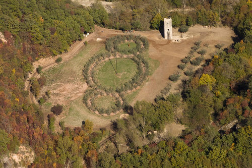

Quale legame esiste fra arte e natura? Non so voi, ma io me lo chiedo spesso.
Penso ad artisti come Antonio Ligabue, folle e selvaggio, oppure ai paesaggi di Monet e di Vincent Van Gogh e alle opere di Frida Kahlo.
Chi è il vero artista? Il pittore o la natura?

Siccome non sono ancora riuscita a dare una risposta sensata a questa domanda, mi sono rivolta a qualcuno che di arte ne sa molto più di me: Diego Galizzi.

Storico dell'arte e museologo, Diego è laureato in Conservazione dei Beni Culturali e, da anni, si occupa di catalogazione, gestione, cura e valorizzazione di collezioni artistiche museali.
Membro dell'[ICOM](http://www.icom-italia.org), ha conseguito una specializzazione in "Management dei Musei e delle Attività Culturali".

Nel 2008 è stato funzionario alla cultura del [Comune di Gubbio](http://www.comune.gubbio.pg.it) e, dal 2009, è conservatore del [Museo Civico delle Cappuccine ](http://www.museocivicobagnacavallo.it) di Bagnacavallo.

### Ciao, Diego. Sei membro del FAI ravennate e curatore museale di Bagnacavallo: cos'è che ami del tuo lavoro?

> Ciao, Anna! Del mio lavoro amo l'idea di contribuire a quella grande visione che il nostro patrimonio culturale rappresenta meglio di ogni altra cosa: l'identità stessa della nostra società.
>
> Per questo è necessario lavorare affinché sia sempre più un fattore di crescita individuale, prima ancora che un fattore di sviluppo economico.
>
> Giocare questa partita, con il lavoro o con l'attività di volontariato, è, a tratti, eccitante, anche se non mancano momenti di scoramento.
>
> Lavorare per una causa meritoria, percependo una sorta di mandato dei cittadini a fare ciò che è possibile, e farlo sempre meglio, per me ha tutto il sapore di una sfida avvincente.

### Parlaci del FAI: di cosa si tratta?

> Partirei da una considerazione: non è solo lo Stato a doversi sentire investito del compito di prendersi cura del nostro patrimonio culturale.
>
> Certo, la Costituzione parla chiaro e chiama la Repubblica al compito irrinunciabile della tutela.
>
> Tuttavia, in un Paese straordinario come il nostro, lo Stato non basta. Anche noi privati cittadini dobbiamo essere guardiani dei beni culturali. E questo anche tramite il libero associazionismo o gli enti no profit.
>
> In questo senso, il [FAI](http://www.fondoambiente.it) ne è un esempio perfetto. È una fondazione nazionale senza scopo di lucro che, dal 1975, promuove una cultura fondata sul rispetto della natura, dell'arte, della storia e delle tradizioni d'Italia.
>
> La caratteristica principale del FAI è il suo forte attivismo nel realizzare tante azioni di valorizzazione del patrimonio artistico italiano.
>
> Il FAI restaura, riapre al pubblico e gestisce monumenti e luoghi di valenza paesaggistica unici del nostro Paese. Parliamo di un patrimonio che gli viene affidato per donazione o in concessione. Il FAI si fa anche portavoce degli interessi e delle istanze della società civile. E lo fa vigilando e intervenendo attivamente sul territorio, in difesa del paesaggio e dei beni culturali.
>
> È un impegno notevole che presuppone la disponibilità di tante risorse. Per questo motivo invito chi può a dare una mano, attraverso piccole donazioni o anche solo aderendo al FAI.

### In che modo arte e natura si compenetrano?

> La prima cosa che mi viene in mente è quello strano meccanismo secondo cui, quando vediamo uno scenario particolarmente spettacolare della natura come, ad esempio, un paesaggio, un tramonto o uno scorcio notturno, spesso utilizziamo l'espressione 'Sembra un dipinto'. Questo è il meccanismo che sta alla base del concetto di _pittoresco_.

> Al contrario, ci sono volte in cui, davanti a un'opera d'arte, crediamo che sembri vera o che la si possa toccare.
>
> Pensate che sia qualcosa di strano? No, non lo è: **arte e natura sono due risvolti della stessa medaglia**, è la nostra visione del mondo.
>
> Da sempre, arte e natura hanno proceduto a braccetto.
>
> La storia dell'arte non è altro che un infinito confronto con la natura. Un confronto dato da una continua ricerca di imitazione e di ammirazione, ma anche di tradimenti e vendette.
>
> Mi piace pensare a quella straordinaria rivoluzione nel mondo dell'arte tra Otto e Novecento, quella inaugurata da Cézanne e compiuta da Picasso, come a una storia di vendetta e di tradimento. Vendetta contro l'imitazione del dato naturale che da qualche decennio aveva tradito la pittura e trovato casa, con più soddisfazione, in un'arte ancora neonata: la fotografia. Ma questa è un'altra storia!

### Arte ed ecologia: binomio vincente?

> Non sempre. Alcune manifestazioni artistiche, nella loro esaltazione dell'Uomo e della sua supremazia sul mondo, hanno lasciato segni non proprio rispettosi dell'ambiente.
>
> Eppure, a mio avviso, **le massime manifestazioni artistiche sono quelle in cui l'idea trasformatrice dell'Uomo si è maggiormente integrata con il paesaggio e il dato naturale**.
>
> Penso ai giardini di Boboli e a molti altri capolavori che, in fondo, non facevano altro che celebrare la bellezza sublime della natura, dal David di Michelangelo alla cesta di frutta di Caravaggio, dalle sculture di Fidia alle opere di Pistoletto.
>
> Oggi non abbiamo alternative: la forza creatrice e trasformatrice dell'Uomo non può non essere all'insegna di un **approccio sempre più ecologico col mondo che ci ospita**.

