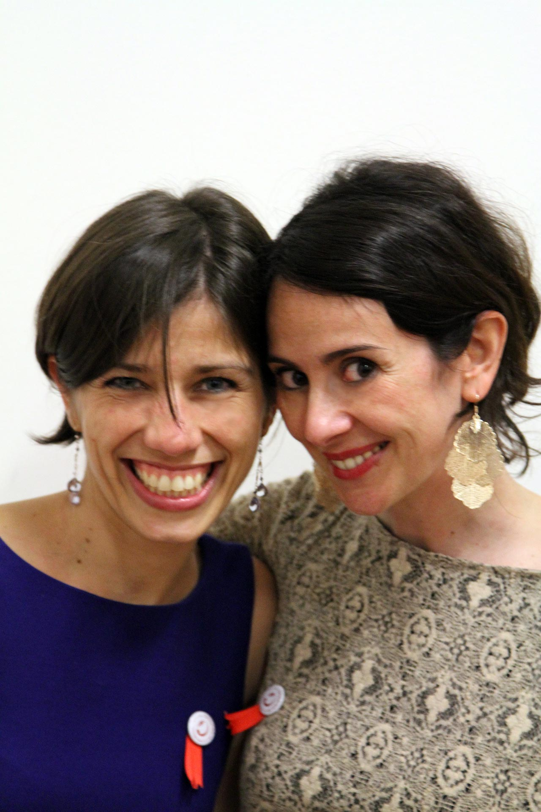
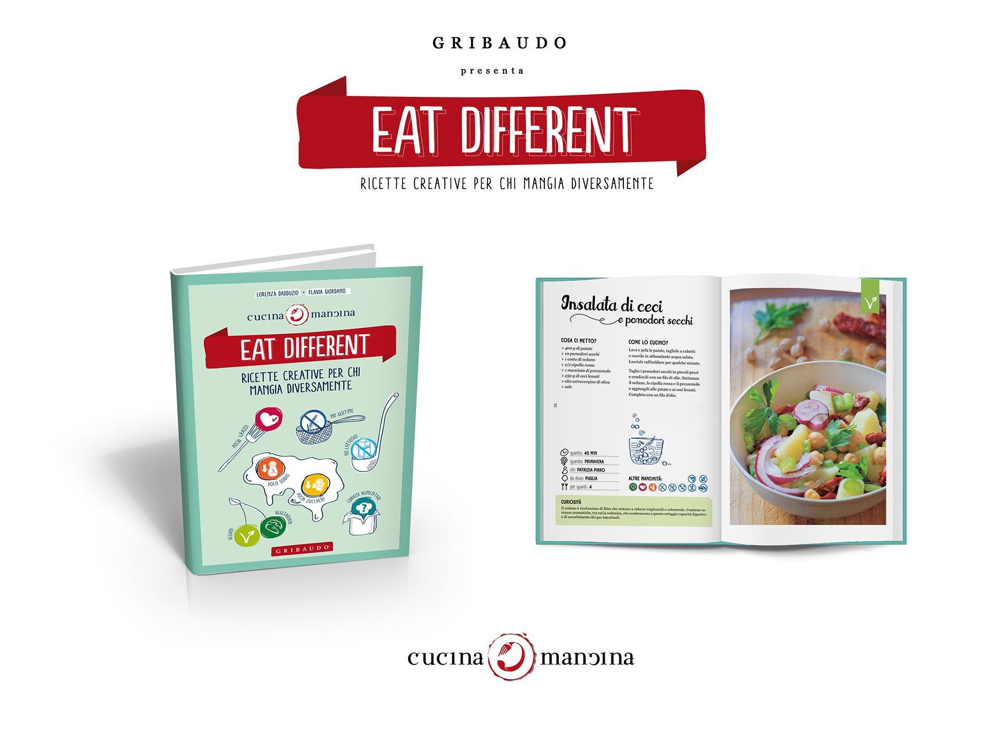
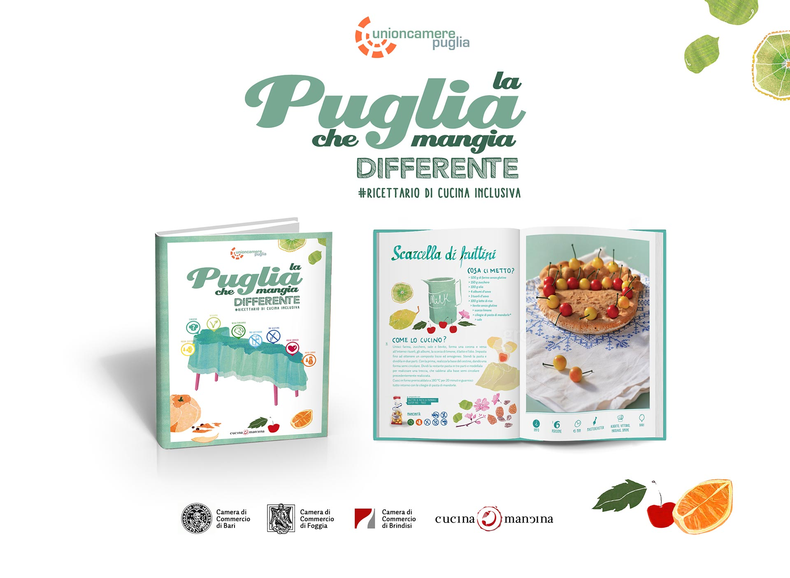

Essere diversamente onnivori - quindi vegetariani, vegani, celiaci o intolleranti a certi cibi - non deve rappresentare un problema.

Per quanto mi riguarda, sono stata vegetariana per due anni e mezzo, e posso dire che sia stata un'esperienza di fortissima crescita personale. È stato un percorso affascinante e ricco di stimoli che mi ha permesso di incontrare tantissime nuove persone.

Ai tempi della mia scelta alimentare vivevo insieme ai miei. Ricordo ancora il giorno dell'annuncio a mia madre: "_Mamma, da oggi sono vegetariana_".
Inizialmente mi ha lanciato uno sguardo fra il nulla e il vago, immobile. La seconda fase è stata la chiara manifestazione del suo terrore più intimo: "_Mo' che ti cucino, tesoro mio?_". Un dramma (per lei).

All'epoca della mia scelta alimentare mi infastidivano le difficoltà nel riuscire a trovare punti vendita e ristoranti adatti alle mie esigenze. C'erano non pochi disagi e, in alcuni casi, la rinuncia a partecipare a cene insieme agli amici _non_ diversamente onnivori.
Nessuno dovrebbe sentirsi diverso a tavola. Sono pure e semplici scelte di vita.

Ma torniamo al presente. Qualche tempo fa mi sono imbattuta in un coloratissimo volantino con sopra il nome di un sito accattivante: [CucinaMancina](http://www.cucinamancina.com). Un sito per chi è diversamente onnivoro!

Le co-founder di CucinaMancina sono **Lorenza Dadduzio**, direttore creativo e marketing, e **Flavia Giordano**, direttore editoriale e social. Sono entrambe pugliesi innamorate del buon cibo e delle sue infinite declinazioni.
Lorenza (in foto, a sinistra) mi ha raccontato meglio il progetto CucinaMancina...

### Ciao, Lorenza. Perché avete dato il via a CucinaMancina?

> Ciao, Anna. CucinaMancina è nata dall'incontro fra me e Flavia durante un corso organizzato dalla regione Puglia nel 2012 per imparare ad avviare start-up basate su una tecnologia innovativa.
>
> Da una cena con i compagni di corso in cui, allo stesso tavolo, c'erano un'intollerante al lattosio, un vegetariano e un celiaco, è nata l'idea di una **food community dedicata ai diversamente onnivori**. Parliamo di vegetariani, vegani, intolleranti, allergici, curiosi alimentari e tutte quelle persone che seguono diete con pochi zuccheri, grassi e sodio.
>
> Flavia ha pensato al nome e alla grammatica attraverso la coniazione di un nuovo linguaggio inclusivo, a misura di _mancino_. Io, invece, ne ho disegnato l'identità, mescolando le forchette parlanti di Munari coi rebbi a forma di mani e la "c" rovesciata di "copyleft". Simbolo, questo, della massima condivisione ed elemento alla base di una community come la nostra.
>
> Volevamo **semplificare la vita delle persone** con problemi alimentari o semplicemente desiderose di variare la propria dieta. Desideravamo offrire loro la possibilità di mangiare in modo diverso e creativo, suggerendo anche i luoghi in cui comprare e mangiare questi prodotti.

### In cosa consiste questo progetto per diversamente onnivori? Come funziona?

> È una **community che unisce ricette, persone, luoghi e prodotti** legati al mondo dell'alimentazione differente attraverso diversi strumenti.
>
> Sul nostro sito proponiamo un **ricettario multifiltro** per scegliere e organizzare le ricette sulla base delle proprie mancinità.
>
> I diversamente onnivori possono votare le ricette e proporne di nuove, ma anche presentare articoli di sana e creativa alimentazione, diventando a loro volta autori della community.
>
> Tutti i contenuti vengono validati dalla redazione col supporto di una nutrizionista. Il ricettario multifiltro sta diventando un riferimento per i mancini alimentari d'Italia.
>
> 
>
> Offriamo anche uno **store locator**, il primo motore di ricerca dell'alimentazione differente in Italia. Si possono cercare o segnalare i luoghi in cui mangiare cibi mancini in Italia in funzione della propria specifica mancinità.
>
> Al momento stiamo lavorando anche allo sviluppo del mercato mancino. Si tratta di **vetrine parlanti** che ospiteranno i prodotti delle aziende agroalimentari per diversamente onnivori raccontati e cucinati dagli chef e dai foodblogger della community.
>
> Il sito offre anche strumenti di _social fooding_ che consentono ai diversamente onnivori di condividere e di salvare le ricette preferite, così come di interagire con esse.

### Quanto è sentito il tema del mangiare differente in Italia? Un vegano o un vegetariano riescono a trovare un'ampia offerta di luoghi in cui mangiare?

> La situazione sta progressivamente migliorando. La consapevolezza delle diversità alimentari sta crescendo ed è sempre più alto il numero di persone alla ricerca di questi cibi. È il caso dei vegetariani che, secondo [Eurispes](http://www.eurispes.eu) sono arrivati a quasi 4 milioni, rendendo l'Italia il paese europeo più _veg_.
>
> CucinaMancina ha anticipato ciò che è diventato obbligatorio a fine 2014. Abbiamo reso evidenti gli allergeni presenti nei menu dei ristoranti e sulle etichette dei prodotti alimentari. Noi le chiamiamo _mancinità_ e le segnaliamo da ormai 2 anni ai nostri diversamente onnivori.
>
> CucinaMancina offre ai ristoranti servizi di **mancinizzazione dei menu**. I nostri nutrizionisti analizzano le portate, suggerendo eventualmente lievi revisioni delle ricette.
>
> È giusto che chiunque abbia la possibilità di sentirsi a casa senza avere la sensazione di essere diverso qualora non possa mangiare un certo cibo.

### Organizzate anche corsi ed eventi?

> Sì, sul nostro portale raccogliamo anche gli eventi mancini italiani. Chef, associazioni ed enti: sono loro stessi a raccontarsi in prima persona iscrivendosi al sito.
>
> Lavoriamo con [Action Aid](http://www.actionaid.it/) o per conto di enti e aziende agroalimentari etiche nell'ambito di laboratori di cucina inclusiva a spreco zero.

### A che punto del percorso siete?

> CucinaMancina ha fatto parlare molto di sé, ottenendo un finanziamento a fondo perduto pari a 70.000€ grazie al bando _Valore Assoluto_. Abbiamo vinto anche una borsa di studio per frequentare la Startup School di [Mind the Bridge](http://mindthebridge.org), in quel di San Francisco.
>
> [StartupItalia!](http://startupitalia.eu) ci ha incluse fra le 100 migliori startup del panorama italiano del 2014. Poi il riconoscimento di _Best Food Startup_ a marzo 2014 durante _La Repubblica delle Idee_, con Riccardo Luna ed Ezio Mauro. In settembre 2014 siamo state a Re-Food di [3040 ReGeneration](http://www.3enta4anta.it), presso il pastificio Rana.
>
> [Vanity Fair](http://www.vanityfair.it) ha inserito il nostro portale tra i 10 migliori siti dedicati al cibo sulla scena internazionale.
>
> All'attivo abbiamo anche la pubblicazione di due volumi: [_Eat Different_](http://www.iodonna.it/casa/ricette-cucina/2014/eat-different-libro-ricette-chi-mangia-diversamente-401884973471.shtml), edito da Gribaudo-Feltrinelli, che ha registrato il tutto esaurito in 3 mesi vendendo 2500 copie in tutta Italia, e [_La Puglia che mangia differente_](http://www.cucinamancina.com/posts.php?id=68&titolo=la-puglia-che-mangia-differente), promosso da [Unioncamere Puglia](http://www.unioncamerepuglia.it), realizzato in italiano e in inglese sia nella versione cartacea che in ebook. Al suo interno ci sono le ricette della tradizione pugliese rivisitate in chiave mancina da 50 chef e blogger della nostra community. Sono ricette cucinate con i prodotti tipici pugliesi e gli ingredienti di 50 aziende agroalimentari del territorio dedicate ai diversamente onnivori.

Foto di copertina: [Brunifia](http://www.flickr.com/photos/23769126@N07/5860611964) via [Photopin](http://photopin.com).
