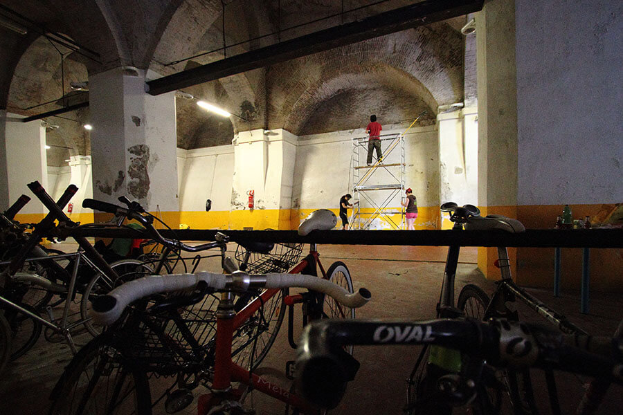

Un servizio di parcheggio e noleggio di bici a Bologna: in quanti lo stanno cercando?
Quanti concepiscono la propria biciletta come un figlio, anziché un semplice mezzo di trasporto?

A nome dei miei amici ciclisti, voglio chiarire un concetto: il ciclista vive il furto della propria bici come un lutto.

Anch'io possiedo due bici, una da corsa e una da turismo. Entrambe hanno un nome e tanti chilometri impressi sul telaio, e con entrambe ho condiviso una serie infinita di emozioni su strada. Se un giorno dovessero rubarmele, credo che mi ritirerei su un eremo chissà dove a piangere e a meditare vendetta. Sì perché io odio i ladri di biciclette.

Detto ciò, MyHumus torna a parlare di bici, e lo fa presentandovi un progetto molto particolare: [Dynamo](http://www.dynamo.bo.it), la prima velostazione d'Italia per il parcheggio e noleggio di bici a Bologna.
Questo nuovo spazio urbano sorgerà di fronte alla Stazione Centrale e inaugurerà il 25 settembre 2015.

Ho scambiato due chiacchiere con Simona Larghetti, presidente dell'[Associazione Salvaiciclisti](http://salvaiciclisti.bologna.it) di Bologna, il gruppo ideatore del progetto.

### Ciao, Simona. Prima di presentare Dynamo, facciamo un piccolo passo indietro: quali sono alcuni degli aspetti legati alla mobilità sostenibile con cui il cittadino di Bologna deve fare i conti?

> Ciao, Anna. Beh, sono diversi. Molti cittadini, ad esempio, non usano la bici perché non sanno dove depositarla in sicurezza. Il numero dei furti in città è molto alto.
>
> Bologna, ogni 5 anni, rinnova il 30% dei propri residenti. Con un flusso simile è difficile rafforzare la cultura del _non acquistare una bici rubata_.
>
> La mobilità sostenibile è un aspetto per cui l'Associazione si è sempre battuta. **Quale funzione ha la strada?** Vogliamo considerarla solo un luogo di transito per auto e scooter? Oppure è uno spazio pubblico, utilizzabile da tutti, che consente anche altre funzioni oltre a quella del normale transito dei veicoli a motore?
>
> Se vogliamo intenderla in quest'ultimo modo, allora **è necessario consentire l'accesso a chiunque**. Bisogna focalizzare l'attenzione sulla persona e creare **spazi altamente accessibili**. Bisogna avere spazi per il parcheggio e noleggio di bici a Bologna, così come in tutta Italia.

### Quando avete deciso di dar vita a Dynamo? Quali sono state le vostre ragioni?

> Serviva un luogo in cui **educare al ciclismo urbano**, in cui **diffondere cultura e sensibilità sull'argomento**.
>
> Da un dibattito cittadino era emerso il bisogno dei bolognesi di avere una velostazione vicino alla stazione. E così, dopo aver stilato un business plan, abbiamo partecipato al bando indetto da [Incredibol](http://www.incredibol.net). Si tratta di un concorso rivolto ad associazioni e a persone con idee da trasformare in impresa.
>
> Abbiamo vinto uno spazio gratuito di 1.000 mq in via dell'Indipendenza 71/Z.
>
> L'arrivo di Dynamo contribuirà a riqualificare la zona. E offrirà finalmente un parcheggio e noleggio di bici a Bologna, a due passi dalla stazione.

### Perché _Dynamo_?

> Perché pensiamo che la capacità di metter in movimento le energie sia un processo virtuoso. Ci muoviamo producendo energia e la raccogliamo senza lasciarla disperdere.

### Quali servizi ci saranno all'interno della vostra velostazione a Bologna?

> **Dynamo sarà un punto di incontro**, una specie di _casa del ciclista urbano_. Le attività seguiranno l'attivazione della cittadinanza. Ogni pretesto sarà valido per creare un'occasione di scambio.
>
> Dynamo sarà aperto dalle 06:00 alle 00:00 e offrirà **tanti servizi rivolti ai cittadini, ai turisti e ai pendolari**: un parcheggio custodito per le bici, uno spazio per l'autoriparazione gratuita e uno per la riparazione a pagamento; un bar con prodotti bio locali, un noleggio bici, wifi gratuito, eventi e corsi, una serie di ciclotour guidati per Bologna, il museo diffuso di [FRONTIER - La linea dello stile](http://www.frontier.bo.it) e un servizio di bike delivery insieme a [UBM Bologna](http://www.ubmbologna.it).

### Prima di salutarci, dimmi una cosa: la cittadinanza bolognese sta rispondendo bene?

> Sì, ci commuove ogni giorno. **Le persone sono entusiaste di questo progetto**, ci stanno offrendo moltissima generosità e sostegno.
>
> Qualche tempo fa, in occasione delle giornate di pulizia degli spazi di Dynamo, abbiamo creato l'evento su Facebook invitando i bolognesi a partecipare: si sono presentati in 40!

