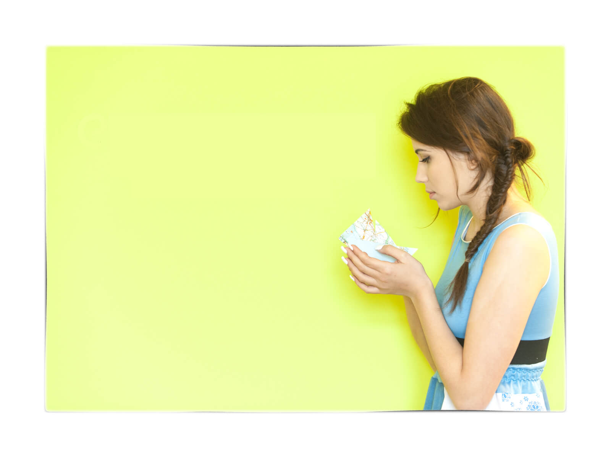

Fra le mie nuove amicizie c'è una persona che ha scelto di realizzare vestiti con materiali riciclati.
Sai quando conosci qualcuno e hai la sensazione di essergli amico da anni? Ecco, con Giada Gaia Cicala, la protagonista di questa nuova intervista, è andata più o meno così.

L'ho conosciuta qualche mese fa, in occasione di un appuntamento organizzato a [Progetto Manifattura](http://www.progettomanifattura.it).
Giada mi sedeva accanto con un bel sorriso stampato sul viso. Abbiamo iniziato subito a chiacchierare e, in men che non si dica, ho conosciuto il suo progetto di moda.

Giada realizza e produce vestiti con materiali riciclati che vanno sotto il nome di [Ecologina](http://www.ecologina.it). Un marchio d'abbigliamento, il suo, che affonda le proprie radici nel rispetto per l'ambiente e nei principi di sostenibilità.

Il lavoro di Giada, secondo me, ha tutte le carte in regola per farsi notare e farsi strada nel mondo fashion. E c'è da dire che, quando sono a Progetto Manifattura, trascorro sempre un po' di tempo nel suo laboratorio.
È bello guardarla lavorare e toccare con mano i tessuti che utilizza!

### Ciao, Giada! Com'è iniziata l'avventura di Ecologina?

> Ciao, Anna! Ecologina è nata dall'incontro di tre mie passioni: la moda, il recupero creativo e la natura. Fondamentale è stata anche l'esperienza lavorativa a Londra al [From Somewhere](http://fromsomewhere.co.uk), label di moda *upcycling*. Quel periodo mi ha permesso di capire che una moda etica è possibile.
>
> Così mi sono buttata a capofitto in questa avventura!

### Cosa sta cercando il tuo brand di vestiti con materiali riciclati?

> Ecologina cerca di offrire una **moda artigianale di qualità**, dando la possibilità di vestire con stile e con un occhio di riguardo alla sostenibilità ambientale.
>
> Il mio marchio vuole ritagliarsi lo spazio per esistere in una **dimensione diversa**. Una dimensione in cui la passione e la creatività non vengano cancellate dalla fretta di una moda low cost usa e getta.

### Che tessuti utilizzi e dove li trovi? È tutto Made in Italy?

> La maggior parte dei tessuti che utilizzo per i miei vestiti con materiali riciclati sono *upcycle*. Questo significa che sono nuovi e di qualità, ma vengono scartati dalle aziende tessili e dai laboratori di confezione o di taglio. Sono **rimanenze**, **piccoli metraggi**, **prove di colore**, **tessuti con piccoli falli**. Sai, c'è tanto spreco nel mondo della moda.
>
> Una piccola parte delle mie collezioni la realizzo servendomi dei tessuti provenienti da vestiti non più utilizzati dalle persone, vero e proprio *recycle*. Dopo aver raccolto tanti vestiti, seleziono sulla base della qualità del materiale.
>
> Nella fase successiva entra in gioco mia nonna. Mi dona il suo prezioso aiuto scucendo gli abiti in pezzi, lavandoli e stirandoli, e diventando, così, materia prima per i miei pezzi unici patchwork.
>
> Le aziende dal quale recupero i tessuti sono tutte italiane, di conseguenza **la materia prima è Made in Italy**.
>
> Anche per il confezionamento e la modellistica, collaboro con artigiani italiani qualificati che svolgono il loro lavoro con passione ed esperienza.

### Cosa ricerchi nelle tue creazioni?

> Nelle mie creazioni ricerco un **equilibrio estetico personale tra materiale, forma e colore**. Sono sempre aggiornata sulle tendenze del momento e mi piace rivisitarle con lo stile di Ecologina.

### Quali esigenze ha il tuo cliente-tipo?

> Il mio cliente-tipo vuole indossare abiti di **qualità**, che abbiano un buon tessuto e una buona fattura. Vuole affezionarsi ai suoi vestiti con materiali riciclati, vuole sentirli suoi.
>
> In un contesto di omologazione sente la necessità di **differenziarsi**, di essere a proprio agio con un abito unico o realizzato in un numero limitato.
>
> Il mio cliente vuole anche la certezza di una filiera trasparente, attenta all'ambiente e ai lavoratori.

### Quali sono i tuoi programmi per il futuro?

> Sono tante le idee che ho in testa e che mi piacerebbe realizzare. Una futura novità sarà l'utilizzo di **tessuti biologici**.
>
> Per la prossima collezione autunno/inverno, per la prima volta, affiancherò all'upcycling e al recycling **tessuti certificati organic**. Avremo una felpa e un jersey provenienti da una giovane azienda tessile berlinese, la [Lebenskleidung](http://www.lebenskleidung.com).
>
> Questo è molto stimolante e mi permette di lavorare in maniera agevolata insieme ai negozi.

