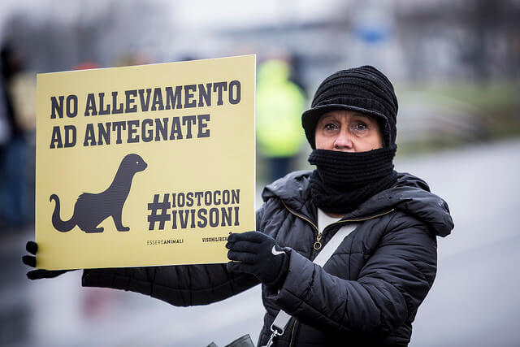

L'intervistato di questa settimana si chiama Eugenio Monti e _milita_ all'interno di [Essere Animali](http://www.essereanimali.org), Onlus per i diritti animali.
Eugenio è vegano, crede in un mondo senza violenza e in una convivenza pacifica fra Uomo e animali. Ogni giorno, con il suo lavoro, Eugenio compie piccoli grandi passi verso una rivoluzione culturale capace di bandire la sopraffazione e la crudeltà umana. E per farlo continua a credere nelle persone, sensibilizzandole e stimolandole a sviluppare una propria coscienza ecologica.
Eugenio filma le condizioni degli animali rinchiusi nelle minuscole gabbie degli allevamenti, ad esempio, e lo fa per testimoniarne la sofferenza.

### Ciao, Eugenio! Innanzitutto voglio ringraziarti per aver accettato l'intervista. Dimmi, quando nasce Essere Animali e qual è il tuo ruolo all'interno di questa Onlus per i diritti animali?

> Ciao, Anna! Essere Animali nasce nel settembre 2011. Io lavoro nel Gruppo Direttivo e sono responsabile delle investigazioni.

### Quali sono i vostri obiettivi?

> La nostra è un'associazione no-profit che promuove la **convivenza pacifica fra Uomo e animali** e che crede in un mondo diverso.
>
> Le attività della nostra Onlus per i diritti animali mirano a coinvolgere sempre più persone in un'ottica di aumento della sensibilità.
>
> **Essere Animali difende la biodiversità, promuove una nuova cultura ecologica** e ama agire in diverse forme, dal vivo e attraverso i mezzi di comunicazione.
>
> Molti importanti media hanno parlato di noi: TG1, TG3, Striscia la Notizia e La7. Abbiamo anche un nostro [blog](http://www.ilfattoquotidiano.it/blog/essereanimali/) sul [Fatto Quotidiano](http://www.ilfattoquotidiano.it).

### Quali attività sta portando avanti la vostra Onlus per i diritti animali?

> Abbiamo **all'attivo diverse campagne** specifiche. Una delle più importanti e recenti è quella incentrata sul [foie gras](http://www.stopfoiegras.org), di cui l'attrice di teatro Daniela Poggi ne è testimonial. Una volta immobilizzati in gabbie singole, o in spazi molto ridotti, agli animali viene somministrato cibo in modo forzato. Una pratica, questa, che causa sofferenze indicibili.
>
> Sull'argomento foie gras abbiamo condotto un'[indagine](http://www.stopfoiegras.org/indagine.html#indagine) che è uscita in esclusiva sul Corriere della Sera. Siccome in Italia è vietata la sua produzione, ma non la vendita, abbiamo fatto pressione su alcune catene di supermercati, esortandole a non venderlo più.
>
> Con enorme soddisfazione, **Pam/Panorama ha scelto di aderire alla nostra campagna _\#ViaDagliScaffali_**: 153 punti vendita, fra supermercati e ipermercati, non esporranno più il foie gras. Una bella conquista della nostra Onlus per i diritti animali!
>
> 
>
> Un'altra importante campagna che abbiamo condotto in Italia in questi ultimi anni mira all'abolizione degli allevamenti degli animali da pelliccia. Va sotto il nome di _[Visoni Liberi](http://www.visoniliberi.org)_.
>
> 
>
> Devi sapere che in Italia abbiamo circa una trentina di allevamenti di questo tipo sparsi fra Lombardia, Emilia-Romagna, Veneto e Abruzzo. Attraverso questa campagna abbiamo mostrato le condizioni di vita dei [visoni](http://www.essereanimali.org/sfruttamento-animale/abbigliamento/visoni/) nel nostro Paese. Abbiamo raccolto fino a 150.000 firme indirizzate al Parlamento per chiedere la chiusura di queste strutture.
>
> Un aspetto confortante, a questo proposito, arriva dall'Europa: sono almeno 6 i Paesi che hanno messo al bando questi allevamenti.

### Mi parli delle vostre vittorie?

> Pam/Panorama, che non venderà più il foie gras, è una delle nostre recentissime vittorie. Siamo anche riusciti a impedire la costruzione di quello che sarebbe stato l'allevamento di visoni più grande d'Italia, con sede a Modena.
>
> A questo proposito, abbiamo condotto una campagna per scongiurarne la realizzazione. Abbiamo anche organizzato un corteo a cui hanno partecipato moltissime persone, e che ha avuto un fortissimo impatto. Siamo finiti perfino sul Tg1.
>
> 
>
> L'estate scorsa la nostra Onlus per i diritti animali ha condotto una campagna contro il delfinario di Rimini. Siamo parte civile al processo e a gennaio ci sarà la prima udienza. Anche questo, a modo suo, è un piccolo grande successo.
>
> Di recente abbiamo documentato la tratta sostenuta dai [cavalli](http://www.essereanimali.org/sfruttamento-animale/cibo/cavalli/) destinati alla macellazione. L'Italia è la nazione in cui si consuma più carne di cavallo e la Puglia è la regione italiana in cui si macellano più capi.
>
> 
>
> La carne equina più pregiata proviene da cavalli allevati unicamente per diventare carne nel nostro piatto. In Polonia ci sono diversi mercati in cui contadini e acquirenti contrattano sulla vendita di questi animali. È proprio la Polonia il nostro maggior fornitore di carne equina.
>
> Dopo la nostra indagine condotta all'interno dei macelli pugliesi, [dati Eurispes](http://www.eurispes.eu/content/comunicato-stampa-rapporto-italia-2014) hanno decretato un aumento significativo di persone favorevoli a equiparare i cavalli agli animali domestici. Questo risultato è giunto proprio dopo la nostra indagine.
>
> Aggiungo che siamo stati proprio noi di Essere Animali ad aver importato in Italia _[Cowspiracy](http://www.cowspiracy.com)_, il documentario prodotto da Leonardo DiCaprio che parla di quanto il consumo di carne non sia più sostenibile. I registi Kip Andersen e Keegan Kuhn si domandano per quale motivo le principali associazioni ambientaliste del mondo non stiano informando la società su quanto il consumo di carne sia la principale causa dell'effetto serra, molto più del consumo di combustibile fossili.

### In che modo possiamo supportare?

> Sul nostro sito ci sono diversi spazi dedicati alle **donazioni**. In qualsiasi momento, inoltre, potete partecipare come attivisti alle nostre attività, ai nostri eventi e alle nostre azioni dimostrative. La nostra Onlus per i diritti animali è sempre in cerca di nuovi sostenitori".

### Alla parola "futuro", cosa rispondi?

> Novembre e dicembre saranno mesi bollenti, ci sono molte attività importanti che stiamo conducendo. Sentirete parlare molto di noi!"

Foto di copertina: Irene Carmassi via [Flickr](https://www.flickr.com/photos/essereanimali/12431744034/in/album-72157640767314433/).
