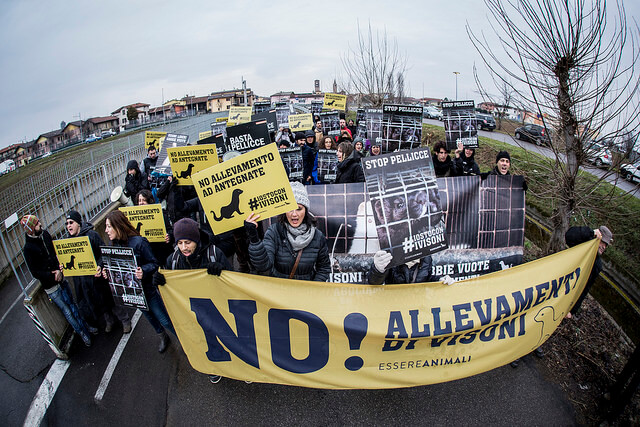

> "*Oggi sappiamo per certo, ma lo abbiamo istintivamente sempre saputo, che gli animali possono soffrire esattamente come gli esseri umani. Le loro emozioni e la loro sensibilità sono spesso più forti di quelle umane. Diversi filosofi e capi religiosi hanno cercato di convincere i loro discepoli e seguaci che gli animali non sono altro che macchine senz'anima, senza sentimenti. Chiunque però abbia vissuto con un animale - sia esso un cane, un uccello o persino un topo - sa che questa teoria è una menzogna inventata per giustificare la crudeltà*".
> (Isaac Bashevis Singer - premio Nobel per la letteratura nel 1978)

Il ragazzo che intervisto questa settimana si chiama Eugenio Monti.

Eugenio è vegano, crede in un mondo senza violenza e in una convivenza pacifica fra uomo e animali; ogni giorno, attraverso il suo lavoro, Eugenio compie piccoli grandi passi verso una rivoluzione culturale capace di mettere al bando la sopraffazione e la crudeltà umane, e per farlo continua a credere nelle persone, sensibilizzandole e stimolandole a sviluppare una propria coscienza ecologica.

Eugenio filma le condizioni degli animali rinchiusi nelle minuscole gabbie degli allevamenti per testimoniare la loro sofferenza; la crudeltà infligge supplizi ed è giusto che le persone ne siano consapevoli (in fin dei conti, non è tenendo gli occhi chiusi che si può pensare di cambiare le cose...).

Il nostro intervistato lavora all'interno dell'associazione [Essere Animali](http://www.essereanimali.org) e, ogni giorno, si batte a sostegno dei loro (sacrosanti) diritti.

#### Ciao Eugenio! Innanzitutto voglio ringraziarti per aver accettato l'intervista. Dimmi, quando nasce "Essere Animali" e qual è il tuo ruolo all'interno dell'associazione?

> Ciao Anna! Essere Animali nasce nel settembre 2011; io lavoro all'interno del Gruppo Direttivo e sono responsabile delle investigazioni.

#### Quali obiettivi si prefigge la vostra associazione?

> La nostra è un'associazione no-profit che promuove la convivenza pacifica fra Uomo e animali e che crede in un mondo diverso; le nostre attività mirano a coinvolgere sempre più persone in un'ottica di sensibilità sempre maggiore. Essere Animali difende la biodiversità, promuove una nuova cultura ecologica ed ama agire in diverse forme, dal vivo e attraverso i mezzi di comunicazione.
> 
> Molti importanti media hanno parlato di noi (TG1, TG3, Striscia la Notizia e La7); abbiamo anche un nostro [blog](http://www.ilfattoquotidiano.it/blog/essereanimali/) sul [Fatto Quotidiano](http://www.ilfattoquotidiano.it).

#### Quali attività state portando avanti?

> Abbiamo all'attivo diverse campagne specifiche. Una delle più importanti - e recenti - è quella incentrata sul [foie gras](http://www.stopfoiegras.org), di cui l'attrice di teatro Daniela Poggi ne è testimonial; una volta immobilizzati in gabbie singole o in spazi molto ridotti, agli animali viene somministrato cibo in modo forzato, pratica che causa sofferenze indicibili.
> 
> Sull'argomento foie gras abbiamo condotto un'[indagine](http://www.stopfoiegras.org/indagine.html#indagine) che è uscita in esclusiva sul Corriere della Sera e, dal momento che nel nostro Paese è vietata la sua produzione (ma non la sua vendita), abbiamo condotto diverse attività di pressione su alcune catene di supermercati che lo espongono, esortandole a non venderlo più.
> 
> Con enorme soddisfazione, Pam/Panorama ha scelto di aderire alla nostra campagna *\#ViaDagliScaffali*: 153 punti vendita - fra supermercati e ipermercati - non esporranno più il foie gras!
>
> 
>
> Un'altra importante campagna che abbiamo condotto in Italia in questi ultimi anni mira all'abolizione degli allevamenti degli animali da pelliccia e va sotto il nome di "[Visoni Liberi](http://www.visoniliberi.org)".
> 
> 
>
> Devi sapere che in Italia abbiamo circa una trentina di allevamenti di questo tipo (sparsi fra Lombardia, Emilia-Romagna, Veneto, ne troviamo uno anche in Abruzzo); attraverso questa campagna abbiamo mostrato le condizioni di vita dei [visoni](http://www.essereanimali.org/sfruttamento-animale/abbigliamento/visoni/) nel nostro Paese raccogliendo fino a 150.000 firme indirizzate al Parlamento per chiedere la chiusura di queste strutture.
> 
> Un aspetto confortante, a tal proposito, arriva dall'Europa: sono almeno 6 i Paesi che hanno messo al bando questi allevamenti".

#### Ora parliamo delle vostre vittorie...

> Pam/Panorama che non venderà più il foie gras è una delle nostre recentissime vittorie. Siamo anche riusciti ad impedire la costruzione di quello che sarebbe stato l'allevamento di visoni più grande d'Italia, con sede a Modena.
> 
> A tal proposito, abbiamo condotto un'urgente campagna per scongiurarne la realizzazione (pensa che la struttura avrebbe rinchiuso fino a 40.000 visoni!) e abbiamo organizzato un corteo a cui hanno partecipato moltissime persone e che è riuscito ad avere un fortissimo impatto, finendo perfino sul Tg1.
> 
> 
>
> L'estate scorsa abbiamo condotto una campagna contro il delfinario di Rimini, siamo parte civile al processo e a gennaio ci sarà la prima udienza. Anche questo, a modo suo, è un piccolo grande successo.
> 
> Di recente abbiamo documentato la tratta sostenuta dai [cavalli](http://www.essereanimali.org/sfruttamento-animale/cibo/cavalli/) destinati alla macellazione; l'Italia è il Paese europeo in cui si consuma più carne di cavallo e la Puglia è la regione italiana in cui si macellano più capi.
> 
> 
>
> La carne equina più pregiata proviene da cavalli allevati unicamente per diventare carne nel nostro piatto. In Polonia ci sono diversi mercati in cui contadini ed acquirenti contrattano sulla vendita di questi animali che li acquistano, ed è proprio la Polonia il nostro maggior fornitore di carne equina.
> 
> Dopo la nostra indagine condotta all'interno dei macelli pugliesi, dati [Eurispes](http://www.eurispes.eu/content/comunicato-stampa-rapporto-italia-2014) hanno decretato un aumento significativo di persone favorevoli ad equiparare i cavalli agli animali domestici. Questo risultato è giunto proprio a seguito della nostra indagine.
> 
> Aggiungo che siamo stati proprio noi di Essere Animali ad aver importato in Italia "[Cowspiracy](http://www.cowspiracy.com)", il documentario prodotto da Leonardo DiCaprio che parla di quanto il consumo di carne non sia più qualcosa di sostenibile; i registi Kip Andersen e Keegan Kuhn si domandano per quale motivo le principali associazioni ambientaliste del mondo non stiano informando la società su quanto il consumo di carne sia la principale causa dell'effetto serra, molto più del consumo di combustibile fossili.

#### In che modo possiamo supportarvi?

> Sul nostro sito ci sono diversi spazi dedicati alle donazioni. In qualsiasi momento, inoltre, potete partecipare come attivisti alle nostre attività, ai nostri eventi e alle nostre azioni dimostrative".

#### Alla parola "Futuro", cosa rispondi?

> Novembre e dicembre saranno mesi bollenti, ci sono molte attività importanti che stiamo conducendo. Sentirete parlare molto di noi!".

Foto di copertina: Irene Carmassi via [Flickr](https://www.flickr.com/photos/essereanimali/12431744034/in/album-72157640767314433/).

