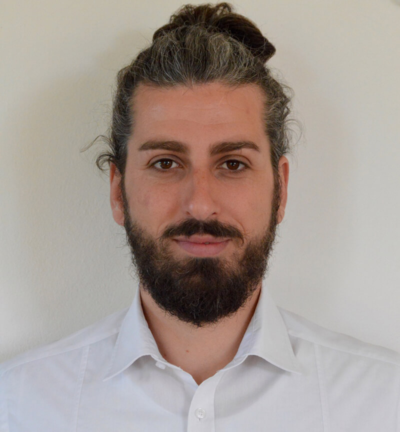
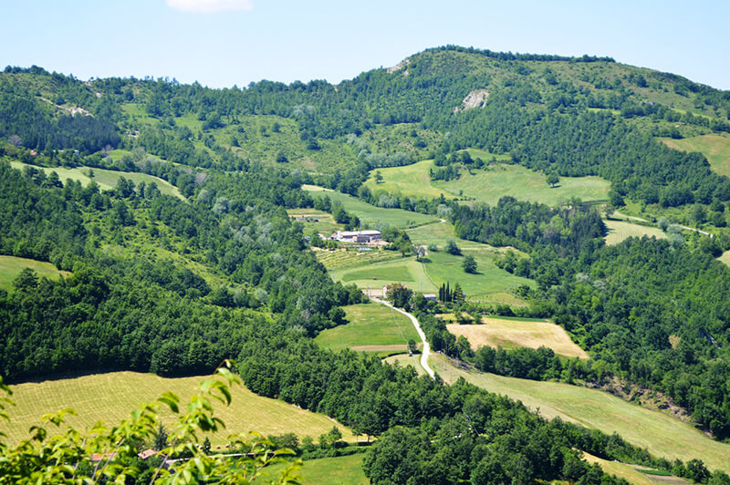
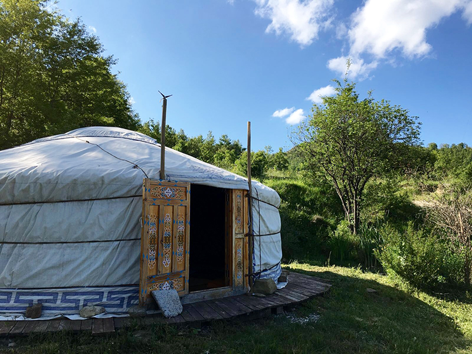
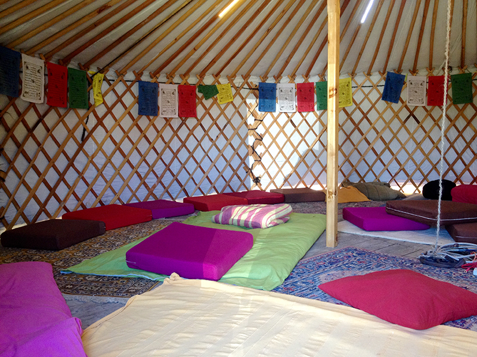
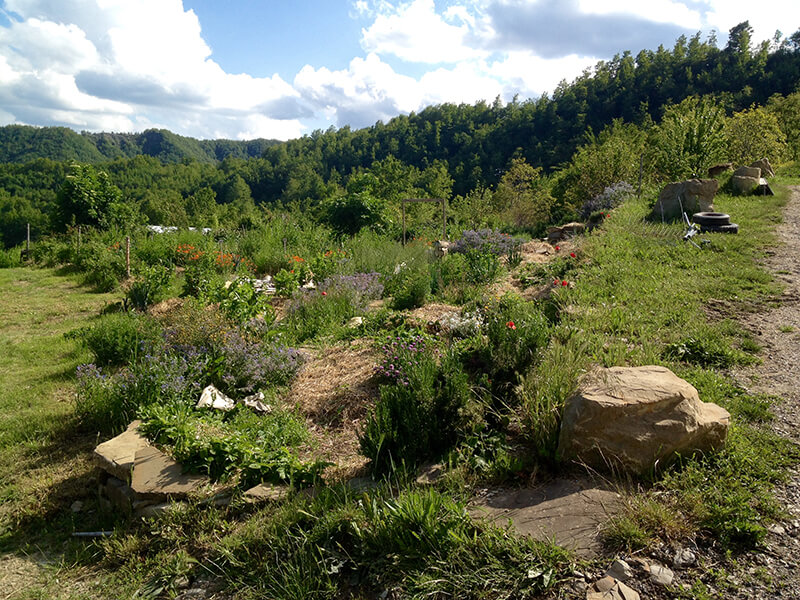
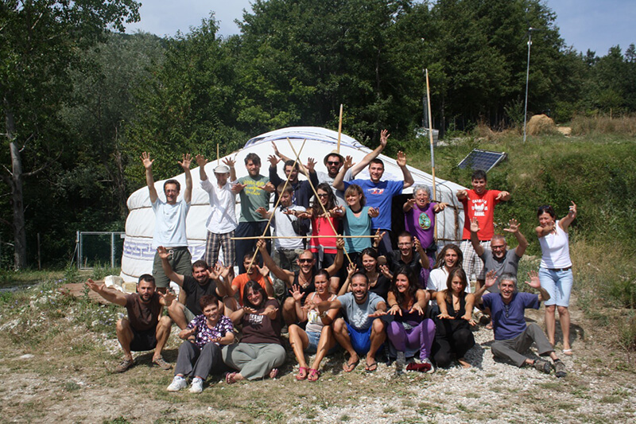

Metti un normalissimo martedì pomeriggio di sole, prendi con te giusto la macchina fotografica, passi a prendere due amiche che non vedono l'ora di stare all'aria aperta, sfidi i crateri dell'E45 e raggiungi un luogo incantevole in provincia di Forlì-Cesena, più precisamente a Paganico: la [Fattoria dell'Autosufficienza](http://www.autosufficienza.it).

Il progetto di cui vi parlo questa settimana nasce da un'idea di Francesco Rosso, direttore generale presso [Macrolibrarsi](http://www.macrolibrarsi.it) (libreria online nata nel 1997 grazie a Giorgio Gustavo Rosso e ad Ivana Iovino con l'obiettivo di diffondere la conoscenza dei prodotti naturali e le pratiche volte al benessere e alla crescita interiori), nonché strenuo sostenitore dei principi di **decrescita** **felice**.

La Fattoria dell'Autosufficienza è un centro di ecologia applicata, situato sull'Appennino Romagnolo, che promuove l'**autosufficienza alimentare**, l'**ecoturismo** e le pratiche di **permacultura**.

Una delle strutture del centro è un bellissimo agriturismo che, a breve, aprirà le porte agli ospiti offrendo loro prodotti realizzati *in loco*: frutto di un accurato progetto di **bioedilizia**, è studiato nel minimo dettaglio per garantire il **minimo impatto ambientale**.

Come potete notare dalla fotografia sottostante, il paesaggio che circonda la Fattoria è veramente da cartolina, della serie "*Saluti e baci da Paganico!*": colline verdeggianti e boscose che sembrano non finire mai, un mosaico naturale sul quale i rapaci volteggiano alla ricerca di prede, instancabili.

Tutto è una festa di colori e di profumi.

Visitando il centro in compagnia di Francesco e di Giulia, la sua compagna, le mie due amiche ed io ci imbattiamo in una fantastica **yurta**, la tradizionale abitazione mobile adottata da alcuni popoli nomadi dell'Asia: costituita da uno scheletro in legno ricoperto da tappeti di feltro di lana, è una struttura veramente bellissima e dal forte impatto visivo.

Nel caso specifico della Fattoria, la yurta ospita molti wwoofers provenienti da tutto il mondo.

Continuando a girovagare tutto attorno all'agriturismo restiamo affascinate dagli orti sinergici, dalla piccola serra in cui alcuni ragazzi stanno lavorando, dagli impianti di erbe aromatiche, dalle porzioni di terreno adibite alla sperimentazione di nuove metodologie biologiche e alle tecniche di permacultura.

Sono proprio felice di essere venuta qui e di visitare un centro che, ne sono certa, cambierà lo stile di vita di moltissime persone.

Voglio approfittare di questa bella passeggiata con Francesco per chiedergli alcune informazioni...

#### Francesco, perché dar vita ad una fattoria dell'autosufficienza?

> **Autosufficienza significa libertà, vuol dire non dipendere da un sistema fragile e poco resiliente**. Direi che queste poche parole siano già di per sé sufficienti ad esprimere la filosofia alla base di questo progetto...

#### Quando avete trovato questi 70 ettari di terreno?

> Nel 2008. Questo terreno, dapprima gestito da un'azienda agricola e in seguito abbandonato, era stato messo in vendita. Quando lo vidi per la prima volta, me ne innamorai all'istante. Il problema era uno solo...

#### Quale?

> Non avevamo la minima idea di come gestirlo...

#### Beh, è un ottimo inizio!

> Già! Scherzi a parte, fin da subito capii che questo terreno sarebbe stato l'ideale per **realizzare qualcosa di grande** che, allo stesso tempo, fosse anche capace di comunicare i principi cardine dell'autosufficienza.
> 
> Abbiamo preferito investire qui i nostri guadagni piuttosto che mettere tutto in banca.

#### Credo sia stata un'ottima scelta. Ora spiegami meglio: cos'è successo dopo il colpo di fulmine?

> Dopo il colpo di fulmine è iniziata questa avventura, così, senza nemmeno pensarci troppo su.
> 
> Non avevo idea di come avrei voluto utilizzare questi ettari, desideravo solo realizzare qualcosa di utile anche agli altri.
>
> Fu in quel periodo di grande riflessione che mi capitò fra le mani un testo di **permacultura**: all'improvviso, tutto mi fu chiaro.

#### Come si può illustrare la permacultura in modo semplice?

> Beh, potremmo partire da un presupposto importante: la specie umana è in pericolo.
> 
> **La permacultura progetta insediamenti umani sostenibili nel tempo ed è una risposta resiliente al problema ambientale**.
> 
> Essa è sì un metodo di coltivazione, ma non tiene conto del solo aspetto agricolo: include anche la casa, la mobilità e, giusto per capirci, tutto ciò che gravita attorno alle persone che vivono uno spazio.
> 
> Attraverso la permacultura si progettano **interazioni con il territorio**, ovviamente le più **sostenibili** possibili.
> 
> Grazie ad alcune strategie possiamo progettare degli insediamenti agricoli simili ad ecosistemi naturali, capaci di mantenersi in modo autonomo.

#### Torniamo alla Fattoria dell'Autosufficienza. Qual è stata la prima cosa più difficile?

> La prima cosa difficile è stata capire come coltivare. Considera che proveniamo dal mondo editoriale. Io sono nato in mezzo ai libri e, da ragazzino, mi ripetevo: *tanto non farò mai il contadino*.

#### Qual è il messaggio che volete comunicare?

> Vogliamo trasmettere i valori legati all'ecologia, al benessere del pianeta, alla cura naturale del proprio corpo e al biologico. **La fattoria è una messa in pratica di quanto abbiamo pubblicato sui nostri libri**.

#### Quanti siete in fattoria?

> Io mi occupo del coordinamento dell'azienda, Émile segue la parte agricola attraverso la sperimentazione del metodo bio intensivo (simile alla permacultura, questo orto realizzato con bancali rialzati prevede delle consociazioni in stile orto sinergico, così come delle pratiche di pacciamatura e di concimazione verde che mantengono il suolo molto attivo. Il terreno non viene mai lavorato con i mezzi meccanici), poi c'è Elisa che si occupa della recettività nell'agriturismo.
> 
> Jerry è il nostro custode tuttofare, mentre Giulia segue l'impianto di erbe aromatiche (l'agriturismo, ci tengo a sottolinearlo, offre **cibo locale e prodotti cosmetici realizzati in azienda grazie alle nostre materie prime**).
> 
> Poi ci sono mia sorella Wahleeah - addetta al semenzaio - e mia madre nel ruolo di cuoca.
> 
> Insieme ai volontari che ci danno una mano costituiamo un bel team di lavoro.

#### Sbirciando sul vostro sito, ho letto che proponete anche diversi corsi. Possiamo trovarne anche sulla permacultura?

> A dire il vero, noi **offriamo molti corsi di permacultura**.
> 
> Per un po' di tempo abbiamo proposto quello intensivo di 72 ore, comprensivo di teoria e di parte pratica (ossia la vera e propria progettazione di uno spazio).
>
> Quest'anno, in aggiunta, presentiamo un corso di 4 giorni tenuto dal grande **[Sepp Holzer](http://www.seppholzer.it/sepp-holzer/)**, colui che ha fatto della sua fattoria, "*[Der Krameterhof](http://www.seppholzer.at/cms/index.php?id=69)*", il maggior esempio europeo di permacultura applicata in climi temperati.
> 
> Devi sapere che in Austria ha creato un'azienda agricola di 40 ettari fra i 1.000 e i 1.500 m di altitudine, in un luogo in cui faticherebbe a crescere anche un cespuglio! Ebbene, lui ha dato vita ad una biodiversità incredibile grazie alla quale riesce a produrre di tutto.
>
> Consiglio questo corso a tutti gli appassionati di permacultura, sarà davvero molto interessante.

Non perdere gli altri articoli recenti di MyHumus: l'[autoproduzione](https://myhumus.com/autoproduzione/) di Lucia Cuffaro, le [scarpe artigianali ](https://myhumus.com/scarpe-artigianali-made-in-italy/)di Gigi Perinello e il progetto di aut- -aut per il rinnovo dell'[istruzione infantile](https://myhumus.com/istruzione-infantile-ecologia/) attendono di essere scoperti!

