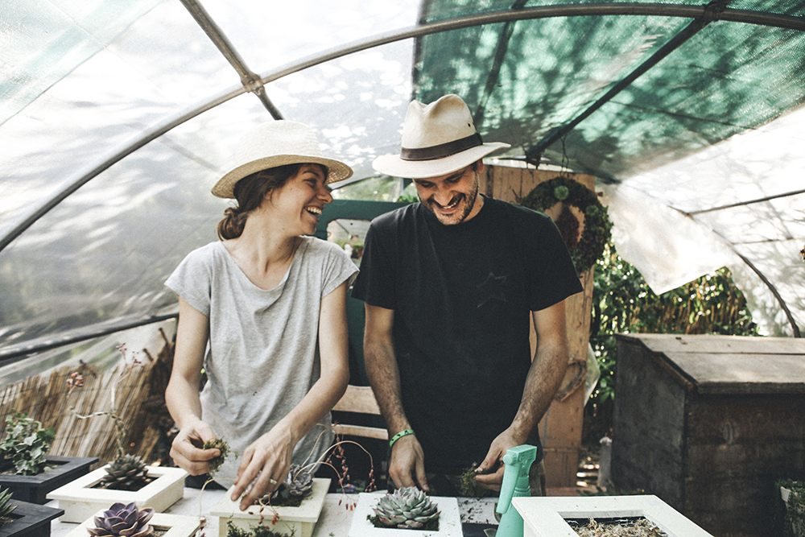
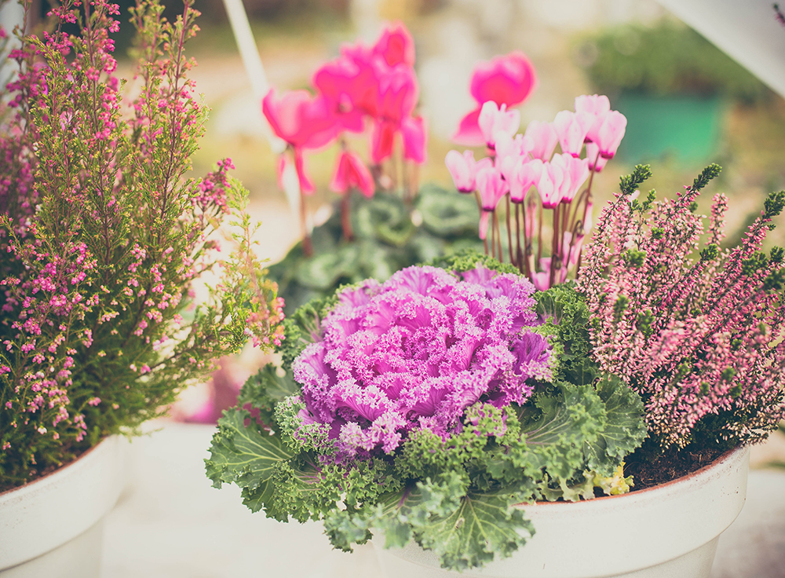
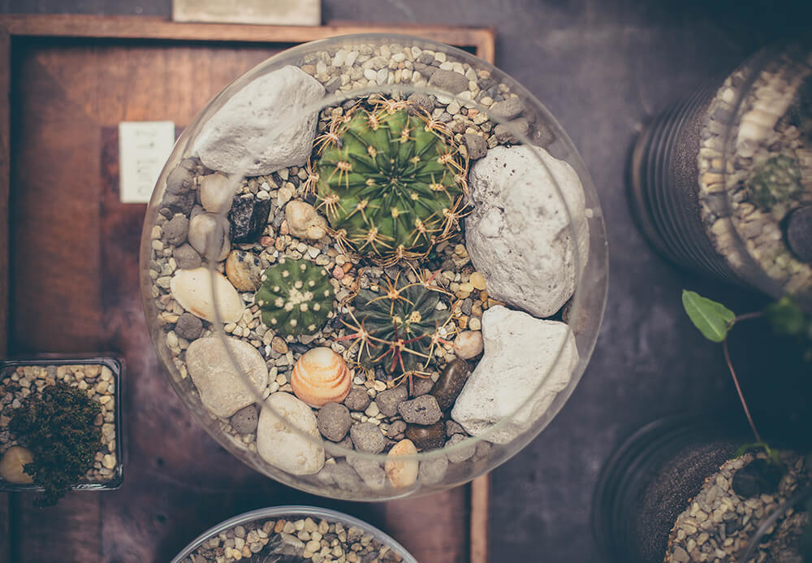
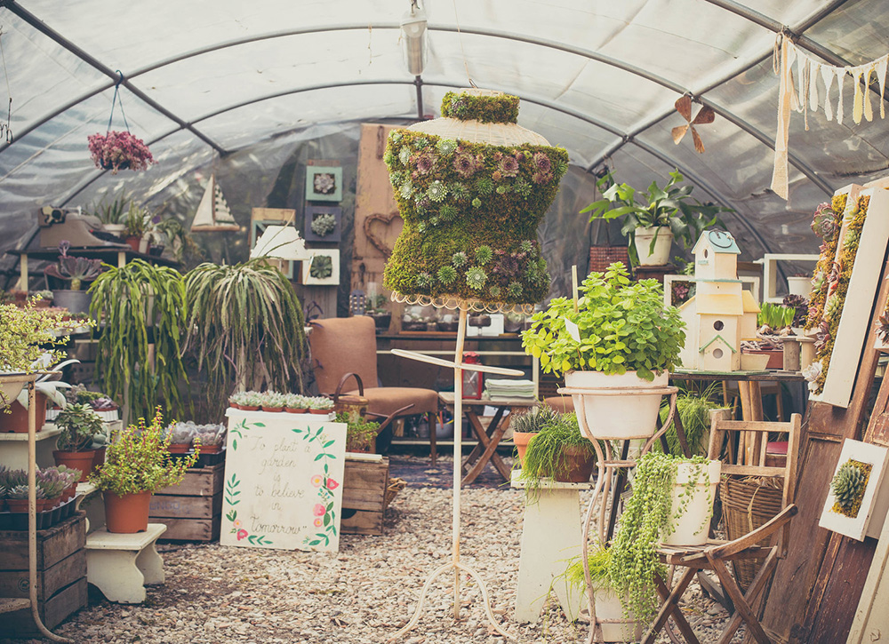
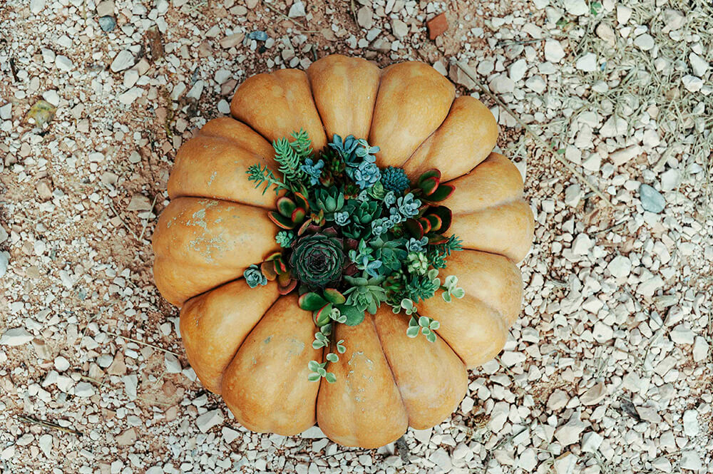

Un vivaio a Rimini che nasce così, dall'altra parte del mondo, con un lui e una lei che s'incontrano per caso in terra australiana. E che non scoprono solo di provenire dalla stessa città, ma di abitare a 4 minuti di macchina l'uno dall'altro. E insomma, finisce che s'innamorano e che si tengono stretti, come nel più lieto dei lieti fini.

[Fazenda](http://www.fazendavivaio.com) nasce così, dopo un Working Holiday nella terra dei canguri e un colpo di fulmine fra **Chiara Fantini** e **Valerio Sardiello**.

Fazenda è un meraviglioso vivaio a Covignano, alle porte di Rimini, in cui tutto è handmade e realizzato con tanto amore.

Sono pazza di questo vivaio a Rimini. Ma soprattutto, sono pazza di Chiara e Valerio!

### Ciao, ragazzi. Che bello intervistarvi. Mi raccontate le origini di Fazenda?

> Ciao, Anna! Fazenda nasce un anno e mezzo fa e rappresenta il nostro progetto di vita.
>
> Il nome del nostro vivaio a Rimini deriva dalla casetta bianca in stile messicano in cui abbiamo mosso i primi passi. Somigliava tanto alle famose _fazendas_. All'epoca eravamo in tre: noi due e la nostra capretta.

### Come avete dato inizio a questa bella avventura insieme? Avete iniziato dai mercatini?

> Sì, esatto, inizialmente siamo stati presenti come hobbisti ai mercatini locali, poi ci siamo cimentati nelle prime fiere.

### Cosa realizzate nel vostro vivaio a Rimini, esattamente? In cosa vi siete specializzati?

> La nostra è una **botanica applicata al design**, ci siamo specializzati nell'**arredamento di spazi interni**.
>
> Amiamo riscoprire piante che, a primo acchito, possono sembrare banali. Nella composizione giusta, diventano uniche. Abbiamo **piante stagionali e perenni, orchidee e molto altro**.
>
> Il nostro vivaio a Rimini cerca sempre di proporre piante particolari. Tutti i nostri articoli sono pezzi unici e **ciò che vendiamo è un prodotto finito**, già concimato e contenuto all'interno di un vaso. Occorre solo innaffiarlo e prendersene tanta cura.
>
> Dopo alcune sperimentazioni in ampolle di vetro per pesci, abbiamo introdotto anche i **terrari**. È incredibile come in una sfera di vetro possa crearsi un ecosistema perfetto!

### Mi piacciono molto i vostri _quadri_!

> Sì, nei nostri quadri c'è un'alga giapponese leggera, ricchissima di ossigeno e di sali minerali che non appesantisce le radici. Noi la importiamo direttamente dal Giappone e ti assicuro che è un materiale molto costoso.
>
> Sai, **studiamo molto il prodotto**, curiamo le piante con amore e facciamo tutto il possibile per educare i nostri clienti. Vogliamo che siano consapevoli di aver acquistato un essere vivente che, in quanto tale, ha delle necessità specifiche.

### Il vostro discorso non fa una piega, bravi! Posso chiedervi dove sono i vostri fornitori?

> Certamente! I nostri fornitori sono principalmente in Emilia-Romagna. A volte andiamo in ricerca di nuove piante in Toscana, leader di settore sul territorio nazionale e zona con i produttori e i vivaisti più interessanti.

### Dove possiamo acquistare le vostre piante?

> Nelle fiere a cui partecipiamo e nel nostro laboratorio-showroom a Covignano, in provincia di Rimini.

### L'ultima domanda riguarda la spedizione in Italia: è un'impresa più o meno impossibile?

> Sì, **spedire piante in Italia è ancora molto complicato**. Il rischio è quello di ricevere un prodotto danneggiato, se non quasi del tutto morto. Ad ogni modo, stiamo studiando nuove possibili soluzioni!

