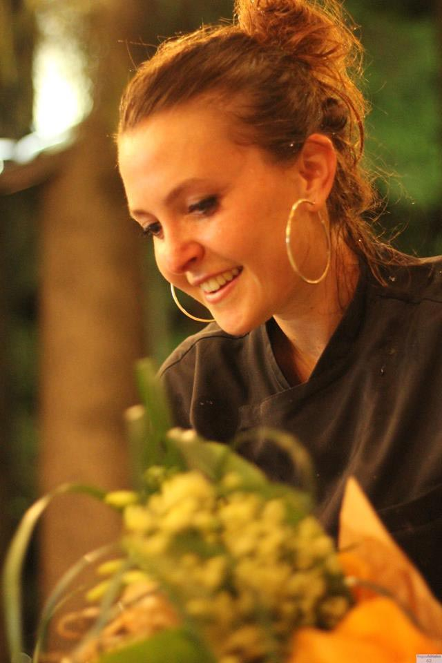
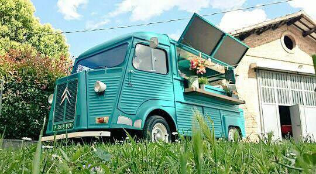
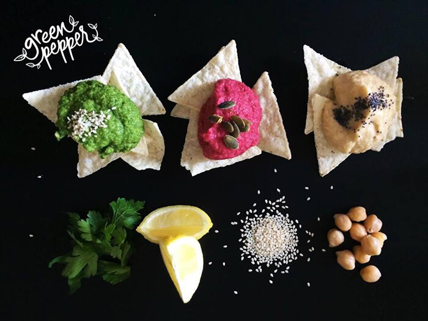
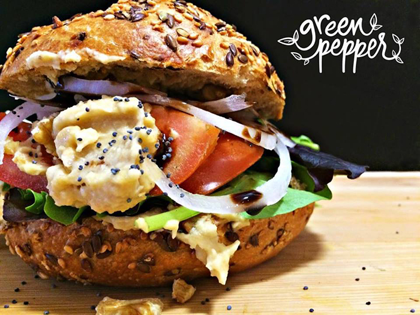
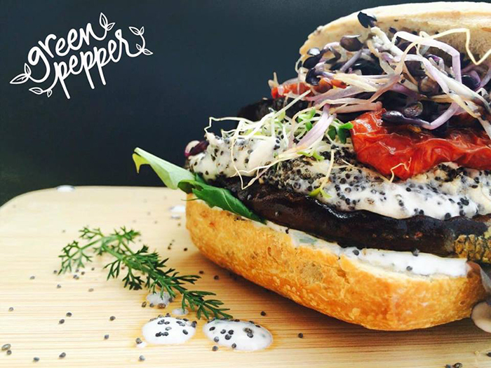
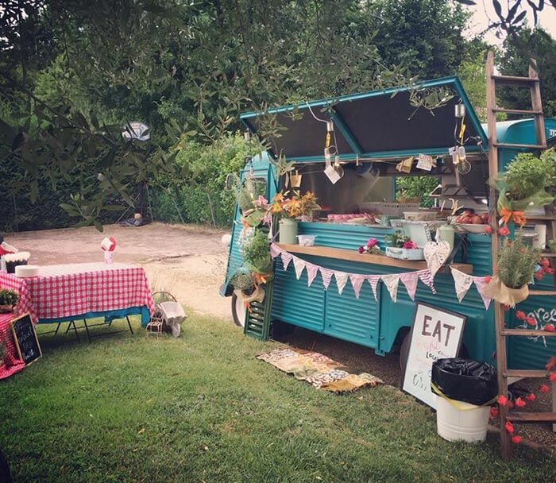
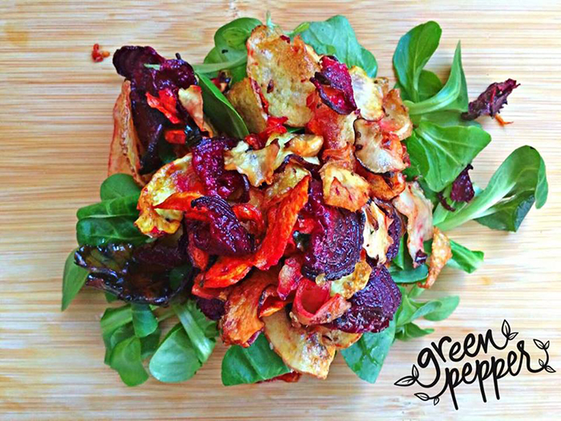
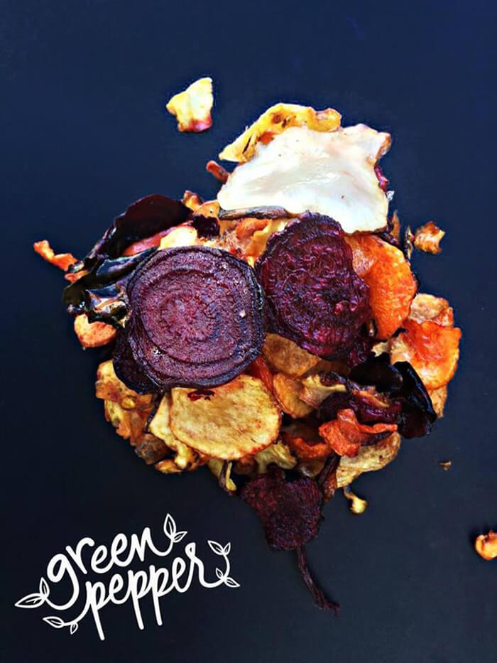
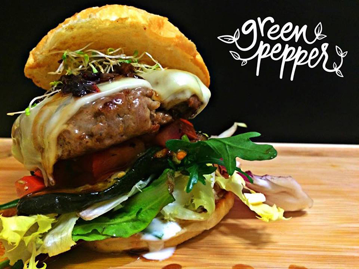
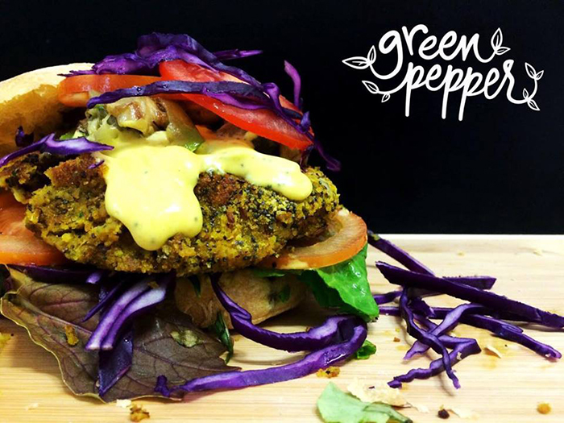

Qualche tempo fa, insieme alle mie amiche Giorgia e Sara, mi trovavo a San Mauro Pascoli (FC) in occasione di [Commonplaces](https://www.facebook.com/commonplacesevento/), un market di design che promuove l'autoproduzione e tutto ciò che è *handmade*.

Non ho fatto in tempo a varcare l'ingresso che sono stata vittima di un colpo di fulmine pazzesco, di quelli che lasciano proprio il segno...

Alla domanda: "*Hai visto un bellissimo fanciullo che ti ha fatto l'occhiolino chiedendoti di fuggire via con lui?*", posso tranquillamente rispondere: "*No, niente di tutto questo*".

In verità sono stata folgorata da un Citroen originale del 1977!

Attenzione: non sto parlando di un furgoncino qualunque, mi riferisco a **un food truck dalla bellezza incredibile**, mai vista tanta cura nei dettagli e nell'allestimento.

Il merito è tutto della spumeggiante Federica Zammarchi, giovane imprenditrice che ha deciso di mettersi in proprio aprendo [Green Pepper](https://www.facebook.com/greenpepperfoodtruck/) e lavorando all'interno della sua splendida **cucina itinerante**.

Il giorno in cui l'ho vista all'opera, a San Mauro Pascoli, aveva creato un'isola felice fatta di colori, di profumi deliziosi e di tanti piccoli e preziosissimi dettagli che, oggi come oggi, fanno la vera differenza all'interno di un'offerta gastronomica sempre più competitiva.

Siete pronti a conoscere questa ragazza (e ad innamorarvi del suo progetto)?

### Ciao Federica! Guarda, non so se te l'ho già detto ma Green Pepper è veramente, ma veramente fichissimo! Ehm...te lo avevo già detto, vero?

> Ciao Anna! Sì sì, confermo, me lo avevi già detto. Ahahah!.

### Dunque, diamo inizio alla nostra chiacchierata partendo come sempre dalle origini. Cos'è Green Pepper?

> Green Pepper è un'idea che sta prendendo forma. È un progetto che non mira al famoso *tutto e subito*, si sta creando nel tempo. Diciamo che è il principio di un'idea più complessa.

### Come nasce la tua avventura?

> Dopo tanti anni passati dietro al bancone, ho lasciato il lavoro da dipendente nella ristorazione. Quello gastronomico è un settore che amo moltissimo, per cui ho deciso di aprire qualcosa di mio.
> 
> Sai, mi è sempre piaciuto viaggiare e, dopo alcune stagioni all'estero, ho voluto importare un'idea che, in altri Paesi, è molto in voga. Tutto in un'ottica di **promozione del mio territorio**.
> 
> Con Green Pepper ho voluto creare qualcosa che rispettasse e promuovesse la semplicità del prodotto di zona.

### Immagino che di Green Pepper s'innamorino tutti, o mi sbaglio?

> Sì, il progetto sta piacendo molto e io sto lavorando a un percorso di fiducia a piccoli passi.

### Quindi dicevi che i food truck sono molto in voga all'estero?

> Sì, **in Europa i furgoni per street food vanno moltissimo**, a Barcellona ce ne sono tanti. In Italia è un'idea che sta prendendo piede, forse perché li si collega al concetto di *junk food*. Eppure non è sempre così.

### Ma questo bellissimo furgoncino da dove salta fuori?

> Il mio Citroen è stato assemblato in Spagna secondo i miei gusti. Di camioncini simili, in Italia, ce ne sono pochissimi e **nell'allestimento dei furgoni per street food gli spagnoli sono superlativi**, hanno assemblato tutto in 6 mesi. Il mio Citroen è originale del '77 e viaggia benissimo, ovviamente con tutti i limiti dovuti all'età.
> 
> La scelta del furgoncino vecchio ha a che fare con il messaggio di semplicità e di freschezza che voglio comunicare.
> 
> Il mio food truck è dotato di una piccola cucina professionale, estremamente comoda e funzionale, in cui preparo tutto. Ovunque io vada cerco sempre di creare un piccolo ambiente piacevole e accogliente, con allestimenti che cambiano in base alla location in cui mi trovo.

### Qual è la tua proposta gastronomica?

> Innanzitutto **propongo sempre un prodotto fresco, selezionato e rigorosamente di stagione**. Scelgo personalmente la frutta e la verdura, ne conosco la provenienza.
> 
> La mia proposta gastronomica prevede generalmente hamburger, chips fritte, tortillas, torte dolci, cheesecakes e, quando richiesti, carne e pesce selezionati. Il menù cambia in base al tipo di richiesta, ovviamente.
> 
> Se l'occasione lo prevede, preparo anche una linea di dolci e di bevande (cocktail di benvenuto, estratti, caffè americani, infusi, tè, ecc.).
> 
> Per gli eventi a domicilio, invece, propongo menù di diverso prezzo in cui la base comprende sempre un buffet che mette d'accordo vegetariani, vegani e onnivori (quindi, per darti un'idea: insalata di cereali, spaghetti con le zucchine, pollo al curry, pad thai, ecc.), poi la linea dei mini burger e così via.

### In questa fase iniziale dove lavori?

> **Per adesso ho deciso di restare in Romagna**, voglio spendermi sul mio territorio. Quando conoscerò meglio la base su cui muovermi, aumenterò il mio raggio d'azione. Il calendario estivo, ad ogni modo, sarà piuttosto fitto.

### Sei sempre da sola all'interno del food truck?

> No, a volte vengo affiancata da persone di fiducia che mi danno una mano. Fino a 40-50 persone, però, lavoro da sola.

### Ti piace il tuo lavoro, vero?

> Altroché se mi piace! Lavoro sempre con il sorriso e questa è già di per sé una grandissima conquista! E poi, come ti dicevo, adoro il contatto con il pubblico, amo prendermi cura dei miei clienti e coccolarli come meritano. Credo che anche questo sia un aspetto fondamentale se si intende lavorare all'interno della ristorazione e dei catering.

### Sono assolutamente d'accordo con te, l'amore verso il proprio cliente è alla base di un buon servizio e di un rapporto di fiducia reciproca. Brava! Ho un'ultima domanda prima di salutarci: sei riuscita a ricevere qualche finanziamento per questa bella attività?

> No, purtroppo per le attività itineranti non sono previsti finanziamenti. Ahimè, ho fatto tutto di tasca mia.

Se ti sei perso qualche articolo di MyHumus, ecco qui i più recenti: [Convivio](https://myhumus.com/convivio-prevenzione-salute/), il progetto di umanizzazione delle cure dell'Oncologia di Verona diretta dal Prof. Giampaolo Tortora, il vivaio [Fazenda](https://myhumus.com/fazenda-vivaio-handmade/) di Rimini, focalizzato sull'arredamento d'interni, e i progetti artistici di tutela ambientale di [Giorgia Severi](https://myhumus.com/arte-conservazione-territorio/).
