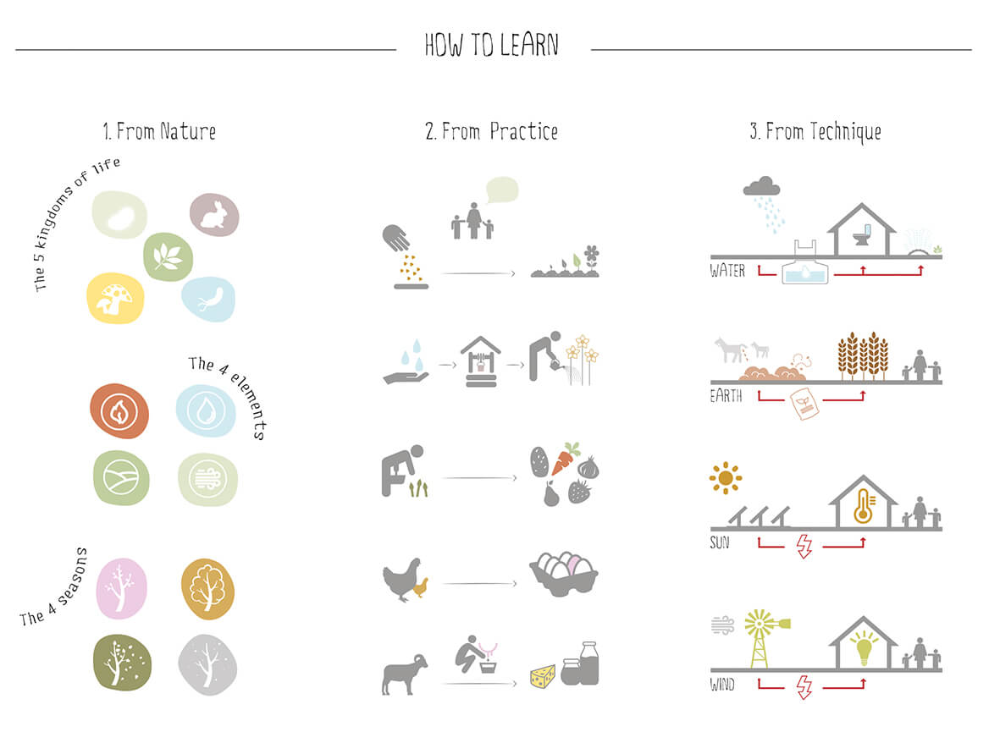

Coltivare all'asilo può accompagnare i bambini nel processo di conoscenza dell'ecosistema?

Quanto è urgente rinnovare l'istruzione infantile in tal senso? Come offrire nuovi stimoli ai più piccoli e metterli in contatto diretto col mondo che li circonda? Serve che il mondo dell'istruzione abbia un taglio più ambientalista?

Come rinnovare l'**istruzione infantile**? Come offrire nuovi stimoli ai più piccoli e metterli in contatto diretto con il mondo che li circonda?

A queste domande hanno dato una risposta i quattro architetti di [aut- -aut](http://www.aut--aut.it): Gabriele Capobianco, Jonathan Lazar, Edoardo Capuzzo Dolcetta e Davide Troiani.

Insieme hanno ideato un progetto che coniuga **infanzia e coscienza ambientale**. Si chiama **Nursery Fields Forever** e propone, sostanzialmente, di coltivare all'asilo.

In base a questo progetto, fin dalla più tenera età i bambini hanno la possibilità di avvicinarsi all'agricoltura urbana interagendo con piante e animali, sperimentando in prima persona.

La loro proposta ha suscitato moltissimo interesse mediatico e si è aggiudicata il primo premio al concorso di idee _London Nursery School_ indetto da [AWR Competitions](http://www.awrcompetitions.com).

Una possibile risposta giunge dai quattro architetti di _[aut- -aut](http://www.aut--aut.it)_, all'anagrafe Gabriele Capobianco, Jonathan Lazar, Edoardo Capuzzo Dolcetta e Davide Troiani.

Insieme hanno ideato un progetto che coniuga infanzia e **coscienza ambientale**, _Nursery Fields Forever_, ovvero l'orto nell'asilo: fin dalla più tenera età, i bambini hanno la possibilità di avvicinarsi all'**agricoltura urbana** interagendo con piante ed animali, sperimentando in prima persona.

La proposta di questo giovane team ha suscitato moltissimo interesse mediatico e si è aggiudicata il primo premio al concorso di idee London Nursery School indetto da [AWR Competitions](http://www.awrcompetitions.com).

Ecco la mia intervista a Jonathan Lazar.

### Ciao, Jonathan! Presentiamo _aut- -aut_: di cosa si occupa? Qual è la sua filosofia?

> Ciao, Anna! _aut- -aut_ è il luogo immateriale in cui alcuni giovani architetti hanno deciso di far convergere il loro impegno.
>
> È una piattaforma aperta, flessibile e orizzontale, capace di dilatarsi o di restringersi a seconda dell'esigenza e delle competenze necessarie per affrontare un certo tema.
>
> L'architettura in sé, oltre ad essere uno strumento di ricerca e di lettura critica del contesto e delle sue contraddizioni, convoglia un certo discorso attraverso la figurazione di spazi nuovi, a volte provocatori.

### Qualche giorno fa sono venuta a conoscenza della vostra proposta: coltivare all'asilo. È fantastica! Ti va di raccontarmi com'è nata questa idea?

> Certo! C'è bisogno di **lavorare all'approccio educativo dell'asilo**, piuttosto che ai suoi spazi. L'innata propensione all'esplorazione della natura che i bambini possiedono non è valorizzata dalla scuola.
>
> Serve proporre un'**inversione di tendenza** attraverso la diffusione di un approccio che, per quanto semplice, sia provocatorio. Anche così potrà suscitare l'interesse delle persone.

### Quale consapevolezza ambientale viene normalmente trasmessa ai più piccoli all'interno degli asili e delle scuole materne?

> La relazione con l'orto e gli animali è quasi sempre limitata a momenti dedicati o a sporadiche visite a fattorie didattiche. Le giornate dei piccoli devono essere pervase dal rapporto con la natura ed essere scandite dal suo ritmo. Devono essere messi nelle condizioni di poter **coltivare all'asilo insieme agli adulti**, ad esempio.
>
> I bambini, soprattutto quelli che abitano le grandi città, ignorano i processi naturali più elementari. Alcuni non conoscono l'origine del latte o pensano che i fagioli crescano in barattoli di latta!
>
> C'è una forte **mancanza di esperienza diretta** e una **negazione processuale** generata dall'egemonia industriale del comparto agroalimentare.

### Coltivare all'asilo è il principale obiettivo del vostro progetto? Quale apprendimento viene proposto?

> Speriamo che _Nursery Fields Forever_ solleciti la nascita di asili in cui lo sviluppo emozionale, cognitivo e sociale dei bambini sia stimolato dall'**interazione con piante e animali**. Ma anche dalla collaborazione tra compagni che condividono una missione comune.
>
> Le nostre spazialità ibridano ambienti scolastici classici e ambienti agricoli. A una divisione in classi si preferisce una routine giornaliera basata sulla cura di piante e animali.
>
> Crediamo che sia necessario **sviluppare una coscienza ambientale fin dall'infanzia**. Coltivare all'asilo potrebbe contribuire proprio in tal senso.
>
> Questa stessa coscienza ambientale farà di loro degli adulti capaci di compiere scelte di consumo memori dell'esperienza vissuta.

### Avete già sperimentato l'idea di coltivare all'asilo? Qualche struttura si è già resa disponibile?

> No, ancora no. La volontà propagandistica alla base della scelta del metodo di rappresentazione del progetto è stata premiata dall'**ampia risonanza mediatica**. E poi anche dall'interesse diffuso per un rinnovamento dell'istruzione infantile in chiave ambientalista.
>
> Speriamo che questo interesse si traduca presto in qualcosa di concreto. Noi siamo pronti a sviluppare l'idea iniziale che abbiamo proposto.

### Un'ultima domanda prima di salutarci: cosa vi attende nei prossimi mesi?

> Ognuno di noi sta portando avanti progetti indipendenti e, insieme, stiamo lavorando a nuove proposte per concorsi. Alcune di esse affrontano ancora il tema dell'educazione infantile.
