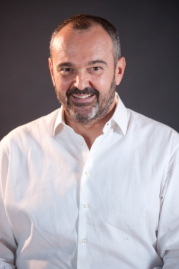
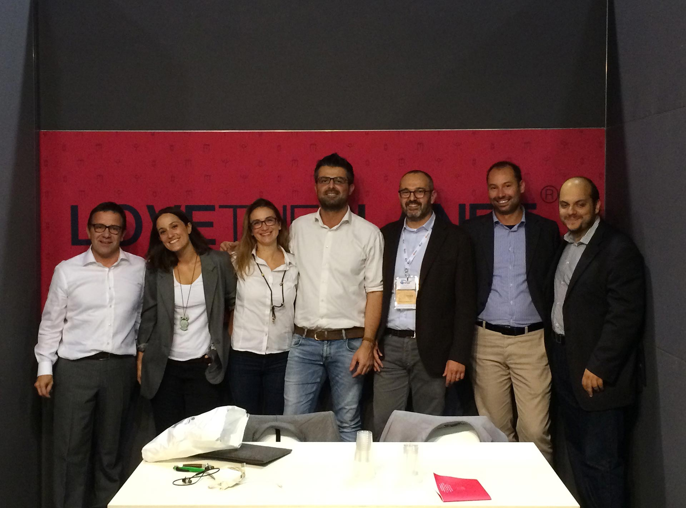

Una rete di imprese sostenibili capace di avviare e di promuovere una moltitudine virtuosismi. Implementare e sviluppare nuovi modelli decisionali a sostegno dell'ambiente. Contribuire ogni giorno al lento (ma necessario) cambiamento del nostro Paese, sia sul piano culturale, sia su quelli sociale ed economico.

È esattamente a questo scopo che è nata [LoveThePlanet](http://www.lovetheplanet.eu/it/), la prima rete di imprese sostenibili italiane dedicata al *green*.
L'intervistato di questa settimana si chiama **Lorenzo Orlandi**, membro di LoveThePlanet e Amministratore di Locom, una società di Project Management coinvolta in green marketing e comunicazione strategica.
LoveThePlanet, come MyHumus, è una realtà insediata a [Progetto Manifattura](http://www.progettomanifattura.it).

### Dott. Orlandi, mi dica: quanto viene presa in considerazione la sostenibilità nel nostro Paese? C'è attenzione verso l'ambiente?

> Ciao, Anna. Oggi i più sensibili al tema sono i consumatori finali che scelgono sempre meno a caso. **Le persone optano per marchi più vicini all'ambiente** che sentono come più seri e coerenti, anche se questo significa pagare di più.
>
> Questo è stato subito percepito da alcuni settori, in particolare dall'industria alimentare e dalle utilities.
>
> Negli ultimi anni si è confuso la sostenibilità col *greenwashing*. Molte aziende e organizzazioni hanno dato un'immagine positiva di sé, dei propri prodotti e delle attività senza un effettivo investimento nell'adozione di modelli di business sostenibili.
>
> In Italia siamo agli albori, ma la collettività ha voglia di vivere in un mondo in cui le ricadute delle attività umane sull'ecosistema siano più gestibili di quanto avvenuto finora.
>
> LoveThePlanet può essere considerata una realtà di forte innovazione. Siamo **consulenti della sostenibilità a tutto tondo**, ciascuno con una forte *expertise* in uno dei settori chiave della sostenibilità.
>
> Affianchiamo i clienti nell'operatività dei progetti offrendo loro un supporto con il minimo impiego di risorse interne dei clienti.

### In che modo lavora LoveThePlanet? Lo definite una rete di imprese sostenibili: di cosa si tratta, esattamente?

> Sì, LoveThePlanet è una rete di imprese sostenibili. La Rete ci permette di essere indipendenti, agili, focalizzati ed aggiornati su tutte le competenze necessarie per rispondere al meglio.
>
> Ecco un esempio: se un Comune ha bisogno di stendere un PAES, cioè un *Piano d'azione per l'energia sostenibile*, sarà identificato come Project Manager il nostro consulente in finanza agevolata. Lui, a sua volta, potrebbe coinvolgere un Energy Manager, se non addirittura un consulente per la comunicazione strategica capace di coinvolgere al meglio gli stakeholder.

### Chi sono i clienti della vostra rete di imprese sostenibili?

> Noi forniamo **consulenze e servizi avanzati per la sostenibilità** a imprese, organizzazioni e Pubblica Amministrazione. Un Comune potrebbe avvicinarsi alla nostra rete per redigere un PAES, o per strutturare azioni di risparmio energetico e riduzione delle emissioni.
>
> Un'azienda privata, invece, potrebbe aver bisogno di un percorso per la redazione del bilancio di sostenibilità. Potrebbe voler verificare la propria efficienza energetica, comunicare e fare engagement con gli stakeholder. Potrebbe anche voler analizzare e tracciare la propria filiera produttiva attraverso una Supply Chain Analysis.

### Coloro che si affidano ai vostri servizi vengono affiancati da un consulente?

> Ciascun membro della nostra rete di imprese sostenibili può proporsi nella definizione e nella realizzazione di un progetto che seguirà come Project Manager.

### Perché rivolgersi a LoveThePlanet?

> Perché siamo **organizzati**, ma **flessibili**. Siamo **innovatori**, ma con un **approccio semplice**. Siamo **iperspecializzati**, ma **aperti**.
>
> E possiamo essere **accessibili**, poiché accompagniamo le imprese in un percorso in cui crediamo anche noi: un progetto che costruiamo insieme.
>
> Ne è un esempio l'intervento di mobilità sostenibile in una Regione del Nord Italia, che si sta trasformato in un modello di turismo sostenibile. Questo progetto non sarebbe stato possibile senza la totale fiducia del Cliente.

### In quali zone d'Italia siete coinvolti?

> In questo momento lavoriamo nel Nord-Ovest.

Foto di copertina: [Aufstieg zur Trutziger Hütte](http://www.flickr.com/photos/42645785@N04/4239305927) via [Photopin](http://photopin.com).
