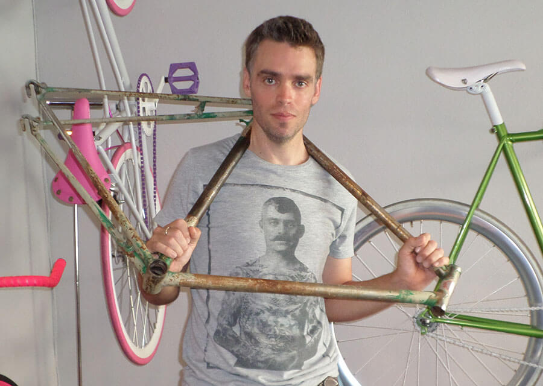
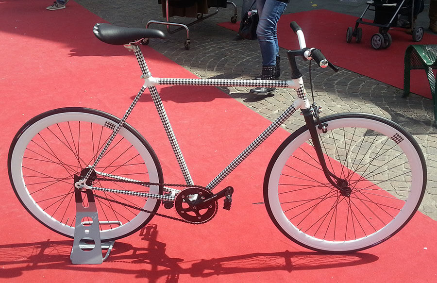
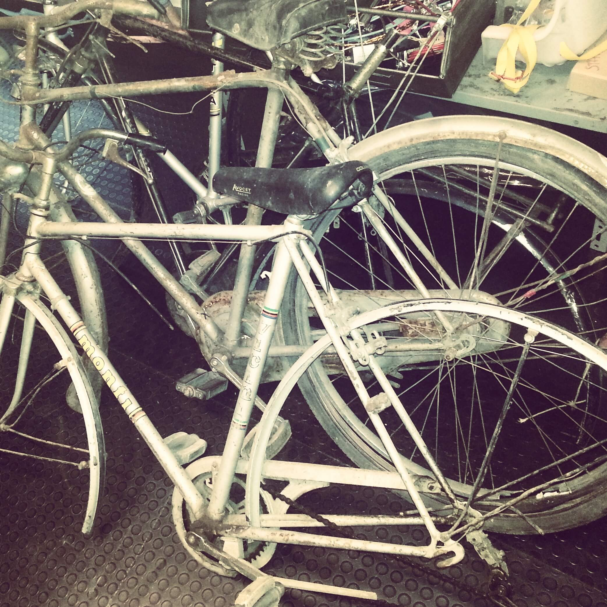
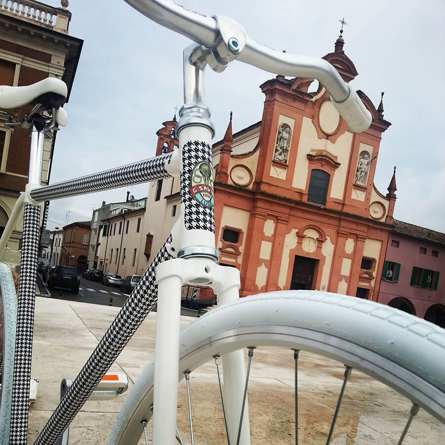
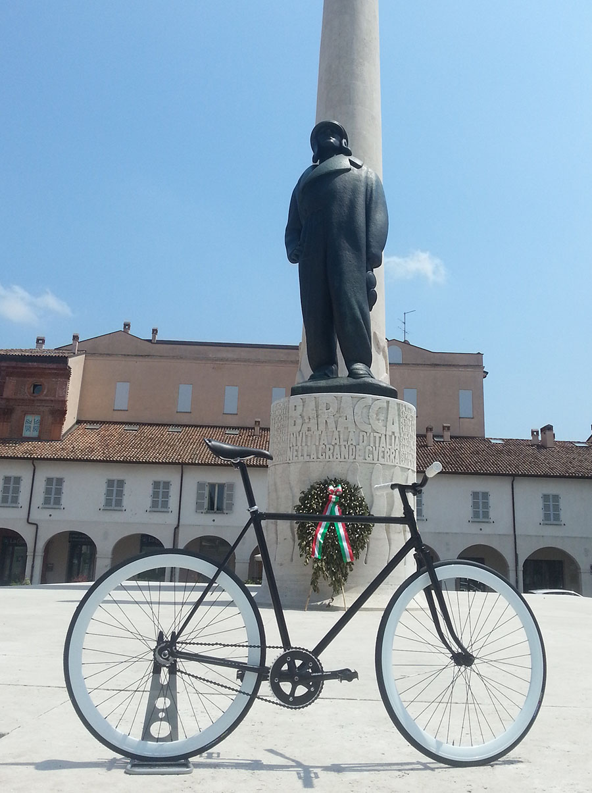
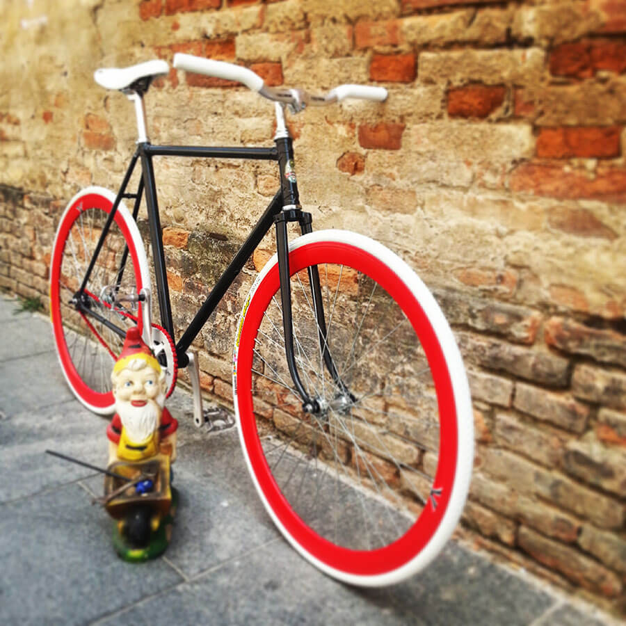

MyHumus è un progetto che nasce dal cuore. Da quello mio, certo, ma anche da quello di tutti coloro che accettano di lasciarsi intervistare. Sono persone che non si limitano a presentarsi rispondendo alle mie domande: contribuiscono in prima persona a divulgare la sostenibilità, tema che mi sta molto a cuore.

Ognuno, a proprio modo, lascia qualcosa su MyHumus. Questa settimana tocca a un appassionato ciclista che, per hobby, realizza bici fatte a mano in Romagna.
Tutto è iniziato da una telefonata del mio amico [Giorgio Minguzzi](http://www.giorgiominguzzi.com). Mi fa: *"Anna, devo parlarti di un amico che è più pazzo di me: si chiama Luca e si occupa di bici"*.

Accattivante, come anticipazione. E poi, figuriamoci, la parola *"bicicletta"* mi mette subito sull'attenti.
E allora viiiiiiaaaa, alla volta di via Carlo Pisacane 2 a Lugo di Romagna, in provincia di Ravenna!
È qui che risiede la piccola officina di [Luca Savini](https://www.facebook.com/luca.savini.754?fref=ts), un ciclista il cui DNA è a forma di bici da corsa e di mountain bike.

### Ciao, Luca. Benvenuto su MyHumus! Quando ti sei appassionato al mondo della bici?

> Ciao, Anna! Mio nonno, a suo tempo, gestiva un negozio di biciclette, mentre mio padre Glauco è stato un ciclista professionista. Ha fatto parte della Compagnia Speciale Bersaglieri Atleti e gareggiava a livello professionistico.
>
> Da ragazzino andava a scuola in bicicletta, percorrendo una cinquantina di chilometri. È così che si è appassionato a questa disciplina. La mia passione, invece, è nata all'età di 12 anni, quando ero un ragazzino impegnato col nuoto.
>
> Dopo una pausa abbastanza lunga, mi sono riavvicinato a questa disciplina dopo un incidente avvenuto durante il mio viaggio di nozze. Pensa che, a seguito di un tuffo riuscito male, sono rimasto paralizzato dal collo in giù!
>
> Rientrato in Italia, ho deciso di comprare una mountain bike promettendomi di salirci sopra il prima possibile. Quella decisione è stata la molla che ha fatto scattare la mia fiducia nella guarigione.
>
> Dopo un duro ciclo riabilitativo, mi sono rimesso in piedi e ho riacquistato il pieno controllo del mio corpo. La bici, da quel momento in poi, è divenuta necessaria.
>
> Mi sono appassionato alla bici, ma anche alla performance. L'alimentazione, ad esempio, è diventata prioritaria.
>
> Quando penso alla bici mi torna sempre in mente una famosa citazione di Alfredo Oriani, poeta che correva in bici: *"La bicicletta siamo noi, che vinciamo lo spazio e il tempo: soli, senza nemmeno il contatto con la terra che le nostre ruote sfiorano appena*.
>
> Anch'io, in sella alla mia bici, sento di vincere lo spazio e il tempo!

### Perché hai deciso di aprire un'officina e di realizzare bici fatte a mano in Romagna?

> Quello che svolgo nella mia officina è un bellissimo hobby. Io sono, innanzitutto, un geometra.
>
> L'avventura dell'officina è iniziata circa tre anni fa. Grazie agli insegnamenti di mio padre, mi divertivo a riparare e a mettere a nuovo le bici degli amici.
>
> Le riparazioni, da sempre, hanno un discreto costo e ci sono due possibili strade: imparare a fare da sé o soccombere ai prezzi del mercato. Le mie bici fatte a mano in Romagna puntano alla qualità garantita nel tempo.

### Dimmi, quali sono le caratteristiche delle tue bici?

> Di solito realizzo **bici con freno a contropedale, bici da corsa e scattofisso**.
>
> **Lavoro su telai vecchi a cui dono nuova vita e nuove sembianze**, ovviamente sulla base delle richieste del cliente). Ricorro anche a telai nuovi di importazione, che personalizzo con diverse tecniche come, ad esempio, il *wrapping*. Questa, ad esempio, permette di modificare l'aspetto della bici in mille modi diversi grazie all'applicazione di particolari pellicole sul telaio.
>
> In una settimana riesco a trasformare i **vecchi telai in articoli giovani e attuali**. Nel caso debba assemblare e personalizzare dal nulla un'intera bici, ruote comprese, impiego almeno un mese di tempo.
>
> Amo molto lavorare i telai in acciaio perché ritengo siano quelli meglio recuperabili per realizzare le mie bici fatte a mano in Romagna.

### È il momento del domandone da un milione di dollari: sogni nel cassetto?

> Come primo step, **vorrei trovare un telaista italiano** con cui mettere a punto quello che ho in mente. Dopodiché vorrei personalizzarlo. E mi piacerebbe tantissimo realizzare bici di legno.

Luca, al momento, non ha ancora un sito. Nel caso vogliate mettervi in contatto con lui, ecco i suoi contatti:
Telefono: [+39 349 3686146](tel:+39-349-3686146)
E-Mail: [luca.savini75@gmail.com](mailto:luca.savini75@gmail.com)

Foto di copertina: [Pån-Kristian Hamre](http://www.flickr.com/photos/35112337@N05/7914616282) via [Photopin](http://photopin.com).*
