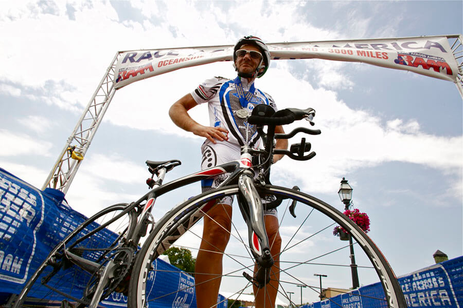

Ci sono tantissime storie di ciclismo appassionanti, in giro, e questa settimana voglio raccontarvene una io.
C'è qualcuno, in quel di Forlì, che ha deciso di attraversare gli USA a bordo della propria bicicletta da corsa: si chiama [Luigi Barilari](http://www.luigibarilari.it/wordpress/), classe 1955.

Luigi è una persona sorridente, senza paura e con un fantastico accento romagnolo. La sua è una di quelle storie che continueresti ad ascoltare per ore. I suoi occhi brillano, quando la racconta.
Luigi e la sua umiltà, Luigi e le sue storie di ciclismo, Luigi e la sua vita dedicata alla continua sfida con sé stesso.

### Luigi, da dove è spuntata fuori questa tua passione per la bici? Me lo dici?

> Ciao, Anna! È nata quando ero un ragazzino. Pensa che ho dovuto abbandonarla per colpa del mio medico di famiglia: diceva che il mal di stomaco, di cui spesso soffrivo, fosse dovuto a lei!
>
> Ho ripreso col ciclismo dopo essermi sposato, quando i miei figli erano già abbastanza grandi, continuando alcuni anni per poi smettere di nuovo.
>
> È nel 1996 che ho ripreso con una certa frequenza, e ciò che mi ha spinto a rimettermi in sella è stato l'interesse di mio figlio Gianluca verso questa disciplina sportiva.
>
> I migliori anni del nostro rapporto sono stati proprio quelli in cui abbiamo pedalato insieme: Gianluca è stata la molla che mi ha motivato a rimettermi in sella.
>
> Nel 1996 ho affrontato la mia prima [Nove Colli](http://www.novecolli.it), la più importante granfondo del nostro territorio: in 6 ore e 45 minuti ho percorso 130 km.
>
> Nel 2002 è stata la volta del mio primo Prestigio, un percorso dato da 7 diverse corse che formano uno dei circuiti più belli di tutta Italia.

### E poi? Continua a raccontare: la tua storia già mi appassiona!

> Nel 2004 ho fondato il [Team Outsider](http://www.luigibarilari.it/TeamOutsiders_Storia.html), attivo ancora oggi.
>
> Nell'ambito delle granfondo, la mia miglior prestazione è stata la Nove Colli del 2006: 200 km percorsi in 6 ore e 45 minuti! Nel mondo delle granfondo c'era molto agonismo, ma sentivo di voler guardare la bici con altri occhi. Le mie prestazioni sulle lunghe percorrenze, tra l'altro, erano buone.
>
> È così che, dopo aver partecipato alla Rimini-Viareggio, mi sono appassionato al mondo delle randonnée, stimolato anche dall'amico Giorgio Zauli. Nel 2007 ho accompagnato Giorgio alla randonnée più famosa d'Europa, la [Parigi-Brest-Parigi](http://www.paris-brest-paris.org), promettendomi di affrontarla anch'io.
>
> Così ho iniziato a _macinare_ sempre più km: 400..500..fino ai miei primi 900 km nella Sorrento-Tropea-Sorrento. Un tragitto, quello, che ho percorso con Carla Sedioli, la ciclista insieme alla quale avevo partecipato alla Rimini-Viareggio.
>
> Nel 2010 ho raggiunto il traguardo della [1001 Miglia](http://www.1001migliaitalia.it), la randonnée più lunga d'Europa: 1660 km percorsi in 88 ore.
>
> La Parigi-Brest-Parigi l'ho affrontata nel 2011, ed è stata una gran bella soddisfazione! Due anni fa, invece, ho conseguito [La Magnifica](http://www.granfondolamagnifica.it), la granfondo di 130 km che inizia e finisce a Forlì.

### Che cos'è la bici, per te?

> La bici è una valvola di sfogo, è **salute**, **libertà**, **energia**, **adrenalina**, e ti aiuta a vedere le cose più chiare e in positivo. Pensa che **molti dei miei problemi li ho risolti pedalando**. La bici mi ha reso ottimista.

### Bene, ora parliamo della più incredibile fra le tue storie di ciclismo: la RAAM (Race Across America). Quando e perché hai deciso di cimentarti in questa avventura?

> Quando si parla di [RAAM](http://www.raceacrossamerica.org/raam/raam2.php?N_webcat_id=1) si fa riferimento all'_ultracycling_, cioè a una competizione in solitaria. È il mitico _coast to coast_ degli Stati Uniti, però fatto a ritroso rispetto al cammino dei pionieri dell'800.
>
> Il mio interesse nei suoi confronti è nato dalla mia passione per le randonnée. Nel 2011, inoltre, avevo partecipato alla presentazione di uno dei 9 italiani che avevano preso parte alla RAAM, la prima e unica donna ad aver affrontato l'avventura: Sabrina Bianchi. Dopo quell'incontro, la Race Across America è ufficialmente divenuta la mia ossessione: non potevo farmela scappare. Sarebbe entrata fra le mie storie di ciclismo, senza alcun dubbio!
>
> Ho subito chiesto a Mauro Farabegoli, il team manager di Sabrina, di accompagnarmi in questa nuova avventura: **attraversare l'America da costa a costa in un tempo massimo di 12 giorni**.
>
> Abbiamo fondato un team e, da fine 2011, ci siamo incontrati ogni mese per studiare l'organizzazione dell'impresa e conoscerci più a fondo.
>
> La mia preparazione ha richiesto un anno e la sfida è giunta nel 2012.
>
> La **Race Across America** non è affatto semplice da fronteggiare: ho percorso 4.870 km in 11 giorni e 22 ore (dopo i primi 900 km, sono iniziati i primi dolorini al fondoschiena...).
>
> Sono partito da Ocean Side, in California, e sono arrivato ad Annapolis, nel Maryland, pedalando mediamente per 20 ore al giorno. Una faticaccia!

### Quali Stati hai attraversato?

> Parecchi: California, Arizona, Utah, Colorado, Cansas, Missouri, Illinois, Indiana, Ohio, West Virginia, Pennsylvania e Maryland.

### E il tuo team di supporto tecnico?

> Il furgoncino di supporto è stato sempre dietro di me. Il gruppo tecnico era composto dal team manager Mauro Farabegoli, da diversi autisti, dal cuoco e da un video operatore.
>
> **Senza il mio gruppo non ce l'avrei fatta**: sono stati loro a comunicarmi le direttive attraverso il megafono installato sul furgone. E sono stati sempre loro a impormi di mangiare e di bere a intervalli regolari.
>
> Di notte avevano paura che mi addormentassi in sella alla bici, così diffondevano la musica sul mio smartphone con l'altoparlante!

`youtube: 94H9rN3HTVI`

### Le storie di ciclismo, certe volte, implicano anche il timore di non farcela. Hai mai avuto paura, Luigi? Hai mai pensato di non farcela?

> Sì, ho avuto diversi momenti di sconforto. Il tragitto non è stato semplice, alcuni tratti di strada sono stati piuttosto pericolosi.
>
> A darmi la forza è stata la **voglia di farcela** e di **non deludere il mio team di supporto tecnico**: tutti lavoravano affinché potessi dare il massimo, giorno dopo giorno.

### Quanto ti ha emozionato giungere al traguardo della RAAM?

> Quando sono arrivato alla fine, l'emozione è stata enorme, non trovo le parole per definirla.
>
> **Sono diventato l'eroe dei miei nipotini!** Al mio ritorno, Forlì mi ha accolto con una grande festa, sono stato addirittura premiato.

### Prima di salutarci, dimmi: qualcuno, durante quei festeggiamenti, ha detto qualcosa che ti ha colpito?

> Una ragazza, dopo aver visto il video dell'avventura, ha detto: '_È bellissima l'umiltà con cui avete affrontato questa esperienza_'. Quello è stato il complimento più bello.

