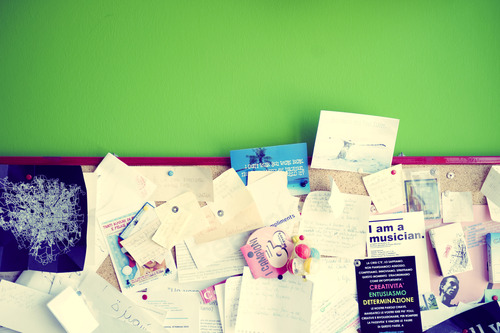
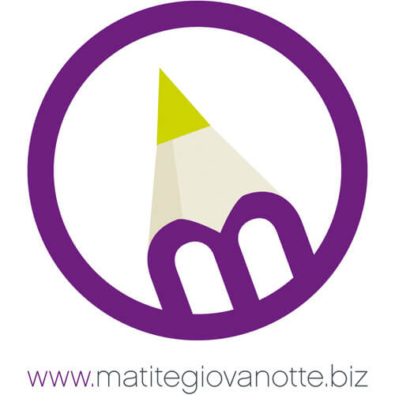
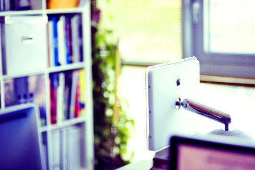
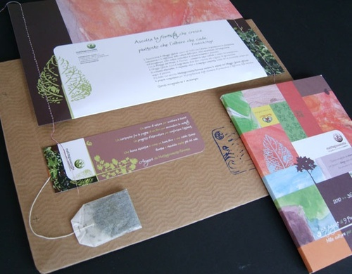
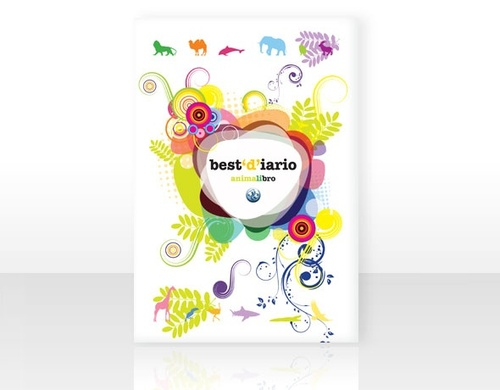
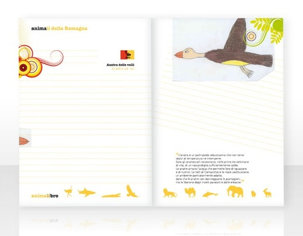
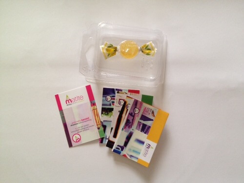

[Matitegiovanotte](http://www.matitegiovanotte.biz) è un'agenzia di comunicazione a Ravenna che si occupa di advertising, retail design e viral, consulenza marketing, grafica e molto altro. Le persone che ci lavorano sono principalmente designer, art director e copywriter.

Antonella Bandoli amministra e dirige la sede ravennate di Matitegiovanotte.
Qualche giorno fa mi ha ricevuta nel suo ufficio, uno spazio super colorato in cui ogni monitor ribolle di creatività.

Da un po' di tempo, *Matite* ha iniziato a concentrare la propria attenzione anche sull'ambiente.
La sede ravennate, infatti, ha scelto di adottare diverse soluzioni *ecofriendly* capaci di trasformare tanti piccoli gesti quotidiani in **azioni di consumo consapevole**.
Voglio proprio saperne di più!

### Ciao, Antonella! Una curiosità: quand'è che ti sei avvicinata al mondo della creatività? E in che modo?

> Ciao, Anna! Ormai gli anni non si contano più. Diciamo fin da ragazzina, intorno alla metà degli anni '80, l'era dorata e "sprecona" dell'advertising.
>
> Sono sempre stata attratta dal linguaggio della creatività. Per questo ho intrapreso un percorso umanistico che mi ha portata dalla Facoltà di Lettere fino all'Università del Progetto. È, questo, il centro di formazione più eccentrico e avveniristico dell'epoca per le professioni creative.
>
> Vivo ancora di rendita. È stata una grande fortuna e un vero privilegio averla frequentata, peccato che oggi non esista più.

### Passiamo alla tua agenzia di comunicazione a Ravenna, Matitegiovanotte. In che modo si dimostra ecofriendly?

> Cerchiamo di **alimentare una cultura del rispetto per l'ambiente** attraverso azioni quotidiane mirate.
>
> Nel nostro piccolo studio ricicliamo la carta, la plastica, il vetro, le pile e i toner esausti. Di questi ultimi siamo anche collettori per i tanti altri uffici del nostro immobile attraverso la gestione di una piccola isola ecologica.
>
> Cerchiamo di realizzare **progetti con un'anima eco**. Un esempio è il piccolo gadget che contiene il nostro biglietto da visita: un mini blister di plastica che raccoglie quattro piccole brochure e una caramella.
>
> Il blister è lo scarto di un progetto che abbiamo realizzato per un nostro cliente, Reebok, che, essendo stato prodotto in abbondanza, sarebbe stato buttato via.
>
> Per quanto riguarda gli omaggi natalizi della mia agenzia di comunicazione a Ravenna, di solito ci affidiamo a soluzioni sostenibili. Ne sono un esempio i coloratissimi coprisella antipioggia ricavati dai sacchi con cui in Oriente si trasporta il riso. Per noi sono originali selle di Natale.
>
> 
>
> Ogni volta che possiamo, offriamo il nostro contributo gratuito di progettazione alle **iniziative del [Villaggio Globale](http://www.villaggioglobale.ra.it/home.php?Lang=it)** di Ravenna che gestisce, tra l'altro, le botteghe di Altro Mercato.
>
> Realizziamo **agende, calendari, quaderni, tutti stampati su carta ecologica**. Sono il frutto del lavoro degli educatori nelle scuole elementari per la promozione e la diffusione di una cultura dell'integrazione.
>
> Così è nato l'*Animalibro*, un quaderno pieno di animali esotici che raccoglie i disegni dei ragazzi. E poi c'è anche l'*Agenda degli Alberi*, il *Calendario delle Stoffe* e tanti altri.
>
> A Milano, da un paio d'anni, aderiamo al servizio di Car Sharing dell'Azienda di Trasporto Municipale. Lo facciamo grazie a un abbonamento annuale. È possibile prenotare dal web un'auto ecologica per gli spostamenti in città e fuori città. C'è anche l'accesso alle ZTL e ai parcheggi gratuiti!
>
> Sono piccole iniziative praticate da una piccola struttura, certo, ma per noi sono ricche di valenza etica.

### Perché ritenete che un'attività debba integrare soluzioni ambientalmente sostenibili all'interno della propria sede?

> Pensiamo sia un dovere di ciascun cittadino ma, soprattutto, delle aziende, che sicuramente hanno maggiori occasioni di spreco e di contaminazione.
>
> Penso spesso all'adesivo che si trova in molte camere di hotel, quello che invita a riflettere prima di cambiare la biancheria dopo un solo uso. Vale lo stesso anche per la nostra agenzia di comunicazione a Ravenna.
>
> Un asciugamano in più da lavare forse incide pochissimo sull'equilibrio ambientale, ma è la somma a impattare in modo determinante.

### Nella vostra agenzia di comunicazione a Ravenna avete in mente altre soluzioni green per il 2014?

> L'anno è appena iniziato e continueremo ad agire il più possibile nel rispetto dell'ambiente. **Inviteremo i nostri clienti a una riflessione di sostenibilità sui progetti che intenderanno avviare**.
>
> Questa intervista è già un piccolo primo passo e sono convinta che MyHumus possa dare un forte contributo alle aziende in termini di consapevolezza ambientale per le aziende. Parafrasando una celebre missione stellare, mi sembra '*un passo da gigante per la comunità!*'
>
> Di questa viralità c'è molto bisogno, queste sono le uniche iniziative che dovrebbero *impattare* sull'ambiente.

