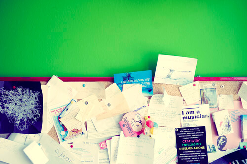
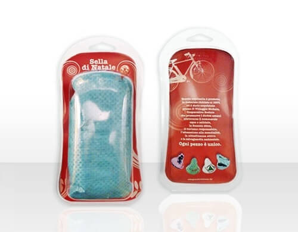
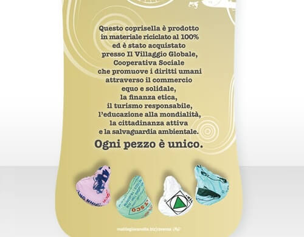

Matitegiovanotte è uno studio di design e di comunicazione che nasce più di 20 anni fa a Forlì.

A partire dal 2007, però, una parte della società si distacca per aprire la sede di Ravenna dalla quale, attualmente, dipende anche l'ufficio di Milano.

A "Matite" ([www.matitegiovanotte.biz](http://www.matitegiovanotte.biz)) ci si occupa di advertising, web&social, retail design e viral (ovvero di nuovi linguaggi di comunicazione commerciale e di nuove forme di coinvolgimento dei consumatori), consulenza marketing, progettazione, grafica, copywriting e di molto altro. Le persone che ci lavorano sono principalmente designer, art director e copywriter.

Antonella Bandoli amministra e dirige la sede ravennate di Matitegiovanotte.

Attiva, sorridente e super dinamica, mi ha ricevuta qualche tempo fa in ufficio: uno spazio giovane, con mille colori, in cui si gusta tutto il sapore di una creatività che ribolle in ogni monitor dello studio.

Insomma, a Matite c'è una bella atmosfera. E vi dirò di più: c'è anche attenzione nei confronti dell'ambiente.

La sede ravennate, infatti, ha deciso di adottare diverse soluzioni *eco-friendly* che trasformino i tanti piccoli gesti quotidiani in azioni di consumo consapevole.

Mi rivolgo ad Antonella per saperne di più...

### Ciao Antonella! Una curiosità: come e quando ti sei avvicinata al mondo della creatività?

> Ciao Anna! Ormai gli anni non si contano più. Diciamo fin da ragazzina, intorno alla metà degli anni '80, l'era dorata (e "sprecona") dell'advertising.
> 
> Sono sempre stata attratta dal linguaggio della creatività, per questo ho intrapreso un percorso umanistico che mi ha portata dalla Facoltà di Lettere fino all'Università del Progetto, il centro di formazione più eccentrico e avveniristico dell'epoca per le professioni creative.
> 
> Vivo ancora di rendita. È stata una grande fortuna ed un vero privilegio averla frequentata, peccato che oggi non esista più.

### Ora parliamo di Matitegiovanotte. In che modo si dimostra eco-friendly?

> Cerchiamo di alimentare una cultura del rispetto per l'ambiente attraverso azioni quotidiane e mirate.
> 
> Nel nostro piccolo studio (sia a Ravenna che a Milano) ricicliamo la carta, la plastica, il vetro, le pile e i toner esausti; di questi ultimi siamo anche collettori per i tanti altri uffici del nostro immobile attraverso la gestione di una piccola isola ecologica.
> 
> Cerchiamo anche di realizzare progetti con un'anima *eco*, come ad esempio il piccolo gadget che contiene il nostro biglietto da visita: un mini blister di plastica che raccoglie quattro piccole brochure ed una caramella.
> 
> Il blister è lo scarto di un progetto che abbiamo realizzato per un nostro cliente, Reebok, che essendo stato prodotto in abbondanza, per motivi di ordini minimi da rispettare, sarebbe stato altrimenti gettato via senza avere una seconda opportunità di vita.
> 
> Per quanto riguarda i nostri omaggi natalizi, solitamente ci affidiamo a soluzioni ambientalmente sostenibili: ne sono un esempio i coloratissimi coprisella anti-pioggia ricavati dai sacchi con cui in oriente si trasporta il riso, divenuti per noi delle originali "Selle di Natale".
>
> 
>
> Inoltre, ogni volta che possiamo, offriamo il nostro contributo gratuito di progettazione alle iniziative del Villaggio Globale di Ravenna che gestisce, tra l'altro, le botteghe dell'Altro Mercato.
> 
> Quindi realizziamo agende, calendari, quaderni (tutti stampati su carta ecologica) che sono il frutto del lavoro degli educatori nelle scuole elementari per la promozione e la diffusione di una cultura dell'integrazione.
> 
> Così è nato l'"Animalibro" - un quaderno zeppo di animali esotici che raccoglie i disegni dei ragazzi - poi l'"Agenda degli Alberi", il "Calendario delle Stoffe"...e tanti altri.
> 
> Infine a Milano, da un paio d'anni, aderiamo al geniale servizio CAR Sharing dell'Azienda di Trasporto Municipale mediante il pagamento di un abbonamento annuale; è possibile prenotare dal web, al bisogno, un'auto ecologica ad ore per gli spostamenti in città e fuori città (con accesso alle aree ZTL e con tutti i parcheggi gratuiti!).
> 
> Sono piccole iniziative praticate da una piccola struttura ma, per noi, ricche di valenza etica.

### Perché ritenete che un'attività debba integrare soluzioni ambientalmente sostenibili all'interno della propria sede?

> Pensiamo sia un dovere di ciascun cittadino ma, soprattutto, delle aziende, che sicuramente hanno maggiori occasioni di spreco e di "contaminazione".
> 
> Penso spesso all'adesivo che si trova in molte camere di hotel, quello che invita a pensare prima di decidere se cambiare la biancheria dopo un solo uso, e alla moltiplicazione di questa prassi per tutti gli hotel del mondo ogni giorno. Vale lo stesso anche per la nostra attività.
> 
> Un asciugamano in più da lavare forse incide pochissimo sull'equilibrio ambientale, ma è la somma che impatta in maniera determinante.

### Avete in mente altre soluzioni green per il 2014?

> L'anno è appena iniziato e, certamente, continueremo ad agire il più possibile nel rispetto dell'ambiente, essenzialmente invitando i nostri clienti ad una riflessione di sostenibilità sui progetti che intenderanno avviare.
> 
> Questa intervista è già un piccolo primo passo e sono convinta che questa tua idea di blog sul grado di consapevolezza ambientale per le aziende sia - parafrasando una celebre missione stellare - '*un passo da gigante per la comunità*'.
> 
> Di questa viralità ci sarebbe molto bisogno, queste sono le uniche iniziative che dovrebbero "impattare" sull'ambiente.
> 
> Grazie e complimenti per il tuo lavoro!.

