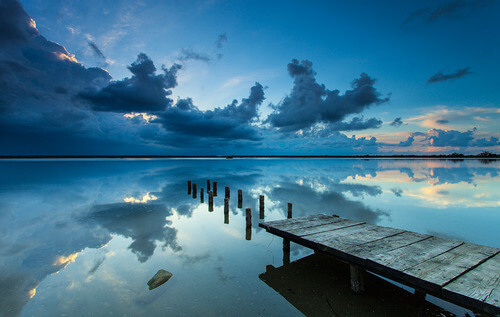
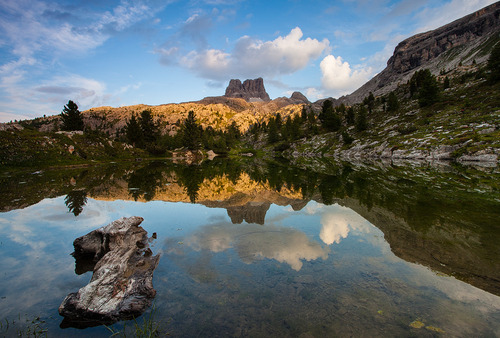
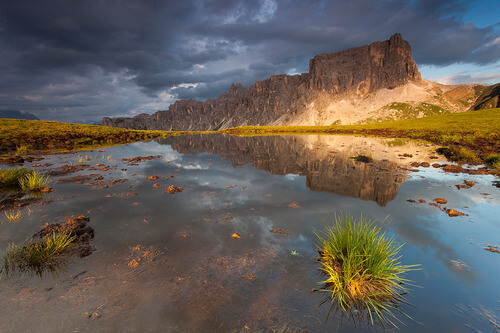
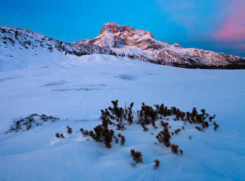
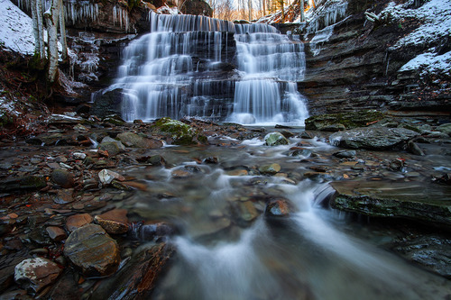

Lo scorso anno, in occasione della festa del 1 maggio, io ed alcuni amici organizzammo un fantastico brunch primaverile vicino alle valli di Sant'Alberto, in provincia di Ravenna. Fra i partecipanti, oltre ai visi che già conoscevo, c'era anche un certo Matteo.

Quella fu una giornata fantastica, piena di parole e di musica, tuttavia non fu in quell'occasione che riuscii a conoscerlo meglio.

Accadde nei seguenti mesi estivi, in occasione di diverse uscite, che ebbi modo di scambiare due parole con lui e di vedere qualcuna delle sue foto (le trovate sul blog: [www.teozzstudio.com](http://teozzstudio.com)).

Sebbene in questi ultimi mesi stia facendo molti scatti in bianco e nero in quel di Venezia, più precisamente a strade, piazze e persone, nei mesi in cui lo conobbi erano soprattutto i paesaggi ad ispirarlo.

Ed è questo che mi colpì di Matteo: un ragazzo giovane, peraltro ancora studente universitario, che ama ritrarre il silenzio di una vallata, la maestosità di una montagna, i riflessi di un lago...

### Ciao Teo! Quando è nata la tua passione per la fotografia e qual è stata la tua prima macchina fotografica?

> Ciao Anna, prima di tutto vorrei ringraziarti per questa intervista.
> 
> La passione per la fotografia è nata una mattina di quattro anni fa. Dopo essermi svegliato, ripensando al sogno che avevo fatto, mi sono detto che avrei dovuto imparare a fotografare.
> 
> Da quel giorno mio nonno, appassionato anche lui di fotografia dagli anni '60, ha deciso di prestarmi la sua Canon Ftb a pellicola e, da quel momento, ho iniziato a scattare.
> 
> Successivamente sono passato al digitale partendo da una reflex base per poi arrivare, dopo quattro anni, ad un modello professionale.
> 
> Attualmente scatto con una 5D mkII e con una Canon Ae-1 a pellicola.

### Perchè fotografare il paesaggio?

> La passione per la fotografia di paesaggio è nata un giorno in cui guardavo alcune foto su un forum della Canon di un ragazzo di Mestre, Marco Dian. Le Dolomiti le avevo vissute fin da quando ero bambino grazie ai miei genitori ma, a mio ricordo, non avevo mai visto tramonti così belli.
> 
> Guardando le sue foto mi sono letteralmente innamorato di quei paesaggi e ho deciso di unire la mia passione per la natura con quella, nascente, della fotografia.
> 
> Oltretutto, ho avuto modo di conoscere Marco. Ne è nata una bella amicizia.
> 
> La natura è una macchina perfetta che è sempre in grado di stupirti e di emozionarti. Con gli anni ho imparato ad apprezzare ciò che essa sa offrire in tutte le sue forme: dai colori stupendi e mozzafiato di un tramonto o di un'alba, al cielo stellato privo di inquinamento luminoso proveniente dalle città, al silenzio quasi opprimente degli inverni rigidi, quando la neve attutisce ogni suono e ti sembra di stare in una bolla, completamente escluso dal mondo esterno.
> 
> Amo, inoltre, la solitudine che la natura riesce ad offrire, il perdersi in solitaria seduto su una roccia ammirando tutta la vallata.
> 
> Tutto questo per me è vita...nulla di più, nulla di meno.
> 
> La fotografia paesaggistica, però, rimane una delle mie formazioni fotografiche. Adoro anche il reportage e la street.

### Quali sono i territori, italiani ed esteri, che hai visitato per i tuoi scatti? Che cosa cerchi nelle tue trasferte fotografiche?

> Principalmente ho fotografato in Italia. I nostri Appennini e le nostre Alpi sanno regalarti ottimi spunti, basta saperli cercare e immortalare al meglio nei vari periodi dell'anno.
> 
> Stupende, inoltre, sono anche le Alpi francesi che ho avuto il piacere di fotografare, sebbene in minima parte.
> 
> Quello che cerco nelle mie trasferte fotografiche è di rimanere ammaliato, stupito, esterrefatto, come dicevo nella domanda precedente, dalla natura e da ciò che sa offrire.
> 
> La fotografia passa in secondo piano anche se, principalmente, il viaggio è incentrato su di essa. Prima devo rimanere colpito io in prima persona, devo vivere la situazione, emozionarmi, per poi trasmettere parte di quel sentimento provato in una foto e a chi la guarderà.

### A quali fotografi ti ispiri?

> Mi ispiro a tanti fotografi, alcuni dei quali ho avuto il piacere di conoscere, insieme ad altri ho avuto anche la possibilità di fotografare, apprendendo e maturando molto.
> 
> Alcuni nomi sono [Marco Dian](http://www.marcodian.com), [Fortunato Gatto](http://www.fortunatophotography.com), [Andrea Pozzi](http://www.forgottenlands.it), [Hans Strand](http://www.hansstrand.com/Hans_Strand/Hans_Strand_Photography.html), [Alexandre Deschaumes](http://autumn-ethereal.smugmug.com), [Xavier Jamonet](http://www.ecrinsdelumiere.com), [Vincent Munier](http://www.vincentmunier.com) e la coppia degli [Haarberg](http://www.haarbergphoto.com).
> 
> Qui mi sto limitando a citare solamente fotografi naturalistici e paesaggistici. Tralascio tutti i documentaristi, fotografi di strada e molti altri. La lista diventerebbe troppo lunga!

### Prossimi viaggi in programma?

> Dolomiti a parte, dovrei ritornare in Cina a gennaio 2015. Inoltre, mi piacerebbe intraprendere la Transiberiana partendo da Mosca e arrivando fino a Pechino, per poi visitare la Mongolia e arrivare a sud fino al Tibet. Nei miei piani c'è anche l'India, un viaggio che ho promesso ad un'amica di famiglia che, purtroppo, ci ha lasciato l'anno scorso.
> 
> Questi sono solo alcuni dei tanti luoghi che vorrei avere la fortuna di visitare.
> 
> Spero di non smettere mai di viaggiare. Il viaggio amplia la conoscenza dell'uomo. Conoscere e vivere le varie culture è quanto di meglio una persona possa fare nella sua vita.

