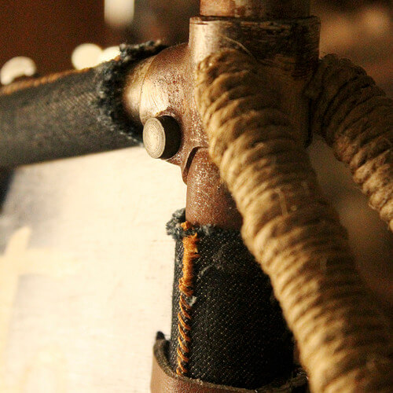
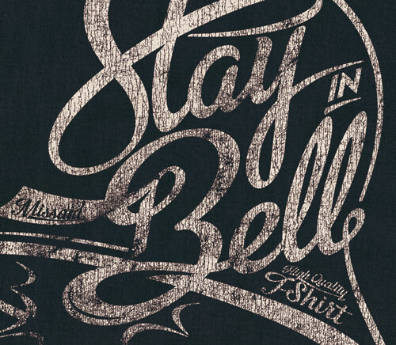
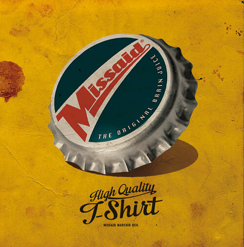

In Romagna vive l'ideatore di una linea di abbigliamento bicycle e skate che spacca. Il suo brand è nato così, durante una serata goliardica a base di nocino, in zona Monte Novo di Montiano.
La persona in questione si chiama Andrea Sansavini, è un mio carissimo amico, e il marchio è [Missaid](http://www.missaid.it). Ne avete mai sentito parlare?

Missaid produce abbigliamento e accessori che riportano i **detti popolari romagnoli** in una lingua che è metà inglese e metà romagnola. Diciamo che è una sorta di *anglo-romagnolo*.
L'anglo-romagnolo è un inglese maccheronico semplice da capire, diretto e spiritoso. Missaid, d'altronde, in inglese significa *detto male* e anticipa abbastanza il concetto di base.
**Missaid proviene da qui, dalla Romagna**. È un marchio che profuma di Sangiovese.

Il concept di questa linea mi ha divertita molto: *"Missaid è la saggezza popolare che tampona l'inglese per dare vita a una lunga serie di detti anglo-romagnoli"*.

Le *tiscert* Missaid vengono realizzate con una cura maniacale, così come il loro packaging: una custodia simil-vinile in perfetta linea con l'anima vintage del marchio.

Su alcune magliette della linea di abbigliamento bicycle e skate romagnola, è stato sperimentato l'*invecchiamento naturale Missaid*. I capi, sostanzialmente, vengono lasciati alle intemperie per un anno intero. La natura decide il risultato finale.
L'obiettivo è realizzarne una piccola serie invecchiata naturalmente.

Andrea produce buona parte dei suoi articoli in **cotone 100% organico**, coltivato senza OGM e senza fertilizzanti nocivi per le acque. Il tutto in un'ottica di rispetto per la biodiversità, il terreno e le comunità locali.
Il marchio Missaid, in buona sostanza, racchiude in sé **spirito creativo ed etica ambientale**. Fantastico!

### Ciao, Andrea! Quanto ti appassiona Missaid da 1 a 10?

> Ciao, Anna! Sicuramente 10. Questo progetto mi diverte, mi regala stimoli, voglia di fare e di disfare per poi rifare e ridisfare nuovamente!

### La tua linea di abbigliamento bicycle e skate Made in Romagna è veramente il top. Dimmi, com'è nata l'idea della cassettina porta-cover delle magliette? È fichissima!

> Grazie! Quando c'erano ancora le mezze stagioni e le strade erano sterrate, i nostri nonni usavano la bici per consegnare le bevande, trasportandole all'interno di una cassetta di legno.
>
> Voglio che le mie magliette vengano proposte in cassette di legno. I miei articoli di abbigliamento bicycle e skate sono freschi, ma arrivano da lontano e portano qualcosa di vissuto. Sono per chi abbia sete di saggezza popolare!

### Come ti è venuta l'idea dell'invecchiamento naturale?

> Nella moda si spende molto tempo per la ricerca di materiali e di tecniche per l'invecchiamento artificiale dei capi. Ma è solamente indossandoli e vivendoli che si ottiene il risultato migliore.
>
> E allora perché non farli indossare alla natura per un anno intero, mese dopo mese?

### Oltre all'abbigliamento bicycle e skate di qualità, che altro realizzi?

> In questa stagione ci sarà molta scelta: t-shirt, felpe, giacche, coppole. **Una linea di abbigliamento bicycle e skate tutta in divenire!**
>
> Non siamo ancora nei negozi, ma mi sto attrezzando. E, come si dice in questi casi, *stay in bell*!

### Andrea, oltre a curare il marchio Missaid sei anche grafico pubblicitario. Eppure, nel tuo garage, ho notato una bici in fase di restauro. Come ultima domanda, ti chiedo: ti occupi anche di bici?

> Sì, anche. La **passione per il restauro** è nata dopo aver ricevuto in regalo una vecchia Legnano degli anni '60. L'ho parcheggiata in garage e lì è rimasta per qualche anno.
>
> Un giorno mi è venuta voglia di allestirla in stile retrò. L'ho solo pulita: volevo che si capisse che arrivava da lontano. Eppure mancava qualcosa, un tocco *sartoriale*; allora mi sono armato di ago e filo e le ho cucito addosso del jeans. Bello!
>
> Ho cercato vecchie biciclette per mercatini. Le volevo semplicemente particolari. Da lì a poco ho trovato una Peugeot Model PE del 1971, bellissima ma conciata parecchio male.
>
> 
>
> L'ho completamente smontata e lucidata in tutte le sue parti, ma non me la sono sentita di riverniciarla. Aveva adesivi bellissimi e fregi fatti a mano su tutto il telaio. Il risultato è, a mio parere, un bel restauro conservativo in cui ho messo del mio
>
> E poi è arrivata la Rivola, su commissione. Rivola era un rinomato telaista della zona. Era, ed è ancora oggi, una bicicletta meravigliosa, con una componentistica di tutto rispetto.
>
> 
>
> Dopo la Rivola è arrivata la Vitali. Viste le sue condizioni, ho effettuato un vero e proprio restauro. Al momento sto smontando fino all'ultima sfera della guarnitura. Le gabbie, a quei tempi, non c'erano!

