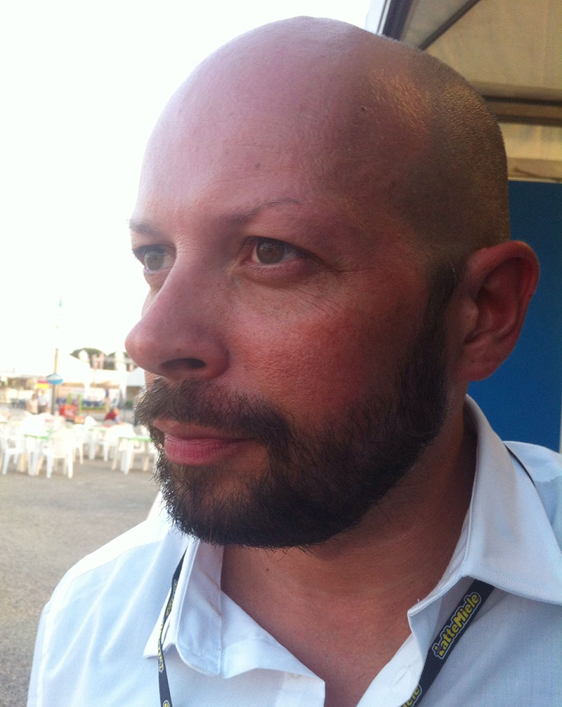

La mobilità sostenibile a Ravenna non è utopia. Spero solo che venga migliorata costantemente attraverso step concreti.
L'idea di realizzare questa intervista è nata durante un mio recente soggiorno a Vienna, la città di Freud, di Mozart e della Sacher torte. Ho visitato tutta la città in sella alla mia bici da turismo.

Chilometri e chilometri di meravigliose piste ciclabili si estendono lungo tutto il territorio urbano, consentendo a chiunque di raggiungere qualsiasi meta. Ogni giorno, famiglie biondissime e sorridenti le percorrono ordinatamente e col caschetto allacciato.
Alcune zone della città, ipoi, ospitano interi viali completamente chiusi al traffico! Un sogno.

La diligenza degli automobilisti è commovente, danno la precedenza ai ciclisti in qualsiasi momento.
A Vienna sembrerebbe regnare l'armonia universale fra automobilisti e ciclisti!

Il soggiorno viennese mi ha fatto riflettere sul concetto di mobilità sostenibile e sul grande significato che dovrebbe avere in qualsiasi contesto urbano. Un minor impatto ambientale in termini di inquinamento atmosferico e acustico. Meno territorio "mangiato" dalla costruzione di strade e di infrastrutture. Meno ingorghi cittadini e miglior viabilità stradale.
Vorrei solo che la mobilità sostenibile a Ravenna avesse sempre più importanza!

È alle amministrazioni pubbliche che spetta promuovere e attuare le **buone pratiche di mobilità** nel contesto urbano. Ecco perché intervistato Enrico Liverani, assessore ai Lavori Pubblici e alla Mobilità della mia Ravenna.

Il mio obiettivo è ottenere una risposta a questa domanda: _come se la cava, la mia città, in termini di mobilità sostenibile?_

### Gentile Ass. Liverani, è un piacere intervistarLa per MyHumus. Mi dica, quali sono i doveri di un Comune in questo senso?

> Salve, Anna. Nell'ambito della mobilità sostenibile a Ravenna, **promuoviamo gli spostamenti di persone e di cose, contenendo, per quanto possibile, le esternalità negative associate al traffico**.
>
> I primi effetti negativi dati dall'ambiente urbano sono, in primis, l'inquinamento atmosferico e quello acustico. Parlare di mobilità sostenibile in ambiente urbano significa orientare la mobilità di residenti e _city user_ così che questi possano privilegiare gli spostamenti sostenibili. Quindi le loro gambe, la bicicletta o i mezzi pubblici.
>
> Così facendo, si può contribuire anche al **miglioramento delle condizioni ambientali della città**, migliorando la qualità dei luoghi, permettendo alle persone di riappropriarsi degli spazi pubblici e aumentando la vivibilità cittadina. Il tutto senza rendere la città blindata.

### Quali difficoltà si fronteggiano in fatto di mobilità sostenibile a Ravenna?

> Credo che la difficoltà maggiore risieda nel **cambiamento delle abitudini**.
>
> Come per qualsiasi altro cambiamento, deve essere preceduto da una campagna informativa importante che definisca il progetto e il senso che racchiude.
>
> Penso sia utile orientare campagne informative e campagne formative. Le prime dedicate agli adulti, in modo che apprendano come sta avvenendo il cambiamento. Le seconde, invece, dedicate ai ragazzi e ai bambini, più propensi ad adottare stili di vita migliori, più sani e sostenibili.
>
> L'altra difficoltà è la **carenza attuale di risorse**. Pare facile prendere la decisione di destinare risorse alla mobilità sostenibile a Ravenna, ma non è così. L'attuale congiuntura economica rende difficile anche la più banale delle decisioni sull'allocazione di risorse.

### Se la confrontiamo con altri Comuni emiliano-romagnoli, secondo Lei a che livello si posiziona Ravenna? Quali passi sono stati compiuti e quali vittorie sono state conseguite finora?

> L'Emilia-Romagna vanta un alto livello culturale e di efficienza nel campo della mobilità sostenibile e intelligente.
>
> Non dimentichiamo che Ferrara o Reggio Emilia sono ai primi posti in Italia per chilometri di piste ciclabili.
>
> Ravenna è ai primi posti nei vari settori. Dal punto di vista degli strumenti legati alla mobilità sostenibile e alla sicurezza stradale, credo non sia seconda a nessuno.
>
> > bbiamo appena aggiornato il nostro Piano della Mobilità Ciclistica e siamo alla quarta edizione del Piano della Sicurezza Stradale Urbana. Abbiamo appena adottato le linee guida europee per la redazione del Piano Urbano della Mobilità Sostenibile e avviato il **percorso partecipativo**. È iniziata la redazione del Piano per l'Accessibilità Urbana dedicata alle persone disabili, alle quali stiamo dedicando tutte le attenzioni possibili. Stiamo acquistando **veicoli elettrici** per sostituire quelli a benzina in servizio agli uffici comunali. Nel Piano del Traffico abbiamo anche introdotto diversi provvedimenti importanti di _park pricing_ per i prossimi anni.
>
> Diciamo che l'attenzione è a tutto tondo, e intendiamo mantenerla così.

### Italia ed Europa: a che punto siamo, in termini di mobilità intelligente?

> Ci sono ancora tantissimi veicoli e altrettante abitudini non in linea con quelli su cui, ormai, l'Europa è definitivamente orientata.
>
> Abbiamo ottenuto buoni risultati e adottato buone norme. Dovremmo cercare di **fare di più, ognuno nel proprio piccolo** e per la propria parte, piccola o grande.

### Ci sono buone pratiche che Le piacerebbe importare dall'estero?

> Ci siamo confrontati con gli esperti di altri Paesi europei in occasione di progetti dedicati alla mobilità sostenibile.
>
> La sensazione che abbiamo avuto non è mai stata di inferiorità culturale o propositiva, anzi. Semmai, abbiamo **difficoltà a fare rispettare le regole** che riusciamo a introdurre.
>
> Mi piacerebbe mettere a frutto e rendere durature le buone pratiche che già nascono nel nostro Paese, in genere, e nella nostra città, in particolare.
>
> In tutti i casi, non siamo presuntuosi: **ogni buona pratica può e deve essere 'copiata' senza vergogna**.

### Quali prospettive ha in serbo per il futuro prossimo di Ravenna?

> La mobilità sostenibile a Ravenna ha imboccato la strada giusta. Abbiamo le carte in regola per darci una qualità dell'abitato e del territorio estremamente elevata. Abbiamo gli strumenti giusti e stiamo adottandone di nuovi, e crediamo che la differenza possano farla i nostri cittadini.
>
> Penso che l'adozione del Piano Urbano della Mobilità Sostenibile sia un passo decisivo per migliorare la qualità della vita dei cittadini. Si riscopre, così, una cultura del _fare comunità_, **educando/rieducandoci a un approccio più sano agli spazi cittadini** e al nostro territorio in generale.

Foto di copertina: [pequeno_hobbit](http://www.flickr.com/photos/111707895@N07/11591727103) via [Photopin](http://photopin.com).\*
