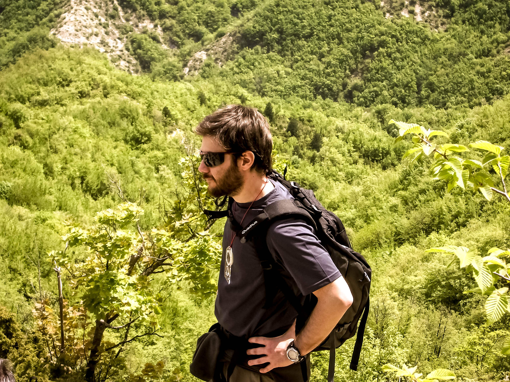
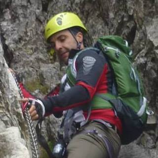

Qualunque strada deciderete di percorrere nella vita, sappiate che sarà sempre meglio scegliere uno dei percorsi escursionistici italiani sottoposti alle attività di manutenzione del [CAI](http://www.cai.it)!
Perché la vita, di per sé, è già abbastanza complicata, e se possiamo risparmiarci frane e alberi caduti, tanto meglio. O no?

Questa settimana intervisto Paolo Proli, presidente della [sezione forlivese](http://www.caiforli.it) del CAI, che mi ha parlato di un'attività fondamentale per l'escursionismo: la manutenzione dei sentieri.

### Salve, Dott. Proli. In effetti, non ho mai riflettutto troppo sul discorso della manutenzione dei percorsi escursionistici italiani. Le andrebbe di parlarmene?

> Certamente! Devi sapere che **in Emilia-Romagna la pulizia e la manutenzione dei sentieri esiste già da molti anni**. Questo anche grazie agli accordi presi con il [Parco Nazionale delle Foreste Casentinesi](http://www.parcoforestecasentinesi.it/pfc/index.php?option=com_inclusore_homepage&lang=it&jos_change_template=pfc_homepage).
>
> Essendo la rete di sentieri molto fitta in tutta la nostra zona, la loro cura è diffusa ovunque. Il CAI propone iniziative curiose come, ad esempio, l'**adozione dei sentieri**: in quel caso, un certo sentiero viene tenuto in cura esclusivamente da un dato socio.
>
> Ad ogni modo, che si tratti di adozione o che si faccia riferimento alle consuete attività di manutenzione, il fine è quello di permettere una percorrenza sicura.

### Come funzionano, a livello operativo, le attività di manutenzione dei sentieri?

> Con cadenza semestrale si organizzano **squadre di volontari** che percorrono i sentieri armati degli attrezzi necessari. Questa attività è interna al CAI, ed è tanto faticosa quanto indispensabile perché rende accessibile un sentiero.
>
> Si interviene per ripulirlo dalla presenza di eventuali rifiuti, ma anche per rimetterlo in sesto dopo frane, alberi caduti o altro.
>
> Al termine della manutenzione si compila un documento che riporta il sentiero, la data, il luogo e il tipo di problema eventualmente incontrato. Possiamo intenderlo come una specie di 'archivio'.

### E, in questo senso, vengono svolte attività di formazione all'interno del CAI?

> Sì. Dopo l'entrata in vigore del Testo Unico sulla Sicurezza, il CAI ha deciso di impartire **corsi di formazione** ai propri operatori dei sentieri. E anche corsi interni per la formazione sull'uso degli strumenti e dei dispositivi di protezione individuale. Quella svolta dal volontario sui percorsi escursionistici italiani è una prestazione soggetta ad alcuni rischi.

Queste sono le parole del Dott. Proli, ma io voglio ascoltare anche il parere di un volontario. Così ho pensato di far riferimento a un mio buon amico, Mirko!

### Ehi, Mirko, mi dici la tua?

> Ciao, Anna! Quella di quest'anno è stata la mia prima esperienza nella manutenzione dei sentieri, visto che sono uno degli ultimi 'acquisti' del CAI forlivese.
>
> Ho svolto il lavoro in coppia, insieme ad altri volontari. Serviva togliere i rami caduti a terra e tutto quello che avrebbe ostruito il passaggio, ma anche riverniciare la segnaletica sui tronchi.
>
> Quest'anno il lavoro non è mancato e arrivare a fine sentiero è stata una faticaccia. Insomma, la birra finale ce la siamo meritata!
>
> Scherzi a parte, alcuni escursionisti ci hanno ringraziato molto per il lavoro svolto e questo ci ha fatto parecchio piacere. **In Romagna abbiamo delle bellissime zone collinari** e dobbiamo conservarle al meglio per la gioia di tutti!

Foto di copertina: [Philip Larson](http://www.flickr.com/photos/22098403@N00/3805313764) via [Photopin](http://photopin.com).
