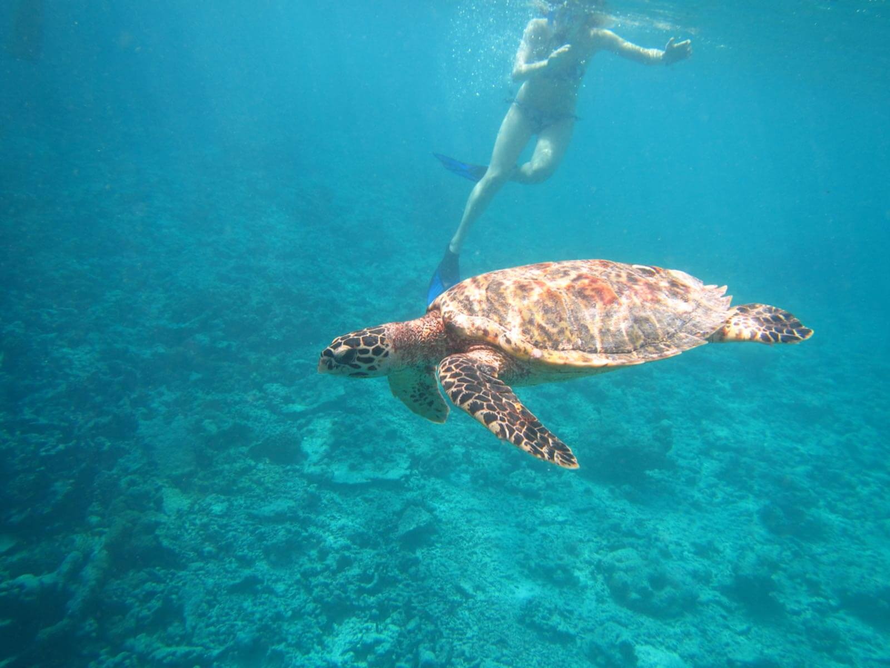

Sono sicura che un giorno mi sveglierò e griderò al mondo: *"Basta! Mollo tutto e scappo in un centro di educazione ambientale alle Maldive!"*. Mica male, come piano.
Lasciare tutto e tutti, alla ricerca della fantomatica *isola che non c'è*.

Qualcuno è partito per davvero, verso l'*isola che non c'è* che, però, *c'è*! Ha messo in valigia gli strumenti necessari per la ricerca scientifica e ha salutato tutti.

L'intervistato di questa settimana si chiama **Flavio Sacco** ed è un biologo marino che ha deciso di trasferirsi alle Maldive per sviluppare [The Barefoot Conservation Center](http://www.thebarefoot.com/portfolio-normal-layout/maldives-conservation-center/), un centro di monitoraggio, conservazione ed educazione ambientale all'interno della struttura turistica [The Barefoot Eco Hotel](http://www.thebarefoot.com), sull'isola di Hanimaadhoo.

Qualunque cosa stiate facendo in questo momento, fatemi una cortesia: abbandonate tutto e spegnete i cellulari.
State per leggere una storia meravigliosa.

### Ciao, Flavio! Voglio capire: quando e come sei finito in un centro di educazione ambientale alle Maldive? Di cosa ti occupi?

> Due anni fa ho scritto un progetto per sviluppare un centro di monitoraggio, conservazione ed educazione ambientale in una struttura turistica.
>
> Un giorno, un imprenditore svizzero di nome Christophe Groh mi ha contattato per ricevere informazioni. Aveva sentito parlare del mio progetto da una biologa marina devota alla causa ambientale delle Maldive, la Dott.ssa Enrica Burioli.
>
> Christophe voleva sviluppare un centro di educazione ambientale alle Maldive, una specie di *eco hotel*. Così, dopo un paio di incontri a Milano e dopo aver discusso i particolari, nel 2014 ho dato il via a questo progetto sperimentale. Con Christophe ho sviluppato un centro di educazione ambientale alle Maldive usando i **servizi offerti agli ospiti per fare monitoraggio e per sviluppare una consapevolezza ambientale nei partecipanti**.
>
> Cerchiamo di abbracciare tutti i principi dell'ecoturismo: **conservazione**, **sostenibilità** e **coinvolgimento della comunità locale**, sia dal punto di vista economico che culturale.

### Qual è l'aspetto peculiare del tuo progetto e perché è nato?

> Applichiamo l'**approccio della ricerca scientifica in un contesto divulgativo**. Questa è davvero l'enorme forza del progetto.
>
> Lavorare in ambito accademico richiede serietà e grande impegno. Quando si afferma qualcosa in ambito scientifico, bisogna supportarlo coi numeri, non si possono fare proclami senza dire da dove provengano certe affermazioni.
>
> È altresì vero che il mondo scientifico non è ancora abbastanza aperto al grande pubblico, ed è troppo autoreferenziale.
>
> Questa è l'idea principale dalla quale nasce questo centro di educazione ambientale alle Maldive: **applicare il metodo scientifico in un contesto vicino alla gente comune** come, appunto, quello turistico.

> Ciò che facciamo lo raccontiamo ogni giorno alle persone ospitate nella struttura.
> Nella mia esperienza, troppo poco di quello che si fa in ambito scientifico viene diffuso al grande pubblico. Probabilmente è proprio per questo che stanno nascendo sempre più progetti *citizen-based*, e credo che anche il nostro si possa definire così.
>
> Portiamo **la ricerca in un contesto comune** facendovi partecipare i cittadini che, nel nostro caso, sono gli ospiti della struttura.

### Qual è il grado di sensibilizzazione e di coinvolgimento nei confronti dell'attività che svolgi?

> Siamo molto fortunati: il coinvolgimento e la sensibilizzazione nel nostro centro di educazione ambientale alle Maldive sono altissimi!
> Tanti partecipano alle attività in mare con un'attenzione e un riguardo verso l'ambiente fuori dal comune. Moltissimi, qui, diventano più consapevoli. Questo, da solo, basta per veder cambiare l'atteggiamento verso l'ambiente, da quando arrivano a quando ripartono.
> Le persone, oggi, vogliono sapere, eppure, troppo spesso, ascoltano chi fa solo proclami senza aver mai davvero studiato a fondo gli argomenti. Non hanno modo di entrare in contatto con i ricercatori.
>
> I nostri ospiti vogliono sapere come comportarsi riguardo a certi aspetti. Il nostro lavoro, come eco hotel e centro di conservazione, è anche questo.

### Come ha reagito la popolazione locale di fronte al vostro centro di educazione ambientale alle Maldive?

> Hanimaadhoo vanta una popolazione felice e aperta, ma non credevamo sarebbero stati tanto entusiasti dell'apertura dell'hotel.
>
> Malgrado quello che si possa pensare, le Maldive non sono un paese povero in cui manca lavoro. Questo significa che non sempre una struttura turistica è accettata solo perchè 'porta lavoro'.
>
> Il nostro progetto avrebbe avuto senso se sviluppato su un'isola abitata e con un villaggio locale.

> Volevamo ecoturismo sotto tutti gli aspetti, compreso il **coinvolgimento della popolazione locale**. Significa offrire lavoro, ma anche coinvolgerli nella gestione più consapevole dei rifiuti sull'isola. Significa **far conoscere ai turisti la cultura locale** mettendo a loro disposizione bici gratuite per visitare il villaggio locale e organizzare visite. Significa **collaborare con la scuola locale** per sviluppare percorsi di educazione ambientale rivolti agli studenti.

### Il tuo centro di educazione ambientale alle Maldive riceve contributi da enti o università?

> No, è **tutto autofinanziato**. Questo dimostra come si possa fare conservazione, ricerca ed educazione ambientale coniugando un'attività commerciale con qualcosa che, di commerciale, non avrebbe nulla.

> **I soldi investiti nel progetto non sono solo un dovere morale verso l'ambiente**. C'è un effettivo ritorno economico, richiamando settori di mercato interessati a questo tipo di struttura.
>
> Abbiamo messo in cantiere diverse collaborazioni con enti di conservazione della natura, privati e pubblici. Speriamo di far crescere sempre di più il nostro centro di educazione ambientale alle Maldive. Anche per dare anche indicazioni utili a chi volesse fare lo stesso.

### Ultimissima domanda: cosa ti auguri per il futuro?

> Spero che recarsi in una struttura eco alle Maldive sia la normalità. Spero che chi deciderà di non intraprendere questa strada venga tagliato fuori dal mercato turistico e snobbato dai turisti. È un'affermazione forte, lo so, ma è quello di cui abbiamo bisogno se vogliamo un'economia sostenibile. Non si tratta di una scelta commerciale: oggi è una necessità che si trova al di sopra dell'economia.

> Il progetto non è solo mio, ma di tante persone: la Dott.ssa Tiziana Saba, colei che più mi ha aiutato nella realizzazione di questo progetto fin dai primi sviluppi. E poi la direttrice dell'Eco Hotel, Domitilla Sciullo, che cito in rappresentanza di tutto lo staff dell'albergo, che ha sempre supportato il progetto.

