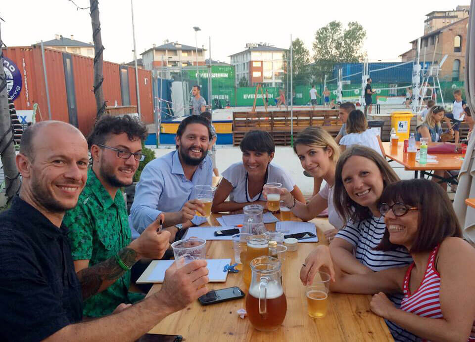
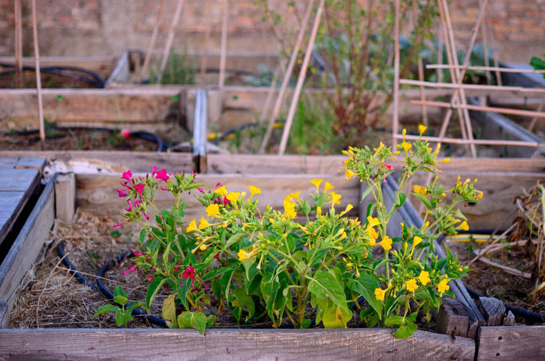
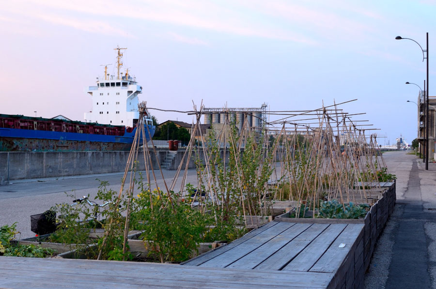

Gli orti urbani a Ravenna per realizzare aree coltivabili, per trasformare la coltivazione in un momento di condivisione sociale e per recuperare quartieri cittadini in cerca di riscatto.
Gli orti urbani sono il cruccio di [Ra-dici](http://www.ra-dici.it), un gruppo ravennate che promuove la partecipazione della cittadinanza nella **gestione delle aree urbane per la rigenerazione dei contesti marginali**. Tutto in un'ottica di sostenibilità ambientale.

Qualche giorno fa ho incontrato **Riccardo Ricci Petitoni**, membro attivo di Ra-dici.
È a loro che ho chiesto un po' di informazioni su questo bel progetto di e per Ravenna.

### Ciao, Riccardo! Diamo il via alla nostra chiacchierata partendo dalle radici di Ra-dici: gioco di parole a parte, di cosa si tratta?

> Ciao, Anna! Ra-dici è un progetto fondato sui concetti di sostenibilità ambientale e di partecipazione attiva.
>
> Ra-dici si è concentrato fin da subito su tre filoni: **ambiente**, **mobilità sostenibile** e **coinvolgimento della cittadinanza**. Nell'autunno 2016 è stato incluso fra i progetti di [CRE.S.CO](http://cresco.ra.it), spazio di coworking ravennate dedicato a progetti di innovazione sociale e all'industria creativa e culturale. Come diretta conseguenza di questo, il gruppo operativo di Ra-dici per la realizzazione di orti urbani a Ravenna si è fatto più ampio e attivo.
>
> Gli step successivi sono stati resi possibili grazie all'aiuto delle persone che hanno creduto in questo progetto. A questo proposito, oltre a CRE.S.CO ringraziamo il dott. Paolo Monduzzi dell'associazione 'Naviga in Darsena - [Darsena Pop Up](https://www.popupdarsena.com)' che ci ha sempre offerto il suo prezioso supporto.
>
> È grazie a lui se oggi abbiamo a disposizione gli spazi in cui riporre le attrezzature e le risorse idriche necessarie a irrigare i nostri orti urbani a Ravenna.

### La vostra attenzione è rivolta alla zona Darsena, giusto?

> Esatto. Al momento le nostre attività sono volte al **recupero della banchina** e alla **riqualificazione urbana dell'intero quartiere**.

### Dov'è nato Ra-dici? Da quante persone è composto?

> Ra-dici è nato nella Darsena di Ravenna. È qui che risiede la nostra base operativa.
>
> Oltre a me, gli attuali componenti sono Eleonora Morlotti, Silvia Barbero, Pietro Marangoni, Andrea Gatta, Chiara Brandi e Beatrice Bellotti.

### Agricoltura urbana ed economia di transizione: sono questi i due cardini principali della vostra attività quotidiana?

> Proprio così, Anna, questi sono due argomenti che ci stanno molto a cuore. Siamo convinti che, al di là del classico contesto rurale, occorra **produrre risorse anche all'interno del perimetro urbano**. Vogliamo educare grandi e piccoli all'**importanza della stagionalità** e all'**attenzione verso l'origine del prodotto**.
>
> Le attività legate agli orti urbani innescano meccanismi molto importanti in termini di **coesione sociale**.
>
> In un futuro nemmeno troppo lontano, vorremmo realizzare un orto urbano in ogni quartiere della città. Crediamo che questo serva sì a educare all'ambiente e alla tutela della salute, ma anche a spingere persone dello stesso quartiere alla condivisione.

#### I vostri orti urbani a Ravenna si rivolgono a persone di tutte le età: questo aspetto mi piace molto!

> Sì, assolutamente. E abbiamo anche in mente diversi **laboratori in scuole e istituti**.

#### Quali sono i vostri progetti per il prossimo futuro?

> A settembre, in collaborazione con Forese Arte Festival e con Matteo Biserna, parteciperemo a [Talea](https://www.facebook.com/events/108845283102209/), la festa del forese di Castiglione di Ravenna. In quell'occasione proporremo il laboratorio di stampa e grafica per grandi e piccini _Ra-dici sotto-sopra: green-art dall'orto_.
>
> Con CRE.S.CO organizzeremo la festa di quartiere, poi ci saranno le attività con l'associazione [Tra le Nuvole](https://www.facebook.com/tralenuvoleravenna/) che propone il C.R.E a Marina di Ravenna. Insieme daremo vita a un laboratorio volto all'installazione di un orto utilizzando cassette di legno riciclate.
>
> Il prossimo inverno, quando l'attività di coltivazione sarà sospesa a causa del freddo, **proporremo focus su argomenti specifici**. Insomma, le idee non mancano e l'energia nemmeno. Non resta che incrociare le dita!
